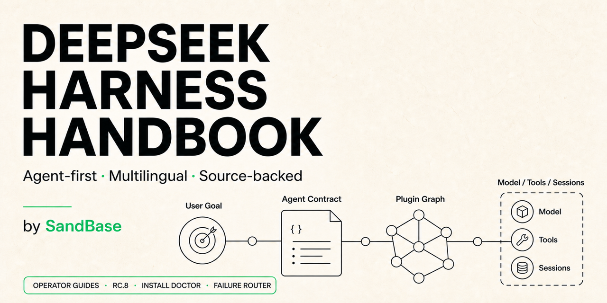
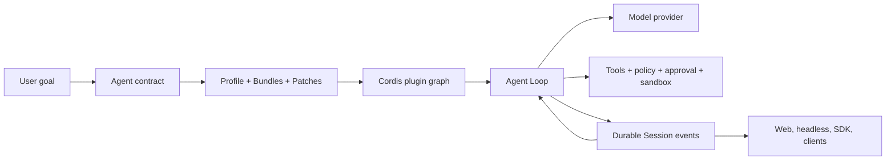

# DeepSeek Harness Handbook

[English](README.md) · [简体中文](docs/zh-CN/README.md) · [日本語](docs/ja/README.md) · [한국어](docs/ko/README.md) · [Español](docs/es/README.md)

[](https://github.com/sandbaseai/deepseek-harness-handbook/stargazers) [](https://github.com/sandbaseai/deepseek-harness-handbook/actions/workflows/content-check.yml) [](LICENSE)

Listed in [Awesome DeepSeek Harness](https://github.com/0xsline/awesome-deepseek-harness#ecosystem-services--resources), the community-maintained DSH ecosystem directory.



> The agent-first, English-canonical field guide to understanding, running, debugging, and extending [DeepSeek Harness](https://github.com/deepseek-ai/deepseek-harness), with reviewed Simplified Chinese coverage and multilingual foundations.

**113 canonical guides · rc.8 source coverage · primary-source links · runnable recovery paths**

Unlike a command catalog, this handbook follows the complete Agent boundary: model routing, tools, approval, sandboxing, durable Sessions, plugins, MCP, ACP, and operator-visible failure recovery. Version-sensitive pages identify the source revision they were checked against.

Choose one path and get to evidence quickly:

| Run | Debug | Build |
|---|---|---|
| [Five-minute quickstart](docs/en/getting-started/quickstart.md) | [Install Doctor](https://sandbaseai.github.io/deepseek-harness-handbook/install-doctor.html) | [First plugin lab](docs/en/plugin-development/first-plugin.md) |
| [CLI map](https://sandbaseai.github.io/deepseek-harness-handbook/deepseek-harness-cli.html) | [Failure Router](https://sandbaseai.github.io/deepseek-harness-handbook/diagnose.html) | [MCP guide](https://sandbaseai.github.io/deepseek-harness-handbook/deepseek-harness-mcp.html) |
| [API cost boundary](https://sandbaseai.github.io/deepseek-harness-handbook/deepseek-api-cost-boundary.html) | [Current field status](https://sandbaseai.github.io/deepseek-harness-handbook/field-status.html) | [Agent runtime map](docs/en/architecture/agent-runtime.md) |

If one of these guides saves an incident or an afternoon, **[star the repository](https://github.com/sandbaseai/deepseek-harness-handbook)**. Stars help the next Agent builder find a source-backed answer instead of another unverified command list.

[Browse the visual field guides](https://sandbaseai.github.io/deepseek-harness-handbook/) · [Request a source-backed runbook](https://github.com/sandbaseai/deepseek-harness-handbook/discussions/99) · [Subscribe to new guides](https://sandbaseai.github.io/deepseek-harness-handbook/feed.xml) · [Read the changelog](CHANGELOG.md)

DeepSeek Harness is more than a model wrapper. It is a composable agent runtime that connects model providers, tools, approval, sandboxing, durable sessions, subagents, and user interfaces through a plugin graph. This independent handbook explains those systems from the perspective of people building and operating agents.

The project is maintained by [SandBase](https://sandbase.ai/). It is not an official DeepSeek AI project.

> [!IMPORTANT]
> DeepSeek Harness is in developer preview and may introduce compatibility-breaking changes. Pages in this handbook name their verification date and link to primary sources. Pin the revision you deploy.

## Start with your goal

| I want to… | Start here |
|---|---|
| Fix `ERR_PNPM_UNEXPECTED_STORE` during a plugin update | [pnpm store-identity recovery](https://sandbaseai.github.io/deepseek-harness-handbook/pnpm-unexpected-store.html) |
| Fix `AbortSignal.any is not a function` even though Node looks current | [Runtime identity and offline recovery runbook](https://sandbaseai.github.io/deepseek-harness-handbook/abortsignal-any.html) |
| Recover Web stuck on Loading plugins in a pnpm source checkout | [pnpm symlink boot guide](https://sandbaseai.github.io/deepseek-harness-handbook/web-loading-plugins-pnpm.html) |
| Separate Responses API full-history traffic, retry attempts, and SSE leaks | [Responses overload runbook](https://sandbaseai.github.io/deepseek-harness-handbook/responses-overload-retry.html) |
| Run supported Codex hooks without assuming policy parity | [Codex hooks bridge guide](https://sandbaseai.github.io/deepseek-harness-handbook/codex-hooks-bridge.html) |
| Install the Claude Code hooks bridge without duplicating the runtime | [Hooks bridge installation guide](https://sandbaseai.github.io/deepseek-harness-handbook/claude-code-hooks-bridge.html) |
| Recover when a second core package copy breaks every tool call | [Duplicate core runtime recovery](https://sandbaseai.github.io/deepseek-harness-handbook/duplicate-core-runtime.html) |
| Design session, model, JSON, and exit semantics for headless embedding | [Programmatic headless contract](https://sandbaseai.github.io/deepseek-harness-handbook/headless-programmatic-contract.html) |
| Build rc.8 in an air-gapped environment without losing provenance | [Air-gapped source-build guide](https://sandbaseai.github.io/deepseek-harness-handbook/air-gapped-source-build.html) |
| Interpret token estimates, provider usage, UI occupancy, and compaction pressure | [Token accounting map](https://sandbaseai.github.io/deepseek-harness-handbook/token-meter-accounting.html) |
| Recover Session creation after editing a live Agent preset | [Preset generation recovery](https://sandbaseai.github.io/deepseek-harness-handbook/preset-generation-recovery.html) |
| Recover raw pinyin, kana, or jamo in the Web composer | [Web IME composition runbook](https://sandbaseai.github.io/deepseek-harness-handbook/web-ime-composition.html) |
| Protect API keys from backups, same-UID tools, or an untrusted Agent | [Credential storage threat model](https://sandbaseai.github.io/deepseek-harness-handbook/api-key-storage.html) |
| Recover a Session whose committed event sequence repeats | [Duplicate committed seq runbook](https://sandbaseai.github.io/deepseek-harness-handbook/duplicate-session-seq.html) |
| Recover a Web composer stuck read-only after sending an image | [Image-send admission runbook](https://sandbaseai.github.io/deepseek-harness-handbook/image-send-readonly.html) |
| Set and verify reasoning effort for a headless one-shot run | [Headless reasoning-effort guide](https://sandbaseai.github.io/deepseek-harness-handbook/headless-reasoning-effort.html) |
| Configure Bailian Token Plan without losing reasoning or model metadata | [Bailian catalog-route runbook](https://sandbaseai.github.io/deepseek-harness-handbook/bailian-token-plan.html) |
| Recover tools that repeatedly return `Unknown or expired MCP session` | [Expired MCP session loop runbook](https://sandbaseai.github.io/deepseek-harness-handbook/expired-mcp-session-loop.html) |
| Understand the shipped CLI, automate one task, or evaluate a community TUI | [DeepSeek Harness CLI map](https://sandbaseai.github.io/deepseek-harness-handbook/deepseek-harness-cli.html) |
| Recover when the Windows folder picker crashes or truncates a Unicode path | [Windows folder-picker crash and truncation guide](https://sandbaseai.github.io/deepseek-harness-handbook/windows-folder-picker-crash.html) |
| Connect to DeepSeek through an authorized proxy or enterprise CA | [Provider egress and TLS guide](https://sandbaseai.github.io/deepseek-harness-handbook/deepseek-api-fetch-failed.html) |
| Fix Web Search authentication when chat uses a custom gateway | [Custom-gateway Web Search runbook](https://sandbaseai.github.io/deepseek-harness-handbook/web-search-custom-gateway.html) |
| Add an MCP server or diagnose missing MCP tools | [MCP preset and connection guide](https://sandbaseai.github.io/deepseek-harness-handbook/deepseek-harness-mcp.html) |
| Evaluate DeepSeek Harness as an ACP External Agent in an editor | [ACP editor-integration boundary](https://sandbaseai.github.io/deepseek-harness-handbook/acp-editor-boundary.html) |
| Render an ACP permission request in a custom Web client | [ACP permission UI contract](https://sandbaseai.github.io/deepseek-harness-handbook/acp-permission-request-ui.html) |
| Move Codex or Claude Code memory without losing provenance or isolation | [Sessions, Skills, and long-term memory](https://sandbaseai.github.io/deepseek-harness-handbook/deepseek-harness-memory.html) |
| Run Web, headless, ACP, or SDK processes concurrently without sharing a writable Session root | [Single-writer Session topology](https://sandbaseai.github.io/deepseek-harness-handbook/deepseek-harness-single-writer.html) |
| Fix `spawn bash ENOENT` after moving or renaming a workspace | [Moved-workspace recovery runbook](https://sandbaseai.github.io/deepseek-harness-handbook/workspace-moved-spawn-enoent.html) |
| Upgrade an exact runtime and preserve a proven rollback | [Upgrade and rollback guide](https://sandbaseai.github.io/deepseek-harness-handbook/upgrade-deepseek-harness.html) |
| Detect when a community plugin replaces core Agent providers | [Composition-diff plugin audit](https://sandbaseai.github.io/deepseek-harness-handbook/deepseek-harness-plugin-audit.html) |
| Choose an exact, reproducible installation topology | [Install DeepSeek Harness safely](https://sandbaseai.github.io/deepseek-harness-handbook/install-deepseek-harness.html) |
| Diagnose `npx` waiting at the DeepSeek Harness install prompt | [npx install-boundary runbook](https://sandbaseai.github.io/deepseek-harness-handbook/npx-install-prompt-hangs.html) |
| Create, invoke, and debug a reusable Skill | [DeepSeek Harness Skills lab](https://sandbaseai.github.io/deepseek-harness-handbook/deepseek-harness-skills.html) |
| Decide whether an instruction belongs in global, project, nested, local, or Skill scope | [AGENTS.md scope and precedence map](https://sandbaseai.github.io/deepseek-harness-handbook/deepseek-harness-agents-md.html) |
| Build, test, package, and install my first plugin | [First DeepSeek Harness plugin lab](docs/en/plugin-development/first-plugin.md) |
| Keep a plugin subprocess from freezing the Agent Host | [Async subprocess tool guide](https://sandbaseai.github.io/deepseek-harness-handbook/async-subprocess-tools.html) |
| Discover and manage community plugins from the DSH Web UI | [DSH Plugin Store](https://sandbaseai.github.io/dsh-plugin-store/) ([GitHub](https://github.com/sandbaseai/dsh-plugin-store)) |
| Fix a plugin boot crash for missing `@deepseek-ai/dsh-client-schema-form` | [Plugin distribution-closure runbook](https://sandbaseai.github.io/deepseek-harness-handbook/missing-client-schema-form.html) |
| Fix `additionalProperties`, type-array, or `oneOf` tool schema errors | [Tool schema subset guide](https://sandbaseai.github.io/deepseek-harness-handbook/tool-schema-subset.html) |
| Distinguish the official Agent runtime from same-name API wrappers | [Official DeepSeek Harness identity guide](https://sandbaseai.github.io/deepseek-harness-handbook/official-deepseek-harness.html) |
| Check current rc.7 boundaries and safer next actions | [DeepSeek Harness rc.7 Field Status](https://sandbaseai.github.io/deepseek-harness-handbook/field-status.html) |
| Capture the package and source revision that actually ran | [DeepSeek Harness Version Evidence](https://sandbaseai.github.io/deepseek-harness-handbook/version-evidence.html) |
| Find the first broken runtime boundary | [Interactive Failure Router](https://sandbaseai.github.io/deepseek-harness-handbook/diagnose.html) |
| Keep the essential commands and checks in one tab | [DeepSeek Harness cheat sheet](docs/en/reference/cheat-sheet.md) |
| Choose the right official runnable example | [Official examples map](docs/en/examples/official-examples-map.md) |
| Understand what DeepSeek Harness actually is | [DeepSeek Harness explained](docs/en/what-is-deepseek-harness.md) |
| Choose between DeepSeek Harness, Claude Code, and Codex | [Source-backed control-plane comparison](https://sandbaseai.github.io/deepseek-harness-handbook/deepseek-harness-vs-claude-code-vs-codex.html) |
| Read a Session log without dropping packed assistant output | [Session log storage-format map](https://sandbaseai.github.io/deepseek-harness-handbook/deepseek-harness-session-log-format.html) |
| Recover when an invalid overlay prevents the profile from booting | [Invalid-overlay recovery runbook](https://sandbaseai.github.io/deepseek-harness-handbook/invalid-overlay-boot-failure.html) |
| Run the Web UI safely | [Five-minute quickstart](docs/en/getting-started/quickstart.md) |
| Use it from Python | [Python SDK quickstart](docs/en/getting-started/python-sdk.md) |
| Run one task in automation or CI | [CLI and Headless Agent guide](https://sandbaseai.github.io/deepseek-harness-handbook/deepseek-harness-cli.html) |
| Configure DeepSeek or another provider | [Model provider guide](docs/en/getting-started/model-providers.md) |
| Prove DeepSeek chat and Web search cannot create unexpected charges | [DeepSeek API cost-boundary runbook](https://sandbaseai.github.io/deepseek-harness-handbook/deepseek-api-cost-boundary.html) |
| Fix a context-window or token-budget error | [Classify and recover context overflow](https://sandbaseai.github.io/deepseek-harness-handbook/context-window-overflow.html) |
| Understand why one model switch affects future Agents | [Map session and deployment model state](https://sandbaseai.github.io/deepseek-harness-handbook/session-model-default.html) |
| Fix a plugin script corrupted around a dollar sign | [Repair tapIndex replacement-string insertion](https://sandbaseai.github.io/deepseek-harness-handbook/tapindex-dollar-corruption.html) |
| Fix an OpenAI-compatible gateway that rejects `developer` | [Diagnose system-message role compatibility](https://sandbaseai.github.io/deepseek-harness-handbook/openai-compatible-developer-role.html) |
| Fix CJK commands that stall persistent Bash for 300 seconds | [Separate the locale/readline trap from PTY corruption](https://sandbaseai.github.io/deepseek-harness-handbook/macos-bash-nonascii.html) |
| Fix plugin installation blocked by `ERR_PNPM_ADDING_TO_ROOT` | [Make the profile workspace target explicit](https://sandbaseai.github.io/deepseek-harness-handbook/pnpm-adding-to-root.html) |
| Fix rc.8 source builds when Node parses an ELF, shell, or Windows pnpm entrypoint | [Cross-platform pnpm entrypoint runbook](https://sandbaseai.github.io/deepseek-harness-handbook/windows-standalone-pnpm.html) |
| Stop black console windows flashing during Windows tool calls | [Two-path Windows process-creation runbook](https://sandbaseai.github.io/deepseek-harness-handbook/windows-console-window-flash.html) |
| Find the corrupt `package.json` behind a pathless boot SyntaxError | [Package-closure recovery runbook](https://sandbaseai.github.io/deepseek-harness-handbook/corrupt-package-json-profile-boot.html) |
| Fix an OpenAI-compatible `server_error` that never retries | [pi-ai classification and retry evidence](https://sandbaseai.github.io/deepseek-harness-handbook/pi-ai-server-error-retry.html) |
| Recover an old Session that throws `received an update before its start Match` | [Conversation projection recovery](https://sandbaseai.github.io/deepseek-harness-handbook/conversation-update-before-start.html) |
| Recover when pnpm leaves a plugin package behind but DSH skips reconciliation | [Partial plugin install recovery](https://sandbaseai.github.io/deepseek-harness-handbook/plugin-add-nonzero-reconcile.html) |
| Recover when a Node 24 + tsx build exits 0 but creates no artifacts | [Silent source-build recovery](https://sandbaseai.github.io/deepseek-harness-handbook/node24-tsx-silent-build.html) |
| Fix `unknown prompt variable "{{hexagon}}"` after adding a draw.io or other MCP tool | [Code Mode tool-prose boundary](https://sandbaseai.github.io/deepseek-harness-handbook/code-mode-unknown-prompt-variable.html) |
| Fix npm `ETARGET` for `dsh-agent-loop@^0.1.0-rc.8` | [Registry and cache recovery](https://sandbaseai.github.io/deepseek-harness-handbook/npm-etarget-rc8.html) |
| Session title stays on the first-prompt fallback with a reasoning model | [Auxiliary title budget diagnosis](https://sandbaseai.github.io/deepseek-harness-handbook/session-title-reasoning-budget.html) |
| Generate exact installation evidence commands for my OS and install path | [Interactive Install Doctor](https://sandbaseai.github.io/deepseek-harness-handbook/install-doctor.html) |
| Recover an empty sidebar or unreadable Session without destroying evidence | [Route frame, sequence, and tool-call identity failures](https://sandbaseai.github.io/deepseek-harness-handbook/session-history-recovery.html) |
| Stop a repeating Agent turn before it exhausts a budget | [Runaway Agent loop emergency runbook](docs/en/troubleshooting/runaway-agent-loop.md) |
| Detect repeated model text inside one streaming attempt | [Degenerate-output guard guide](https://sandbaseai.github.io/deepseek-harness-handbook/degenerate-model-output.html) |
| Stop a foreground tool after `session.cancel` is accepted but work remains live | [Stuck-tool cancellation runbook](https://sandbaseai.github.io/deepseek-harness-handbook/stuck-tool-cancellation.html) |
| Recover when every turn in one Session returns invalid JSON | [Poisoned Session recovery guide](docs/en/troubleshooting/poisoned-session-invalid-tool-json.md) |
| Recover when every retry reports insufficient tool messages | [Missing tool-result recovery guide](https://sandbaseai.github.io/deepseek-harness-handbook/insufficient-tool-messages.html) |
| Fix a todo that stays in progress after the final answer | [Todo state and projection guide](https://sandbaseai.github.io/deepseek-harness-handbook/todo-stuck-in-progress.html) |
| Fix a Code Mode Skill that appears in UI but not model context | [Code Mode Skill context guide](https://sandbaseai.github.io/deepseek-harness-handbook/code-mode-skill-context.html) |
| Fix `terminal inspection is unsupported on platform win32` in Minimal | [Windows Minimal preset Bash guide](https://sandbaseai.github.io/deepseek-harness-handbook/windows-minimal-bash.html) |
| Diagnose a frozen first `workspace-write` call on Windows | [Windows first ACL grant guide](https://sandbaseai.github.io/deepseek-harness-handbook/windows-acl-first-run.html) |
| Run DeepSeek Harness from source on a Synology NAS | [Synology NAS deployment guide](https://sandbaseai.github.io/deepseek-harness-handbook/synology-nas.html) |
| Recover when the Agent waits but no question or approval card appears | [Missing interaction card guide](https://sandbaseai.github.io/deepseek-harness-handbook/missing-question-card.html) |
| Diagnose `Output token limit reached` without confusing it with context overflow | [Output token ceiling guide](https://sandbaseai.github.io/deepseek-harness-handbook/output-token-limit.html) |
| Recover when a Git plugin installs without its declared `dist/` or `lib/` export | [Missing plugin artifact guide](https://sandbaseai.github.io/deepseek-harness-handbook/git-plugin-missing-dist.html) |
| Fix `/compact` when its summary reaches the token cap | [Compaction summary truncation guide](https://sandbaseai.github.io/deepseek-harness-handbook/compaction-summary-truncated.html) |
| Decide which plugin `missing peer` and ignored-build warnings require action | [Plugin peer-warning guide](https://sandbaseai.github.io/deepseek-harness-handbook/plugin-peer-warnings.html) |
| Keep answers in Chinese or another language and diagnose an English Think row | [Response and reasoning language guide](https://sandbaseai.github.io/deepseek-harness-handbook/response-language.html) |
| Recover a long prompt after Web clears it but the turn fails | [Accepted-before-durable prompt recovery](https://sandbaseai.github.io/deepseek-harness-handbook/prompt-send-recovery.html) |
| Fix Bailian/DashScope `UNKNOWN_TOOL` or `tool "" is disabled` after a streamed call loses its ID and name | [Streamed tool-call identity guide](https://sandbaseai.github.io/deepseek-harness-handbook/streamed-tool-call-identity.html) |
| Explain slow first-token latency before blaming the provider | [Mature Session TTFT guide](docs/en/troubleshooting/slow-ttft-mature-sessions.md) |
| Fix `ReplaceFileW EACCES` while editing a Windows profile | [Windows HMR-watched config recovery](docs/en/troubleshooting/windows-replacefile-eacces.md) |
| Decide whether worker-thread Code Mode fits the security boundary | [Code Mode trust-boundary guide](docs/en/security/code-mode-worker-trust-boundary.md) |
| Fix Web, headless, or custom-profile startup reporting `--expose-internals` is required | [HMR loader-capability diagnosis](https://sandbaseai.github.io/deepseek-harness-handbook/hmr-expose-internals.html) |
| Fix a pnpm global install that reports an installed plugin as missing | [Global native-binding resolution guide](docs/en/troubleshooting/pnpm-global-native-binding.md) |
| Fix macOS workspace selection when the path ends in `:/` | [macOS native picker path guide](docs/en/troubleshooting/macos-workspace-picker-trailing-colon.md) |
| Persist downstream plugin events without breaking Session resume | [Custom Session event compatibility](https://sandbaseai.github.io/deepseek-harness-handbook/custom-session-events.html) |
| Connect external MCP tools | [MCP integration guide](docs/en/integrations/mcp.md) |
| Add reusable Agent instructions | [Skills guide](docs/en/agent-patterns/skills.md) |
| Delegate work to child Agents | [Subagents guide](docs/en/agent-patterns/subagents.md) |
| Understand the runtime | [The agent-runtime mental model](docs/en/architecture/agent-runtime.md) |
| Understand one complete turn | [Agent Loop and Session Events](docs/en/architecture/agent-lifecycle.md) |
| Choose between Session persistence and long-term memory | [Sessions are not long-term memory](docs/en/architecture/sessions-vs-memory.md) |
| Understand approval, guards, and tool effects | [Tool execution pipeline](docs/en/architecture/tool-execution-pipeline.md) |
| Build an Agent rather than a loose collection of tools | [Agent design map](docs/en/agent-patterns/designing-an-agent.md) |
| Research a repository without publishing changes | [Repository Research Agent recipe](docs/en/recipes/repository-research-agent.md) |
| Run or debug DeepSeek Harness on Windows | [Windows compatibility guide](docs/en/troubleshooting/windows-compatibility.md) |
| Recover a profile after a plugin change | [Plugin install and recovery guide](docs/en/troubleshooting/plugin-install-recovery.md) |
| Diagnose an `ERR_HTTP2_INVALID_SESSION` crash | [HTTP/2 provider-transport troubleshooting](docs/en/troubleshooting/http2-invalid-session.md) |
| Fix `crypto.randomUUID` or `host.pickDirectory` HTTP 403 without weakening the Agent shell | [Remote Web control-plane guide](https://sandbaseai.github.io/deepseek-harness-handbook/remote-web-secure-context.html) |
| Fix persistent Bash on NixOS or minimal Linux | [PTY shell-path guide](docs/en/troubleshooting/pty-shell-path.md) |
| Protect or recover a session log | [Live session log durability](docs/en/troubleshooting/live-session-log-durability.md) |
| Fix first Session flush when the filesystem rejects hard links | [Session hard-link compatibility runbook](https://sandbaseai.github.io/deepseek-harness-handbook/session-hard-link-unsupported.html) |
| Fix a failing installation or run | [Troubleshooting index](docs/en/troubleshooting/README.md) |
| Track upstream changes | [Updates and breaking changes](docs/en/updates/README.md) |

## The agent-first mental model



An agent is not just a prompt. A useful Agent has a task boundary, allowed effects, completion condition, model route, tool surface, permission policy, session strategy, failure behavior, and an operator-visible result. DeepSeek Harness supplies the runtime vocabulary for assembling those responsibilities without forcing every product into one fixed loop or interface.

## What makes this handbook different

- **Agent-first:** concepts are organized around building, running, and debugging Agents.
- **Source-backed:** version-sensitive claims link to official documentation or source.
- **Operational:** every tutorial includes success evidence, failure branches, and safety boundaries.
- **Visual:** architecture pages prioritize diagrams over walls of text.
- **Living:** updates, breaking changes, and troubleshooting pages follow upstream development.
- **Multilingual by design:** English is canonical; translations declare their source revision and review status. Current depth is [reported explicitly](#language-coverage).

## Language coverage

| Locale | Current status | Published coverage |
|---|---|---|
| English | Canonical | 113 pages |
| 简体中文 | Reviewed | Navigation plus three core guides |
| 日本語 | Draft | Navigation only |
| 한국어 | Draft | Navigation only |
| Español | Draft | Navigation only |

The locale links at the top do not imply feature parity. English remains the source of truth until a translation points to the current canonical revision and has been reviewed by a fluent contributor.

## Published guide map

Every item below is available now. Planned coverage lives in the [public roadmap](ROADMAP.md).

### Getting started

- [Fix pnpm store drift during plugin update](docs/en/troubleshooting/pnpm-unexpected-store-plugin-update.md)
- [Diagnose npx hanging before DeepSeek Harness starts](docs/en/troubleshooting/npx-install-prompt-hangs.md)
- [What is DeepSeek Harness?](docs/en/what-is-deepseek-harness.md)
- [DeepSeek Harness vs Claude Code vs Codex](docs/en/reference/deepseek-harness-vs-coding-agents.md)
- [Install DeepSeek Harness safely](docs/en/getting-started/install-deepseek-harness.md)
- [Upgrade and roll back safely](docs/en/getting-started/upgrade-and-rollback.md)
- [Five-minute Web UI quickstart](docs/en/getting-started/quickstart.md)
- [Python SDK quickstart](docs/en/getting-started/python-sdk.md)
- [Headless Agent and CI](docs/en/getting-started/headless-agent.md)
- [Configure model providers](docs/en/getting-started/model-providers.md)

### Architecture

- [The agent-runtime mental model](docs/en/architecture/agent-runtime.md)
- [Session log storage format and packed rows](docs/en/reference/session-log-storage-format.md)
- [Agent Loop and Session Events](docs/en/architecture/agent-lifecycle.md)
- [Sessions are not long-term memory](docs/en/architecture/sessions-vs-memory.md)
- [Tool execution pipeline](docs/en/architecture/tool-execution-pipeline.md)

### Agent patterns

- [Designing an Agent](docs/en/agent-patterns/designing-an-agent.md)
- [AGENTS.md scope and precedence](docs/en/agent-patterns/agents-md-scope.md)
- [Skills: discovery, precedence, and invocation](docs/en/agent-patterns/skills.md)
- [Subagents: providers, delegation, and continuation](docs/en/agent-patterns/subagents.md)

### Recipes

- [Repository Research Agent](docs/en/recipes/repository-research-agent.md)

### Operations

- [Keep concurrent Session roots single-writer](docs/en/operations/single-writer-session-roots.md)

### Official examples

- [Choose the right upstream example](docs/en/examples/official-examples-map.md)
- Headless CLI task runner
- Python SDK and JSON-RPC runtime
- ACP automation server
- MCP memory overlays
- Self-modifying Cordis composition
- Session-local schedules

### Integrations

- [Connect MCP servers](docs/en/integrations/mcp.md)
- [Evaluate the ACP editor-integration boundary](docs/en/integrations/acp-editor-boundary.md)
- [Render ACP permission requests safely](docs/en/integrations/acp-permission-request-ui.md)
- [Recover a silent Node 24 and tsx source build](docs/en/troubleshooting/node24-tsx-silent-build.md)
- [Fix unknown prompt variables from MCP descriptions in Code Mode](docs/en/troubleshooting/code-mode-unknown-prompt-variable.md)
- [Fix npm ETARGET while installing rc.8](docs/en/troubleshooting/npm-etarget-rc8.md)
- [Fix missing `dsh-client-schema-form` after npm installation](docs/en/troubleshooting/missing-client-schema-form.md)
- [Fix Session titles that stay on the fallback with reasoning models](docs/en/troubleshooting/session-title-reasoning-budget.md)
- [Generate an installation evidence plan with Install Doctor](docs/en/tools/install-doctor.md)

### Plugin development

- [Build your first DeepSeek Harness plugin](docs/en/plugin-development/first-plugin.md)
- [Run subprocesses safely inside tools](docs/en/plugin-development/async-subprocess-tools.md)
- [Author tool schemas for the enforced subset](docs/en/plugin-development/tool-schema-subset.md)
- [Custom durable Session event compatibility](docs/en/plugin-development/custom-session-events.md)

### Security

- [Threat-model API key storage and choose a stronger credential boundary](docs/en/security/credential-storage-threat-model.md)
- [Audit community plugins before installation](docs/en/security/community-plugin-audit.md)
- [Code Mode worker-thread trust boundary](docs/en/security/code-mode-worker-trust-boundary.md)
- [Prevent unexpected DeepSeek API charges](docs/en/security/prevent-unexpected-deepseek-api-charges.md)

### Searchable operations

- [Verify the official DeepSeek Harness project](docs/en/reference/official-project-identity.md)
- [DeepSeek Harness rc.7 Field Status](https://sandbaseai.github.io/deepseek-harness-handbook/field-status.html)
- [DeepSeek Harness Version Evidence](https://sandbaseai.github.io/deepseek-harness-handbook/version-evidence.html)
- [Interactive Failure Router](https://sandbaseai.github.io/deepseek-harness-handbook/diagnose.html)
- [DeepSeek Harness cheat sheet](docs/en/reference/cheat-sheet.md)
- [Troubleshooting index](docs/en/troubleshooting/README.md)
- [Add an MCP server and diagnose missing tools](https://sandbaseai.github.io/deepseek-harness-handbook/deepseek-harness-mcp.html)
- [`ERR_HTTP2_INVALID_SESSION` provider-transport crashes](docs/en/troubleshooting/http2-invalid-session.md)
- [Sandbox denial versus sandbox unavailable](docs/en/troubleshooting/sandbox-denied-vs-unavailable.md)
- [Windows compatibility and troubleshooting](docs/en/troubleshooting/windows-compatibility.md)
- [Minimal preset Bash failure on native Windows](docs/en/troubleshooting/windows-minimal-preset-bash.md)
- [First Windows workspace-write freeze](docs/en/troubleshooting/windows-first-workspace-write-freeze.md)
- [Synology NAS source deployment](docs/en/getting-started/synology-nas-source-deployment.md)
- [Missing question or approval card after reconnect](docs/en/troubleshooting/missing-question-approval-after-reconnect.md)
- [`Output token limit reached`](docs/en/troubleshooting/output-token-limit-reached.md)
- [Git plugin missing its built export](docs/en/troubleshooting/git-plugin-missing-dist.md)
- [Compaction summary truncated at the token cap](docs/en/troubleshooting/compaction-summary-truncated.md)
- [Plugin peer-dependency and ignored-build warnings](docs/en/troubleshooting/plugin-peer-dependency-warnings.md)
- [Response and reasoning language control](docs/en/troubleshooting/response-language-and-reasoning.md)
- [Prompt accepted before it became durable](docs/en/troubleshooting/prompt-accepted-before-durable.md)
- [Windows folder-picker worker crash](docs/en/troubleshooting/windows-folder-picker-worker-crash.md)
- [DeepSeek API fetch failures behind a proxy or enterprise CA](docs/en/troubleshooting/deepseek-api-fetch-failed-proxy-ca.md)
- [Fix Web Search authentication on a custom gateway](docs/en/troubleshooting/web-search-custom-gateway-auth.md)
- [Configure Bailian Token Plan without losing catalog compatibility](docs/en/troubleshooting/bailian-token-plan-catalog-route.md)
- [Recover duplicated committed Session sequence numbers](docs/en/troubleshooting/duplicate-committed-session-seq.md)
- [Recover a composer stuck read-only after an image send](docs/en/troubleshooting/image-send-composer-readonly.md)
- [Set and verify reasoning effort for headless runs](docs/en/guides/headless-reasoning-effort.md)
- [Recover an expired MCP session without a repeated tool-call loop](docs/en/troubleshooting/expired-mcp-session-loop.md)
- [Plugin installation and known-good recovery](docs/en/troubleshooting/plugin-install-recovery.md)
- [Remote Web access, SSH, HTTPS, and trust](docs/en/troubleshooting/remote-web-secure-context.md)
- [Route OpenCode Go models by protocol and entitlement](docs/en/troubleshooting/opencode-go-model-routing.md)
- [Recover Web from a Client plugin boot failure](docs/en/troubleshooting/web-client-plugin-boot-failure.md)
- [Design shared dependency caches as explicit workspace-write capabilities](docs/en/security/workspace-write-shared-cache.md)
- [PTY shell path on NixOS and minimal Linux](docs/en/troubleshooting/pty-shell-path.md)
- [Protect and recover live session logs](docs/en/troubleshooting/live-session-log-durability.md)
- [Recover `spawn bash ENOENT` after a workspace moves](docs/en/troubleshooting/workspace-moved-spawn-enoent.md)
- [Classify and recover context overflow](https://sandbaseai.github.io/deepseek-harness-handbook/context-window-overflow.html)
- [Stop a runaway Agent loop and contain spend](docs/en/troubleshooting/runaway-agent-loop.md)
- [Detect and recover from degenerate repeated model output](docs/en/troubleshooting/degenerate-model-output.md)
- [Stop a tool that will not cancel](docs/en/troubleshooting/stuck-tool-cancellation.md)
- [Recover a Session poisoned by invalid tool-call JSON](docs/en/troubleshooting/poisoned-session-invalid-tool-json.md)
- [Fix UNKNOWN_TOOL from empty streamed tool identity, including Bailian](docs/en/troubleshooting/streamed-tool-call-empty-identity.md)
- [Diagnose slow TTFT in mature Sessions](docs/en/troubleshooting/slow-ttft-mature-sessions.md)
- [Fix `ReplaceFileW EACCES` on Windows HMR-watched config](docs/en/troubleshooting/windows-replacefile-eacces.md)
- [Treat worker-thread Code Mode as host-trusted](docs/en/security/code-mode-worker-trust-boundary.md)
- [Fix `--expose-internals` HMR startup from a source checkout](docs/en/troubleshooting/hmr-expose-internals-source-checkout.md)
- [Fix pnpm global native-binding plugin resolution](docs/en/troubleshooting/pnpm-global-native-binding.md)
- [Fix macOS workspace picker trailing-colon paths](docs/en/troubleshooting/macos-workspace-picker-trailing-colon.md)
- [Persist custom plugin events without breaking Session resume](docs/en/plugin-development/custom-session-events.md)
- [Updates and breaking changes](docs/en/updates/README.md)

## Repository structure

```text
docs/<locale>/
  getting-started/     installation and first runs
  architecture/        runtime and lifecycle explanations
  agent-patterns/      design decisions for real agents
  recipes/             reproducible agent builds
  troubleshooting/     symptom-driven diagnostic pages
  ecosystem/           plugins, tools, skills, and comparisons
  updates/             upstream change coverage
scripts/               content and translation verification
content-manifest.json  canonical revision and locale status
```

## Editorial and commercial boundary

DeepSeek Harness remains the subject of every technical page. SandBase maintains the handbook and may provide a restrained link to related Agent, model, Skill, or MCP discovery resources. A mention is never presented as an official DeepSeek recommendation, a compatibility guarantee, or a security endorsement.

## Contributing

Corrections, reproducible examples, diagrams, troubleshooting cases, upstream change notes, and fluent translation reviews are welcome. Read [CONTRIBUTING.md](CONTRIBUTING.md) and run `npm run check` before submitting a pull request.

New here? Choose a scoped task from the [public roadmap](ROADMAP.md), or open a [documentation request](https://github.com/sandbaseai/deepseek-harness-handbook/issues/new?template=documentation-request.yml). Reproducible evidence is more valuable than a large patch.

## Primary sources

- [DeepSeek Harness official repository](https://github.com/deepseek-ai/deepseek-harness)
- [Official architecture documentation](https://github.com/deepseek-ai/deepseek-harness/blob/master/docs/architecture.md)
- [Official Agent lifecycle](https://github.com/deepseek-ai/deepseek-harness/blob/master/docs/agent-lifecycle.md)
- [Official capability seams](https://github.com/deepseek-ai/deepseek-harness/blob/master/docs/capability-seams.md)
- [Official tool execution pipeline](https://github.com/deepseek-ai/deepseek-harness/blob/master/docs/tool-execution-pipeline.md)
- [Official user guides](https://github.com/deepseek-ai/deepseek-harness/tree/master/docs/user/guide)

## License

Apache-2.0. See [LICENSE](LICENSE).
