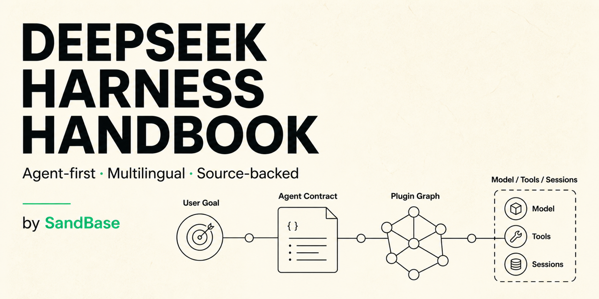
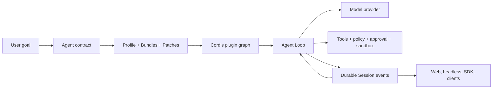

# DeepSeek Harness Handbook

[English](README.md) · [简体中文](docs/zh-CN/README.md) · [日本語](docs/ja/README.md) · [한국어](docs/ko/README.md) · [Español](docs/es/README.md)

[](https://github.com/sandbaseai/deepseek-harness-handbook/stargazers) [](https://github.com/sandbaseai/deepseek-harness-handbook/actions/workflows/content-check.yml) [](LICENSE)



> The agent-first, English-canonical field guide to understanding, running, debugging, and extending [DeepSeek Harness](https://github.com/deepseek-ai/deepseek-harness), with reviewed Simplified Chinese coverage and multilingual foundations.

If this handbook saves you time, **star the repository** and watch releases. That signal helps more Agent builders find source-backed DeepSeek Harness guidance.

**[Check the rc.6 field status](https://sandbaseai.github.io/deepseek-harness-handbook/field-status.html)** · **[Route a failure in 30 seconds](https://sandbaseai.github.io/deepseek-harness-handbook/diagnose.html)** · **[Get started in five minutes](docs/en/getting-started/quickstart.md)** · **[Contribute](CONTRIBUTING.md)**

**Live operator site:** [Browse the visual field guides](https://sandbaseai.github.io/deepseek-harness-handbook/) · [Subscribe to new guides](https://sandbaseai.github.io/deepseek-harness-handbook/feed.xml) · [Read the changelog](CHANGELOG.md)

DeepSeek Harness is more than a model wrapper. It is a composable agent runtime that connects model providers, tools, approval, sandboxing, durable sessions, subagents, and user interfaces through a plugin graph. This independent handbook explains those systems from the perspective of people building and operating agents.

The project is maintained by [SandBase](https://sandbase.ai/). It is not an official DeepSeek AI project.

> [!IMPORTANT]
> DeepSeek Harness is in developer preview and may introduce compatibility-breaking changes. Pages in this handbook name their verification date and link to primary sources. Pin the revision you deploy.

## Start with your goal

| I want to… | Start here |
|---|---|
| Check current rc.6 boundaries and safer next actions | [DeepSeek Harness rc.6 Field Status](https://sandbaseai.github.io/deepseek-harness-handbook/field-status.html) |
| Capture the package and source revision that actually ran | [DeepSeek Harness Version Evidence](https://sandbaseai.github.io/deepseek-harness-handbook/version-evidence.html) |
| Find the first broken runtime boundary | [Interactive Failure Router](https://sandbaseai.github.io/deepseek-harness-handbook/diagnose.html) |
| Keep the essential commands and checks in one tab | [DeepSeek Harness cheat sheet](docs/en/reference/cheat-sheet.md) |
| Choose the right official runnable example | [Official examples map](docs/en/examples/official-examples-map.md) |
| Understand what DeepSeek Harness actually is | [DeepSeek Harness explained](docs/en/what-is-deepseek-harness.md) |
| Run the Web UI safely | [Five-minute quickstart](docs/en/getting-started/quickstart.md) |
| Use it from Python | [Python SDK quickstart](docs/en/getting-started/python-sdk.md) |
| Run one task in automation or CI | [Headless Agent guide](docs/en/getting-started/headless-agent.md) |
| Configure DeepSeek or another provider | [Model provider guide](docs/en/getting-started/model-providers.md) |
| Fix a context-window or token-budget error | [Context window exceeded guide](docs/en/troubleshooting/context-window-exceeded.md) |
| Stop a repeating Agent turn before it exhausts a budget | [Runaway Agent loop emergency runbook](docs/en/troubleshooting/runaway-agent-loop.md) |
| Recover when every turn in one Session returns invalid JSON | [Poisoned Session recovery guide](docs/en/troubleshooting/poisoned-session-invalid-tool-json.md) |
| Connect external MCP tools | [MCP integration guide](docs/en/integrations/mcp.md) |
| Add reusable Agent instructions | [Skills guide](docs/en/agent-patterns/skills.md) |
| Delegate work to child Agents | [Subagents guide](docs/en/agent-patterns/subagents.md) |
| Understand the runtime | [The agent-runtime mental model](docs/en/architecture/agent-runtime.md) |
| Understand one complete turn | [Agent Loop and Session Events](docs/en/architecture/agent-lifecycle.md) |
| Choose between Session persistence and long-term memory | [Sessions are not long-term memory](docs/en/architecture/sessions-vs-memory.md) |
| Understand approval, guards, and tool effects | [Tool execution pipeline](docs/en/architecture/tool-execution-pipeline.md) |
| Build an Agent rather than a loose collection of tools | [Agent design map](docs/en/agent-patterns/designing-an-agent.md) |
| Research a repository without publishing changes | [Repository Research Agent recipe](docs/en/recipes/repository-research-agent.md) |
| Run or debug DeepSeek Harness on Windows | [Windows compatibility guide](docs/en/troubleshooting/windows-compatibility.md) |
| Recover a profile after a plugin change | [Plugin install and recovery guide](docs/en/troubleshooting/plugin-install-recovery.md) |
| Diagnose an `ERR_HTTP2_INVALID_SESSION` crash | [HTTP/2 provider-transport troubleshooting](docs/en/troubleshooting/http2-invalid-session.md) |
| Fix an empty remote Web UI or `crypto.randomUUID` error | [Remote Web secure-context guide](docs/en/troubleshooting/remote-web-secure-context.md) |
| Fix persistent Bash on NixOS or minimal Linux | [PTY shell-path guide](docs/en/troubleshooting/pty-shell-path.md) |
| Protect or recover a session log | [Live session log durability](docs/en/troubleshooting/live-session-log-durability.md) |
| Fix a failing installation or run | [Troubleshooting index](docs/en/troubleshooting/README.md) |
| Track upstream changes | [Updates and breaking changes](docs/en/updates/README.md) |

## The agent-first mental model



An agent is not just a prompt. A useful Agent has a task boundary, allowed effects, completion condition, model route, tool surface, permission policy, session strategy, failure behavior, and an operator-visible result. DeepSeek Harness supplies the runtime vocabulary for assembling those responsibilities without forcing every product into one fixed loop or interface.

## What makes this handbook different

- **Agent-first:** concepts are organized around building, running, and debugging Agents.
- **Source-backed:** version-sensitive claims link to official documentation or source.
- **Operational:** every tutorial includes success evidence, failure branches, and safety boundaries.
- **Visual:** architecture pages prioritize diagrams over walls of text.
- **Living:** updates, breaking changes, and troubleshooting pages follow upstream development.
- **Multilingual by design:** English is canonical; translations declare their source revision and review status. Current depth is [reported explicitly](#language-coverage).

## Language coverage

| Locale | Current status | Published coverage |
|---|---|---|
| English | Canonical | 30 pages |
| 简体中文 | Reviewed | Navigation plus three core guides |
| 日本語 | Draft | Navigation only |
| 한국어 | Draft | Navigation only |
| Español | Draft | Navigation only |

The locale links at the top do not imply feature parity. English remains the source of truth until a translation points to the current canonical revision and has been reviewed by a fluent contributor.

## Published guide map

Every item below is available now. Planned coverage lives in the [public roadmap](ROADMAP.md).

### Getting started

- [What is DeepSeek Harness?](docs/en/what-is-deepseek-harness.md)
- [Five-minute Web UI quickstart](docs/en/getting-started/quickstart.md)
- [Python SDK quickstart](docs/en/getting-started/python-sdk.md)
- [Headless Agent and CI](docs/en/getting-started/headless-agent.md)
- [Configure model providers](docs/en/getting-started/model-providers.md)

### Architecture

- [The agent-runtime mental model](docs/en/architecture/agent-runtime.md)
- [Agent Loop and Session Events](docs/en/architecture/agent-lifecycle.md)
- [Sessions are not long-term memory](docs/en/architecture/sessions-vs-memory.md)
- [Tool execution pipeline](docs/en/architecture/tool-execution-pipeline.md)

### Agent patterns

- [Designing an Agent](docs/en/agent-patterns/designing-an-agent.md)
- [Skills: discovery, precedence, and invocation](docs/en/agent-patterns/skills.md)
- [Subagents: providers, delegation, and continuation](docs/en/agent-patterns/subagents.md)

### Recipes

- [Repository Research Agent](docs/en/recipes/repository-research-agent.md)

### Official examples

- [Choose the right upstream example](docs/en/examples/official-examples-map.md)
- Headless CLI task runner
- Python SDK and JSON-RPC runtime
- ACP automation server
- MCP memory overlays
- Self-modifying Cordis composition
- Session-local schedules

### Integrations

- [Connect MCP servers](docs/en/integrations/mcp.md)

### Searchable operations

- [DeepSeek Harness rc.6 Field Status](https://sandbaseai.github.io/deepseek-harness-handbook/field-status.html)
- [DeepSeek Harness Version Evidence](https://sandbaseai.github.io/deepseek-harness-handbook/version-evidence.html)
- [Interactive Failure Router](https://sandbaseai.github.io/deepseek-harness-handbook/diagnose.html)
- [DeepSeek Harness cheat sheet](docs/en/reference/cheat-sheet.md)
- [Troubleshooting index](docs/en/troubleshooting/README.md)
- [MCP server not connecting](docs/en/troubleshooting/mcp-server-not-connecting.md)
- [`ERR_HTTP2_INVALID_SESSION` provider-transport crashes](docs/en/troubleshooting/http2-invalid-session.md)
- [Sandbox denial versus sandbox unavailable](docs/en/troubleshooting/sandbox-denied-vs-unavailable.md)
- [Windows compatibility and troubleshooting](docs/en/troubleshooting/windows-compatibility.md)
- [Plugin installation and known-good recovery](docs/en/troubleshooting/plugin-install-recovery.md)
- [Remote Web UI, HTTPS, and `crypto.randomUUID`](docs/en/troubleshooting/remote-web-secure-context.md)
- [PTY shell path on NixOS and minimal Linux](docs/en/troubleshooting/pty-shell-path.md)
- [Protect and recover live session logs](docs/en/troubleshooting/live-session-log-durability.md)
- [Fix context window exceeded errors](docs/en/troubleshooting/context-window-exceeded.md)
- [Stop a runaway Agent loop and contain spend](docs/en/troubleshooting/runaway-agent-loop.md)
- [Recover a Session poisoned by invalid tool-call JSON](docs/en/troubleshooting/poisoned-session-invalid-tool-json.md)
- [Updates and breaking changes](docs/en/updates/README.md)

## Repository structure

```text
docs/<locale>/
  getting-started/     installation and first runs
  architecture/        runtime and lifecycle explanations
  agent-patterns/      design decisions for real agents
  recipes/             reproducible agent builds
  troubleshooting/     symptom-driven diagnostic pages
  ecosystem/           plugins, tools, skills, and comparisons
  updates/             upstream change coverage
scripts/               content and translation verification
content-manifest.json  canonical revision and locale status
```

## Editorial and commercial boundary

DeepSeek Harness remains the subject of every technical page. SandBase maintains the handbook and may provide a restrained link to related Agent, model, Skill, or MCP discovery resources. A mention is never presented as an official DeepSeek recommendation, a compatibility guarantee, or a security endorsement.

## Contributing

Corrections, reproducible examples, diagrams, troubleshooting cases, upstream change notes, and fluent translation reviews are welcome. Read [CONTRIBUTING.md](CONTRIBUTING.md) and run `npm run check` before submitting a pull request.

New here? Choose a scoped task from the [public roadmap](ROADMAP.md), or open a [documentation request](https://github.com/sandbaseai/deepseek-harness-handbook/issues/new?template=documentation-request.yml). Reproducible evidence is more valuable than a large patch.

## Primary sources

- [DeepSeek Harness official repository](https://github.com/deepseek-ai/deepseek-harness)
- [Official architecture documentation](https://github.com/deepseek-ai/deepseek-harness/blob/master/docs/architecture.md)
- [Official Agent lifecycle](https://github.com/deepseek-ai/deepseek-harness/blob/master/docs/agent-lifecycle.md)
- [Official capability seams](https://github.com/deepseek-ai/deepseek-harness/blob/master/docs/capability-seams.md)
- [Official tool execution pipeline](https://github.com/deepseek-ai/deepseek-harness/blob/master/docs/tool-execution-pipeline.md)
- [Official user guides](https://github.com/deepseek-ai/deepseek-harness/tree/master/docs/user/guide)

## License

Apache-2.0. See [LICENSE](LICENSE).
