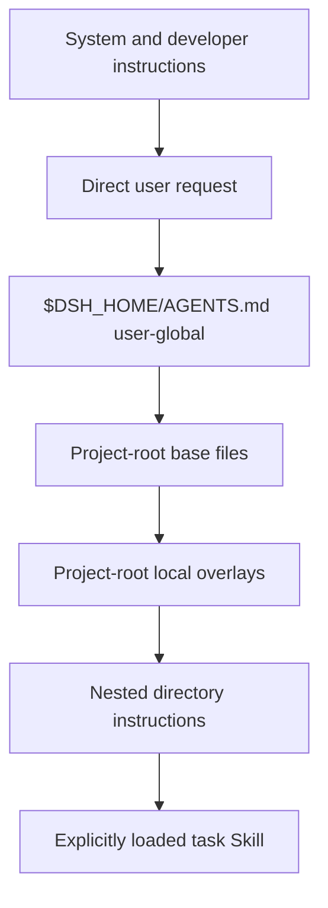
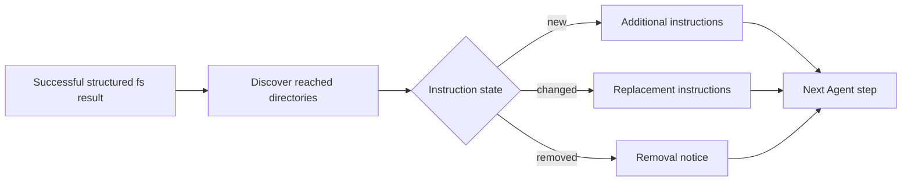
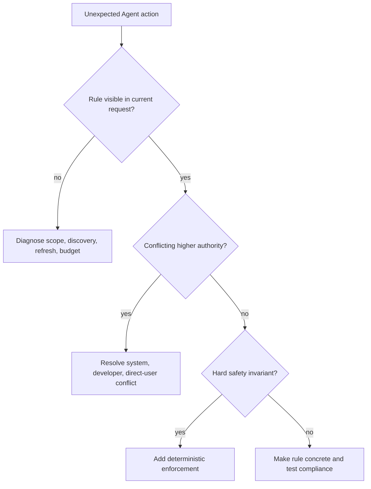

# DeepSeek Harness AGENTS.md scope and precedence

DeepSeek Harness loads a bounded chain of `AGENTS.md`-compatible files into each Session. The chain is durable user-role context, not a process-wide prompt mutation, a deterministic policy engine, or a Skill catalog.

Use this guide to decide where a rule belongs, predict which files apply to a Session, and diagnose stale or duplicated instructions without editing Session history.

> [!WARNING]
> This behavior is reverified at upstream commit `b150a55` (`0.1.1-rc.2`). `$DSH_HOME/AGENTS.md` is currently the fixed user-global path. Discussion #3285 proposes separating that path from project instructions, but the proposal was not implemented at the verification date.

## Loaded does not mean enforced

The shipped plugin frames workspace instructions in a durable **user-role** message. Its own text says the rules “may be relevant,” should be used “as guidance when applicable,” and do not override system, developer, or direct user instructions. That distinction explains many reports that an `AGENTS.md` “sometimes cannot constrain the AI.”

There are four separate claims:

| Claim | Evidence that proves it |
|---|---|
| discovered | the expected source path is present in the current baseline or update event |
| model-visible | the derived request contains the retained workspace message within budget |
| followed | the model's proposed action matches the rule in this turn |
| enforced | a non-model boundary rejects a forbidden action even when the model proposes it |

`AGENTS.md` can establish the first two. It can influence the third. It cannot by itself establish the fourth.

Use deterministic controls for hard requirements:

| Requirement | Enforcement owner |
|---|---|
| “Never write outside this repository” | filesystem containment or sandbox policy |
| “Do not push without approval” | approval gate plus GitHub branch protection |
| “Only these commands are allowed” | tool allowlist and argument validator |
| “Tests must pass before merge” | required CI status checks |
| “Never expose this secret” | credential isolation, redaction, and egress policy |
| “Do not delete production data” | least-privilege credentials and server-side authorization |

Keep the matching instruction too—it helps the model choose the safe path—but do not make prose the last security boundary.

## The authority and scope stack



This diagram combines two different dimensions:

- **Authority:** workspace instructions do not override system, developer, or direct user instructions.
- **Specificity:** inside the workspace chain, more specific directory instructions take precedence over broader ones.

A Skill is task-scoped instructions loaded through the Skill mechanism. It is not automatically broader or narrower than an `AGENTS.md` file. Avoid contradictory rules and use the direct task boundary to resolve ambiguity.

## What loads before the first request

The first eligible step builds one baseline in this order:

1. `$DSH_HOME/AGENTS.md`, where `$DSH_HOME` defaults to `~/.dsh`;
2. every configured base candidate in the project root;
3. every configured local-overlay candidate in the project root;
4. the same base-then-local ordering for each directory from project root to the Session cwd.

Defaults:

```text
Base candidates:  AGENTS.md, CLAUDE.md
Local overlays:   AGENTS.local.md, CLAUDE.local.md
Root markers:     .git
Render budget:    65,536 bytes in the shipped base bundle
Source-file cap:  1 MiB
```

If no configured root marker exists while walking upward, the Session cwd itself becomes the project root.

Within one directory, files whose content is byte-identical after trimming surrounding whitespace collapse to the earliest candidate. Distinct `AGENTS.md` and `CLAUDE.md` contents both load. A local overlay loads after the base candidates.

## Choose the right home for a rule

| Rule lifetime | Put it here | Why |
|---|---|---|
| Every DSH Session for one user | `$DSH_HOME/AGENTS.md` | Fixed user-global baseline |
| Every task in one repository | `<repo>/AGENTS.md` | Root-scoped, versioned with the project |
| One developer's repository override | `<repo>/AGENTS.local.md` | Loads after base files; keep it out of version control if private |
| One subtree | `<repo>/<subdir>/AGENTS.md` | Becomes active when the Session starts there or structured fs work reaches it |
| One reusable task type | A Skill | Discoverable and loaded only when the task matches or the user invokes it |
| One immediate correction | The direct user request | Highest relevant user authority for the current task |

Do not place credentials, tokens, private URLs, or secrets in any instruction file. The baseline becomes model-visible durable Session context.

## Nested discovery is tool-driven

Nested files are not all loaded eagerly. After a successful first-party `read`, `write`, or `edit` touches a deeper path, the plugin checks newly reached descendant scopes and previously loaded scopes. A new file queues an addition; a changed file queues a replacement; a removed or newly deduplicated file queues a removal notice.



Shell `cd` does not trigger this discovery. Each Bash call has its own shell state, and parsing arbitrary shell syntax is not the filesystem observation boundary. If you need a nested scope to become visible, use a structured first-party filesystem action on a path under that scope.

There is no instruction-file watcher. External edits become visible after a successful structured fs touch, Session resume reconciliation, or baseline restoration after compaction.

## The `$DSH_HOME` collision

At rc.7, `$DSH_HOME/AGENTS.md` has two potential meanings when the Session workspace is `$DSH_HOME` itself:

- the hard-coded user-global file;
- the default project candidate at the workspace root.

There is no second official path such as `$DSH_HOME/agent/AGENTS.md` for global-only instructions. Therefore one file cannot hold separate global and `$DSH_HOME`-project policies. Treat `$DSH_HOME/AGENTS.md` as global, not as a configuration-repository policy file.

Until upstream defines a separate global path:

1. keep DSH configuration work bounded by a direct task instruction or an explicitly loaded Skill;
2. maintain project-specific configuration guidance in a separate version-controlled repository rather than assuming `$DSH_HOME/AGENTS.md` is local to that directory;
3. inspect the baseline source labels before acting on destructive configuration changes;
4. do not create symlink tricks to force two meanings. Final-component instruction symlinks are followed and may cross the repository trust boundary.

If a custom composition changes the plugin's `dshHome`, verify the resolved graph and a fresh Session baseline. That field changes where this plugin reads its fixed global file; it does not change the Harness process home or retroactively rewrite durable history.

## Budget behavior

The renderer preserves the most specific files first. When the complete chain exceeds `maxBytes`, it drops whole broader files before truncating the most-specific file and emits a visible budget notice.

This means a global rule can disappear under budget pressure while a deep project rule remains. Keep global policy concise, avoid duplicating prose across scopes, and inspect the visible baseline instead of assuming every existing file reached the model.

A file larger than `maxSourceBytes` is ignored rather than partially read. The default source cap is 1 MiB, but an instruction file should be far smaller.

## Diagnose unexpected behavior

Start by classifying the failure instead of rewriting the rule:



### A rule is visible but not followed

- Check for a conflicting system, developer, or current direct-user instruction.
- Replace vague goals such as “be careful” with an observable action, boundary, and stop condition.
- Separate repository facts from mandatory workflow. Long background prose competes for attention.
- Put the rule in the narrowest applicable directory instead of repeating it globally and locally.
- State what to do when the rule cannot be satisfied; otherwise the model may improvise.
- Test a fresh Session with a small, adversarial task and inspect both the request context and attempted tool call.
- If violating the rule would cause damage, stop prompt tuning and add a policy or authorization gate.

This is probabilistic instruction following, so a single successful test is not enforcement proof. Run a small matrix across the model routes and task shapes you actually support.

### A rule never appears

- Confirm the Session cwd and nearest configured project-root marker.
- Confirm the candidate file name and casing.
- Check that `maxBytes` is positive and the file fits `maxSourceBytes`.
- Look for a budget notice that omitted a broader file.
- For nested files, trigger a successful structured fs touch under that directory.
- Confirm an `ctx.fs` provider exists in the composition; without it, loading is a no-op.

### A rule appears twice

- Check whether the Session cwd or project root equals `$DSH_HOME`.
- Check whether `AGENTS.md` and `CLAUDE.md` are distinct rather than trimmed-content duplicates.
- Inspect the displayed source paths and logical scopes before deleting anything.

### An edit looks stale

- Do not wait for a watcher; there is none.
- Perform one bounded structured read under the relevant scope or resume the Session.
- Look for `Updated instructions from:` or `Instructions removed:` in the next durable context event.
- Start a fresh Session when testing a new precedence or discovery configuration. Existing history remains durable.

## Acceptance gate

- [ ] A fresh Session shows the expected user-global and project-root source labels.
- [ ] The direct user request remains authoritative over conflicting workspace prose.
- [ ] A nested structured read produces exactly one additional scope message.
- [ ] A same-file edit produces one replacement, not accumulated duplicates.
- [ ] Removing a file produces a removal notice after reconciliation.
- [ ] A shell-only directory change does not falsely claim nested discovery.
- [ ] Budget diagnostics identify every omitted or truncated path.
- [ ] No secret is present in the rendered baseline or Session export.
- [ ] A `$DSH_HOME` workspace is reviewed for the fixed-global collision.
- [ ] A visible-but-ignored rule is separated from a missing or stale rule.
- [ ] Every destructive, security, release, and egress invariant has a deterministic owner outside model prose.
- [ ] Conflicting higher-authority instructions have an explicit resolution.
- [ ] Critical rules name an observable action, boundary, failure behavior, and stop condition.
- [ ] Compliance is tested across supported model routes and adversarial task shapes.

## Primary sources

- [Upstream scope proposal #3285](https://github.com/deepseek-ai/deepseek-harness/discussions/3285)
- [Why AGENTS.md can appear not to constrain the model #4731](https://github.com/deepseek-ai/deepseek-harness/discussions/4731)
- [`dsh-agent-instructions` README at rc.2](https://github.com/deepseek-ai/deepseek-harness/blob/b150a551b8d465e31e418e1b2eaf5e79bbb7d28e/packages/context/agent-instructions/README.md)
- [Discovery configuration and fixed global path](https://github.com/deepseek-ai/deepseek-harness/blob/b150a551b8d465e31e418e1b2eaf5e79bbb7d28e/packages/context/agent-instructions/src/config.ts)
- [Root discovery, candidate loading, and bounded reads](https://github.com/deepseek-ai/deepseek-harness/blob/b150a551b8d465e31e418e1b2eaf5e79bbb7d28e/packages/context/agent-instructions/src/files.ts)
- [User-role framing, precedence, and change messages](https://github.com/deepseek-ai/deepseek-harness/blob/b150a551b8d465e31e418e1b2eaf5e79bbb7d28e/packages/context/agent-instructions/src/render.ts)
- [Shipped base composition and 65,536-byte budget](https://github.com/deepseek-ai/deepseek-harness/blob/b150a551b8d465e31e418e1b2eaf5e79bbb7d28e/packages/bundle/base/cordis.patch.yml)
