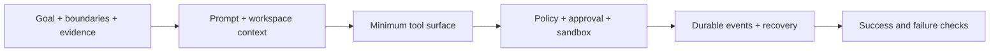

# Designing an Agent, not a bag of tools

Start with an Agent contract before choosing plugins:

| Decision | Question |
|---|---|
| Goal | What concrete state should become true? |
| Scope | Which workspace, services, and data may it touch? |
| Evidence | How can a human verify completion? |
| Model route | Which provider/model meets the quality and cost target? |
| Capabilities | What tools are necessary—and which are not? |
| Effects | Which calls read, write, execute, publish, or delete? |
| Control | Which effects require policy or human approval? |
| Memory | What must survive reload, resume, or fork? |
| Failure | Should the Agent retry, ask, degrade, or stop? |

## Prefer the minimum capability surface

A repository summarizer may need filesystem reads but not shell execution. A coding Agent may need edits and tests but not network publishing. A release Agent may need publishing only after tests and explicit approval. Smaller capability sets make prompts clearer and failures easier to diagnose.

## Separate four safety mechanisms

- **Permission policy** decides whether an operation is allowed, denied, or needs approval.
- **Approval** is a human decision point; it is not confinement.
- **Sandboxing** constrains where execution can cause effects; it does not express business intent.
- **Credentials** determine what an external provider accepts; they do not prove the action was appropriate.

Treating these as interchangeable creates dangerous blind spots.

## Make completion observable

“Done” should correspond to evidence: files changed, tests passed, an artifact produced, a query result returned, or a durable event recorded. Ask the Agent to report both the result and the evidence. For mutations, include a rollback or cleanup path.

## Map the design to Harness

- Put model-facing capabilities behind `ctx.tools`.
- Put provider implementations behind capability seams.
- Use Agent events for live interception and steering.
- Use Session events for facts required by replay or resume.
- Compose the result as a profile/bundle rather than modifying a privileged core.
- Inspect the resolved graph with `--dump-config` before debugging behavior.

## Official sources

- [Architecture](https://github.com/deepseek-ai/deepseek-harness/blob/master/docs/architecture.md)
- [Capability seams](https://github.com/deepseek-ai/deepseek-harness/blob/master/docs/capability-seams.md)
- [Defensive patterns](https://github.com/deepseek-ai/deepseek-harness/blob/master/docs/defensive-patterns.md)
