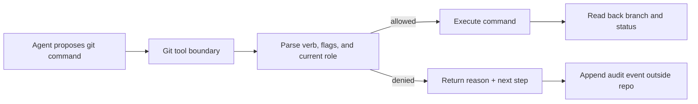

# Turn GitFlow from a prompt request into an execution guard

An Agent can be told to use `integration`, `preview`, and `production` branches and still push directly to a protected branch. A system prompt and an `AGENTS.md` file express intent; they do not enforce the next Git process. The enforcement point is the tool boundary immediately before a Git command executes.

This guide converts the [upstream `agents-gitflow-guard` discussion](https://github.com/deepseek-ai/deepseek-harness/discussions/4896) into a reusable DeepSeek Harness design. The upstream plugin is a community project, not part of the core runtime, and its honest limitation matters: command parsing is best-effort, so repository branch protection remains the final authority.

## The control path



The guard should run before `git push`, `git reset`, branch deletion, and merge operations. It should classify the current branch by role and produce a deterministic decision:

| Operation | Protected role | Default decision | Why |
|---|---|---|---|
| Push or force-push | `production`, `archive` | Deny | Keep release/history branches reviewable |
| Delete branch | `production`, `archive` | Deny | Prevent irreversible loss |
| Agent merge | `production`, `archive` | Deny | Require a human or CI merge authority |
| Normal commit | `integration`, `preview` | Allow with audit | Work can progress without bypassing review |
| Push to a feature branch | feature | Allow with audit | Preserve the PR workflow |

Do not infer authorization from the command's English explanation. Parse the executable, flags, refspecs, and resolved repository state. `git push origin HEAD:production` is a protected push even when the current local branch has a harmless name.

## A minimal opt-in configuration

Keep the policy project-local and explicit. The required role is the integration branch; preview, production, and archive roles are optional.

```json
{
  "integration": "develop",
  "preview": "staging",
  "production": "main",
  "archive": "archive"
}
```

Resolve the config once at tool startup, report the selected role in diagnostics, and fail closed when a protected role is ambiguous. Never silently treat a missing config as permission to force-push.

## Denials are part of the Agent contract

A useful denial is actionable and machine-readable:

```text
DENIED git push --force origin HEAD:main
role=production reason=protected-role next=push a feature branch and open a review
audit=/var/tmp/dsh-gitflow-guard/events.ndjson
```

Return the denial as a failed tool result so the Agent can choose a successor action. Append an event outside the repository containing the timestamp, profile, workspace identifier, normalized operation, branch roles, decision, and reason. Do not log tokens, full prompts, or unredacted remote URLs.

## Tests that prove the boundary

Test the command that would cause harm, not only the prompt that describes the policy:

1. On `main`, verify ordinary status and read-only commands still work.
2. Attempt `git push origin HEAD:main`, `git push --force`, and `git branch -D main`; each must be denied before process spawn.
3. Attempt a feature-branch push and verify the command reaches Git and the audit event says `allow`.
4. Restart with a missing or malformed config and verify the guard fails closed.
5. Bypass the local guard with a second client and verify repository branch protection or CI still rejects the change.
6. Inspect the external audit log after a denial and confirm secrets and workspace contents are absent.

The last test is essential: a local Agent plugin is a policy adapter, not a security boundary. GitHub branch protection, required reviews, signed commits, and least-privilege tokens must enforce the authoritative rule.

## DeepSeek Harness integration checklist

- Install a guard in an isolated profile; do not replace the core Git tool globally.
- Record the resolved profile, plugin version, and source revision in the run evidence.
- Keep command parsing, policy decision, execution, and audit writing as separate stages.
- Preserve the original command in a redacted diagnostic so a denied refspec can be reconstructed.
- Exercise Web, headless, and SDK surfaces because each can expose a different execution path.
- Remove the plugin and restart; prove the baseline tool schema and profile return exactly.

## Primary evidence

- [Upstream `agents-gitflow-guard` discussion (#4896)](https://github.com/deepseek-ai/deepseek-harness/discussions/4896)
- [Community plugin repository](https://github.com/FeatureAgents/AgentsGitFlowController)
- [Community plugin audit guide](../security/community-plugin-audit.md)
- [Tool execution pipeline](../architecture/tool-execution-pipeline.md)
