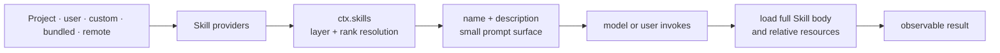

# DeepSeek Harness Skills: create, invoke, and debug reusable Agent instructions

Skills are optional instruction packages discovered through `ctx.skills`. They let a deployment or repository teach Agents a repeatable workflow without hard-coding that workflow into the Agent loop. A Skill is not a session event, and loading one does not by itself prove that its instructions were followed.

> [!NOTE]
> You do not install a Skill with `dsh plugin add`. A plugin contributes runtime code and effects; a Skill contributes instructions that an Agent may load. Put a local Skill in a discovered Skill root, then run a Session whose workspace resolves that root.



## Create one project Skill

From the repository where you run the Agent:

```sh
mkdir -p .dsh/skills/repository-review/references
```

Create `.dsh/skills/repository-review/SKILL.md`:

```md
---
name: repository-review
description: Review a repository change for correctness, safety, and missing tests. Use for pull requests, patches, and pre-merge audits.
---

# Repository review

1. Read the changed files and their callers before judging the patch.
2. Separate confirmed defects from questions and optional improvements.
3. For every defect, cite the file and the smallest relevant line range.
4. Check tests, failure paths, permissions, cleanup, and compatibility.
5. Do not edit files unless the user explicitly asks for a fix.

Use the checklist at `references/checklist.md` only when the change touches
persistence, credentials, external effects, or concurrency.
```

Then create `.dsh/skills/repository-review/references/checklist.md` with the specialized checks. Relative resources stay beside the Skill and are loaded only when the instructions require them.

The description is the routing surface. The full body is progressive-disclosure content. State both the result and the trigger in the description; do not hide the trigger only in the body because the Agent has not loaded it yet.

## Invoke and prove the Skill

There are two independent paths.

### Let the Agent select it

Ask for a task that clearly matches the description:

> Review the current patch for correctness, safety, and missing tests. Do not edit files.

The model-visible catalog contains the Skill name and description. When selected, the Agent calls the `skill` tool, receives the current body, and follows it on the next model step.

### Invoke it explicitly

Use the exact whitespace-bounded name in a user message:

> `/repository-review` Review the current patch. Do not edit files.

A direct user gesture loads a user-invocable Skill into that turn. The Agent should follow the injected `<skill_content>` and must not call the `skill` tool again for the same Skill.

Prove all four signals:

1. the catalog includes `repository-review` with the expected description;
2. the selected or explicitly invoked body is the current file content;
3. the response exhibits the workflow's observable constraints;
4. the result cites actual repository evidence rather than merely saying the Skill ran.

Skill loading proves instruction availability, not compliance. Test at least one positive trigger, one nearby non-trigger, and one explicit invocation.

## Where local Skills are discovered

Lower rank wins within one scope layer:

| Rank | Source | Directory |
|---:|---|---|
| 100 | project DSH | `<projectRoot>/.dsh/skills` |
| 200 | project Agents | `<projectRoot>/.agents/skills` |
| 300 | custom | configured custom Skill directories |
| 400 | user DSH | `<dshHome>/skills` |
| 500 | user Agents | `<agentsHome>/skills` |
| 600 | bundled | configured bundled Skill directory |

The project root is the nearest ancestor containing `.git`; without one, the current working directory becomes the project root. Project-scoped Skills therefore travel naturally with a repository.

In a monorepo, this is the Git root, not the nearest package directory. A Skill under `packages/app/.dsh/skills` is not project-scoped when the `.git` directory is above `packages/`. Put it under the actual Git root or configure an explicit custom Skill directory.

## Valid shapes and frontmatter

Skill names use kebab-case. The local provider accepts:

```text
.dsh/skills/
  repository-review/
    SKILL.md
    references/
      checklist.md
  release-notes.md
```

Both a directory bundle (`<name>/SKILL.md`) and a flat `<name>.md` are valid. Nested recursive `**/SKILL.md` discovery is not supported.

The required frontmatter fields are `name` and `description`. The filesystem provider also parses optional `whenToUse`, `metadata`, `disable-model-invocation`, and `user-invocable`. Names must use kebab-case.

## Progressive disclosure

The initial model catalog contains model-invocable Skill names and descriptions, not the full instruction bodies or absolute paths. The complete definition is loaded only after invocation. This keeps prompt cost lower and makes the description a routing contract.

A strong description says what the Skill produces and when to use it. The body should then contain the ordered workflow, safety conditions, required evidence, and links to relative resources.

Loaded instruction bodies have no size cap. They remain in tool-result or injected context until compaction, so keep the body focused and move conditional detail into relative resources.

## Model and user invocation are independent

Two frontmatter controls resolve into separate policies:

- `disable-model-invocation: true` hides a Skill from model-facing discovery;
- `user-invocable: false` prevents direct human invocation.

Omitting them permits both by default. A deployment can therefore provide model-only, user-only, dual-use, or trusted-loader-only Skills.

```yaml
# The user may invoke /release-check, but the model cannot select it itself.
disable-model-invocation: true
user-invocable: true
```

Invocation policy fails closed. A misspelled camel-case key or a non-boolean invocation value makes the local provider drop the Skill with a warning instead of silently exposing it.

## Layering and duplicates

The registry merges a global host layer with the viewing Agent's scope chain. A nearer scope layer wins a duplicate name outright. Rank decides duplicates only inside the same layer, followed by provider registration order and local order.

That means an Agent preset can intentionally shadow a host Skill for one scoped Agent without changing every other Agent in the process.

## Hot refresh and failure behavior

Filesystem watchers invalidate the catalog when direct Skill entries change. Provider mutations emit `skills/change`, prompting consumers to fetch a new snapshot. An incomplete provider observation can still contribute usable Skills but is not cached as authoritative absence.

Catalog frontmatter and body content have different refresh behavior:

- adding, removing, renaming, or changing direct Skill frontmatter invalidates discovery and may append a replacement catalog to durable Session history;
- editing only the instruction body does not change the catalog, but the next `skill(name)` load rereads the file;
- changing a file under `references/`, `scripts/`, or `assets/` does not invalidate the catalog;
- an incomplete discovery preserves the last-good model catalog instead of publishing a false deletion.

## Diagnose common surprises

| Symptom | First evidence | Likely boundary |
|---|---|---|
| Skill exists on disk but is absent | Session cwd, nearest `.git`, direct root entry | wrong project root or unsupported nesting |
| A same-name Skill has unexpected content | source layer and duplicate-name winner | nearer scope or lower-rank provider shadows it |
| `/name` stays ordinary text | exact whitespace boundary and `user-invocable` | invalid gesture or user invocation disabled |
| Agent never selects the Skill | rendered catalog description and tool visibility | weak routing description or hidden `skill` tool |
| Body edit is not announced | compare catalog metadata with body only | expected: body changes do not publish a catalog replacement |
| Skill disappears after malformed edit | logs plus YAML types and kebab-case name | fail-closed frontmatter validation |

When a Skill seems missing, check:

1. valid kebab-case name;
2. supported direct directory or flat-file shape;
3. Session cwd and nearest Git root;
4. invocation policy;
5. a nearer scope shadowing the same name;
6. incomplete provider discovery or watcher failure.

## Skill authoring checklist

- Keep the description short enough for a catalog and specific enough for routing.
- State trigger conditions and explicit non-goals.
- Separate read-only inspection from mutations.
- Define observable evidence of completion.
- Use placeholders, never real credentials.
- Keep relative resources inside the Skill bundle.
- Test model selection and direct user invocation where enabled.
- Test the resolved root from a nested working directory.
- Keep loaded bodies bounded and move conditional detail into resources.

## Official sources

- [Skills subsystem](https://github.com/deepseek-ai/deepseek-harness/blob/99f6f02fecdb7dff40c3fbc9470f5907c29f74ca/docs/subsystems/skills.md)
- [Filesystem Skill provider](https://github.com/deepseek-ai/deepseek-harness/blob/99f6f02fecdb7dff40c3fbc9470f5907c29f74ca/packages/skill/skill-filesystem/README.md)
- [Model-facing Skill tool](https://github.com/deepseek-ai/deepseek-harness/blob/99f6f02fecdb7dff40c3fbc9470f5907c29f74ca/packages/skill/tool-skill/README.md)
- [Skill packages](https://github.com/deepseek-ai/deepseek-harness/tree/99f6f02fecdb7dff40c3fbc9470f5907c29f74ca/packages/skill)
