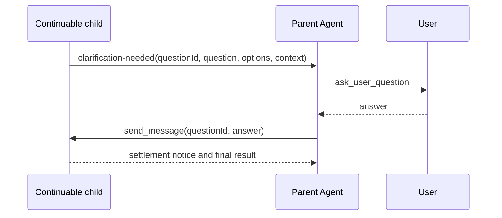

# Relay a subagent clarification through the parent Session

DeepSeek Harness `0.1.1-rc.2` does not let a live delegated child open the user-question UI directly. The user-question service authenticates the exact live Agent and accepts it only when it is a runtime root. A child owned by another live Agent fails with `DELEGATED_CALLER` before any UI wait begins.

This is a useful ownership boundary: the root Session owns the human relationship, visible conversation, cancellation, and audit trail. A workflow that needs clarification should relay the request through that parent rather than silently suspending a child on a UI surface it does not own.

## Use a four-step relay



The parent remains the only Agent that asks the user. The child remains the owner of its work context. The relay joins them through explicit identity instead of pretending both share one interactive turn.

## Choose the child lifecycle first

| Child route | Can receive the later answer? | Safe response to missing information |
|---|---|---|
| foreground one-shot | no independent continuation handle | return a clarification requirement as the result; parent asks, then starts a new child with the answer |
| background one-shot Job | no follow-up conversation | settle with a failed/blocked outcome; parent asks, then starts a replacement Job |
| continuable child | yes, through its durable child id | report clarification, become idle, then parent uses `send_message` for the next child turn |
| product subagent configured non-interactively | provider-specific, often no UI path | fail closed and return diagnostic; never assume its native AskUserQuestion can reach the DSH user |

If the workflow expects interactive clarification, choose a continuable provider before starting. A one-shot task cannot become continuable merely because it returned a question.

## Define a structured clarification envelope

Do not parse arbitrary prose such as “I need more info” from the child's final answer. Give the workflow a versioned terminal contract:

```json
{
  "kind": "clarification-needed",
  "version": 1,
  "questionId": "chapter-scope-1",
  "question": "Which audience should this chapter target?",
  "detail": "The outline supports either beginner or graduate-level treatment.",
  "options": ["Beginner", "Graduate"],
  "allowFreeText": false,
  "resumeToken": "child-owned-opaque-token"
}
```

The envelope is a request, not a UI command. The parent validates and may rewrite it before showing the user. Never let the child supply HTML, a callback URL, executable code, secret defaults, or a durable permission grant.

## Parent relay state machine

Store relay state independently of transient model context:

```text
running
  -> clarification_requested
  -> question_presented
  -> answered | cancelled | expired
  -> answer_delivery_pending
  -> child_resumed
  -> completed | failed | clarification_requested
```

Each record should contain:

- parent Session id and exact live parent Agent identity;
- child id and direct-parent relationship;
- question id plus hash of normalized question/options;
- presentation timestamp, expiry, and one terminal user outcome;
- answer-delivery attempt and acknowledgement identity;
- child settlement or replacement id;
- redacted audit facts, never raw secrets by default.

The user answer must be appended to the parent Session before delivery so reconnect can reconstruct what the human decided. Delivery to the child must be idempotent: repeating a network request must not create two child turns.

## Ask honestly from the parent

The parent should explain provenance:

```text
The research subagent needs one clarification before it can continue.

Which audience should this chapter target?
1. Beginner
2. Graduate
```

Do not impersonate the child as the top-level assistant or expose its hidden reasoning. Show only the reviewed question, useful context, and bounded options. Let the user cancel. Cancellation is a terminal workflow outcome unless policy explicitly provides a default.

## Deliver the answer safely

For a continuable child, send a self-contained follow-up that includes the stable question id:

```text
Clarification answer for chapter-scope-1: Beginner.
Continue the existing task using that decision. Do not ask the user directly.
If another essential ambiguity remains, return a new clarification-needed envelope
with a new questionId. Do not reuse chapter-scope-1.
```

Only the direct parent should be authorized to resume that child. A child id supplied in model text is attribution, not authority. The continuation service must check the live lineage relationship.

## Bound interaction loops

Set limits per workflow:

- maximum clarification rounds;
- maximum questions per batch;
- question expiry;
- maximum answer size;
- maximum child resumes;
- total wall-clock and token budget;
- allowed question kinds and option count.

When a limit is reached, surface a visible blocked result with completed artifacts and missing decisions. Do not continue asking until the user gives up.

## Recovery after reconnect or restart

On parent UI reconnect, replay only a still-pending root-owned question. If the answer was committed but delivery was not acknowledged, resume the delivery state rather than asking again.

A process restart can remove live child Activations, but a continuable child may be cold-resumable by its durable Session id. Prove that the provider supports cold resume before promising it. If the child cannot resume, start a replacement with the original task summary, accepted artifacts, question, and committed answer; record the replacement identity.

## Security boundaries

- A child question is untrusted content. Sanitize display text and cap size.
- The parent decides whether the question is necessary and safe to expose.
- User answers may contain secrets; redact logs and avoid forwarding irrelevant context.
- Human clarification is not tool approval. Keep user questions and permission grants on separate seams.
- Do not let a child request broader sandbox, credentials, or network access through a generic clarification answer.
- Cancellation must propagate to the pending question and the child Activation.

## Acceptance matrix

| Case | Required result |
|---|---|
| delegated child calls ask-user directly | fails before creating a UI wait |
| child returns valid clarification envelope | parent validates and presents one root-owned question |
| malformed or oversized envelope | fails visibly; no UI injection |
| user answers | parent commits answer before one idempotent delivery |
| user cancels or question expires | child is cancelled or workflow becomes visibly blocked |
| duplicate browser answer | first terminal outcome wins |
| answer delivery retries | one child turn is created |
| child asks another question | new id and bounded round count are required |
| parent reconnects before answer | one pending question reappears |
| parent reconnects after answer | question does not reappear; delivery state resumes |
| child cannot cold resume | replacement child receives reviewed state and answer |
| unrelated Agent uses child id | authorization rejects without exposing child content |

## Official sources

- [Official workflow subagent question request #4697](https://github.com/deepseek-ai/deepseek-harness/discussions/4697)
- [rc.2 user-question root ownership contract](https://github.com/deepseek-ai/deepseek-harness/blob/b150a551b8d465e31e418e1b2eaf5e79bbb7d28e/docs/subsystems/user-questions.md)
- [Delegated-caller guard design](https://github.com/deepseek-ai/deepseek-harness/blob/b150a551b8d465e31e418e1b2eaf5e79bbb7d28e/.agents/notes/implemented/bug-fix/2026-08-01-ask-user-delegated-caller-guard.md)
- [rc.2 subagent one-shot and continuable contract](https://github.com/deepseek-ai/deepseek-harness/blob/b150a551b8d465e31e418e1b2eaf5e79bbb7d28e/packages/subagent/tool-subagent/README.md)
- [rc.2 product-subagent non-interactive boundary](https://github.com/deepseek-ai/deepseek-harness/blob/b150a551b8d465e31e418e1b2eaf5e79bbb7d28e/.agents/notes/implemented/feature/2026-08-15-product-subagent-noninteractive-permissions.md)
