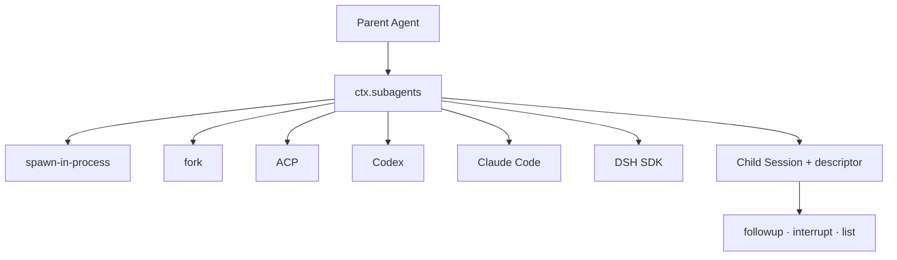

# DeepSeek Harness Subagents: delegation without one fixed backend

Subagents are an optional capability seam. A parent Agent delegates work through `ctx.subagents`; multiple provider implementations can coexist under different names. Delegation is therefore not hard-wired into the Agent loop or to one child process model.



## One-shot versus continuable children

| Kind | Best for | Lifetime |
|---|---|---|
| one-shot | bounded independent research or execution | provider returns a run that settles once |
| continuable | a durable specialist that receives later messages | one child Session may have multiple turns and cold resumes |

One-shot providers advertise static capability flags. A request requiring an unsupported capability fails loudly with `UNSUPPORTED_CAPABILITY`; it is not accepted and silently degraded.

Continuable support is a separate provider capability. The continuation manager owns child activation, direct-parent authorization, cold resume, and child-first disposal, while the normal Agent loop still owns turn execution.

## The durable identity model

A continuable child is one durable Session. It may have at most one live process-local **Activation**—the period when its reconstructed Agent is resident.

```text
persisted child Session
  -> optional live Activation
       -> one retained Agent handle
       -> Agent inbox as the only FIFO
       -> zero or more owned child Activations
```

No second message queue is introduced. Follow-ups use the child's ordinary Agent inbox, so accepted messages retain one observable FIFO order.

That inbox is not synonymous with “messages I sent.” It can also contain initial input, child-local or plugin input, steering context, and runtime settlement notices that wake a parent after its own child finishes. Any queue-control API must preserve those other owners.

## Bind child lifetime to the parent owner

The child identity is durable, but its live Activation still has an owner. Treating the continuation manager's service scope as that owner creates a production trap: a parent can dispose while a child remains live, and the child can continue consuming memory or waiting on a settlement that no longer has a receiver. Upstream discussion [#4909](https://github.com/deepseek-ai/deepseek-harness/discussions/4909) describes this as a missing lifecycle-handoff contract.

Use the parent Agent's effect scope as the disposal boundary when the child is owned by that parent. The contract should make four edges observable:

1. **Ownership:** parent disposal marks every owned child as closing and prevents new follow-ups.
2. **Cascade:** disposal drains descendants exactly once; an explicit `drain` call is not a substitute for the owner hook.
3. **Hung work:** a child that never settles has a bounded watchdog or an explicit force-reclaim policy; waiting on `whenIdle()` alone is not a timeout.
4. **Settlement:** a child settlement either reaches its live parent or is durably recorded as an orphaned handoff; silently returning because the parent disappeared loses operator evidence.

Verify the boundary with parent-first, child-first, hung-child, and crash-restart tests. Record child id, parent id, ownership scope, disposal reason, and final settlement status. A prompt asking a child to stop is not lifecycle control: the host must still prove that the Activation was disposed and that external effects were independently checked.

## Start, follow up, and interrupt

- `startContinuable()` reserves the child ID, records its descriptor, creates the Agent, and accepts the initial prompt.
- `followup()` sends into the running Activation, wakes a waiting one, or cold-resumes when no Activation exists.
- `interrupt()` cancels the live target's current work but keeps unclaimed inbox messages and descendants; a later message can resume the queue.

Caller cancellation owns lookup and admission only until inbox acceptance. After acceptance, the continuation manager owns the Activation independently.

## Control stale pending follow-ups without clearing the inbox

Upstream discussion [#4631](https://github.com/deepseek-ai/deepseek-harness/discussions/4631) reports that several corrections sent to a busy continuable child remain FIFO even after earlier corrections become stale. rc.2 exposes no model-facing list, single-message cancel, reorder, priority, or replace-pending operation for that child queue.

`interrupt()` does not solve this problem. It calls `Agent.cancel(..., { keepInbox: true })`: the active turn is interrupted, but unclaimed messages stay pending and can resume later.

Until a scoped control lands:

1. keep at most one unacknowledged correction per child;
2. ask the child to report or settle before issuing another correction when ordering matters;
3. combine related corrections into one replacement instruction before sending;
4. treat an interrupted child as still owning its pending queue;
5. abandon the child identity and start a fresh bounded child only when repeating old work and losing its private in-flight state is acceptable.

Do not claim that a fresh child cancels the old one. Stop or dispose the old owner through its supported lifecycle and verify external side effects separately.

## Define the controllable subsequence

A safe future API does not expose arbitrary `agent.inbox` mutation. It derives an **eligible subsequence** of pending messages satisfying all of these conditions:

- the target is an exact live resident continuable child;
- the caller is its exact live direct parent;
- the message is an unclaimed `next-turn` follow-up admitted through that parent-child relay;
- its source and admission record identify that same relay and parent;
- the Activation is not closing;
- the message is neither initial input, steering/next-step context, child-local input, plugin input, nor a runtime settlement notice.

An empty result means “none of this parent's pending follow-ups,” not “the child's inbox is empty.” This wording matters: hidden ineligible work may still keep the child running or waiting.

### List safely

A list operation should:

- never cold-resume an absent child merely to inspect it;
- return stable `MessageId` values, target, accepted time or seq, and a bounded preview;
- paginate with a small default and enforced maximum;
- omit or redact content the caller is not authorized to see;
- identify the snapshot generation or durable seq used;
- label the result as a filtered view, not a complete inbox dump.

The full message body may contain secrets, tool output, or personal data. A model-facing tool usually needs an identifier and short preview, not unrestricted content.

### Cancel one pending message

Cancellation must linearize against claim:

1. authorize the exact live parent and child;
2. locate the `MessageId` in the eligible pending subsequence;
3. repeat the eligibility check at the mutation boundary;
4. remove it through the inbox's durable cancellation path;
5. return whether cancellation won the race.

In rc.2, `Inbox.remove(messageId)` locates a still-pending message, appends `agent/inbox/spliced { outcome: "canceled" }`, mutates the live projection, and emits `agent/inbox/discarded`. If claim wins first, `remove()` returns `false`; the control must not cancel the active Agent turn or pretend the already-claimed message was withdrawn.

Cancellation is not message deletion from history. The durable splice remains evidence that accepted work was canceled before it ran.

### Replace or reorder only eligible follow-ups

A raw `clear()`, full inbox reorder, or `prepend()` is unsafe as a parent-facing control. It can remove or move settlement notices and break the child's view of its own descendants.

Define any future operation over the eligible subsequence while preserving every ineligible message and the relative order of all ineligible entries. For example:

- `replace_pending` means cancel this parent's eligible pending follow-ups and insert one new follow-up atomically;
- `move_to_front` means move one eligible follow-up ahead of this parent's other eligible follow-ups, not ahead of arbitrary inbox messages;
- `priority` selects among eligible messages from the same authority domain; it does not preempt a claimed turn;
- a generation mismatch refuses rather than applying a stale reorder to a changed inbox.

The cancellation and insertion must be one durable transaction if callers are promised atomic replace. Two independent operations create a window in which a claim can admit the old message, the new message, or both.

## Queue-control failure router

| Observation | Boundary | Safe interpretation |
|---|---|---|
| list is empty while child is waiting | filtered visibility | no eligible parent follow-up; hidden settlement/internal work may exist |
| cancel returns false | claim/cancel race or wrong id | message was not eligible and pending at mutation time |
| interrupted child later processes old correction | `keepInbox: true` | expected preservation, not a failed interrupt |
| canceled id has a durable splice but no `user/message` | cancel won before claim | accepted work was accounted without entering a turn |
| same id appears in a later turn | identity or replay defect | preserve insertion, splice, claim, and `user/message` events |
| replace removes a settlement notice | authority-filter defect | stop using the operation; child-lifecycle progress may be lost |
| urgent message runs after old work | FIFO acceptance | priority did not preempt or reorder claimed work |
| inspection cold-resumes a settled child | observation side effect | redesign list as resident-only or use a separate durable mailbox view |

## Queue-control regression gates

- Listing is bounded, paginated, and resident-only.
- An empty list is documented as an eligible-subsequence result.
- Only the exact live direct parent can list or cancel its follow-ups.
- A host-user address, ancestor, sibling, stale Agent, or caller-supplied source is insufficient authority.
- Initial input is never listed or canceled as a follow-up.
- `next-step` steering and injected context are excluded.
- Settlement and other internal notices are excluded.
- Messages from another sender are excluded.
- Previews are length-bounded by Unicode code point and redact protected content.
- Stable `MessageId` is the occurrence identity; text equality is never used.
- Cancel-first produces one durable canceled splice and no later claim.
- Claim-first returns not-canceled and never aborts the active turn.
- Repeated cancellation is idempotent and reports no second success.
- Inspection and failed cancellation never cold-resume a child.
- Replace is atomic or explicitly refuses to promise atomicity.
- Reorder preserves the positions and relative order of every ineligible entry.
- Priority never preempts already-claimed work.
- A generation mismatch rejects a stale list-then-mutate request.
- Interrupt preserves unclaimed messages exactly as documented.
- Disposal accounts for every accepted message as claimed, canceled, or explicitly stopped.

## Authorization boundary

Continuation authority comes from the exact live parent/ancestor relationship, not from a caller-supplied sender field. A direct parent can address its durable child; mismatched parent identity or an unauthorized ancestor fails rather than relying on prompt text.

This matters when exposing `send_message`, `interrupt_agent`, or `list_agents` through model-facing tools: an identifier in a message is attribution, not authority.

## Reports versus runtime settlement

A child may explicitly report selected content to its direct parent. Separately, the runtime emits its own settlement account when a continuable child finishes. These have distinct provenance so transcripts never present runtime-generated text as words the child chose.

## Choosing a provider

Evaluate providers on:

- required start-time capabilities;
- one-shot versus continuable support;
- isolation and filesystem policy;
- model/tool availability in the child;
- session persistence and cold-resume behavior;
- cancellation and disposal semantics;
- cost, latency, and external credentials.

Do not select a provider only by brand name. The capability descriptor and execution boundary determine whether it fits the Agent contract.

## Scale workflows with two separate limits

The worker-thread workflow engine has two different child limits:

| Limit | Default | What it controls |
|---|---:|---|
| `maxConcurrentAgents` | `0` | live overlapping `agent()` calls; zero resolves to `min(16, max(1, CPU cores - 2))` |
| `maxTotalAgents` | `1000` | all `agent()` calls started during one workflow run |

The total limit is a runaway-loop backstop, not a memory budget. A workflow can remain below 1000 calls and still exhaust the Node.js heap because each child has an independent model context, runtime state, result, and lifecycle evidence. Increasing `--max-old-space-size` only moves the crash boundary; it does not make hundreds of children one bounded job.

For a large translation or repository-processing task:

1. partition the input into durable batches;
2. start with a small concurrency ceiling such as 2–4;
3. set a total-agent ceiling close to the expected batch size, not the deployment default;
4. persist each completed batch outside the workflow before starting the next one;
5. record peak heap, child count, batch duration, failed items, and retry count;
6. cancel growth when memory rises monotonically after settled children.

The relevant composition row is `workflow-worker-thread`. In a copied preset, keep it inside the same isolated delegation group as `tool-workflow` and lower both ceilings deliberately:

```yaml
- id: delegation
  name: cordis:group
  group: true
  isolate:
    workflows: true
  config:
    - id: workflow-worker-thread
      name: '@deepseek-ai/dsh-workflow-worker-thread'
      config:
        provider: spawn
        maxConcurrentAgents: 4
        maxTotalAgents: 64
    - id: tool-workflow
      name: '@deepseek-ai/dsh-tool-workflow'
```

These values are starting bounds, not universal sizing advice. Increase one dimension at a time from measured evidence. A run that needs 480 translations is usually safer as several restartable batches than one process-lifetime fan-out.

## Failure checklist

| Symptom | Investigate |
|---|---|
| delegation rejected immediately | provider name or unsupported capability |
| child ID returned but no result yet | inbox accepted; turn may not have started |
| follow-up reaches a different run | wrong child/session identity or one-shot provider |
| interrupt appears to lose work | claimed work is not requeued; unclaimed inbox remains |
| cold resume lacks recent state | persistence flush failure or stale storage |
| parent waits after its own task | owned descendant Activation has not disposed |
| process approaches 4 GB and exits with JavaScript heap OOM | total child count may be below the default cap; lower concurrency and total calls, then split durable batches |

## Official sources

- [rc.2 continuable subagent manager](https://github.com/deepseek-ai/deepseek-harness/blob/b150a551b8d465e31e418e1b2eaf5e79bbb7d28e/packages/subagent/subagent/src/continuation.ts)
- [rc.2 subagent contract](https://github.com/deepseek-ai/deepseek-harness/blob/b150a551b8d465e31e418e1b2eaf5e79bbb7d28e/packages/subagent/subagent/README.md)
- [rc.2 durable Inbox implementation](https://github.com/deepseek-ai/deepseek-harness/blob/b150a551b8d465e31e418e1b2eaf5e79bbb7d28e/packages/core/agent/src/inbox.ts)
- [rc.2 Agent inbox and cancellation contract](https://github.com/deepseek-ai/deepseek-harness/blob/b150a551b8d465e31e418e1b2eaf5e79bbb7d28e/packages/core/agent/README.md)
- [rc.2 concrete Agent loop](https://github.com/deepseek-ai/deepseek-harness/blob/b150a551b8d465e31e418e1b2eaf5e79bbb7d28e/packages/core/agent-loop/src/agent.ts)
- [Workflow worker-thread limits](https://github.com/deepseek-ai/deepseek-harness/blob/b150a551b8d465e31e418e1b2eaf5e79bbb7d28e/packages/workflow/workflow-worker-thread/README.md#config)
- [Pending follow-up control request #4631](https://github.com/deepseek-ai/deepseek-harness/discussions/4631)
- [Non-upstream list-and-cancel reference implementation](https://github.com/Jstn-1g/deepseek-harness/commit/913172e7972c0541cb08122e0e9e75ae8f6472c9)
- [480-child JavaScript OOM report](https://github.com/deepseek-ai/deepseek-harness/discussions/1897)
