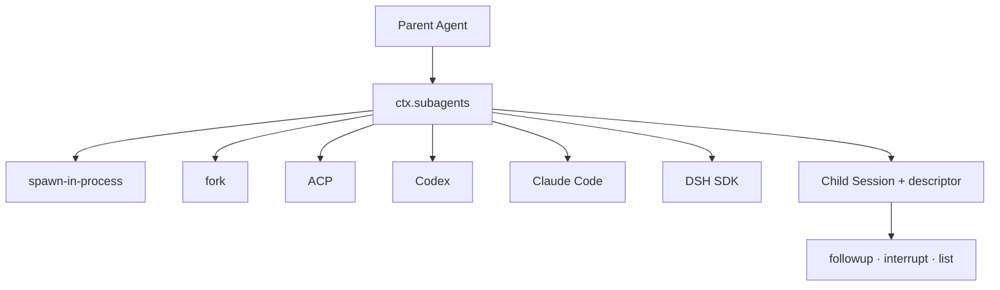

# DeepSeek Harness Subagents: delegation without one fixed backend

Subagents are an optional capability seam. A parent Agent delegates work through `ctx.subagents`; multiple provider implementations can coexist under different names. Delegation is therefore not hard-wired into the Agent loop or to one child process model.



## One-shot versus continuable children

| Kind | Best for | Lifetime |
|---|---|---|
| one-shot | bounded independent research or execution | provider returns a run that settles once |
| continuable | a durable specialist that receives later messages | one child Session may have multiple turns and cold resumes |

One-shot providers advertise static capability flags. A request requiring an unsupported capability fails loudly with `UNSUPPORTED_CAPABILITY`; it is not accepted and silently degraded.

Continuable support is a separate provider capability. The continuation manager owns child activation, direct-parent authorization, cold resume, and child-first disposal, while the normal Agent loop still owns turn execution.

## The durable identity model

A continuable child is one durable Session. It may have at most one live process-local **Activation**—the period when its reconstructed Agent is resident.

```text
persisted child Session
  -> optional live Activation
       -> one retained Agent handle
       -> Agent inbox as the only FIFO
       -> zero or more owned child Activations
```

No second message queue is introduced. Follow-ups use the child's ordinary Agent inbox, so accepted messages retain one observable FIFO order.

## Start, follow up, and interrupt

- `startContinuable()` reserves the child ID, records its descriptor, creates the Agent, and accepts the initial prompt.
- `followup()` sends into the running Activation, wakes a waiting one, or cold-resumes when no Activation exists.
- `interrupt()` cancels the live target's current work but keeps unclaimed inbox messages and descendants; a later message can resume the queue.

Caller cancellation owns lookup and admission only until inbox acceptance. After acceptance, the continuation manager owns the Activation independently.

## Authorization boundary

Continuation authority comes from the exact live parent/ancestor relationship, not from a caller-supplied sender field. A direct parent can address its durable child; mismatched parent identity or an unauthorized ancestor fails rather than relying on prompt text.

This matters when exposing `send_message`, `interrupt_agent`, or `list_agents` through model-facing tools: an identifier in a message is attribution, not authority.

## Reports versus runtime settlement

A child may explicitly report selected content to its direct parent. Separately, the runtime emits its own settlement account when a continuable child finishes. These have distinct provenance so transcripts never present runtime-generated text as words the child chose.

## Choosing a provider

Evaluate providers on:

- required start-time capabilities;
- one-shot versus continuable support;
- isolation and filesystem policy;
- model/tool availability in the child;
- session persistence and cold-resume behavior;
- cancellation and disposal semantics;
- cost, latency, and external credentials.

Do not select a provider only by brand name. The capability descriptor and execution boundary determine whether it fits the Agent contract.

## Scale workflows with two separate limits

The worker-thread workflow engine has two different child limits:

| Limit | Default | What it controls |
|---|---:|---|
| `maxConcurrentAgents` | `0` | live overlapping `agent()` calls; zero resolves to `min(16, max(1, CPU cores - 2))` |
| `maxTotalAgents` | `1000` | all `agent()` calls started during one workflow run |

The total limit is a runaway-loop backstop, not a memory budget. A workflow can remain below 1000 calls and still exhaust the Node.js heap because each child has an independent model context, runtime state, result, and lifecycle evidence. Increasing `--max-old-space-size` only moves the crash boundary; it does not make hundreds of children one bounded job.

For a large translation or repository-processing task:

1. partition the input into durable batches;
2. start with a small concurrency ceiling such as 2–4;
3. set a total-agent ceiling close to the expected batch size, not the deployment default;
4. persist each completed batch outside the workflow before starting the next one;
5. record peak heap, child count, batch duration, failed items, and retry count;
6. cancel growth when memory rises monotonically after settled children.

The relevant composition row is `workflow-worker-thread`. In a copied preset, keep it inside the same isolated delegation group as `tool-workflow` and lower both ceilings deliberately:

```yaml
- id: delegation
  name: cordis:group
  group: true
  isolate:
    workflows: true
  config:
    - id: workflow-worker-thread
      name: '@deepseek-ai/dsh-workflow-worker-thread'
      config:
        provider: spawn
        maxConcurrentAgents: 4
        maxTotalAgents: 64
    - id: tool-workflow
      name: '@deepseek-ai/dsh-tool-workflow'
```

These values are starting bounds, not universal sizing advice. Increase one dimension at a time from measured evidence. A run that needs 480 translations is usually safer as several restartable batches than one process-lifetime fan-out.

## Failure checklist

| Symptom | Investigate |
|---|---|
| delegation rejected immediately | provider name or unsupported capability |
| child ID returned but no result yet | inbox accepted; turn may not have started |
| follow-up reaches a different run | wrong child/session identity or one-shot provider |
| interrupt appears to lose work | claimed work is not requeued; unclaimed inbox remains |
| cold resume lacks recent state | persistence flush failure or stale storage |
| parent waits after its own task | owned descendant Activation has not disposed |
| process approaches 4 GB and exits with JavaScript heap OOM | total child count may be below the default cap; lower concurrency and total calls, then split durable batches |

## Official sources

- [Subagent subsystem](https://github.com/deepseek-ai/deepseek-harness/blob/master/docs/subsystems/subagent.md)
- [Subagent packages](https://github.com/deepseek-ai/deepseek-harness/tree/master/packages/subagent)
- [Extension cookbook](https://github.com/deepseek-ai/deepseek-harness/blob/master/docs/cookbook/extension-cookbook.md)
- [Workflow worker-thread limits](https://github.com/deepseek-ai/deepseek-harness/blob/master/packages/workflow/workflow-worker-thread/README.md#config)
- [480-child JavaScript OOM report](https://github.com/deepseek-ai/deepseek-harness/discussions/1897)
