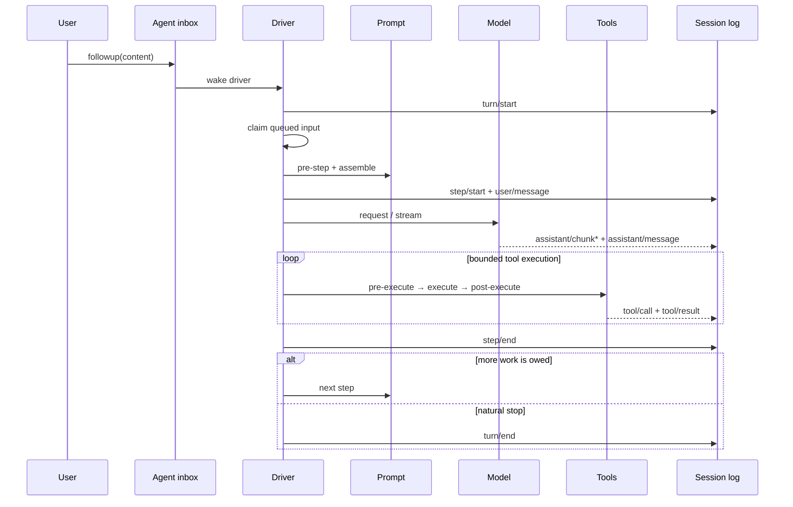
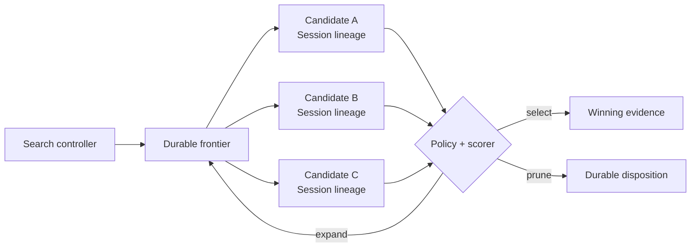
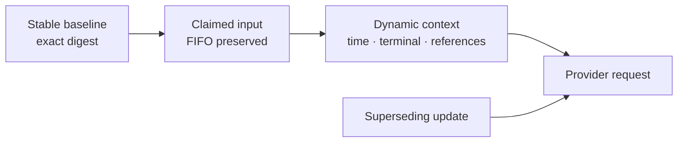

# One DeepSeek Harness turn, step by step

A **step** is one model request plus the tool calls it produces. A **turn** contains zero or more steps and closes only when the runtime owes no more work.



## Why the distinction matters

- A model can request tools, causing another step inside the same turn.
- Steering or queued next-step input can extend a turn.
- A rejected first `agent/pre-step` decision can still produce a durable zero-step turn.
- Cancellation and provider errors must close or recover at the correct boundary.

## Parent disposal is a separate lifecycle contract

Upstream architecture report [#4909](https://github.com/deepseek-ai/deepseek-harness/discussions/4909) identifies a failure mode that a normal turn trace cannot prove: a parent Agent can dispose while a continuable child remains owned by a service/factory scope. Explicit `drainChildren()` calls, a child waiting forever for `whenIdle()`, and a settlement callback that returns when the parent is gone create four distinct gaps—ownership, cascade cleanup, hung-child reclamation, and settlement delivery.

Treat those as separate acceptance checks. A parent-owned child must be released or deliberately handed off when the parent scope ends; a hung child needs a bounded timeout or force-reclaim policy; and settlement must be durable enough to explain whether it was delivered, queued for handoff, cancelled, or dropped because policy chose that outcome. Do not infer any of these guarantees from a successful child tool call or from an explicit drain API that callers may forget to invoke.

```text
parent dispose
  → child ownership decision (cascade | handoff | reject)
  → bounded child drain / reclaim
  → durable settlement disposition
```

The minimum safe regression fixture creates a parent, starts a child that has not settled, disposes the parent first, and then exercises both a normal child settlement and a hung-child timeout. Assert no orphaned activation remains, no settlement notification is silently lost, and the parent Session records the disposition without rewriting prior durable events. The repository's jobs/schedule paths provide a useful ownership comparison, but a community reference patch is not evidence that the main branch already provides this contract.

## A search frontier belongs outside the default linear driver

[Request #4761](https://github.com/deepseek-ai/deepseek-harness/discussions/4761) asks for a generic frontier-selection extension point for beam search, branch pruning, cost-aware planning, and deterministic replay. The rc.2 source has no public frontier seam. More importantly, the existing tool scheduler is the wrong owner: it orders exclusive and parallel-safe tool calls **inside one model step**. It does not own alternative Session histories, candidate scores, search budgets, or branch selection.

The concrete `ReactLoopAgent`, inbox, and run controls are package-private. Public orchestration creates or resumes Agents through `ctx.agents`; a prepared Session can be claimed by only one concrete driver. Subagents, jobs, and workflows are composed outside the default loop. A frontier controller should preserve those boundaries instead of importing driver internals.



### Define the seam around evidence, not mutable Agents

A reusable selector needs an immutable input and an explicit decision output. This illustrative vocabulary is not an rc.2 API:

```ts
interface FrontierCandidate {
  candidateId: string
  sessionId: string
  parentCandidateId?: string
  depth: number
  stateDigest: string
  terminal: boolean
  observedUsage?: { inputTokens?: number; outputTokens?: number }
}

type FrontierDecision =
  | { kind: 'expand'; candidateIds: string[] }
  | { kind: 'select'; candidateId: string }
  | { kind: 'prune'; candidateIds: string[]; reason: string }
  | { kind: 'stop'; reason: 'budget' | 'cancelled' | 'exhausted' }
```

Do not pass live Agent objects to third-party scoring code. A selector should receive frozen candidate records plus a harness-owned budget and policy revision. Candidate IDs, Session lineage, state digests, score components, tie-break order, and final disposition must be durable enough to explain the outcome later.

### Separate four extension points

| Extension | Owns | Must not own implicitly |
|---|---|---|
| expander | which admitted candidate states may be generated next | policy bypass or unbounded Agent creation |
| scorer | comparable observations and declared uncertainty | hidden side effects or current mutable Session reads |
| selector | deterministic ranking, tie-break, and next action | execution of the selected branch |
| budget policy | depth, width, tokens, cost, wall time, and cancellation | fabricated provider cost from token estimates |

Cost-aware planning must distinguish observed provider usage from estimates and unknown values. A missing price or delayed usage record cannot become zero cost. Branches that execute tools need the same approval, sandbox, and effect policy as a normal Agent; speculative side effects are not made safe by later pruning.

### Make replay mean replay

Deterministic replay should consume recorded candidate inputs and decisions without calling the model, tools, clock, or scorer again. Re-running the search with the same seed is a reproduction experiment, not replay. Record at least:

```text
controller and policy revision
candidate id, Session lineage, and state digest
expansion order and admitted children
score components, missing values, and scorer revision
budget before and after each decision
stable tie-break key
selected, pruned, failed, and cancelled dispositions
```

Acceptance requires identical decision order from the recorded ledger, bounded teardown of every losing Agent handle, no orphaned background job, and one explicit answer for what happens to tool effects produced by a branch that is later pruned. If candidates cannot be isolated from irreversible effects, restrict search to read-only or simulated capabilities.

## Durable facts versus live control

`turn/*`, `step/*`, `user/message`, `assistant/*`, and `tool/*` belong to the durable log. `agent/*` events coordinate the live Agent: inbox state, status, request interception, continuation, and errors.

If you are building a transcript, replay UI, audit feed, or resume feature, consume `session/event`. If you are steering or supervising work currently in flight, use the live Agent API.

## Tool execution is a pipeline

Tool calls do not jump directly from model output to side effects. The runtime classifies execution mode, observes ordering/barriers, and passes calls through pre-execute, execute, and post-execute phases. Permission, approval, sandbox, and telemetry can therefore remain separate concerns.

## Prefix caching is a message-order contract

Provider prefix caches are positional. Two requests can reuse only the byte-stable prefix they share before the first differing token. A stable block placed after a different first prompt is stable content in the wrong position: it must be prefetched again even when its bytes did not change.

At the rc.2 boundary, `ReactLoopAgent.preStep()` claims inbox messages, projects the runtime context, and enters the default batch as:

```ts
messages: context === undefined ? claimed : [...claimed, context]
```

The final `agent/pre-step` decision is not a temporary transport buffer. The driver appends each message in that order as a durable `user/message` event before deriving the provider request. Built-in participants then add different kinds of context:

| Participant | Current insertion | Stability meaning |
|---|---|---|
| Core runtime context | after claimed input | can be stable initially, but later snapshots can supersede it |
| Agent instructions | after the last claimed message | workspace and scope changes can replace the baseline |
| Skill catalog | appended or replaced in place | changes when visible model-invocable Skills change |
| Time context | appended after delegation | dynamic per request |
| tmux context | prepended after delegation | dynamic terminal observation |
| Third-party context | plugin-defined | no automatic stability guarantee |

This makes the first-turn cache opportunity real, but it also makes a blanket reorder unsafe. `source.kind` records provenance; it does not promise that a payload is deterministic across Sessions. Moving every non-user message ahead of every user message would change durable replay order, recency, and possibly supersession semantics.

### Model four properties separately

| Property | Question |
|---|---|
| Provenance | Who produced the message? |
| Authority and recency | Which instruction or observation supersedes an earlier one? |
| Durable order | In what order must replay reconstruct model-visible history? |
| Cache stability | For which exact profile, workspace, configuration, and content digest are the bytes reusable? |

A safe optimization needs an explicit cache-stable baseline contract. Only deterministic initial context whose digest covers all authority inputs should move before the first claimed prompt. Dynamic observations and superseding updates must keep their documented position.



### Verification matrix for an ordering change

1. A fresh Session places only explicitly stable baseline messages before one prompt.
2. Two claimed inputs keep their original FIFO order.
3. Mid-turn steering and injection do not move across the claimed batch.
4. Post-compaction instruction refresh stays later than the content it supersedes.
5. Runtime snapshot updates retain their durable recency.
6. Time, tmux, Session-reference, and third-party ordering remains documented and tested.
7. Resume and replay derive the same provider request from the durable log.
8. Provider usage compares identical and different first prompts while system text and tool schemas remain byte-identical.

Cache hit ratios and saved-token counts remain provider-specific because cache block size, TTL, routing, and accounting differ. Measure the exact outbound request and usage events; do not infer a universal saving from one provider result.

## Debugging checklist

When a turn looks stuck, identify the last durable event:

1. No `turn/start`: inbox/wakeup or Agent creation problem.
2. `turn/start` without `step/start`: pre-step rejection or failure.
3. `step/start` without assistant output: provider/request path.
4. `tool/call` without result: approval, policy, provider, or execution failure.
5. `step/end` without `turn/end`: queued input, continuation, or stopping hook.

## Official sources

- [Agent lifecycle at rc.2](https://github.com/deepseek-ai/deepseek-harness/blob/b150a551b8d465e31e418e1b2eaf5e79bbb7d28e/docs/agent-lifecycle.md)
- [Agent loop pre-step assembly at rc.2](https://github.com/deepseek-ai/deepseek-harness/blob/b150a551b8d465e31e418e1b2eaf5e79bbb7d28e/packages/core/agent-loop/src/agent.ts)
- [Agent instructions insertion at rc.2](https://github.com/deepseek-ai/deepseek-harness/blob/b150a551b8d465e31e418e1b2eaf5e79bbb7d28e/packages/context/agent-instructions/src/index.ts)
- [Skill catalog insertion at rc.2](https://github.com/deepseek-ai/deepseek-harness/blob/b150a551b8d465e31e418e1b2eaf5e79bbb7d28e/packages/skill/tool-skill/src/index.ts)
- [Prefix-cache report and measurements](https://github.com/deepseek-ai/deepseek-harness/discussions/4749)
- [Frontier-selection extension request #4761](https://github.com/deepseek-ai/deepseek-harness/discussions/4761)
- [Lifecycle handoff and orphaned child report #4909](https://github.com/deepseek-ai/deepseek-harness/discussions/4909)
- [rc.2 AgentLoop public/private boundary](https://github.com/deepseek-ai/deepseek-harness/blob/b150a551b8d465e31e418e1b2eaf5e79bbb7d28e/packages/core/agent-loop/README.md)
