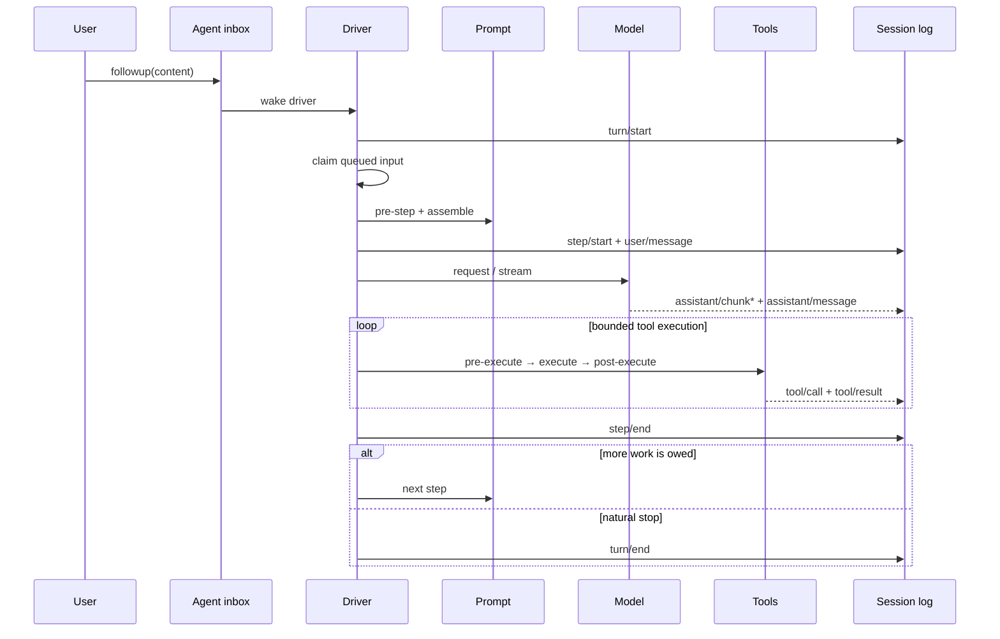
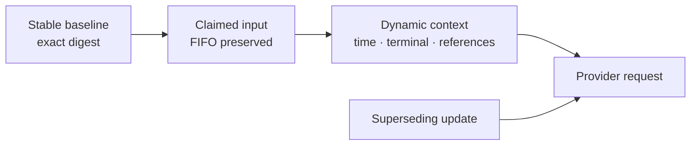

# One DeepSeek Harness turn, step by step

A **step** is one model request plus the tool calls it produces. A **turn** contains zero or more steps and closes only when the runtime owes no more work.



## Why the distinction matters

- A model can request tools, causing another step inside the same turn.
- Steering or queued next-step input can extend a turn.
- A rejected first `agent/pre-step` decision can still produce a durable zero-step turn.
- Cancellation and provider errors must close or recover at the correct boundary.

## Durable facts versus live control

`turn/*`, `step/*`, `user/message`, `assistant/*`, and `tool/*` belong to the durable log. `agent/*` events coordinate the live Agent: inbox state, status, request interception, continuation, and errors.

If you are building a transcript, replay UI, audit feed, or resume feature, consume `session/event`. If you are steering or supervising work currently in flight, use the live Agent API.

## Tool execution is a pipeline

Tool calls do not jump directly from model output to side effects. The runtime classifies execution mode, observes ordering/barriers, and passes calls through pre-execute, execute, and post-execute phases. Permission, approval, sandbox, and telemetry can therefore remain separate concerns.

## Prefix caching is a message-order contract

Provider prefix caches are positional. Two requests can reuse only the byte-stable prefix they share before the first differing token. A stable block placed after a different first prompt is stable content in the wrong position: it must be prefetched again even when its bytes did not change.

At the rc.2 boundary, `ReactLoopAgent.preStep()` claims inbox messages, projects the runtime context, and enters the default batch as:

```ts
messages: context === undefined ? claimed : [...claimed, context]
```

The final `agent/pre-step` decision is not a temporary transport buffer. The driver appends each message in that order as a durable `user/message` event before deriving the provider request. Built-in participants then add different kinds of context:

| Participant | Current insertion | Stability meaning |
|---|---|---|
| Core runtime context | after claimed input | can be stable initially, but later snapshots can supersede it |
| Agent instructions | after the last claimed message | workspace and scope changes can replace the baseline |
| Skill catalog | appended or replaced in place | changes when visible model-invocable Skills change |
| Time context | appended after delegation | dynamic per request |
| tmux context | prepended after delegation | dynamic terminal observation |
| Third-party context | plugin-defined | no automatic stability guarantee |

This makes the first-turn cache opportunity real, but it also makes a blanket reorder unsafe. `source.kind` records provenance; it does not promise that a payload is deterministic across Sessions. Moving every non-user message ahead of every user message would change durable replay order, recency, and possibly supersession semantics.

### Model four properties separately

| Property | Question |
|---|---|
| Provenance | Who produced the message? |
| Authority and recency | Which instruction or observation supersedes an earlier one? |
| Durable order | In what order must replay reconstruct model-visible history? |
| Cache stability | For which exact profile, workspace, configuration, and content digest are the bytes reusable? |

A safe optimization needs an explicit cache-stable baseline contract. Only deterministic initial context whose digest covers all authority inputs should move before the first claimed prompt. Dynamic observations and superseding updates must keep their documented position.



### Verification matrix for an ordering change

1. A fresh Session places only explicitly stable baseline messages before one prompt.
2. Two claimed inputs keep their original FIFO order.
3. Mid-turn steering and injection do not move across the claimed batch.
4. Post-compaction instruction refresh stays later than the content it supersedes.
5. Runtime snapshot updates retain their durable recency.
6. Time, tmux, Session-reference, and third-party ordering remains documented and tested.
7. Resume and replay derive the same provider request from the durable log.
8. Provider usage compares identical and different first prompts while system text and tool schemas remain byte-identical.

Cache hit ratios and saved-token counts remain provider-specific because cache block size, TTL, routing, and accounting differ. Measure the exact outbound request and usage events; do not infer a universal saving from one provider result.

## Debugging checklist

When a turn looks stuck, identify the last durable event:

1. No `turn/start`: inbox/wakeup or Agent creation problem.
2. `turn/start` without `step/start`: pre-step rejection or failure.
3. `step/start` without assistant output: provider/request path.
4. `tool/call` without result: approval, policy, provider, or execution failure.
5. `step/end` without `turn/end`: queued input, continuation, or stopping hook.

## Official sources

- [Agent lifecycle at rc.2](https://github.com/deepseek-ai/deepseek-harness/blob/b150a551b8d465e31e418e1b2eaf5e79bbb7d28e/docs/agent-lifecycle.md)
- [Agent loop pre-step assembly at rc.2](https://github.com/deepseek-ai/deepseek-harness/blob/b150a551b8d465e31e418e1b2eaf5e79bbb7d28e/packages/core/agent-loop/src/agent.ts)
- [Agent instructions insertion at rc.2](https://github.com/deepseek-ai/deepseek-harness/blob/b150a551b8d465e31e418e1b2eaf5e79bbb7d28e/packages/context/agent-instructions/src/index.ts)
- [Skill catalog insertion at rc.2](https://github.com/deepseek-ai/deepseek-harness/blob/b150a551b8d465e31e418e1b2eaf5e79bbb7d28e/packages/skill/tool-skill/src/index.ts)
- [Prefix-cache report and measurements](https://github.com/deepseek-ai/deepseek-harness/discussions/4749)
