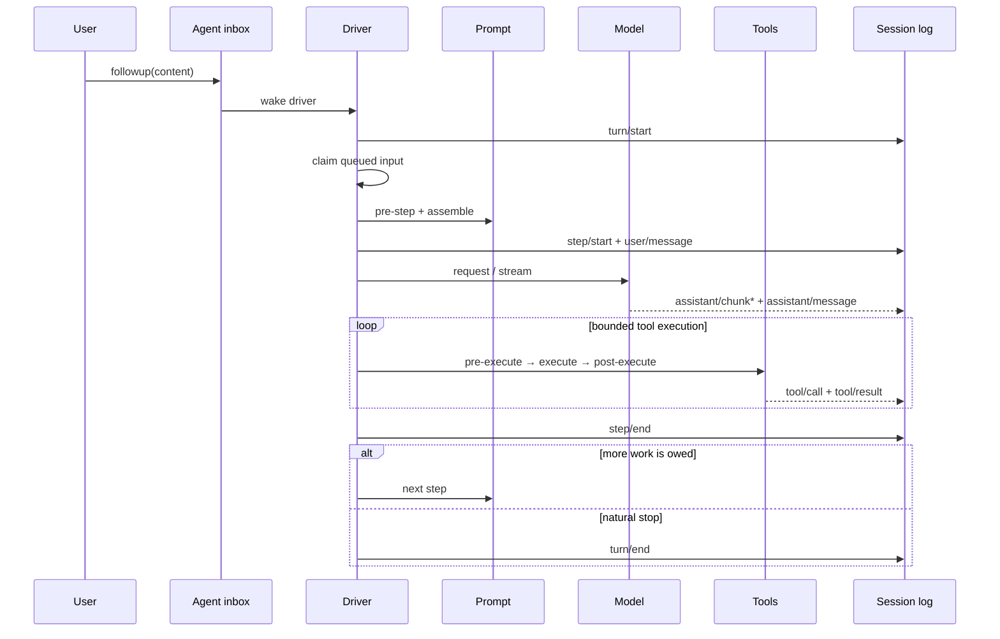

# One DeepSeek Harness turn, step by step

A **step** is one model request plus the tool calls it produces. A **turn** contains zero or more steps and closes only when the runtime owes no more work.

## Why the distinction matters

- A model can request tools, causing another step inside the same turn.
- Steering or queued next-step input can extend a turn.
- A rejected first `agent/pre-step` decision can still produce a durable zero-step turn.
- Cancellation and provider errors must close or recover at the correct boundary.

## Durable facts versus live control

`turn/*`, `step/*`, `user/message`, `assistant/*`, and `tool/*` belong to the durable log. `agent/*` events coordinate the live Agent: inbox state, status, request interception, continuation, and errors.

If you are building a transcript, replay UI, audit feed, or resume feature, consume `session/event`. If you are steering or supervising work currently in flight, use the live Agent API.

## Tool execution is a pipeline

Tool calls do not jump directly from model output to side effects. The runtime classifies execution mode, observes ordering/barriers, and passes calls through pre-execute, execute, and post-execute phases. Permission, approval, sandbox, and telemetry can therefore remain separate concerns.

## Debugging checklist

When a turn looks stuck, identify the last durable event:

1. No `turn/start`: inbox/wakeup or Agent creation problem.
2. `turn/start` without `step/start`: pre-step rejection or failure.
3. `step/start` without assistant output: provider/request path.
4. `tool/call` without result: approval, policy, provider, or execution failure.
5. `step/end` without `turn/end`: queued input, continuation, or stopping hook.

## Official sources

- [Agent lifecycle](https://github.com/deepseek-ai/deepseek-harness/blob/master/docs/agent-lifecycle.md)
- [Architecture: turn flow](https://github.com/deepseek-ai/deepseek-harness/blob/master/docs/architecture.md#turn-flow)
- [Tool execution pipeline](https://github.com/deepseek-ai/deepseek-harness/blob/master/docs/tool-execution-pipeline.md)
