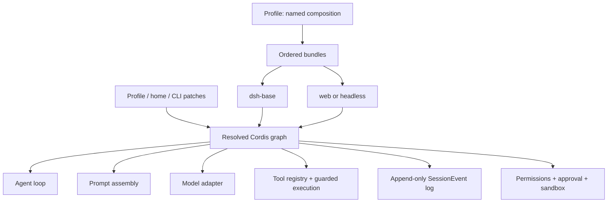
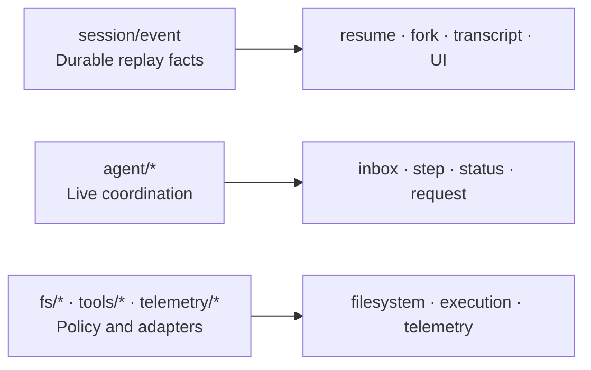

# DeepSeek Harness architecture from an Agent builder's view

The defining idea is not merely “tools around a model.” DeepSeek Harness is a Cordis plugin graph in which the model adapter, tool registry, session log, agent loop, policy, sandbox, and interfaces are replaceable parts of one composition.



## Composition: profile → bundles → patches

A **profile** is a named composition stored in the Harness home. It stacks bundles, installs out-of-tree plugins, and carries the user's `cordis.patch.yml`. The official distribution ships `web` and `headless` profile templates.

A **bundle** packages Cordis configuration rows and the code they mount. `dsh-base` supplies the common runtime capabilities; surface bundles add the browser application or one-shot headless runner.

Layers resolve in order: profile bundles, profile patch, home-level patch, then a `--patch` overlay. Because a patch targets a row by ID and replaces its full config, inspect before overriding:

```sh
dsh --profile web --dump-config
```

## Runtime responsibilities

| Responsibility | Core context/service |
|---|---|
| Durable events and sessions | `ctx.sessions` |
| Prompt sections and tool schemas | `ctx.systemPrompt` |
| Scoped tool registration and guarded execution | `ctx.tools` |
| Live Agent registry and events | `ctx.agents` |
| Default driver | `ctx.agentLoop` |
| Model message/stream vocabulary | `ctx.llm` |

This separation matters operationally. A provider failure is not automatically a loop failure; a tool denial is not a sandbox crash; a missing transcript item is a session-event problem, not just a UI rendering problem.

## Three event domains



- Use **session events** for facts that must survive reload and reconstruct model-visible history.
- Use **agent events** to observe or intercept work in flight.
- Use **capability events** to attach policy or swap adapters without importing the loop.

The official architecture states a powerful invariant: model-visible input must be reconstructable from the session log. That is why replay, resume, fork, telemetry, and UI rendering converge on `session/event`.

## Capability seams

A complete capability seam has three roles: a service definition, a provider implementation, and a consumer. For example, changing a filesystem/subprocess provider can move shell, terminal, and language-service execution into another environment without forking every tool.

When designing an Agent, ask these questions in order:

1. What durable facts must the session retain?
2. Which live step or request needs interception?
3. Which capability needs a provider and policy boundary?
4. Which profile should mount the composition?
5. What evidence will an operator see when it succeeds or fails?

## Common extension map

| Goal | Attach here |
|---|---|
| Model provider | adapter on `ctx.llm` |
| Model-facing tool | registration on `ctx.tools` |
| Human command | `ctx.commands` |
| Background job | `ctx.jobs` |
| Filesystem provider/policy | `ctx.fs` or `fs/*` |
| Process confinement | `ctx.sandbox` |
| Request or tool interception | `agent/*` or `tools/*` |
| Durable custom state | extend `SessionEventMap` |
| UI/editor | drive `ctx.agents`, render `session/event` |

## Official sources

- [Architecture](https://github.com/deepseek-ai/deepseek-harness/blob/master/docs/architecture.md)
- [Cordis primer](https://github.com/deepseek-ai/deepseek-harness/blob/master/docs/cordis-primer.md)
- [Capability seams](https://github.com/deepseek-ai/deepseek-harness/blob/master/docs/capability-seams.md)
- [Module graph](https://github.com/deepseek-ai/deepseek-harness/blob/master/docs/module-graph.md)
