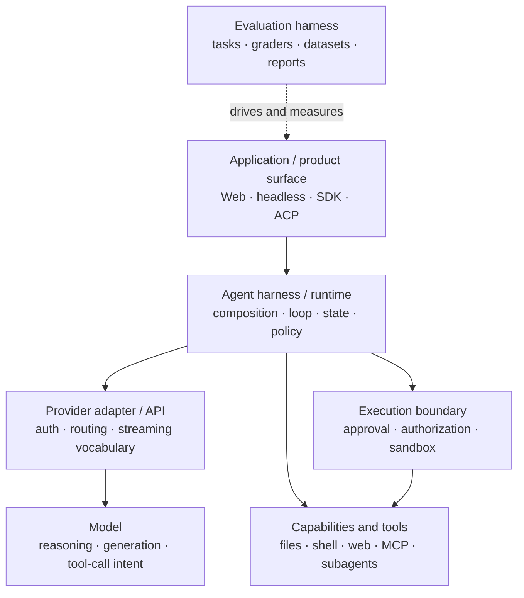
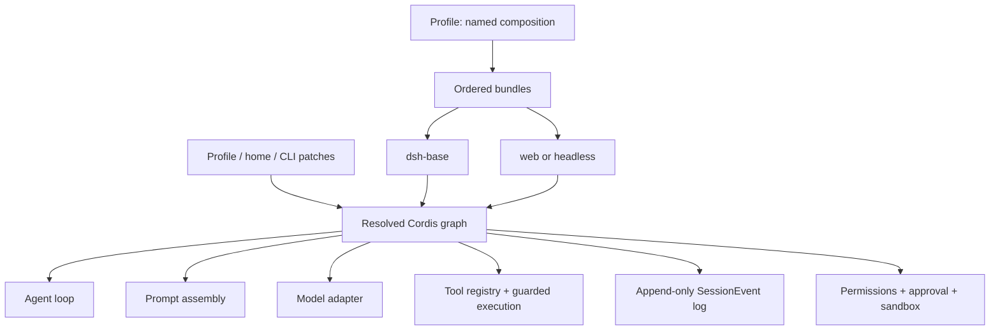
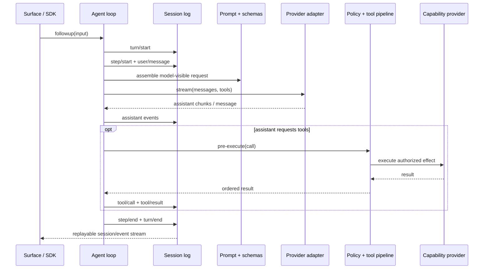
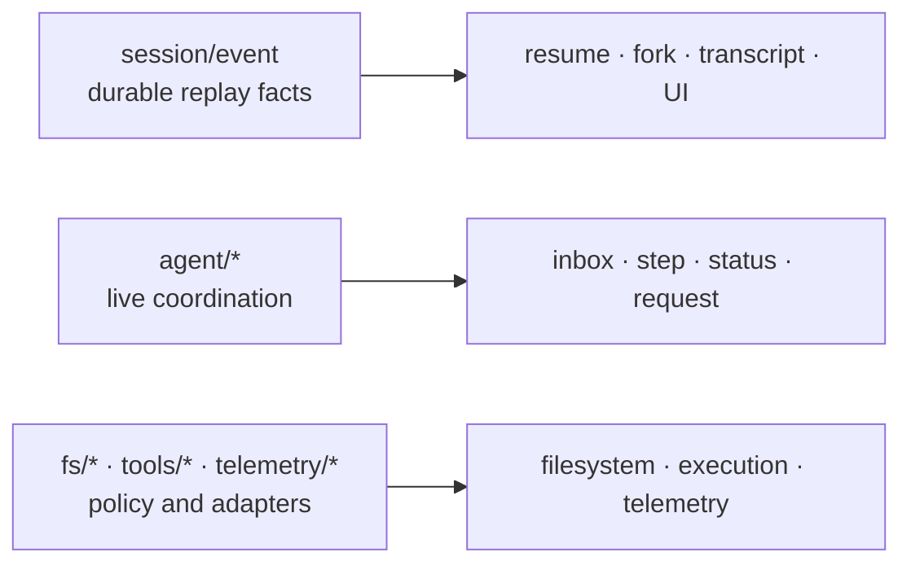

# DeepSeek Harness architecture: the Agent harness boundary map

DeepSeek Harness is not merely “tools around a model.” At the source-verified rc.2 boundary, it is a Cordis composition that owns the Agent loop, durable Session events, tool execution, policy seams, model adapters, and user-facing surfaces. That makes it an **Agent harness/runtime**: the execution and control layer around replaceable models and effects.

This map prevents a common category error: a model, provider API, Agent framework, Agent harness, evaluation harness, and sandbox can participate in one product without being the same layer.

## The seven-layer map



| Layer | Owns | Does **not** prove |
|---|---|---|
| Model | generated text, reasoning behavior, proposed tool calls | durable state, safe execution, or task completion |
| Provider adapter/API | credentials, endpoint routing, request/stream translation | Agent policy or tool correctness |
| Agent framework primitives | reusable abstractions for messages, tools, graphs, or workflows | a shipped runtime composition |
| Agent harness/runtime | loop, composition, tool registry, durable events, lifecycle, policy integration, surfaces | benchmark quality or isolation by itself |
| Evaluation harness | test cases, graders, repetitions, scoring, reports | production orchestration or containment |
| Capability/tool layer | effects such as filesystem, shell, Web, MCP, and delegation | authorization merely because a schema exists |
| Sandbox/control boundary | confinement, approval, authorization, audit, or remote execution | that the Agent chose the right action |

DeepSeek Harness occupies the Agent-harness column. You can evaluate it with a separate eval harness, attach different model providers, and replace local capability providers with isolated ones. Those are composition choices, not changes to the product's identity.

## What the runtime actually composes



A **profile** is a named composition stored in the Harness home. It stacks bundles, installs out-of-tree plugins, and carries the user's `cordis.patch.yml`. The official distribution ships `web` and `headless` profile templates.

A **bundle** packages Cordis configuration rows and the code they mount. `dsh-base` supplies shared runtime capabilities; surface bundles add the browser application or one-shot headless runner.

Layers resolve in order: profile bundles, profile patch, home-level patch, then a `--patch` overlay. A patch targets a row by ID and replaces its full config, so inspect the resolved graph before overriding it:

```sh
dsh --profile web --dump-config
```

## One turn, with ownership made explicit



The model proposes; the loop schedules; policy gates; capability providers perform effects; the Session log preserves replay facts; the surface renders or steers. “The Agent did it” is therefore too imprecise for debugging or security review.

## Runtime responsibilities

| Responsibility | Core context/service | Boundary question |
|---|---|---|
| Durable events and sessions | `ctx.sessions` | Can the fact survive reload and reconstruct history? |
| Prompt sections and tool schemas | `ctx.systemPrompt` | What enters model-visible context? |
| Scoped tool registration and guarded execution | `ctx.tools` | Where is a proposed call admitted and ordered? |
| Live Agent registry and events | `ctx.agents` | Who owns inbox, status, steering, and live coordination? |
| Default driver | `ctx.agentLoop` | Who opens turns and advances steps? |
| Model message/stream vocabulary | `ctx.llm` | Which adapter translates the provider stream? |

This separation matters operationally. A provider failure is not automatically a loop failure; a tool denial is not a sandbox crash; a missing transcript item is a Session-event problem, not merely a UI rendering problem.

## Three event domains



- Use **Session events** for facts that must survive reload and reconstruct model-visible history.
- Use **Agent events** to observe or intercept work in flight.
- Use **capability events** to attach policy or swap adapters without importing the loop.

The source-verified invariant is: model-visible input must be reconstructable from the Session log. Replay, resume, fork, telemetry, and UI rendering therefore converge on `session/event`.

## Capability seams: interface, provider, consumer

A complete capability seam has three roles:

1. a service definition that states the contract;
2. one or more providers that implement it;
3. consumers, often model-facing tools, that call it.

For example, filesystem and subprocess providers can move shell, terminal, and language-service effects into another execution environment without forking every consumer. A tool schema alone is not a safety boundary; the provider, authorization path, sandbox, and evidence trail still matter.

## Where should new behavior attach?

| Goal | Attach here | Avoid confusing it with |
|---|---|---|
| Route another model | adapter on `ctx.llm` | a second Agent loop |
| Add a model-facing action | registration on `ctx.tools` | automatic authorization |
| Add a human command | `ctx.commands` | a model turn |
| Run background work | `ctx.jobs` | an unowned detached promise |
| Replace filesystem execution | `ctx.fs` provider and `fs/*` policy | a UI-only workspace switch |
| Confine processes | `ctx.sandbox` and subprocess provider | approval text |
| Intercept a request or tool | `agent/*` or `tools/*` | durable history |
| Add model-visible context | an admitted, logged Session event path | a transient UI message |
| Add durable custom state | extend `SessionEventMap` | component-local state |
| Add UI or editor integration | drive `ctx.agents`, render `session/event` | owning the authoritative transcript |
| Measure quality across tasks | an external evaluation harness | runtime lifecycle management |

## Five questions for an Agent architecture review

1. Which layer owns the behavior: model, provider, loop, tool, policy, execution environment, or surface?
2. Which facts must be durable, and can the Session log reconstruct every model-visible input?
3. Where is authority decided, and where is the effect actually executed?
4. Which profile and exact resolved rows mount the behavior?
5. What observable evidence distinguishes success, denial, provider failure, loop failure, and sandbox failure?

If an architecture diagram cannot answer these questions, it is probably collapsing boundaries that operators will later need to debug.

## Verification boundary

The architecture above is source-verified against DeepSeek Harness rc.2 commit [`b150a551`](https://github.com/deepseek-ai/deepseek-harness/tree/b150a551b8d465e31e418e1b2eaf5e79bbb7d28e). The seven-layer taxonomy and review questions are handbook interpretation, not upstream terminology or a claim that DeepSeek Harness ships an evaluation system.

## Pinned official sources

- [Architecture at rc.2](https://github.com/deepseek-ai/deepseek-harness/blob/b150a551b8d465e31e418e1b2eaf5e79bbb7d28e/docs/architecture.md)
- [Agent lifecycle at rc.2](https://github.com/deepseek-ai/deepseek-harness/blob/b150a551b8d465e31e418e1b2eaf5e79bbb7d28e/docs/agent-lifecycle.md)
- [Capability seams at rc.2](https://github.com/deepseek-ai/deepseek-harness/blob/b150a551b8d465e31e418e1b2eaf5e79bbb7d28e/docs/capability-seams.md)
- [Tool execution pipeline at rc.2](https://github.com/deepseek-ai/deepseek-harness/blob/b150a551b8d465e31e418e1b2eaf5e79bbb7d28e/docs/tool-execution-pipeline.md)
- [Cordis primer at rc.2](https://github.com/deepseek-ai/deepseek-harness/blob/b150a551b8d465e31e418e1b2eaf5e79bbb7d28e/docs/cordis-primer.md)
