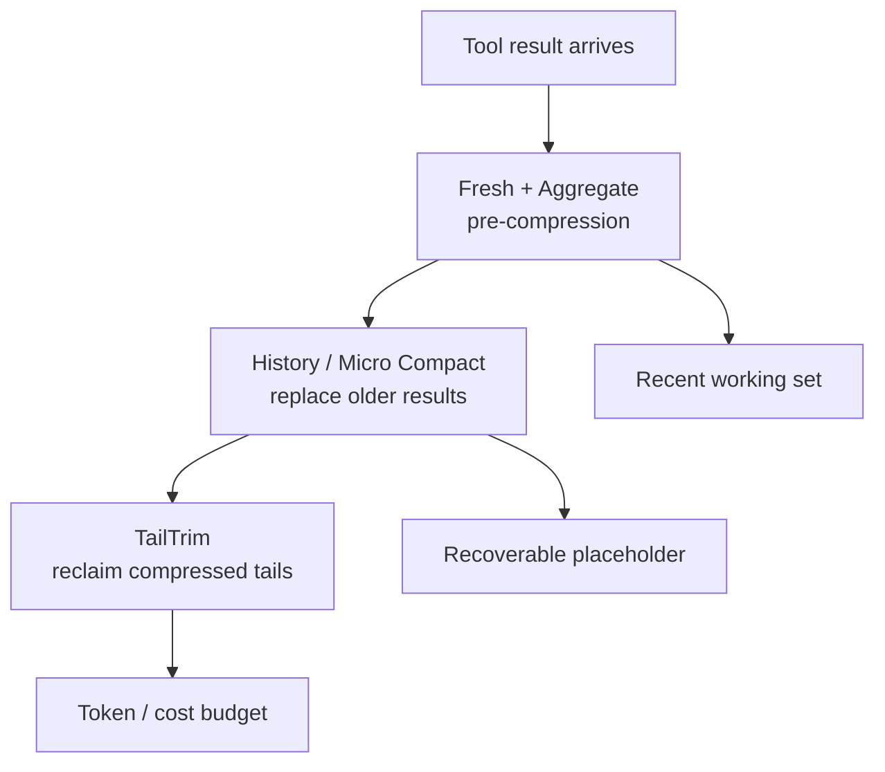

# Compress tool context without confusing cache savings with deletion

Long-running Agents accumulate tool results faster than a model can use them. A good compression policy is not “shorten the transcript.” It is a staged, inspectable decision about which evidence remains immediately available, which can be reconstructed, and which prompt prefixes must be invalidated.

This guide distills the [upstream context-compression selector showcase (#4895)](https://github.com/deepseek-ai/deepseek-harness/discussions/4895) into a runtime design. The upstream plugin is community software; the profile names and thresholds below are a design vocabulary, not a claim that every DeepSeek Harness release ships these controls.

## Three paths with different cache consequences



| Path | When it runs | What changes | Cache implication |
|---|---|---|---|
| Fresh + Aggregate | Before a result first reaches the model | Reduces a new result using tool type, command, and content evidence | Can preserve an already-sent prefix |
| History / Micro Compact | When older results exceed policy | Replaces old results with recoverable multi-line records | Rewrites old prompt bytes and can restart cache |
| TailTrim | After placeholders exist | Removes excess tail material from compressed records | May further change the historical prefix |

The order matters. Running History before Fresh can compact material that a reducer could have summarized more accurately. Running TailTrim on raw output can destroy recovery evidence. Make each stage’s input and output explicit in traces.

## Treat a Profile as an orchestration policy

A Profile should name the enabled paths and their evaluation order, not just expose one opaque “compression level.” At minimum, record:

- reducer selection rules for tool type, command, and content shape;
- maximum result bytes and target reclaim for Fresh + Aggregate;
- history age or token threshold for Micro Compact;
- count of recent tool calls retained as the working set;
- minimum reclaim before a stage is allowed to mutate history;
- TailTrim’s lower bound for recoverable placeholder content;
- whether the profile is conservative, balanced, aggressive, or experimental.

Example policy (illustrative):

```json
{
  "name": "conservative-agent",
  "fresh": { "enabled": true, "maxBytes": 24000 },
  "history": { "enabled": true, "retainRecentCalls": 8, "minReclaimTokens": 1200 },
  "tailTrim": { "enabled": false }
}
```

Do not silently turn an experimental profile into a production default. Include the resolved Profile and source revision in the Session evidence so a later answer can be reproduced.

## Preserve recoverability, not just summaries

A compacted tool result should tell the Agent what was removed and how to recover it. A useful placeholder contains the tool name, invocation identity, original content hash, time, and a pointer to an authorized local or Session query surface. It must not claim that omitted lines were irrelevant.

```text
[tool_result compacted]
tool=search invocation=tool-42
sha256=<digest> lines=1-8400 retained=summary
reason=history-threshold profile=conservative-agent
recover=Session query:tool-42
```

Keep the recent working set intact when the next step is likely to depend on exact paths, exit codes, or a just-produced patch. A summary that removes the command’s error line can make the Agent retry the wrong operation.

## Measure cache and cost separately

Compression can reduce visible tool text while still making the request more expensive if it rewrites a large stable prefix. Capture these measurements for baseline and each Profile:

1. prompt bytes before and after each stage;
2. provider cache-hit/miss and the invalidated prefix boundary;
3. tool-result tokens retained, replaced, and recoverable;
4. summarizer tokens, latency, and provider charge;
5. final task success, re-fetches, and incorrect retries.

Do not call a Profile “cheaper” from token count alone. If History rewrites the prefix every turn, the cache loss can exceed the reclaimed output. Conversely, Fresh + Aggregate can reduce future payloads without touching already-cached bytes.

## Safety and privacy boundaries

- Apply the same secret-redaction policy before compression and before writing a recoverable copy.
- Keep placeholders inside the Session’s authorization boundary; a hash is not permission to expose the original result.
- Never let model-generated summaries become policy instructions or tool authorization.
- Preserve exit status, command identity, and error markers even when prose is removed.
- Stop compaction on a failed reducer rather than replacing evidence with an empty success-looking record.
- Make cancellation durable: a cancelled compaction must not leave half-written placeholder state.

## Acceptance matrix

| Gate | Evidence |
|---|---|
| Fresh reducer is deterministic | Same bytes and Profile produce the same digest and output |
| Recent working set survives | Exact recent paths, status, and errors remain queryable |
| History mutation is visible | Trace records replaced ranges and cache invalidation |
| Placeholder is recoverable | Authorized query restores the original result by invocation ID |
| TailTrim is bounded | Minimum evidence survives and reclaim is measured |
| Failure is fail-safe | Reducer error leaves the original result available |
| Cost claim is honest | Cache, summarizer, latency, and task-success metrics are reported together |

## Primary evidence

- [Upstream context-compression selector showcase (#4895)](https://github.com/deepseek-ai/deepseek-harness/discussions/4895)
- [Prompt assembly and provenance](prompt-assembly-provenance.md)
- [Manual compaction caller-abort runbook](../troubleshooting/manual-compaction-caller-abort.md)
- [Session log storage format](../reference/session-log-storage-format.md)
