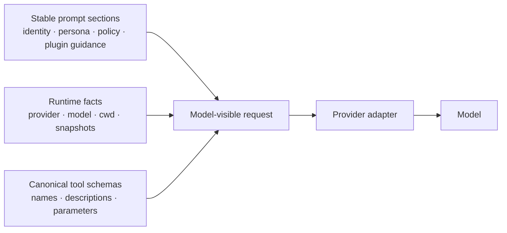

# Prompt assembly is three pipelines, not one giant system prompt

When an Agent behaves differently after a plugin, provider, or mode change, “the system prompt changed” is too coarse to debug. The useful question is which assembly pipeline changed, whether its bytes are stable, and whether the change belongs to policy, runtime facts, or tool contracts.

This guide turns the source walkthrough in [upstream discussion #110](https://github.com/deepseek-ai/deepseek-harness/discussions/110) into an operator checklist. It is a field model, not a claim that every release exposes a prompt-dump API.

## The three pipelines

### 1. Ordered prompt sections

Identity, persona, Plan policy, plugin guidance, and Code SDK material are assembled as explicit sections. Their order is part of the behavior: moving a section can change instruction precedence, cache boundaries, and what a plugin appears to override.

Treat section IDs and order as an interface. A plugin should add the smallest guidance block it owns; it should not copy the entire base prompt or depend on an incidental paragraph position.

### 2. Runtime facts and snapshots

Provider, model, working directory, and similar facts are mutable runtime state. They should not be re-rendered into a stable prefix on every turn. When a fact changes—or after compaction removes the earlier context—the runtime can append a user-visible snapshot in a defined order.

This distinction explains why a prompt can be semantically equivalent yet cache-unfriendly. A stable identity prefix and an appended, ordered snapshot make the invalidation boundary observable. Never infer cache performance from the number of prompt lines alone; measure prefix bytes, cache hits, and the actual request trace together.

### 3. Tool schemas

Tool schemas are a separate contract: name, description, and parameter shape. They are not merely prose in the system prompt. A schema can be stable while policy text changes, or policy can be stable while a plugin adds a new capability.

Keep the schema digest separate from the prompt-section digest in diagnostics and tests. This makes “the model saw a new tool” distinguishable from “the model saw new instructions.”

## Plan Mode is policy, not automatic containment

The upstream source walkthrough notes that Plan Mode adds policy guidance; it does not necessarily remove `write` or `bash` from the tool registry. Therefore:

| Observation | Safe interpretation |
|---|---|
| Plan text says to plan before editing | A model-facing policy instruction was added |
| A write schema is still present | The capability remains registered |
| A write call succeeds | The execution gate allowed it; Plan text did not contain it |
| A write call is denied | Approval, authorization, or sandbox policy enforced the boundary |

If “planning must be read-only” is a security requirement, enforce it in approval or sandbox policy and test an actual denied write. Do not rely on a prompt section as a security gate.

## Code Mode is not automatically cheaper

Code Mode can reduce the number of native wire tools the model selects by exposing a `run_code` surface and calling other tools through a generated SDK. That changes the tool schema and prompt assembly, while internal calls still pass through the tool pipeline.

Evaluate it with four measurements:

1. stable-prefix bytes before and after the mode switch;
2. independent schema bytes and cache-hit rate;
3. generated-code and internal-tool-call success rate;
4. end-to-end latency and provider cost.

The upstream discussion records a useful warning: a smaller visible tool list does not prove a smaller total prompt or lower cost. Preserve the exact source revision and request traces when comparing modes.

## A provenance-first debugging run

1. Start a clean profile and record the exact CLI package, profile, provider, model, and working directory.
2. Run `dsh --profile <name> --dump-config` and save the resolved composition before installing the plugin.
3. Capture one request in the baseline mode, including prompt bytes, tool names, and schema digests where the provider or harness makes them available.
4. Apply one change only: a plugin, Plan Mode, Code Mode, provider, or working directory.
5. Repeat the capture and classify the diff as **section**, **fact**, **schema**, or **provider translation**.
6. Test a real effect: Plan Mode must be checked with an attempted write, and Code Mode with both generated code and an ordinary tool failure.
7. Remove the change, restart from the same profile, and confirm the baseline returns. A restart-only fix is evidence of lifecycle or cache state, not proof that the prompt was wrong.

## What a useful diagnostic surface should expose

The current public contracts do not promise a universal prompt provenance command. For plugin and runtime work, ask for (or instrument) these fields without logging secrets:

- ordered section IDs and a content digest;
- runtime-fact snapshot sequence and insertion point;
- tool-schema names plus a schema digest;
- provider/model route and cache boundary;
- source revision and profile patch chain.

Hash content rather than publishing credentials, workspace paths, or full user prompts. A digest is useful only if its algorithm, normalization, and scope are documented.

## Acceptance matrix

| Gate | Evidence |
|---|---|
| Section order is deterministic | Two clean boots produce the same ordered IDs |
| Runtime facts are separated | A provider/cwd change alters the snapshot, not unrelated base sections |
| Schema changes are visible | Adding one tool changes the schema digest and expected registry entry |
| Plan is not mistaken for a sandbox | A write attempt is denied or allowed by an explicit execution policy |
| Code Mode is measured honestly | Prompt, schema, cache, latency, and internal calls are recorded |
| Plugin cleanup is complete | Uninstall/restart restores the baseline section and schema digests |

## Primary evidence

- [Upstream system-prompt assembly walkthrough (#110)](https://github.com/deepseek-ai/deepseek-harness/discussions/110)
- [Agent runtime boundary map](agent-runtime.md)
- [Tool execution pipeline](tool-execution-pipeline.md)
- [First plugin: composition and cleanup contract](../plugin-development/first-plugin.md)
- [Official CLI reference](https://github.com/deepseek-ai/deepseek-harness/blob/b150a551b8d465e31e418e1b2eaf5e79bbb7d28e/apps/cli/reference/README.md)
