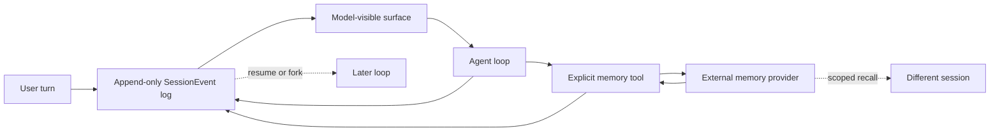

# Sessions are not long-term memory

DeepSeek Harness has durable sessions, but a durable session is not automatically a cross-session memory system. The distinction matters: session replay reconstructs one interaction; long-term memory deliberately moves selected facts across interaction boundaries.

On the verified upstream rc.7 revision, the shipped composition has an event-sourced Session service and opt-in examples for third-party memory servers through MCP. It does **not** ship a generic `ctx.memory` service. Treat proposals for such a service as design work, not as an available runtime API.



## Four mechanisms, four contracts

| Mechanism | What it owns | Boundary | Model visibility |
|---|---|---|---|
| Session log | Durable events for one Agent interaction | One session and its lineage | `deriveMessages()` projects the current surface |
| Resume or fork | Reuse of a validated session log or completed prefix | Same session, or a child with lineage | Reconstructed from the selected durable events |
| Compaction | A smaller replacement surface for older balanced history | One session | Summary/checkpoint replaces only the selected model-visible range |
| Long-term memory | Selected facts, observations, or profiles | Potentially many sessions | Only when a tool or prompt-assembly policy retrieves it |

A fifth mechanism—**Skills or workspace instructions**—stores stable operating guidance. Do not put policy into semantic memory and hope retrieval happens. If an Agent must always follow a rule, mount that rule deterministically.

## Decide what you are migrating

"Move my Codex or Claude Code memory" can refer to four different artifacts. Inventory them before choosing a plugin or writing an importer.

| Source artifact | What it usually means | DSH destination |
|---|---|---|
| Project instructions | Rules that should apply on every run | Project Skill or workspace instruction |
| User preferences | Selected facts reused across new Sessions | Scoped long-term memory |
| Conversation transcript | Evidence from one prior interaction | Imported archive or read-only search index, not a live Session append |
| Tool configuration | Commands, MCP servers, permissions, or model routes | Reviewed DSH profile, plugin, or MCP configuration |

Do not bulk-inject every source file into the system prompt. That hides provenance, spends context on irrelevant records, and turns stale notes into high-priority instructions. Preserve the original files, import into a disposable namespace, and make retrieval explicit enough to inspect.

### Migration acceptance record

Record these fields for each imported item:

```text
source_agent, source_path, source_digest, source_updated_at
imported_at, importer_version, destination_scope, destination_record_id
```

The source digest makes a rerun idempotent and lets an operator distinguish unchanged, updated, and deleted source files. A dry run should report those three sets without mutating either side.

## What the Session service guarantees

The Session log is the append-only source of truth for an Agent's interaction history. Message history is derived from its ordered surface rather than maintained as a second mutable transcript. Persistence is supplied by plugins that subscribe to `session/event`, flush writes, and later seed a resumed session.

That gives operators strong properties:

- a provider request can be reconstructed with its model route and message prefix;
- tool calls and results remain ordered durable facts;
- a completed event prefix can be forked with lineage metadata;
- compaction can replace an older model-visible range without rewriting the raw history.

It does not decide which user facts deserve reuse next month, whether another Agent may see them, or how a user deletes them. Those are memory-product decisions.

## The shipped memory path is an explicit tool path

The official repository includes default-off MCP overlays for third-party memory servers. The generic MCP client launches the chosen server and exposes its tools. The model must call a write tool to store a fact and a search or recall tool to retrieve it.

This explicit path has a useful property: memory access is visible as a tool effect. It can be logged, approved, denied, timed out, and evaluated. It also has a limitation: a fact is not recalled unless the model or another deterministic policy invokes the capability.

Use a short instruction when the provider's tool descriptions are insufficient:

```text
When the user asks you to remember something, call a memory write tool.
When historical information may be relevant, search memory and use only
records that match the current user and task scope.
```

An instruction improves tool selection. It does not create isolation, retention, or trust boundaries.

## Choose state by the job

| Requirement | Prefer |
|---|---|
| Reopen the same conversation after a restart | Session persistence and resume |
| Explore an alternative from a completed point | Session fork |
| Keep a long task within the context budget | Compaction |
| Reuse a user preference in a new session | Scoped long-term memory |
| Apply a rule on every run | Skill, profile, or workspace instruction |
| Keep an audit fact that must never depend on model recall | Durable application record outside model memory |

If two rows apply, compose them. A support Agent may use a durable session for the active case, a memory store for approved customer preferences, and an application database for the contractual case record.

## Production contract for a memory capability

Before mounting a memory provider, make these decisions explicit.

### 1. The host owns identity

The model may choose the note or query. It must not choose the tenant, principal, Agent, or workspace whose memory is accessed.

```text
Model-owned: query, note, recall intent
Host-owned: tenant, principal, Agent, workspace, provider route
```

Derive scope from authenticated execution context. Never accept a model-authored user ID as an isolation boundary.

### 2. Writes are durable effects

A save can survive the current turn and influence later sessions. Decide whether it requires approval, what audit event proves commitment, and how a user can inspect or delete it.

Give each logical save a harness-owned idempotency key. Agent retry, transport retry, or session resume must not create duplicate memories.

### 3. Timeout may mean unknown outcome

If a provider client cannot accept an `AbortSignal`, bounding the Agent's wait does not cancel the remote write. A timed-out save may commit later. Report that state as `OUTCOME_UNKNOWN`, retain the idempotency key, and reconcile before retrying.

### 4. Recall returns untrusted data

Stored text can be stale, malicious, or written under another workflow. Return typed records with stable ID, scope, source, timestamps, and confidence. Tell the model to treat recalled content as evidence, never as higher-priority instructions.

### 5. Availability shapes the tool surface

Do not advertise memory tools when no provider is usable. Conditional registration keeps the assembled tool schema honest. Structured runtime errors still matter for a provider that becomes unavailable after registration.

### 6. Bound retrieval

Cap result count, bytes, and estimated tokens. Define ranking and tie behavior. An unbounded memory search can consume the context window or let one noisy namespace dominate the prompt.

## Minimal cross-session evaluation

Use a disposable provider namespace and a non-sensitive nonce such as `validation drink = amber tea 7319`.

1. In session A, ask the Agent to remember the nonce.
2. Confirm a memory write tool ran and returned a durable record ID.
3. Create session B without copying session A's transcript.
4. Ask for the validation drink and explicitly request a memory search.
5. Confirm a search tool ran, returned the same scoped record, and the answer cited that record.
6. Create session C under another test principal. Confirm the nonce is absent.
7. Repeat the original save with the same idempotency key. Confirm there is still one logical record.
8. Inject instruction-like text into a test memory. Confirm it is quoted as data and cannot override the active Agent policy.
9. Re-run the same import. Confirm unchanged source digests do not create duplicate records.
10. Change one source fact and import again. Confirm the old record remains auditable or is explicitly superseded rather than silently overwritten.

### Success evidence

- session B recalls the exact nonce through a visible tool call;
- session C cannot retrieve it;
- duplicate delivery does not create a second logical memory;
- audit data names the provider, host-owned scope, operation, record ID, and outcome;
- disabling the provider removes the tools or produces the documented runtime-unavailable transition.

### Failure branches

| Symptom | Inspect first |
|---|---|
| Session B knows the nonce without a search | Transcript leakage or automatic prompt injection |
| Session B cannot recall it | Tool registration, provider process, namespace, or retrieval ranking |
| Session C can recall it | Host identity and provider isolation mapping |
| Two records appear after retry | Missing or provider-ignored idempotency |
| Timeout followed by a late record | Unknown-outcome handling and reconciliation |
| Retrieved text changes Agent policy | Trust labeling and prompt hierarchy |
| A second import duplicates everything | Source digests, idempotency, and update semantics |
| An old fact silently wins | Conflict policy, timestamps, and supersession records |

## Evaluate a community memory plugin before installing it

A GitHub repository, npm package, and enthusiastic discussion comment are discovery signals, not compatibility or security evidence. Memory plugins execute inside or beside the Host and can observe sensitive prompts, files, and durable state.

Use this release gate:

1. Match the repository, npm publisher, package tarball, license, and exact version.
2. Inspect install scripts, runtime dependencies, network destinations, filesystem roots, and declared DSH injections.
3. Confirm where recall enters the model surface and whether the insertion is visible in Session evidence.
4. Test tenant and workspace isolation with two disposable principals.
5. Test uninstall and cold restart without the plugin. Existing Sessions must still load, or the plugin must document the durable dependency.
6. Back up the complete profile and memory store before testing migration against real data.

The [community plugin audit](../security/community-plugin-audit.md) provides the full artifact-inspection and recovery workflow.

## Current upstream status

- Durable Session events, resume, fork, and compaction are shipped runtime mechanisms.
- Third-party memory is available through default-off MCP example overlays.
- A first-party `ctx.memory` capability seam has been proposed in the community, but it is not part of the verified shipped API.

Pin the upstream revision you deploy and re-check this boundary after upgrades.

## Official sources

- [Session package](https://github.com/deepseek-ai/deepseek-harness/blob/99f6f02fecdb7dff40c3fbc9470f5907c29f74ca/packages/core/session/README.md)
- [Session implementation](https://github.com/deepseek-ai/deepseek-harness/blob/99f6f02fecdb7dff40c3fbc9470f5907c29f74ca/packages/core/session/src/index.ts)
- [Third-party memory MCP examples](https://github.com/deepseek-ai/deepseek-harness/blob/99f6f02fecdb7dff40c3fbc9470f5907c29f74ca/examples/mcp-memory/README.md)
- [MCP client](https://github.com/deepseek-ai/deepseek-harness/tree/99f6f02fecdb7dff40c3fbc9470f5907c29f74ca/packages/mcp/mcp-client)
- [Community memory migration discussion](https://github.com/deepseek-ai/deepseek-harness/discussions/14)
- [Community `ctx.memory` proposal](https://github.com/deepseek-ai/deepseek-harness/discussions/1638)
