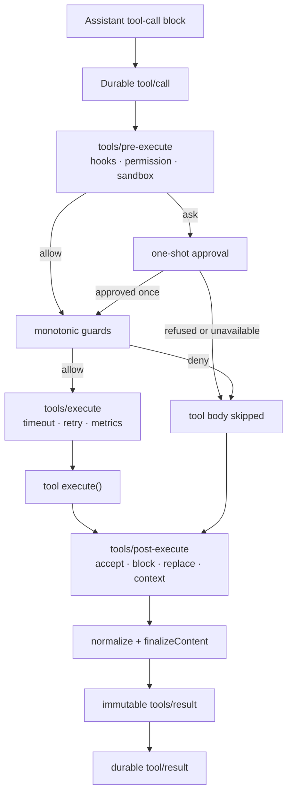

# DeepSeek Harness tool execution pipeline

A model-produced tool call does not execute directly. DeepSeek Harness logs the call, runs policy and hooks, resolves approval, applies monotonic guards, dispatches the tool, normalizes the result, and records one authoritative model-facing outcome.

## The stages and their jobs

| Stage | Use it for |
|---|---|
| `tools/pre-execute` | reorderable hooks, permission decisions, sandbox preparation |
| `ctx.approval` | one-shot human answer to an `ask` decision |
| registered guards | monotonic invariants that later hooks cannot weaken |
| `tools/execute` | wrappers around dispatch lifetime: timeout, retry, metrics |
| tool body | capability implementation |
| `tools/post-execute` | explicit result transformation or added context |
| `finalizeContent` | definition-owned final content invariant |
| `tools/result` | observation of the frozen authoritative outcome |

## Four controls that should not be confused

- **Permission** expresses whether policy allows, denies, or asks.
- **Approval** records a human decision for one proposed action.
- **Guard** preserves a non-reorderable denial invariant.
- **Sandbox** constrains the execution environment.

An approval does not remove a sandbox boundary. A sandbox does not decide whether publishing production data is appropriate. A model instruction is not a substitute for either.

## Why calls are logged before execution

The durable `tool/call` event lets clients render pending work and lets replay preserve what the model requested even when execution is denied. Exactly one `tool/result` becomes the model-facing outcome, including normalized failures and denials.

## Debug by the last visible stage

| Last evidence | Likely investigation |
|---|---|
| assistant message, no `tool/call` | call parsing/classification |
| `tool/call`, pending UI card | pre-execute hook or approval |
| approval accepted, no dispatch | monotonic guard |
| dispatch starts, never settles | tool body, timeout, provider, cancellation |
| result exists but content is wrong | post-execute or `finalizeContent` |
| UI differs from model history | durable event rendering versus live state |

## Extension rule of thumb

Use `tools/post-execute` only when changing the result. Use `tools/result` when observing final metrics, audit, or capture. Put timeouts and retries around `tools/execute`. Put owner policy that must never be reordered in a guard.

## Official sources

- [Tool execution pipeline](https://github.com/deepseek-ai/deepseek-harness/blob/master/docs/tool-execution-pipeline.md)
- [Extension cookbook](https://github.com/deepseek-ai/deepseek-harness/blob/master/docs/cookbook/extension-cookbook.md)
- [Adding a tool](https://github.com/deepseek-ai/deepseek-harness/blob/master/docs/cookbook/adding-a-tool.md)
