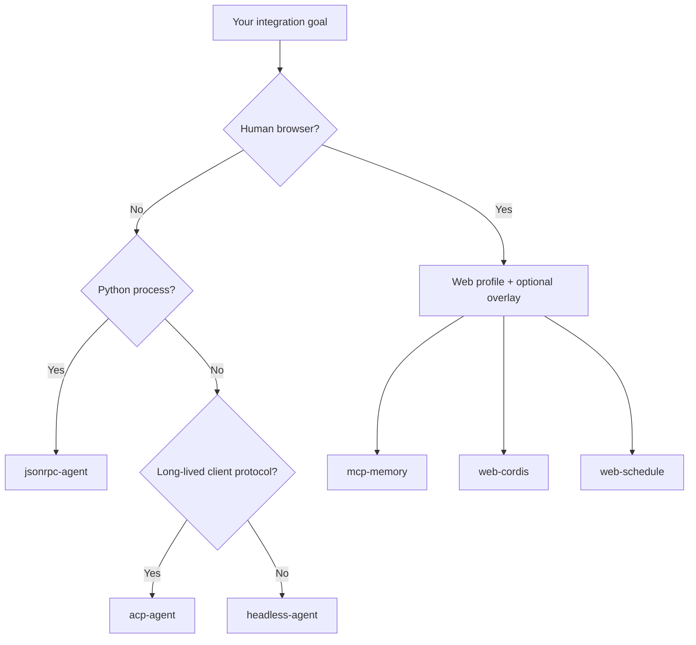

# DeepSeek Harness official examples: choose the right starting point

The rc.2 upstream repository shipped several runnable compositions. They demonstrate different interfaces and effect boundaries; they are not interchangeable starter templates. The current `0.1.2-alpha.1` source tree no longer contains the top-level `examples` directory, so every example link below is pinned to rc.2. Use them as historical, inspectable baselines rather than assuming the paths exist in a fresh checkout.

> [!WARNING]
> These examples exercise real tools, credentials, processes, persistence, and sometimes broad filesystem access. Read the linked composition and run in a disposable workspace before adapting one to production.

## Choose by objective

| You need to… | Start with | Interface | Main boundary to inspect |
|---|---|---|---|
| Run one unattended repository task | [`headless-agent`](https://github.com/deepseek-ai/deepseek-harness/tree/b150a551b8d465e31e418e1b2eaf5e79bbb7d28e/examples/headless-agent) | CLI | working directory, approval, sandbox, exit evidence |
| Embed an Agent in Python | [`jsonrpc-agent`](https://github.com/deepseek-ai/deepseek-harness/tree/b150a551b8d465e31e418e1b2eaf5e79bbb7d28e/examples/jsonrpc-agent) | Python SDK + JSON-RPC | runtime process, session identity, filesystem reach |
| Serve an Agent to programmatic clients | [`acp-agent`](https://github.com/deepseek-ai/deepseek-harness/tree/b150a551b8d465e31e418e1b2eaf5e79bbb7d28e/examples/acp-agent) | ACP over JSON-RPC stdio | protocol-pure stdout, client-owned permissions, cancellation |
| Connect third-party memory through MCP | [`mcp-memory`](https://github.com/deepseek-ai/deepseek-harness/tree/b150a551b8d465e31e418e1b2eaf5e79bbb7d28e/examples/mcp-memory) | Web profile overlay | server lifecycle, credentials, storage scope, tool discovery |
| Let an Agent inspect its plugin graph | [`web-cordis`](https://github.com/deepseek-ai/deepseek-harness/tree/b150a551b8d465e31e418e1b2eaf5e79bbb7d28e/examples/web-cordis) | Web or ACP | in-memory plugin effects shared by the Host process |
| Add session-local reminders | [`web-schedule`](https://github.com/deepseek-ai/deepseek-harness/tree/b150a551b8d465e31e418e1b2eaf5e79bbb7d28e/examples/web-schedule) | Web profile overlay | Session ownership, delivery timing, persistence semantics |

## Interface map



## `headless-agent`: one task, one result

Use the shipped `headless` profile when a script or CI job needs one fresh persisted session, final assistant text on stdout, and a process exit:

```sh
npx @deepseek-ai/dsh --profile headless \
  "Review the current changes. Do not edit files. Report risks with file paths."
```

The upstream example composition includes local Bash and filesystem tools, subagent delegation, workflows, TODOs, checkpoint policy, and JSONL persistence. The process working directory becomes the default workspace, so launch location is part of the security and correctness contract.

Use it when you need a task runner. Do not use final prose as the only CI assertion—also check the exit code, files, tests, session evidence, or downstream state.

## `jsonrpc-agent`: Python owns the runtime

The Python SDK starts a bundled JSON-RPC runtime and drives an unattended Agent composition. The published package does not require a system Node.js installation.

The upstream `minimal.cordis.yml` deliberately exposes only persistent Bash and `str_replace_editor`, but currently runs them with `danger-full-access`. Absolute paths can reach anything available to the runtime process. Treat the example as a readable integration baseline, not as a safe default for sensitive machines.

Choose a fresh session ID for independent work. Reusing an ID intentionally continues its durable conversation and persistent Bash process.

## `acp-agent`: clients own the interaction contract

The ACP example serves automation clients, parent Agents, and subagent providers over JSON-RPC stdio:

```sh
pnpm run demo:acp
```

Stdout is protocol-only; diagnostics belong on stderr. Each `session/new` supplies an absolute workspace, and the client answers permission requests programmatically. There is no product UI or permission picker hiding behind the protocol.

Choose ACP when the caller needs session creation, cancellation, permission decisions, and streaming protocol events. Use headless instead when a shell command only needs one final result.

## `mcp-memory`: interoperability, not bundled memory

The memory directory contains optional overlays for Memorix, MCP Reference Memory, and Engram. DeepSeek Harness starts a configured stdio child or connects to a Streamable HTTP server, discovers its tools, and exposes names such as `mcp__<serverName>__<tool>`.

It does not install the provider, initialize its database, choose embeddings, migrate data, or operate a separate HTTP service. Those remain provider responsibilities.

```sh
dsh web --patch "$PWD/examples/mcp-memory/mcp-reference-memory.cordis.yml"
```

Verify memory with two fresh sessions: write a unique value in session A, explicitly recall it in session B, then use it in a new answer. A reply that merely repeats context from the same conversation is not evidence of cross-session memory.

## `web-cordis`: self-modifying composition

This example mounts the Cordis inspection tool so an Agent can inspect its current process and mount or unmount model-authored plugins:

```sh
pnpm run demo:cordis
```

Mounted effects are in memory, disappear on unmount or process exit, and may affect other sessions in the same Host. This makes the example valuable for learning plugin composition—and unsuitable for casual use on a shared or sensitive runtime.

## `web-schedule`: Session-local follow-ups

This optional overlay adds `schedule_create`, `schedule_list`, and `schedule_delete`:

```sh
dsh web --patch examples/web-schedule/cordis.yml
```

Reminders belong to their original Session. They resume when that Session becomes live again and do not run while it is cold. Delivery means a follow-up was queued in the conversation; it is not proof of model success, user receipt, or an operating-system notification.

## Adaptation checklist

Before copying an example:

1. Name the interface and lifecycle your product actually needs.
2. Print or inspect the complete resolved composition.
3. Inventory model-facing tools and non-model runtime services separately.
4. Define workspace, credential, persistence, and network scopes.
5. Test denial, timeout, cancellation, restart, and cleanup paths.
6. Record observable evidence for success and partial completion.
7. Pin the upstream commit used as your baseline.

## Continue learning

- [Headless Agent and CI](../getting-started/headless-agent.md)
- [Python SDK quickstart](../getting-started/python-sdk.md)
- [Connect MCP servers](../integrations/mcp.md)
- [Tool execution pipeline](../architecture/tool-execution-pipeline.md)

## Official sources

- [rc.2 examples index](https://github.com/deepseek-ai/deepseek-harness/blob/b150a551b8d465e31e418e1b2eaf5e79bbb7d28e/examples/README.md)
- [rc.2 Headless Agent example](https://github.com/deepseek-ai/deepseek-harness/blob/b150a551b8d465e31e418e1b2eaf5e79bbb7d28e/examples/headless-agent/README.md)
- [rc.2 JSON-RPC Agent example](https://github.com/deepseek-ai/deepseek-harness/blob/b150a551b8d465e31e418e1b2eaf5e79bbb7d28e/examples/jsonrpc-agent/README.md)
- [rc.2 ACP Agent example](https://github.com/deepseek-ai/deepseek-harness/blob/b150a551b8d465e31e418e1b2eaf5e79bbb7d28e/examples/acp-agent/README.md)
- [rc.2 MCP memory examples](https://github.com/deepseek-ai/deepseek-harness/blob/b150a551b8d465e31e418e1b2eaf5e79bbb7d28e/examples/mcp-memory/README.md)
- [rc.2 Web Cordis example](https://github.com/deepseek-ai/deepseek-harness/blob/b150a551b8d465e31e418e1b2eaf5e79bbb7d28e/examples/web-cordis/README.md)
- [rc.2 Web Schedule example](https://github.com/deepseek-ai/deepseek-harness/blob/b150a551b8d465e31e418e1b2eaf5e79bbb7d28e/examples/web-schedule/README.md)
