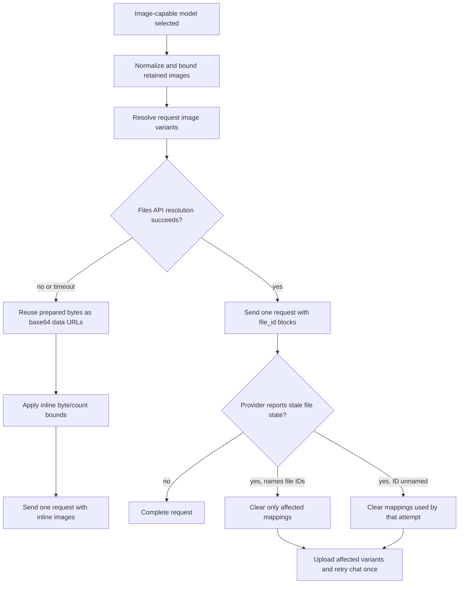

# Configure DeepSeek Harness image input on rc.2

Use this guide when an Agent must inspect images through the official `deepseek-official` route. It covers the route declaration, the rc.2 Files API path, deterministic image limits, and the fallback behavior when file resolution cannot complete.

> [!WARNING]
> Image input can send user data to the configured DeepSeek-compatible endpoint. Use a disposable Session for testing, avoid attaching secrets, and treat uploaded files as remote data with an expiry and quota lifecycle.

## What rc.2 does

At upstream revision `b150a551b8d465e31e418e1b2eaf5e79bbb7d28` (`dsh-v0.1.1-rc.2`), the official adapter:

1. requires the selected model catalog entry to declare `inputModalities: [text, image]`;
2. normalizes and bounds retained request images before reading them;
3. normally uploads derived image bytes through `POST /files` and sends `file_id` blocks;
4. reuses a locally indexed upload when its request variant and endpoint/key scope match;
5. rebuilds the whole request with base64 data URLs when Files resolution fails or times out;
6. never mixes file IDs and inline images in one chat request.

The catalog declaration is a route claim, not a remote capability test. The endpoint still needs to support the expected Files API and image message format.

## Declare an image-capable model

In the `llm-deepseek` configuration, add the image modality to the exact model that should accept images:

```yaml
- id: llm-deepseek
  name: '@deepseek-ai/dsh-llm-deepseek'
  config:
    apiKeyEnv: DEEPSEEK_API_KEY
    models:
      - id: deepseek-v4-flash-vision-exp
        name: DeepSeek-V4-Flash-Vision-Exp
        inputModalities: [text, image]
        imagePixelBudget: 640000
        imageMaxBytes: 1048576
```

Keep model IDs, keys, and configuration names exact. An omitted `inputModalities` means text-only. An explicit `models` list replaces the adapter's default catalog; it does not add one entry to the defaults.

Use a fresh Session after changing the model route. Existing Session history and model selection are not a reliable test of a new catalog declaration.

## Verify the route before sending private images

First check the executable and resolved composition:

```sh
dsh --version
dsh --profile web --dump-config > resolved-web.yml
```

Then perform a bounded read-only test with a small synthetic image. Confirm all of the following:

- the selected model entry includes `image` in `inputModalities`;
- the image is accepted by a new Session;
- the request reaches the intended `baseURL`;
- the response identifies the image correctly without mutating the workspace;
- the Host and provider logs do not expose the image contents or API key.

A successful catalog lookup alone proves none of these runtime properties.

## Understand the request budgets

The adapter defaults are designed to bound one request, not to promise provider-wide limits:

| Setting | Default | Meaning |
|---|---:|---|
| `imagePixelBudget` | 640,000 pixels | total normalized pixels per image by default |
| `imageMaxBytes` | 1 MiB | encoded bytes per normalized image by default |
| `maxRequestFilesBytes` | 128 MiB | accumulated derived bytes retained for file references |
| `maxInlineRequestImageBytes` | 20 MiB | accumulated base64-expanded bytes in fallback mode |
| `maxImagesPerRequest` | 600 | maximum represented images |
| `filesApiTimeoutMs` | 60,000 ms | deadline for resolving one image through Files API |
| `fileExpiresAfterSeconds` | 604,800 seconds | requested upload lifetime, subject to provider limits |

The adapter removes the oldest image prefix when count or byte bounds are exceeded. Removed images are represented to the model by a fixed omission placeholder. The request does not reread omitted attachments to restore them.

For low-detail models, configure `imageDetail: low` or an explicit pixel budget according to the route contract. The adapter scales dimensions inward to remain at or below the pixel budget; it does not simply force every image into a square.

## Files API and fallback decision tree



A Files resolution failure is not automatically a failed chat request: rc.2 switches that attempt to inline mode. An upload or file-management operation can still report its own error when called directly. A stale-file recovery permits one additional chat attempt; a second stale-file rejection is returned rather than retried indefinitely.

The local upload index is scoped by endpoint/API-key identity and request `variantId`. A mapping nearing expiry is replaced before use. The adapter does not retrieve every remote file on every request.

## Common failures

| Symptom | Diagnose first | Recovery |
|---|---|---|
| Image rejected before network activity | model catalog lacks `inputModalities: [text, image]` | correct the exact model entry and start a fresh Session |
| Provider rejects `file_id` or Files endpoint | endpoint is not compatible with the rc.2 Files API contract | verify `/files`, auth, `purpose: user_data`, and image message support; use a route that implements the contract |
| Files upload times out, but text request continues | Files resolution boundary | inspect endpoint latency and `filesApiTimeoutMs`; verify whether the inline request succeeded |
| Older images disappear from context | request byte/count budget | attach only required images or raise deployment-owned limits within provider constraints |
| Repeated uploads occur after restart | local upload index is unavailable or expired | treat as expected cache miss; verify remote quota and expiry rather than assuming duplicate chat sends |
| Stale file error repeats | provider rejected the retry after mapping recovery | stop retrying, record the sanitized provider response, and verify file IDs and endpoint state |
| Model selector shows no vision route | explicit `models` list replaced the defaults | add the image-capable entry to the explicit list |

Do not work around a provider rejection by disabling image validation globally. That can make durable history advertise an input modality the selected route cannot represent.

## Security and operations

- Never place `DEEPSEEK_API_KEY` or a literal API key in a profile patch, screenshot, issue, or guide example.
- Treat Files API uploads as remote copies. Use the shortest acceptable expiry and reclaim harness-owned files when the provider quota matters.
- Configure the Files API and chat endpoint consistently. A gateway that supports chat but not `/files` will rely on inline fallback, with its independent base64 budget.
- Keep image logs, request traces, and error reports metadata-only. Do not log image bytes or base64 payloads.
- Test image input with a synthetic fixture before using customer or repository data.
- Verify the effective route from the Harness Host, not only from the browser machine.

## Verification record

```text
Harness release: dsh-v0.1.1-rc.2
Upstream revision: b150a551b8d465e31e418e1b2eaf5e79bbb7d28
Verification date: 2026-08-22
Verification scope: adapter README, Files API client, request-image and adapter source
Runtime test credential: not used
```

## Official sources

- [dsh-v0.1.1-rc.2 release](https://github.com/deepseek-ai/deepseek-harness/releases/tag/dsh-v0.1.1-rc.2)
- [`dsh-llm-deepseek` README at rc.2](https://github.com/deepseek-ai/deepseek-harness/blob/b150a551b8d465e31e418e1b2eaf5e79bbb7d28/packages/llm/llm-deepseek/README.md)
- [rc.2 Files API client](https://github.com/deepseek-ai/deepseek-harness/blob/b150a551b8d465e31e418e1b2eaf5e79bbb7d28/packages/llm/llm-deepseek/src/files-api.ts)
- [rc.2 DeepSeek adapter](https://github.com/deepseek-ai/deepseek-harness/blob/b150a551b8d465e31e418e1b2eaf5e79bbb7d28/packages/llm/llm-deepseek/src/adapter.ts)
- [Configure model providers](model-providers.md)
- [Recover a stuck image-send composer](../troubleshooting/image-send-composer-readonly.md)
