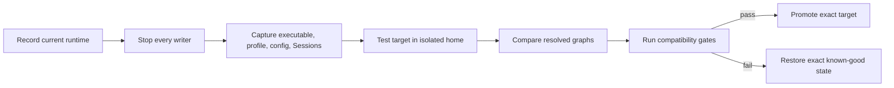

# Upgrade DeepSeek Harness without losing the last known-good runtime

An upgrade changes more than one visible version string. The executable supplies in-box bundles; each profile owns out-of-tree dependencies and ordered patch layers; the home directory supplies shared overrides and credentials; browser artifacts may come from a previous source build; durable Sessions outlive the process that wrote them.

Upgrade one boundary at a time and preserve evidence that can actually restore the previous state.

> [!WARNING]
> DeepSeek Harness is in developer preview and may introduce compatibility-breaking changes. Do not use a production profile or irreplaceable Session as the first upgrade target.

## Name the thing being upgraded

| Boundary | Examples | Rollback object |
|---|---|---|
| published CLI artifact | `@deepseek-ai/dsh@0.1.1-rc.2` | exact previous package version and integrity |
| official source checkout | Git commit or release tag | previous commit plus clean build inputs |
| profile plugin | npm version or Git commit | previous manifest, lockfile, and bundle list |
| profile configuration | `cordis.patch.yml` | exact previous file and resolved graph |
| home configuration | `$DSH_HOME/cordis.patch.yml` | exact shared override file |
| durable Session data | JSONL or another provider | immutable backup from a stopped writer |

Do not call a profile-plugin update a Harness upgrade, or a Git pull a published-package upgrade. They have different owners and rollback paths.

## The safe upgrade loop



## 1. Record the current executable

For an installed CLI:

```sh
command -v dsh
dsh --version
npm view @deepseek-ai/dsh version dist-tags dist.integrity --json
```

For a source checkout:

```sh
git remote get-url origin
git rev-parse HEAD
git status --short
pnpm --version
pnpm dsh --version
```

Record the package-manager and Node versions. A global, project-local, npx, and source executable may all print the same product version while resolving different physical artifacts.

## 2. Stop the process before capturing state

Stop Web, headless workers, supervisors, and any other process using the same `DSH_HOME`. Confirm the port and relevant processes are gone before copying mutable profile or Session files.

The first SIGINT or SIGTERM begins bounded graceful disposal. Avoid a forced second signal unless the process cannot drain, because disposal owns Session flushes and plugin cleanup.

## 3. Capture the known-good composition

Before stopping, or from a non-booting dump path that does not mount plugins, preserve:

```sh
dsh --profile web --dump-default-config > before-default.yml
dsh --profile web --dump-config > before-resolved.yml
```

Back up these profile and home files after all writers stop:

```text
$DSH_HOME/profiles/web/package.json
$DSH_HOME/profiles/web/pnpm-lock.yaml
$DSH_HOME/profiles/web/pnpm-workspace.yaml
$DSH_HOME/profiles/web/cordis.patch.yml
$DSH_HOME/cordis.patch.yml
$DSH_HOME/.credentials.yaml
```

Treat credentials separately: preserve them securely, do not attach them to a bug report, and do not copy production credentials into the isolated test home.

If Session compatibility matters, preserve an immutable backup using the active persistence provider's documented boundary while the writer is stopped.

## 4. Inspect the target before changing anything

Read exact target metadata:

```sh
npm view @deepseek-ai/dsh@<target-version> \
  name version dist.integrity repository.url \
  engines dependencies --json
```

Review the official release and diff from the known-good source revision. Look specifically for changes to:

- Node and package-manager requirements;
- CLI arguments and profile initialization;
- in-box bundle composition;
- configuration schemas or row IDs;
- persistence and Session event formats;
- native and platform-specific dependencies;
- permission, sandbox, credential, and network defaults;
- plugin service or peer-dependency contracts.

A moving `latest`, `next`, or other dist-tag is a discovery pointer, not a rollback coordinate. Resolve and record the exact version plus registry integrity.

## 5. Test the target in an isolated home

Create a disposable home and workspace. Do not mutate the known-good profile first.

```sh
upgrade_home=$(mktemp -d)
upgrade_workspace=$(mktemp -d)
cd "$upgrade_workspace"
DSH_HOME="$upgrade_home" \
  npx @deepseek-ai/dsh@<target-version> --version
DSH_HOME="$upgrade_home" \
  npx @deepseek-ai/dsh@<target-version> --profile web --dump-config \
  > target-clean.yml
```

Boot the clean Web profile only after metadata review:

```sh
DSH_HOME="$upgrade_home" \
  npx @deepseek-ai/dsh@<target-version> web
```

Use a limited test credential and a disposable workspace. Prove a bounded read-only turn before importing any plugin or state.

## 6. Add profile plugins one at a time

The executable's in-box bundles resolve from the selected DSH installation. Out-of-tree plugins resolve from each profile's pnpm-managed dependencies. Therefore an executable upgrade can expose plugin compatibility failures without changing the plugin version.

For each required plugin:

1. record the old exact version or Git commit;
2. inspect its package metadata, peer dependencies, scripts, and bundle patch;
3. install it into the isolated profile at the same exact coordinate;
4. dump the new graph;
5. boot and test its denial, restart, and disposal paths;
6. only then consider a plugin version update as a separate change.

`dsh plugin --profile <name> update` forwards to pnpm and then reconciles bundle declarations. It can change multiple dependencies if invoked broadly. Prefer an exact package target and inspect the resulting manifest and lockfile diff.

## 7. Run compatibility gates

Minimum gates:

| Gate | Evidence |
|---|---|
| executable | expected path, exact version, and package/source identity |
| clean boot | isolated profile starts with no stale home state |
| composition | target dump has only understood row changes |
| model route | one bounded request uses the expected provider and credential |
| permissions | denied write or command remains denied |
| tools | expected schemas register once and effects remain bounded |
| Sessions | fresh, resume, export, and cold restart work for required data |
| plugins | every required bundle loads at a pinned coordinate |
| shutdown | processes, timers, connections, and writers dispose |
| restart | cold restart reproduces the same target behavior |

Do not use a successful UI load as the only acceptance signal.

## 8. Promote or roll back

Promote the exact artifact that passed, not a moving tag resolved later. Preserve the target version, integrity, profile manifest, lockfile, patches, resolved graph, and acceptance evidence together.

If a gate fails:

1. stop the target process and every writer;
2. restore the previous exact CLI package or source commit;
3. restore the captured profile manifest, lockfile, build allowances, and patch files;
4. restore Session data only if the target wrote incompatible state and you have an immutable stopped-writer backup;
5. run the previous `--dump-config` and compare it with `before-resolved.yml`;
6. cold boot and repeat the known-good acceptance task.

Rollback is not proven until the prior runtime boots from the restored state and produces its previous observable signals.

## Failure router

| First failure | First comparison |
|---|---|
| target clean profile fails | target artifact, Node/platform support, and package family |
| clean profile works, copied profile fails | resolved graph and profile dependency closure |
| same plugins fail only on target | peer/service contract and row-schema changes |
| Web shows old behavior from source | build freshness and browser/client artifacts |
| old executable fails after rollback | profile files or Session state were changed by target |
| `plugin update` changes unrelated packages | manifest and lockfile diff from the captured state |
| resumed Session fails, fresh Session works | persistence and event compatibility boundary |
| shutdown hangs | plugin or writer disposal path before force termination |

## Upgrade record

```text
Known-good executable path and version:
Known-good package integrity or source commit:
Target exact version and integrity or commit:
Node and package-manager versions:
DSH_HOME and profile:
Writers stopped before capture: yes / no
Profile manifest, lockfile, patches captured:
Session backup boundary:
Clean isolated-home result:
Resolved graph diff reviewed:
Required plugin coordinates and results:
Compatibility gates passed:
Promotion artifact:
Rollback rehearsal result:
Reviewer and date:
```

## Official sources

- [Official release and run instructions](https://github.com/deepseek-ai/deepseek-harness/blob/b150a551b8d465e31e418e1b2eaf5e79bbb7d28/README.md)
- [CLI profile, plugin, shutdown, and source-execution contract](https://github.com/deepseek-ai/deepseek-harness/blob/b150a551b8d465e31e418e1b2eaf5e79bbb7d28/apps/cli/reference/README.md)
- [Official CLI package manifest](https://github.com/deepseek-ai/deepseek-harness/blob/b150a551b8d465e31e418e1b2eaf5e79bbb7d28/apps/cli/package.json)
- [Official rc.2 release](https://github.com/deepseek-ai/deepseek-harness/releases/tag/dsh-v0.1.1-rc.2)
- [Session persistence contract](https://github.com/deepseek-ai/deepseek-harness/blob/b150a551b8d465e31e418e1b2eaf5e79bbb7d28/packages/session/session-persistence/README.md)
