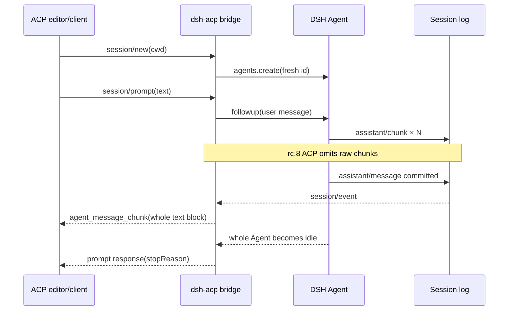

# Use DeepSeek Harness ACP without mistaking automation for an editor UI

DeepSeek Harness rc.8 ships an Agent Client Protocol server, but its official contract is automation-only. A compatible editor can start it as a custom ACP process and exchange baseline requests, yet that does not make it a full native editor Agent.

Use this guide to evaluate `dsh-acp` with Zed or another ACP host, prove the capabilities that exist, and avoid advertising token streaming, tool presentation, or Session recovery before the bridge implements them.

## ACP, MCP, and the DSH SDK are different seams

| Interface | Direction | Purpose |
|---|---|---|
| ACP server | editor or parent client → DSH Agent | create and drive Agent Sessions over JSON-RPC stdio |
| MCP client | DSH Agent → external tool server | discover and call tools/resources |
| DSH SDK server | programmatic client → DSH runtime | DSH-native Session events and lifecycle over its own protocol |

An editor supporting ACP does not automatically expose its MCP servers to rc.8 DSH. The official ACP bridge rejects non-empty `mcpServers`. Likewise, DSH's richer SDK `session.event` stream is not the ACP wire.

## The rc.8 capability ledger

| Capability | rc.8 ACP behavior | Editor consequence |
|---|---|---|
| initialize | one protocol version; baseline text/resource-link prompt capability | connection can negotiate |
| new Session | supported with one absolute `cwd` | create a fresh editor thread |
| prompt | text plus flattened resource links; one in-flight prompt per Session | basic request/response works |
| assistant text | emitted only from committed `assistant/message` blocks | whole committed blocks may appear as chunks; no token latency |
| cancellation | addressed Session cancels and settles pending prompt | stop action can work |
| permission request | one-shot allow/reject for bridge-owned tool calls | client can apply machine policy |
| images/audio/embedded context | not advertised and rejected | editor attachments do not cross |
| additional directories | non-empty list rejected | one primary workspace only |
| forwarded MCP servers | non-empty list rejected | editor MCP configuration is unavailable to DSH through ACP |
| reasoning/tool activity/plans/titles/usage | omitted | no native progress or tool cards |
| Session list/load/resume/fork/delete | unsupported | editor history cannot restore a DSH thread |
| per-Session close | unsupported | connection owns all Sessions |

The protocol name `agent_message_chunk` is not proof of token streaming. The bridge subscribes to durable `session/event` and ignores `assistant/chunk`; it sends a notification only when an `assistant/message` is committed.

## The current message path



Prompt settlement waits for whole-Agent idle, not merely the correlated `turn/end`. Steering or injected work can therefore contribute committed messages before the response settles. Token-limit endings map to `end_turn`; a correlated model error rejects the prompt.

## Run the official source demo as a bounded probe

The repository example is the authoritative executable composition:

```sh
git clone https://github.com/deepseek-ai/deepseek-harness.git
cd deepseek-harness
git checkout 141eb6fef83422698aef7a981029e843e8161534
corepack pnpm install --frozen-lockfile
DEEPSEEK_API_KEY=... corepack pnpm run demo:acp
```

Stdout is protocol-only newline-delimited JSON-RPC. Send diagnostics to stderr; one stray stdout log corrupts the transport. Use a limited provider key and a disposable workspace because the example composes filesystem, Bash, subagent, workflow, compaction, and hook capabilities.

Do not paste a credential into editor settings. Prefer an environment supplied to the process by a secret manager or a wrapper whose permissions and stdout behavior you have reviewed.

## Register it as a custom Zed Agent for testing

Zed's current External Agents UI can add a custom ACP process. A source-checkout probe can use a wrapper command that changes to the pinned repository and runs `pnpm run demo:acp`. Keep the wrapper's stdout protocol-pure.

Conceptual `agent_servers` entry:

```json
{
  "agent_servers": {
    "deepseek-harness-rc8-probe": {
      "type": "custom",
      "command": "/absolute/path/to/dsh-acp-wrapper",
      "args": [],
      "env": {}
    }
  }
}
```

This is a developer probe, not a claim that DSH is in the ACP Registry or provides a production editor integration. Zed's own documentation says External Agents own their runtime, model, authentication, tools, and native configuration; Zed model keys do not automatically configure the external process.

## Probe what exists

Use a disposable project and record the ACP log.

1. Start one fresh thread and confirm `initialize` plus `session/new` succeed.
2. Send a short prompt and timestamp the first provider activity, first ACP text update, commit, and prompt response.
3. Confirm the first ACP text arrives after `assistant/message`, not for every `assistant/chunk`.
4. Trigger a bounded tool call and confirm no ACP tool-start/progress/result card appears.
5. Cancel one running prompt and verify it settles as cancelled without affecting another Session.
6. Under `workspace-write`, trigger one permission escalation and test both one-shot outcomes.
7. Restart the ACP process and confirm the previous Session id is unknown.
8. Attempt non-empty `mcpServers` or `additionalDirectories` only in a disposable test and retain the expected invalid-params response.

Use Zed's `dev: open acp logs` command for the host-side wire trace. Sanitize prompts, paths, tool arguments, and environment data before sharing.

## Do not promise these editor experiences yet

- **Token streaming:** committed block delivery can still be labeled a chunk on the wire.
- **Thinking display:** reasoning stays in DSH Session events and is not projected to ACP.
- **Tool cards:** the bridge omits call, progress, result, and presentation metadata.
- **Restored threads:** a persisted JSONL Session is not reachable through ACP load/resume.
- **Editor context parity:** image, audio, embedded context, extra roots, and forwarded MCP servers reject.
- **Zed-native policy:** DSH owns provider routing and the composed capability graph; the editor is not the security boundary.

If the desired experience is an interactive terminal application, use a real CLI/TUI in a terminal thread. If the desired client needs complete DSH durable events today, evaluate the DSH SDK instead of relabeling ACP committed messages as live progress.

## What a complete editor-facing bridge needs

### Streaming projection

Project raw `assistant/chunk` text deltas to ACP incrementally, while handling retries and replacement correctly. A failed or retried provider attempt must not leave stale text in an editor that cannot retract it. Define whether reasoning and tool activity use standard ACP update kinds and preserve call identity through start, progress, permission, result, and cancellation.

### Session discovery and resume

Add protocol-supported list/load/resume behavior backed by the existing persistence coordinator. Resume must use the exact persisted Session and its original Agent composition, reject duplicate live ownership, run crash repair once, establish a replay watermark, and avoid re-emitting historical output as new streaming content.

### Capability negotiation

Advertise only implemented prompt, filesystem, terminal, MCP, and Session capabilities. Validate host-supplied roots and servers rather than silently ignoring them. Treat the editor process, DSH process, provider, and tool backends as separate trust and billing boundaries.

## Acceptance matrix

- Text deltas arrive before committed assistant messages and preserve Unicode boundaries.
- Retry replacement removes or supersedes abandoned partial text deterministically.
- Reasoning visibility follows an explicit opt-in/redaction policy.
- Tool lifecycle updates preserve one stable call id.
- Permission, cancellation, and prompt settlement do not regress.
- Session list returns only authorized roots and sanitized metadata.
- Resume loads one exact persisted Session with single-writer ownership.
- Historical replay is distinguishable from new live output.
- Reconnect resumes from a watermark without duplicate chunks.
- Unsupported host capabilities remain unadvertised and fail clearly.
- Multiple Sessions remain isolated across cwd, cancellation, and disposal.
- Source demo, SDK client, and at least one real editor host pass the same protocol fixtures.

## Primary sources

Verified against DeepSeek Harness rc.8 commit `141eb6fef83422698aef7a981029e843e8161534` and current Zed External Agents documentation on 2026-08-20.

- [Upstream editor-integration request #3453](https://github.com/deepseek-ai/deepseek-harness/discussions/3453)
- [rc.8 ACP implementation](https://github.com/deepseek-ai/deepseek-harness/blob/141eb6fef83422698aef7a981029e843e8161534/packages/acp/acp/src/index.ts)
- [rc.8 ACP automation contract](https://github.com/deepseek-ai/deepseek-harness/blob/141eb6fef83422698aef7a981029e843e8161534/packages/acp/acp/README.md)
- [rc.8 runnable ACP example](https://github.com/deepseek-ai/deepseek-harness/blob/141eb6fef83422698aef7a981029e843e8161534/examples/acp-agent/README.md)
- [rc.8 DSH SDK streaming contract](https://github.com/deepseek-ai/deepseek-harness/blob/141eb6fef83422698aef7a981029e843e8161534/packages/sdk/server/README.md)
- [Zed External Agents](https://zed.dev/docs/ai/external-agents)
- [Zed ACP debugging and Agent Panel](https://zed.dev/docs/ai/agent-panel)
