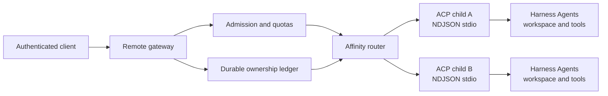

# Host stdio-only DeepSeek Harness ACP without inventing a remote security boundary

DeepSeek Harness rc.2 exposes its automation bridge over newline-delimited JSON-RPC on stdio. The implementation accepts a runtime-only `Stream`, but the exported Cordis configuration schema exposes only `provider` and `model`. A `cordis.yml` deployment therefore cannot select HTTP transport.

This is not a missing command-line flag. It is an ownership boundary. If a platform wraps ACP with HTTP, that platform becomes responsible for authentication, tenant binding, process supervision, request correlation, reconnect semantics, quotas, and teardown.

Use this guide to decide whether to keep one child per trust domain, build a reviewed gateway, or wait for a supported upstream transport contract.

The official discussion on native multi-tenant support (#4965) reinforces this boundary: tenant isolation is a deployment and authorization concern, not something created by assigning different ACP Session ids. Treat that discussion as a design signal, not as a released transport contract.

## Verify the current contract first

At rc.2 commit `b150a55`:

- `AcpConfig.stream` exists as a runtime-only override;
- the exported `Config` schema omits `stream`;
- production defaults to an NDJSON stream over `process.stdin` and `process.stdout`;
- stdout is protocol-only;
- one ACP connection may own several Sessions;
- a Session id is meaningful only inside the connection that created it;
- connection close cancels, drains, and disposes every Session owned by that bridge;
- there is no per-Session close, list, load, or resume method;
- ACP advertises no authentication method.

The `Stream` seam makes tests and direct TypeScript mounting possible. It does not by itself promise that arbitrary remote transports are stable, secure, or supported from deployment configuration.

## Choose the isolation unit before the transport

| Topology | Isolation owner | Good fit | Main cost |
|---|---|---|---|
| one child per request | process | short stateless jobs | startup cost and no continuity |
| one child per tenant | process plus tenant scheduler | strong credential, workspace, and Session separation | process density and rolling-drain complexity |
| one child per trust domain | process plus policy domain | tenants that share reviewed tools and provider routes | application authorization still required |
| shared ACP connection | gateway correlation | trusted internal batch workloads | all Sessions share one connection lifetime |
| direct custom `Stream` mount | application code | controlled experiments or an upstream contribution | runtime-only seam and application coupling |

Do not begin with “How do we expose stdio over HTTP?” Begin with “Which principal owns this process, workspace, provider credential, capability graph, and persistence root?” Transport follows that answer.

For unrelated tenants, one child per tenant or narrow trust domain is the safer default. Multiplexing tenant Sessions through one ACP connection does not create isolation merely because Session ids differ.

## The gateway is a stateful protocol owner



The gateway needs an unforgeable mapping:

```text
authenticated principal
  -> tenant and policy revision
  -> child generation
  -> ACP connection
  -> Session id
  -> active request and reverse request ids
```

Never accept a client-provided child id, workspace path, provider credential, or tenant id as authority. Resolve those fields from authenticated server-side state.

## Five contracts a remote host must define

### 1. Process supervision

Start the exact reviewed artifact with a minimal environment. Reserve stdout for ACP frames and collect bounded stderr separately. Apply startup, prompt, idle, and shutdown deadlines. Rate-limit restarts and expose the child generation in internal diagnostics.

A transport close invalidates every Session owned by that connection. Do not silently attach old Session ids to a new child.

### 2. Correlation and reverse requests

JSON-RPC request ids correlate ordinary calls. ACP permission requests travel in the opposite direction and must return to the exact authenticated owner or configured machine policy. Bind each pending reverse request to tenant, connection generation, Session, tool call, expiry, and offered option ids.

Reject late, replayed, cross-tenant, or invented permission answers. Never let a browser construct a broader grant than the bridge offered.

### 3. Session affinity

Route every call for one ACP Session to the connection that created it. Persist the ownership mapping before returning the Session id to a remote client. During a rolling deploy, stop new admission, let bounded work drain, then close the connection. Because rc.2 has no Session resume, moving a live Session between children is not supported.

### 4. Delivery and reconnect

An HTTP stream disconnect is not proof the Agent stopped. Choose and document one semantic:

- disconnect cancels the prompt and eventually the Agent;
- work continues and the client may reconnect to a bounded replay window;
- work continues but the result is available through a separate durable job resource.

If replay exists, key it by authenticated principal, child generation, Session, and monotonic gateway sequence. Bound it by age and bytes. Label replayed frames, preserve order, and never replay a permission choice as though it were a new request.

Heartbeats prove gateway connectivity, not Agent progress. Keep liveness, tool telemetry, and prompt completion as different signals.

### 5. Teardown and accounting

Connection-owned teardown means closing one shared bridge affects all of its Sessions. A remote service needs admission closure, bounded drain, explicit cancellation, descendant cleanup, child exit verification, and a final ownership-ledger transition.

Record usage at the model gateway until ACP exposes a runtime-owned receipt. Record tool effects at the authoritative tool boundary. Do not infer either from final assistant prose.

## Recommended HTTP resource model

Do not expose raw stdio bytes as an unauthenticated WebSocket. A safer application API gives ownership explicit resources:

| Resource | Purpose |
|---|---|
| `POST /agents` | allocate one reviewed child or trust-domain slot |
| `POST /agents/{id}/sessions` | create a Session under server-chosen workspace policy |
| `POST /sessions/{id}/prompts` | create an idempotency-keyed prompt job |
| `GET /jobs/{id}/events` | stream ordered, authorized delivery with a resume cursor |
| `POST /permissions/{id}/decision` | answer one exact, unexpired reverse request |
| `POST /jobs/{id}/cancel` | cancel one admitted prompt interval |
| `DELETE /agents/{id}` | drain and close the connection-owned lifetime |

These are gateway resources, not claims about official ACP endpoints. Keep ACP ids private or wrap them in opaque, tenant-bound handles.

## Failure routing

| Evidence | Owner | Safe response |
|---|---|---|
| child exits before `initialize` | artifact, environment, or supervisor | retain stderr and stop restart storms |
| malformed stdout frame | child or wrapper logging | terminate the corrupted generation |
| unknown Session after restart | expected connection-local identity | create a new Session; do not guess affinity |
| client stream drops mid-turn | gateway delivery contract | cancel, replay, or expose job status as declared |
| permission answer has wrong owner | authentication or correlation | reject and audit without forwarding |
| deploy cannot drain | long tool, descendant, or persistence teardown | cancel at deadline and verify child exit |
| one tenant can address another handle | authorization failure | stop the service path and treat as an isolation incident |

## Security minimum

- authenticate every remote request and stream reconnect;
- authorize tenant, Agent profile, workspace, provider route, and operation independently;
- use opaque external handles and constant-scope lookup failures;
- apply per-principal concurrency, byte, token, tool, and wall-clock quotas;
- keep provider and tool credentials out of model-visible arguments and client payloads;
- isolate untrusted code and Bash with a container-class boundary, not only a Node process;
- protect event streams against cross-origin credential leakage and cache storage;
- redact prompts, tool arguments, results, paths, and stderr before logs or traces leave the trust domain;
- audit admission, permission, cancellation, process generation, and terminal outcome;
- test tenant separation with two real principals, not two labels inside one request.

## Acceptance matrix

- Two tenants cannot enumerate, address, cancel, replay, or approve each other's resources.
- A Session always routes to its creating child generation.
- A child restart makes old ownership fail closed and does not alias an id.
- Duplicate prompt submission with the same idempotency key creates at most one admitted interval.
- Reconnect from a valid cursor delivers each retained event once and in order.
- An expired cursor returns an explicit resync requirement instead of a partial history.
- A reverse permission request reaches only its exact owner and expires once.
- Late permission answers cannot authorize a new or retried call.
- Slow clients hit a bounded byte policy without unbounded memory growth.
- Rolling deploys reject new admission before draining existing work.
- Shutdown cancels at its deadline and verifies the child plus descendants have exited.
- Stdout corruption terminates one generation without leaking frames to another tenant.
- Provider and tool credentials never appear in external handles, event URLs, or logs.
- Usage and tool audit records identify tenant, Session, job, child generation, and policy revision.

## What upstream support would need to promise

A documented custom-`Stream` extension would need compatibility, lifecycle, backpressure, error, and teardown guarantees. A first-party HTTP package would additionally need authentication hooks, Session ownership, reconnect and replay semantics, quotas, per-Session or connection-level close behavior, and a threat model.

Until then, describe an HTTP wrapper as platform-owned infrastructure built around the official stdio bridge, not as an official DeepSeek Harness remote server.

## Primary sources

Verified against DeepSeek Harness rc.2 commit `b150a551b8d465e31e418e1b2eaf5e79bbb7d28e` on 2026-08-27.

- [Official remote-hosting request #4692](https://github.com/deepseek-ai/deepseek-harness/discussions/4692)
- [rc.2 ACP implementation and runtime-only stream](https://github.com/deepseek-ai/deepseek-harness/blob/b150a551b8d465e31e418e1b2eaf5e79bbb7d28e/packages/acp/acp/src/index.ts)
- [rc.2 ACP protocol and lifecycle contract](https://github.com/deepseek-ai/deepseek-harness/blob/b150a551b8d465e31e418e1b2eaf5e79bbb7d28e/packages/acp/acp/README.md)
- [rc.2 ACP runnable example](https://github.com/deepseek-ai/deepseek-harness/tree/b150a551b8d465e31e418e1b2eaf5e79bbb7d28e/examples/acp-agent)
- [Container-class boundary note for untrusted code](https://github.com/deepseek-ai/deepseek-harness/blob/b150a551b8d465e31e418e1b2eaf5e79bbb7d28e/.agents/notes/implemented/feature/2026-06-15-code-mode.md)
