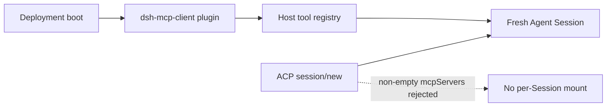

# Design session-scoped MCP around the current ACP boundary

DeepSeek Harness `0.1.1-rc.2` rejects every non-empty `mcpServers` array in ACP `session/new`:

```text
Invalid params: mcpServers is not supported
```

This does not mean DeepSeek Harness lacks an MCP client. The shipped `@deepseek-ai/dsh-mcp-client` connects to stdio or Streamable HTTP servers and registers tools such as `mcp__catalog__search`. The boundary is ownership: MCP instances are deployment-composed Cordis plugins, while ACP Sessions are created later inside that fixed Host composition.

## Separate the two lifecycles



| Plane | Owner in rc.2 | Lifetime | Consequence |
|---|---|---|---|
| MCP transport and discovery | deployment Cordis composition | plugin/Host lifetime | every Agent in scope observes the registered tool generation |
| ACP Agent | ACP connection | fresh Session until connection teardown | Session cannot contribute a new MCP plugin row |
| MCP tool call | calling Agent through `ctx.tools` | one execution | policy can inspect the call, but cannot retroactively change transport ownership |

An ACP client advertising MCP support does not make its servers available to DSH. Capability negotiation describes what the bridge accepts; it is not a tunnel around the Harness composition.

## Current operator path: deployment-configured MCP

Configure a trusted Streamable HTTP endpoint before ACP Sessions start:

```yaml
- id: mcp-platform-gateway
  name: '@deepseek-ai/dsh-mcp-client'
  config:
    serverName: platform
    transport: streamable-http
    url: https://mcp-gateway.example.internal/mcp
    headers:
      Authorization: !!js '`Bearer ${process.env.MCP_GATEWAY_TOKEN}`'
    failOnStartupError: true
```

This produces one stable Host-visible namespace such as `mcp__platform__search`. It does not make the URL or credentials session-scoped. Authentication and tenant routing must be enforced by the gateway using trusted context that cannot be forged by model arguments.

Do not put a tenant token directly in a model-visible tool argument and call that isolation. The model can replay, omit, or alter arguments. Tenant identity must come from an authenticated execution context, a per-tenant Host, or another out-of-band binding controlled by the operator.

## Choose an architecture by trust boundary

### 1. One Host per tenant or trust domain

Compose each Host with only that tenant's MCP endpoints and credentials. Use this when tool schemas, credentials, egress, and durable Sessions must be strongly separated. It costs more processes, but the existing deployment-scoped contract matches the security boundary.

### 2. Deployment allowlist plus Session selection

A future bridge can let the deployment declare named MCP endpoints, while ACP `session/new` selects only approved names. The client never supplies a URL, command, headers, or environment.

Tool visibility must be Agent-scoped. Connecting every allowlisted server at Host scope and hiding names in the prompt is not authorization; direct and indirect lookup must enforce the same selection.

### 3. Shared authenticated MCP gateway

Mount one deployment-level Streamable HTTP server that routes calls behind the gateway. Use this when the platform already owns tenant authentication, policy, audit, and remote execution.

The visible tool names are shared unless the gateway publishes a stable superset. Per-tenant effects behind identical schemas are workable; changing one shared client's discovered tool list per request is not.

### 4. Direct client-supplied HTTP MCP

Accept ACP `mcpServers` and create an Agent-owned MCP connection for each Session. HTTP avoids client-triggered local process spawning but still introduces SSRF and arbitrary egress. Do not ship this shape until URL policy, credential custody, namespace collision, quotas, teardown, and capability negotiation are defined.

## Why HTTP-only is not automatically safe

A client-selected Streamable HTTP URL can reach loopback services, cloud metadata endpoints, internal control planes, or DNS-rebound addresses. Headers may contain credentials that reach logs or long-lived config. Tool descriptions and schemas are untrusted model context. Tool calls can perform effects outside the local filesystem sandbox.

At minimum, a direct implementation needs:

- an operator allowlist over scheme, resolved address, port, and redirect target;
- DNS resolution and redirect checks on every connection generation;
- explicit denial of loopback, link-local, private, metadata, and Unix-socket bridges unless individually approved;
- secret references rather than raw client-supplied headers;
- bounded server count, schema size, tool count, connection time, call time, and reconnect budget;
- deterministic server-qualified names with collision rollback;
- Agent-owned registration scope and complete disposal before Session removal;
- audit records joining ACP Session, tenant, MCP server identity, tool call, and policy outcome.

## Session teardown contract

Per-Session MCP cannot reuse the current deployment plugin lifetime unchanged. A safe bridge must make the Agent the owner of the connection, tool registrations, reconnect timers, and in-flight calls.

```text
session/new accepted
  -> validate approved server identity
  -> connect and discover within bounded startup
  -> atomically register the complete tool generation for this Agent

session/close or ACP disconnect
  -> reject new calls
  -> cancel and await in-flight calls
  -> stop reconnect timers
  -> unregister every tool
  -> close transport
  -> dispose Agent
```

The rc.2 ACP bridge has no per-Session close method and disposes all owned Agents when the connection closes. Session-scoped MCP therefore also needs an explicit per-Session lifecycle decision; otherwise a long-lived multi-tenant ACP connection retains every Session's external connections until whole-connection teardown.

## Verify the deployment gateway workaround

1. Start the Host with one reviewed Streamable HTTP MCP gateway.
2. Confirm `mcp__<serverName>__<tool>` appears before the first ACP prompt.
3. Create two ACP Sessions representing different test tenants.
4. Prove the gateway derives tenant identity from authenticated execution context, not a model-controlled argument.
5. Attempt cross-tenant object access and require a gateway denial plus audit event.
6. Change one tenant's entitlement without changing the shared tool schema; confirm policy changes without tool-generation churn.
7. Disconnect the gateway and verify the documented reconnect and failure behavior.
8. Close ACP and confirm Agents stop; separately confirm the deployment-owned gateway follows Host/plugin lifetime.

## Acceptance matrix for native session-scoped support

| Case | Required result |
|---|---|
| empty `mcpServers` | Session behavior remains backward-compatible |
| unsupported stdio config | rejects before spawning any process |
| unapproved HTTP destination | rejects before DNS/connect side effects |
| redirect to private address | rejects the redirected destination |
| duplicate server namespace | new Session creation rolls back atomically |
| discovery partly succeeds | no partial tool generation remains visible |
| two Sessions choose different approved servers | each Agent sees only its authorized tools |
| one Session closes | only its calls, registrations, timers, and transport dispose |
| ACP connection closes | every descendant MCP resource drains before Agent disposal completes |
| hostile tool description | remains untrusted and cannot alter system policy |
| quota exceeded | fails clearly without leaking a connection or registration |
| Host restart | stale Session/MCP handles are never presented as live |

## Official sources

- [Official session-scoped MCP proposal #4694](https://github.com/deepseek-ai/deepseek-harness/discussions/4694)
- [rc.2 ACP hard rejection and connection-owned teardown](https://github.com/deepseek-ai/deepseek-harness/blob/b150a551b8d465e31e418e1b2eaf5e79bbb7d28e/packages/acp/acp/src/index.ts)
- [rc.2 ACP automation contract](https://github.com/deepseek-ai/deepseek-harness/blob/b150a551b8d465e31e418e1b2eaf5e79bbb7d28e/packages/acp/acp/README.md)
- [rc.2 MCP client configuration and lifecycle](https://github.com/deepseek-ai/deepseek-harness/blob/b150a551b8d465e31e418e1b2eaf5e79bbb7d28e/packages/mcp/mcp-client/README.md)
- [rc.2 MCP client plugin ownership](https://github.com/deepseek-ai/deepseek-harness/blob/b150a551b8d465e31e418e1b2eaf5e79bbb7d28e/packages/mcp/mcp-client/src/index.ts)
