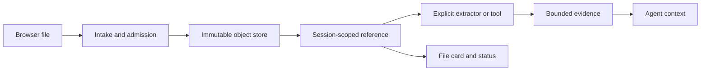

# Design general file attachments for DeepSeek Harness Agents

DeepSeek Harness `0.1.1-rc.2` accepts pasted and dropped raster images in Web, but it does not provide a first-party path for PDF, DOCX, XLSX, TXT, ZIP, or arbitrary binary files. This is not a missing MIME entry. The current contract is image-specific from the browser draft through durable storage and Session-authorized retrieval.

Use this guide to separate three promises that a file button is often assumed to make:

1. **transport**: the browser can send bytes to the Host;
2. **durability and authorization**: the Host can retain and retrieve those bytes for the owning Session;
3. **Agent usability**: an explicit parser or tool can turn the file into bounded, model-visible evidence.

An implementation is incomplete until it defines all three.

> [!IMPORTANT]
> This is an architecture and acceptance guide, not a claim that rc.2 already supports general files. The source paths below are pinned to `b150a55`. Do not make non-images enter the current image pipeline by widening `imageLimits.mediaTypes`.

## What rc.2 actually does

The Web composer collects every clipboard item whose kind is `file`, then calls `intakeImages(files)`. That function compares each browser-declared type with the projected image media types. The conversation service creates only draft objects whose `kind` is `image`, serializes them as base64 image inputs, and releases their object URLs after successful admission.

The Host contract is equally specific:

| Boundary | rc.2 vocabulary | Why a general file does not fit |
|---|---|---|
| Composer | `createDraftImages`, `addImages`, image labels and limits | no file draft kind or file card |
| Wire admission | encoded image attachment | no general file request schema |
| Store | `SaveImageAttachment`, `ImageAttachmentRef` | decodes raster bytes and records dimensions |
| Durable message | image content block | no generic file content block |
| Retrieval | `session.attachment` returns an image reference and bytes | authorization is useful, response vocabulary is image-specific |
| Model route | image request policy and provider image encoding | a PDF or spreadsheet requires parsing or a provider-native file contract |

The local store verifies declared raster media type against decoded bytes, normalizes dimensions, enforces pixel and byte bounds, and produces a content-addressed image reference. Relabeling a PDF as an image should fail, and weakening that check would remove an integrity boundary.

## Model the complete path



Keep the raw object, extracted evidence, and model request separate. The raw object is durable input. Extraction is a versioned computation. Model context is a bounded projection, not the whole file by default.

## Define a media-neutral reference

A future general-file reference should remain opaque and serializable. This illustrative shape is not an rc.2 API:

```ts
interface FileAttachmentRef {
  attachmentId: string
  mediaType: string
  bytes: number
  name?: string
  sha256: string
}
```

Do not store an absolute browser path, a filesystem path, a public URL, or a bearer token in the durable message. Treat `name` as display text only. Derive the object identity from verified bytes or another collision-resistant server-owned identifier.

Metadata supplied by the browser is untrusted. The Host must:

- enforce per-file, per-message, Session, tenant, and storage quotas;
- detect or validate media type from bytes where a reliable detector exists;
- normalize the display name and discard directory information;
- scan or quarantine according to deployment policy;
- commit a complete object before publishing its durable reference;
- avoid extracting archives during upload;
- make deletion and retention ownership explicit.

## Give authorization a real owner

The existing `session.attachment` route demonstrates the right retrieval principle: the requested object is served only when the Session's durable events reference that attachment id. A general-file route should preserve that join and add deployment identity where applicable.

Authorize retrieval against:

```text
principal + tenant + connection + Session + attachment id + operation
```

Do not authorize by attachment id alone, original filename, UI visibility, or possession of a local path. A content hash can deduplicate storage without becoming a cross-tenant read capability.

For remote Web deployments, never translate a browser-selected filename into a Host filesystem path. The browser and Host may be on different machines, and a path string is neither transport nor authorization.

## Make Agent usability explicit

“The file uploaded” does not mean “the model can read it.” Choose one or more explicit consumers:

| Consumer | Appropriate use | Required boundary |
|---|---|---|
| Workspace tool | operator deliberately places a file inside an authorized workspace | filesystem policy, path containment, tool approval |
| Extractor plugin | PDF text, office cells, archive inventory, metadata | sandbox, time/memory/output bounds, parser provenance |
| Provider-native Files API | a selected model route supports an official file contract | route capability, remote retention, provider file lifecycle |
| Human-only card | file must remain visible/downloadable but not enter context | Session authorization and safe download behavior |

Do not silently choose a parser from the filename. Record the detected type, extractor name and version, limits, warnings, and output digest. The Agent should be able to distinguish complete extraction from truncation, password protection, unsupported content, corruption, or malware quarantine.

## Use a bounded extraction result

A parser result should be a derived artifact with an explicit status:

```json
{
  "attachmentId": "sha256:…",
  "extractor": "pdf-text@2",
  "status": "truncated",
  "pagesProcessed": 40,
  "pagesTotal": 212,
  "characters": 120000,
  "warnings": ["output limit reached"],
  "artifactId": "sha256:…"
}
```

The model receives bounded text, structured rows, or a tool result referencing the derived artifact. It should not receive unbounded base64, raw archive members, executable macros, or the claim that the entire document was read when only a prefix was extracted.

For spreadsheets, preserve sheet names, cell coordinates, formulas versus displayed values, hidden-sheet policy, and truncation. For documents and PDFs, preserve page or section coordinates. Citability is part of the Agent contract.

## Safe workaround on rc.2

When the user and Harness share the same trusted machine, place a copy of the file inside the selected workspace through the operating system, then ask the Agent to inspect that explicit relative path with an authorized tool or installed parser. Verify the copy and keep the original outside the Agent's write scope when provenance matters.

This workaround does not apply to a remote browser whose Host runs elsewhere. It also does not make an unsupported format readable. Confirm that the selected tool can parse the format, and start with read-only access.

Avoid these shortcuts:

- widening the image MIME allowlist;
- embedding a large file as base64 in prompt text;
- exposing a local unauthenticated upload server;
- copying uploads into the workspace before admission succeeds;
- automatically unpacking ZIP files;
- giving a parser unrestricted network or filesystem access;
- treating a community plugin's installability as a security review.

## Failure router

| Symptom | Owning boundary | First evidence |
|---|---|---|
| paste shows unsupported image format | composer intake | browser file type and `imageLimits` projection |
| file card appears but send fails | Host admission | request schema, byte and quota error |
| send succeeds but Agent cannot use content | extraction or route capability | durable ref, selected consumer, extraction status |
| another Session can fetch the object | authorization | retrieval principal and durable-reference join |
| large document freezes the Host | parser isolation | CPU, memory, wall time, output and child-process telemetry |
| ZIP expands beyond quota | archive policy | member count, expanded bytes, depth and compression ratio |
| file disappears after reconnect | durability | commit result and Session event reference |
| model cites content not extracted | context projection | artifact digest, coordinates and truncation marker |

## Acceptance gate

- [ ] Pasting, dropping, and picking a supported file use one admission contract.
- [ ] Unsupported files receive an accessible, specific error instead of silent refusal.
- [ ] Image intake and rendering continue unchanged.
- [ ] The Host verifies bytes, name, size, quota, and policy before publishing a reference.
- [ ] A failed multi-file admission publishes no partial message.
- [ ] The durable event contains an opaque reference, never a client or Host path.
- [ ] Attachment retrieval requires the exact authorized Session reference.
- [ ] Cross-Session and cross-tenant identifier guesses are denied.
- [ ] Parser work has wall-time, memory, child-process, archive, and output bounds.
- [ ] Extraction provenance, coordinates, warnings, and truncation survive replay.
- [ ] Reconnect restores file cards and extraction state without re-uploading bytes.
- [ ] Cancellation leaves an explicit object and extraction disposition.
- [ ] Retention and deletion cover raw objects and derived artifacts.
- [ ] Model context never implies that unread or truncated content was processed.
- [ ] Mobile, keyboard, screen-reader, and drag/drop flows expose equivalent status.

## Minimal design record

```text
Accepted media types and detection method:
Per-file / message / Session / tenant quotas:
Object identity and storage owner:
Durable reference schema:
Retrieval authorization join:
Extractor selection and sandbox:
Extraction limits and provenance:
Model-visible projection:
Remote-provider copy and retention, if any:
Reconnect, cancellation, deletion, and export behavior:
```

## Primary sources

- [General-file attachment request #4700](https://github.com/deepseek-ai/deepseek-harness/discussions/4700)
- [rc.2 Web composer intake](https://github.com/deepseek-ai/deepseek-harness/blob/b150a551b8d465e31e418e1b2eaf5e79bbb7d28e/packages/client/ui-conversation/src/client/skeleton/InputBar.tsx)
- [rc.2 conversation draft and send service](https://github.com/deepseek-ai/deepseek-harness/blob/b150a551b8d465e31e418e1b2eaf5e79bbb7d28e/packages/client/ui-conversation/src/client/service.ts)
- [rc.2 attachment vocabulary](https://github.com/deepseek-ai/deepseek-harness/blob/b150a551b8d465e31e418e1b2eaf5e79bbb7d28e/packages/attachment/attachment/src/types.ts)
- [rc.2 attachment store contract](https://github.com/deepseek-ai/deepseek-harness/blob/b150a551b8d465e31e418e1b2eaf5e79bbb7d28e/packages/attachment/attachment/src/index.ts)
- [rc.2 local image validation and storage](https://github.com/deepseek-ai/deepseek-harness/blob/b150a551b8d465e31e418e1b2eaf5e79bbb7d28e/packages/attachment/attachment-local/src/store.ts)
- [rc.2 Session-authorized retrieval](https://github.com/deepseek-ai/deepseek-harness/blob/b150a551b8d465e31e418e1b2eaf5e79bbb7d28e/packages/host/apiproxy/src/api-proxy.ts)
