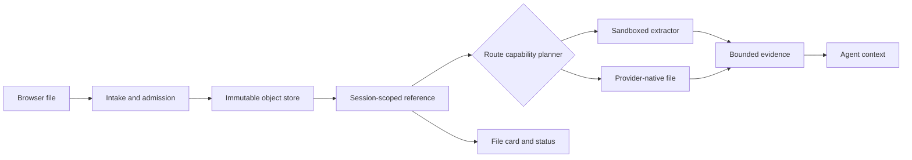

# Design general files and provider-native PDF/video passthrough

DeepSeek Harness `0.1.1-rc.2` accepts pasted and dropped raster images in Web, but it does not provide a first-party path for PDF, video, DOCX, XLSX, TXT, ZIP, or arbitrary binary files. This is not a missing MIME entry. The current contract is image-specific from the browser draft through durable storage and Session-authorized retrieval.

Use this guide to separate three promises that a file button is often assumed to make:

1. **transport**: the browser can send bytes to the Host;
2. **durability and authorization**: the Host can retain and retrieve those bytes for the owning Session;
3. **Agent usability**: an explicit parser, tool, or compatible provider route can turn the file into bounded, model-visible evidence.

An implementation is incomplete until it defines all three. Provider-native PDF or video input changes the third promise; it does not remove the first two.

> [!IMPORTANT]
> This is an architecture and acceptance guide, not a claim that rc.2 already supports general files. The source paths below are pinned to `b150a55`. Do not make non-images enter the current image pipeline by widening `imageLimits.mediaTypes`.

## What rc.2 actually does

The Web composer collects every clipboard item whose kind is `file`, then calls `intakeImages(files)`. That function compares each browser-declared type with the projected image media types. The conversation service creates only draft objects whose `kind` is `image`, serializes them as base64 image inputs, and releases their object URLs after successful admission.

The Host contract is equally specific:

| Boundary | rc.2 vocabulary | Why a general file does not fit |
|---|---|---|
| Composer | `createDraftImages`, `addImages`, image labels and limits | no file draft kind or file card |
| Wire admission | encoded image attachment | no general file request schema |
| Store | `SaveImageAttachment`, `ImageAttachmentRef` | decodes raster bytes and records dimensions |
| Durable message | image content block | no generic file content block |
| Retrieval | `session.attachment` returns an image reference and bytes | authorization is useful, response vocabulary is image-specific |
| Model route | image request policy and provider image encoding | a PDF or spreadsheet requires parsing or a provider-native file contract |

The local store verifies declared raster media type against decoded bytes, normalizes dimensions, enforces pixel and byte bounds, and produces a content-addressed image reference. Relabeling a PDF as an image should fail, and weakening that check would remove an integrity boundary.

## Turn the composer request into three product contracts

[Request #4766](https://github.com/deepseek-ai/deepseek-harness/discussions/4766) proposes the most useful initial user experience: pick or drop a PDF, keep a document card in the draft and history, and let an Agent read it with an appropriate tool. That experience still needs three separately testable contracts.

| User action | Product promise | Required proof |
|---|---|---|
| choose, paste, or drop | the surface admits a declared file type and shows per-file validation | keyboard and pointer parity, truthful MIME/size error, no silent drop |
| send and reconnect | the Host commits an immutable object and the Session replays a durable card | object digest, atomic message commit, authorized retrieval after reconnect |
| ask the Agent to read it | one explicit consumer produces bounded evidence | selected tool or provider route, provenance, coordinates, limits, warning state |

Do not make the picker imply the third promise. A PDF card may be durably present while extraction is pending, unavailable, refused by policy, or unsupported on the selected route. Give the card an explicit state such as `stored`, `processing`, `ready`, `limited`, or `failed`, and let the Agent report that state instead of guessing from the filename.

The smallest safe UI extension is additive: keep the current image draft and renderer unchanged; introduce a neutral file draft and document card; send it through a new Host admission schema; and publish the message only after every selected object has committed. Picker `accept` filters are convenience hints, not security controls. The Host still owns byte validation, quotas, quarantine, and authorization.

### Do not put a Host disk path in the message

A durable attachment reference should resolve through a Session-authorized Host operation. It should not expose the backing-store path to the model or convert a browser filename into a filesystem capability. This matters even on a local installation: storage layout can change, exported Sessions need stable identities, and a model-visible absolute path grants more ambient information than the attachment contract requires.

If a deployment deliberately offers “copy into workspace,” model that as a separate, approved materialization operation:

```text
attachment id + target workspace + relative destination + overwrite policy
  -> authorize
  -> write atomically inside the workspace
  -> return a relative tool-visible path and the source digest
```

The resulting workspace file is a derivative. It does not replace the attachment identity, and its later modification must not rewrite history about the bytes the user originally attached.

## Model the complete path



Keep the raw object, extracted evidence, and model request separate. The raw object is durable input. Extraction is a versioned computation. Model context is a bounded projection, not the whole file by default.

## Define a media-neutral reference

A future general-file reference should remain opaque and serializable. This illustrative shape is not an rc.2 API:

```ts
interface FileAttachmentRef {
  attachmentId: string
  mediaType: string
  bytes: number
  name?: string
  sha256: string
}
```

Do not store an absolute browser path, a filesystem path, a public URL, or a bearer token in the durable message. Treat `name` as display text only. Derive the object identity from verified bytes or another collision-resistant server-owned identifier.

Metadata supplied by the browser is untrusted. The Host must:

- enforce per-file, per-message, Session, tenant, and storage quotas;
- detect or validate media type from bytes where a reliable detector exists;
- normalize the display name and discard directory information;
- scan or quarantine according to deployment policy;
- commit a complete object before publishing its durable reference;
- avoid extracting archives during upload;
- make deletion and retention ownership explicit.

## Give authorization a real owner

The existing `session.attachment` route demonstrates the right retrieval principle: the requested object is served only when the Session's durable events reference that attachment id. A general-file route should preserve that join and add deployment identity where applicable.

Authorize retrieval against:

```text
principal + tenant + connection + Session + attachment id + operation
```

Do not authorize by attachment id alone, original filename, UI visibility, or possession of a local path. A content hash can deduplicate storage without becoming a cross-tenant read capability.

For remote Web deployments, never translate a browser-selected filename into a Host filesystem path. The browser and Host may be on different machines, and a path string is neither transport nor authorization.

## Make Agent usability explicit

“The file uploaded” does not mean “the model can read it.” Choose one or more explicit consumers:

| Consumer | Appropriate use | Required boundary |
|---|---|---|
| Workspace tool | operator deliberately places a file inside an authorized workspace | filesystem policy, path containment, tool approval |
| Extractor plugin | PDF text, office cells, archive inventory, metadata | sandbox, time/memory/output bounds, parser provenance |
| Provider-native Files API | a selected model route supports an official file contract | route capability, remote retention, provider file lifecycle |
| Human-only card | file must remain visible/downloadable but not enter context | Session authorization and safe download behavior |

Do not silently choose a parser from the filename. Record the detected type, extractor name and version, limits, warnings, and output digest. The Agent should be able to distinguish complete extraction from truncation, password protection, unsupported content, corruption, or malware quarantine.

## Treat passthrough as a route-owned derivative

Provider-native input is not a reason to make a provider file id the durable attachment. Keep one local, immutable attachment as the source of truth. A provider upload is a revocable derivative owned by one exact route and account.

```ts
interface ProviderFileBinding {
  attachmentId: string
  provider: string
  endpointIdentity: string
  modelRoute: string
  apiVersion: string
  remoteFileId: string
  uploadSha256: string
  state: 'uploading' | 'processing' | 'ready' | 'failed' | 'expired' | 'deleted'
  expiresAt?: string
}
```

Never cache a naked remote file id globally. Bind reuse to the local attachment, provider account or endpoint, exact model route, API version, uploaded-byte digest, processing state, and expiry. A file uploaded through one tenant credential must not become readable through another.

The upload lifecycle needs its own durable state machine:

```text
local admission → policy/egress approval → upload → provider processing
               → ready binding → model request → retention/delete
```

Make upload idempotent by the binding key. Recover a pending upload after reconnect without publishing two remote copies. Verify size and digest before marking it ready. Record provider deletion success or expiry instead of assuming cleanup occurred.

## Negotiate capabilities at the exact route

Do not infer support from a provider logo or a model family name. The selected endpoint, account, API, model route, and request mode jointly own the capability. A versioned capability record should declare:

| Capability | Questions the planner must answer |
|---|---|
| Media | Which MIME types, containers, codecs, encrypted PDFs, and audio tracks are accepted? |
| Transfer | Inline bytes, signed URL, provider upload id, or another file reference? |
| Limits | Maximum bytes, pages, duration, resolution, frame rate, files, and context cost? |
| Semantics | PDF text plus rendered pages, OCR, video frames, audio, subtitles, timestamps? |
| Lifecycle | Processing states, reuse window, expiry, deletion, residency, and retention? |
| Output | Page or timestamp citations, token accounting, truncation, and safety signals? |

Current provider documentation demonstrates why the planner cannot use one global Boolean. OpenAI Responses accepts an `input_file` by uploaded file id, URL, or inline file data, while its file-input guide specifically documents PDF handling. Gemini documents PDF inline and Files API paths, and a separate video path whose upload can remain in a processing state before becoming active. Those are provider examples, not an rc.2 contract and not evidence that every model behind either API accepts every file type.

Choose one explicit route:

1. **Passthrough** when the exact route declares the media type, transfer form, and limits.
2. **Extraction** when a bounded local parser or tool is the supported consumer.
3. **Hybrid** when the model needs native visual/audio semantics and the Agent also needs stable citations or searchable text.
4. **Human-only** when the file may be retained but no safe consumer exists.
5. **Fail closed** with an actionable unsupported-format result when none applies.

The durable Session event should record the chosen route and policy revision. Replay may reuse a still-valid binding, but it must re-plan after model, endpoint, account, API version, or capability changes.

## Define PDF truth boundaries

A PDF is both a container and a rendered document. A native provider may combine embedded text with page images; a local extractor may expose only one of them. Record which semantics were used.

- reject or explicitly route encrypted and password-protected documents;
- bound bytes, pages, render pixels, embedded objects, forms, scripts, and decompression;
- distinguish native text, OCR text, page rendering, and attachment extraction;
- preserve page coordinates and state whether citations cover text, images, or both;
- quarantine active content and never execute document JavaScript or macros;
- treat instructions inside the document as untrusted data, not Agent authority;
- disclose omitted pages, failed OCR, rotation correction, and truncation.

## Define video truth boundaries

A video MIME type does not prove that its container, video codec, audio codec, duration, or tracks are accepted. Probe metadata in a bounded media worker before provider egress.

- bound bytes, duration, dimensions, frame count, frame rate, audio duration, and subtitle size;
- normalize or reject variable frame rate, rotation, unsupported codecs, and malformed timelines explicitly;
- record whether the route used visual frames, audio, subtitles, or a derived transcript;
- preserve timestamp coordinates in derived evidence;
- treat instructions in frames, speech, metadata, and subtitles as untrusted content;
- never say the model “watched the whole video” when the provider sampled frames.

For example, Gemini's current video guide says the service processes visual and audio streams, documents upload-and-processing states, and describes a default one-frame-per-second visual sampling path. That sampling detail is a truthfulness boundary: fast events may be absent from the evidence even when the request succeeds.

## Secure remote egress

Uploading to a model provider creates a second data location. Require the same policy quality as any other external tool call:

- authorize provider egress by tenant, data class, destination, and route;
- enforce data residency, DLP, malware, retention, and deletion policy before upload;
- never turn a private attachment into a public URL;
- allow only validated destinations for provider URL-fetch modes and defend against SSRF;
- use short-lived signed URLs whose expiry and audience match the request;
- keep provider credentials and remote ids out of model-visible text and exported transcripts;
- make cancellation settle the local request and the remote-object disposition independently.

## Use a bounded extraction result

A parser result should be a derived artifact with an explicit status:

```json
{
  "attachmentId": "sha256:…",
  "extractor": "pdf-text@2",
  "status": "truncated",
  "pagesProcessed": 40,
  "pagesTotal": 212,
  "characters": 120000,
  "warnings": ["output limit reached"],
  "artifactId": "sha256:…"
}
```

The model receives bounded text, structured rows, or a tool result referencing the derived artifact. It should not receive unbounded base64, raw archive members, executable macros, or the claim that the entire document was read when only a prefix was extracted.

For spreadsheets, preserve sheet names, cell coordinates, formulas versus displayed values, hidden-sheet policy, and truncation. For documents and PDFs, preserve page or section coordinates. Citability is part of the Agent contract.

## Safe workaround on rc.2

When the user and Harness share the same trusted machine, place a copy of the file inside the selected workspace through the operating system, then ask the Agent to inspect that explicit relative path with an authorized tool or installed parser. Verify the copy and keep the original outside the Agent's write scope when provenance matters.

This workaround does not apply to a remote browser whose Host runs elsewhere. It also does not make an unsupported format readable. Confirm that the selected tool can parse the format, and start with read-only access.

Avoid these shortcuts:

- widening the image MIME allowlist;
- embedding a large file as base64 in prompt text;
- exposing a local unauthenticated upload server;
- copying uploads into the workspace before admission succeeds;
- automatically unpacking ZIP files;
- giving a parser unrestricted network or filesystem access;
- treating a community plugin's installability as a security review.

## Failure router

| Symptom | Owning boundary | First evidence |
|---|---|---|
| paste shows unsupported image format | composer intake | browser file type and `imageLimits` projection |
| file card appears but send fails | Host admission | request schema, byte and quota error |
| send succeeds but Agent cannot use content | extraction or route capability | durable ref, selected consumer, extraction status |
| another Session can fetch the object | authorization | retrieval principal and durable-reference join |
| large document freezes the Host | parser isolation | CPU, memory, wall time, output and child-process telemetry |
| ZIP expands beyond quota | archive policy | member count, expanded bytes, depth and compression ratio |
| file disappears after reconnect | durability | commit result and Session event reference |
| model cites content not extracted | context projection | artifact digest, coordinates and truncation marker |
| PDF succeeds on one model but fails after route change | capability negotiation | endpoint, account, API, model route and policy revision |
| provider says file is still processing | remote lifecycle | binding state, upload digest, provider status and retry owner |
| video summary misses a brief event | media semantics | sampling policy, frame rate, audio and subtitle usage |
| deleted Session leaves a provider copy | retention | remote binding ledger and deletion/expiry evidence |

## Acceptance gate

- [ ] Pasting, dropping, and picking a supported file use one admission contract.
- [ ] Unsupported files receive an accessible, specific error instead of silent refusal.
- [ ] Image intake and rendering continue unchanged.
- [ ] The Host verifies bytes, name, size, quota, and policy before publishing a reference.
- [ ] A failed multi-file admission publishes no partial message.
- [ ] The durable event contains an opaque reference, never a client or Host path.
- [ ] Attachment retrieval requires the exact authorized Session reference.
- [ ] Cross-Session and cross-tenant identifier guesses are denied.
- [ ] Parser work has wall-time, memory, child-process, archive, and output bounds.
- [ ] Extraction provenance, coordinates, warnings, and truncation survive replay.
- [ ] Reconnect restores file cards and extraction state without re-uploading bytes.
- [ ] Cancellation leaves an explicit object and extraction disposition.
- [ ] Retention and deletion cover raw objects and derived artifacts.
- [ ] Model context never implies that unread or truncated content was processed.
- [ ] Mobile, keyboard, screen-reader, and drag/drop flows expose equivalent status.
- [ ] Capability negotiation is scoped to endpoint, account, API version, model route, and request mode.
- [ ] A provider upload is a derivative binding, never the durable attachment identity.
- [ ] Remote bindings include uploaded-byte digest, processing state, expiry, and deletion disposition.
- [ ] Reconnect and retry cannot create duplicate remote uploads for one binding key.
- [ ] Route changes invalidate or re-plan provider bindings safely.
- [ ] PDF tests cover native text, scans, page images, encryption, rotation, truncation, and active content.
- [ ] PDF evidence states whether page citations cover extracted text, rendered images, or both.
- [ ] Video tests cover container/codec mismatch, audio, subtitles, variable frame rate, rotation, and long duration.
- [ ] Video evidence records sampling and never implies unseen frames were processed.
- [ ] Provider URL ingestion resists SSRF and never requires a public attachment URL.
- [ ] Egress approval, residency, retention, and deletion apply to every provider copy.
- [ ] Provider-side failures preserve the local attachment and produce an actionable fallback or refusal.

## Minimal design record

```text
Accepted media types and detection method:
Per-file / message / Session / tenant quotas:
Object identity and storage owner:
Durable reference schema:
Retrieval authorization join:
Extractor selection and sandbox:
Extraction limits and provenance:
Model-visible projection:
Remote-provider copy and retention, if any:
Provider capability key and policy revision:
PDF text/render/OCR semantics:
Video frame/audio/subtitle sampling semantics:
Reconnect, cancellation, deletion, and export behavior:
```

## Primary sources

- [General-file attachment request #4700](https://github.com/deepseek-ai/deepseek-harness/discussions/4700)
- [PDF/video passthrough request #4725](https://github.com/deepseek-ai/deepseek-harness/discussions/4725)
- [Composer non-image attachment request #4766](https://github.com/deepseek-ai/deepseek-harness/discussions/4766)
- [rc.2 Web composer intake](https://github.com/deepseek-ai/deepseek-harness/blob/b150a551b8d465e31e418e1b2eaf5e79bbb7d28e/packages/client/ui-conversation/src/client/skeleton/InputBar.tsx)
- [rc.2 conversation draft and send service](https://github.com/deepseek-ai/deepseek-harness/blob/b150a551b8d465e31e418e1b2eaf5e79bbb7d28e/packages/client/ui-conversation/src/client/service.ts)
- [rc.2 attachment vocabulary](https://github.com/deepseek-ai/deepseek-harness/blob/b150a551b8d465e31e418e1b2eaf5e79bbb7d28e/packages/attachment/attachment/src/types.ts)
- [rc.2 attachment store contract](https://github.com/deepseek-ai/deepseek-harness/blob/b150a551b8d465e31e418e1b2eaf5e79bbb7d28e/packages/attachment/attachment/src/index.ts)
- [rc.2 local image validation and storage](https://github.com/deepseek-ai/deepseek-harness/blob/b150a551b8d465e31e418e1b2eaf5e79bbb7d28e/packages/attachment/attachment-local/src/store.ts)
- [rc.2 Session-authorized retrieval](https://github.com/deepseek-ai/deepseek-harness/blob/b150a551b8d465e31e418e1b2eaf5e79bbb7d28e/packages/host/apiproxy/src/api-proxy.ts)
- [OpenAI API file inputs](https://developers.openai.com/api/docs/guides/file-inputs)
- [Gemini document understanding](https://ai.google.dev/gemini-api/docs/document-processing)
- [Gemini video understanding](https://ai.google.dev/gemini-api/docs/video-understanding)
