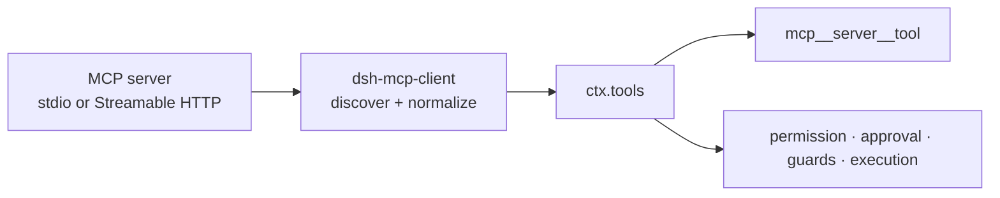

# Connect MCP servers to DeepSeek Harness

The official MCP client plugin connects DeepSeek Harness to external Model Context Protocol servers and registers discovered server tools on `ctx.tools`. The model sees them as native tools under deterministic server-qualified names.



## Add one server per plugin row

For a local stdio server:

```yaml
- id: mcp-github
  name: '@deepseek-ai/dsh-mcp-client'
  config:
    serverName: github
    transport: stdio
    command: npx
    args: ['-y', '@modelcontextprotocol/server-github']
    env:
      GITHUB_TOKEN: !!js process.env.GITHUB_TOKEN
```

For Streamable HTTP:

```yaml
- id: mcp-web
  name: '@deepseek-ai/dsh-mcp-client'
  config:
    serverName: web
    transport: streamable-http
    url: http://localhost:3000/mcp
    headers:
      Authorization: !!js '`Bearer ${process.env.MCP_TOKEN}`'
```

Never paste a real token into the composition. Resolve credentials from the environment or another secret provider.

## Tool names

A raw server tool named `search` under `serverName: web` becomes `mcp__web__search`. Server qualification lets two servers expose the same raw name without collision. Names are normalized to the Harness function-name contract; changed or truncated names gain a deterministic hash so distinct tools do not collapse.

`serverName` must be unique across live instances. Changing it changes model-visible tool names and therefore affects saved history, prompts, and KV-cache prefix stability.

## Startup and reconnect behavior

On activation, the plugin connects, calls `listTools()`, and registers the returned generation before the first turn. With the current package defaults:

- `failOnStartupError` is `false`, so a failed initial connection can leave the profile active with no tools;
- per-tool call timeout defaults to 60 seconds;
- automatic reconnect is enabled;
- reconnect begins at 500 ms, doubles to a 30-second ceiling, and allows 10 consecutive attempts;
- the last good tool generation remains registered during an outage, but calls fail until recovery;
- an exhausted reconnect budget unregisters the server's tools.

These defaults are version-sensitive. Inspect the package README at the revision you deploy.

## Security model

MCP makes external capabilities discoverable; it does not make them trustworthy. Discovered calls still enter the normal Harness tool pipeline, where policy, approval, guards, and sandbox-related hooks can act.

Review four independent surfaces:

1. the command or URL used to reach the server;
2. credentials and ambient environment passed to it;
3. schemas and descriptions exposed to the model;
4. real effects performed when a tool is called.

For stdio, explicitly pass only required secrets. For HTTP, use TLS for non-local endpoints and scope bearer tokens to the smallest capability set.

## Verify the connection

1. Start the profile and wait for discovery to settle.
2. Confirm expected `mcp__<server>__<tool>` names appear.
3. Ask the Agent to perform a harmless read-only operation.
4. Confirm a durable `tool/call` and `tool/result` pair.
5. Stop the server once and observe the configured reconnect behavior.
6. Dispose the plugin and confirm its tools disappear.

## Current limitations

The official bridge currently exposes MCP **tools**. MCP resources and prompts do not yet have Harness consumers. Native model rendering of non-text MCP content is lossy: canonical execution data retains JSON blocks, while model context uses placeholders for image, audio, resource, and unsupported blocks.

## Official sources

- [MCP package index](https://github.com/deepseek-ai/deepseek-harness/blob/master/packages/mcp/README.md)
- [MCP client plugin](https://github.com/deepseek-ai/deepseek-harness/blob/master/packages/mcp/mcp-client/README.md)
- [Third-party memory MCP examples](https://github.com/deepseek-ai/deepseek-harness/blob/master/examples/mcp-memory/README.md)
- [Tool execution pipeline](../architecture/tool-execution-pipeline.md)
