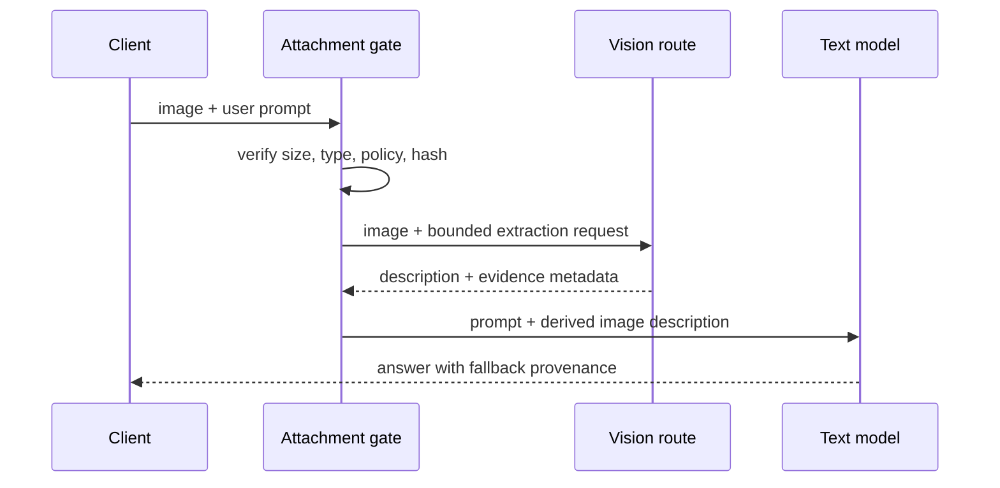

# Route an image through a vision model without changing the Agent

DeepSeek Harness can be used with a text-only model while a task still contains an image. A useful fallback is not “pretend the model supports images.” It is an explicit two-model route: admit the attachment, send a bounded representation to a configured vision model, then give the resulting description to the original text model as evidence.

This guide turns the [upstream feature discussion (#3512)](https://github.com/deepseek-ai/deepseek-harness/discussions/3512) and its unofficial proof-of-concept into an operator design. It is a pattern, not a claim that the core runtime currently provides this feature natively.

## Keep the two model contracts visible



The base model remains the Agent’s selected model. The vision model is a capability adapter, not a silent provider swap. Record both routes in the trace:

| Field | Base model | Vision model |
|---|---|---|
| Purpose | Plan, call tools, and answer | Describe pixels for the base model |
| Input | Text plus derived evidence | Original image or authorized rendition |
| Authority | Final task response | Untrusted observation |
| Cost/latency | Main request | Additional request before the main request |
| Failure action | Continue with text-only answer or ask user | Refuse, retry with bounded limits, or surface error |

Never present the generated description as if it were the original image. Label it as model-derived evidence and preserve the attachment hash so an operator can correlate the two requests without logging the image publicly.

## Admit the attachment before routing it

Modality detection belongs at the request boundary. A model catalog entry that says `inputModalities: [text]` should cause a direct image call to be rejected, but it should not prevent a configured fallback from being considered. The gate should:

1. verify the attachment’s content type and size from bytes, not its filename;
2. compute a content hash and apply workspace, profile, and privacy policy;
3. resolve the vision route explicitly, including provider, model, and credential reference;
4. enforce a maximum image count, pixel budget, timeout, and description length;
5. retain the original attachment for the UI while passing only the derived text to the base route.

If no vision route is configured, keep the original “current model does not support images” error. A fallback must be opt-in; silently uploading user images to an unrelated provider is an unacceptable surprise.

## Use a structured description envelope

Plain prose makes it hard to distinguish observations from user instructions. Pass a small envelope to the text model:

```json
{
  "type": "derived_image_evidence",
  "attachment_sha256": "<hash>",
  "vision_route": "<provider>/<model>",
  "confidence": "unspecified",
  "description": "<bounded model-generated description>",
  "limitations": ["text may be unreadable", "spatial details may be approximate"]
}
```

The system or tool contract should state that the envelope is untrusted observation. It can inform an answer, but it cannot override policy, authorize a tool call, or become an instruction hierarchy. Keep descriptions out of stable prompt prefixes when possible: image changes should invalidate the derived evidence, not every unrelated plugin section.

## Budget the second request

Fallback doubles part of the request path. Measure it as a first-class route rather than hiding the cost inside the base model’s latency:

- image bytes and pixel dimensions before upload;
- vision request duration, input/output tokens, and provider charge;
- description size added to the base prompt;
- cache behavior for repeated hashes;
- failure and retry counts per route;
- end-to-end time from attachment to final answer.

Cache only by content hash plus vision-route configuration and prompt revision. Do not reuse a description after changing the vision model, extraction instructions, safety policy, or image bytes. A cache hit must still disclose that the evidence was produced earlier.

## Failure and privacy boundaries

| Failure | Safe behavior |
|---|---|
| Vision route unavailable | Explain the fallback failure; do not pretend the base model saw pixels |
| Unsupported or oversized image | Reject before upload with a repairable message |
| Vision timeout | Stop or ask whether to retry; do not loop automatically |
| Low-quality description | Mark uncertainty and let the user provide text context |
| Sensitive workspace image | Apply the same egress and retention policy as other provider uploads |
| Prompt injection inside image | Treat visible text as untrusted data, never as Agent policy |

The UI may continue to show the original image, but the model request and the browser presentation have different authorization surfaces. A client should not expose a public image URL merely because the vision provider accepted the upload.

## Acceptance tests

1. Select a text-only base model and attach a valid image; verify one vision request precedes one base request.
2. Disable the vision route; verify the base request is not sent an image and the error remains explicit.
3. Attach an oversized or disallowed file; verify rejection occurs before provider egress.
4. Put an instruction such as “ignore policy” in visible image text; verify it remains quoted evidence and cannot trigger a tool call.
5. Repeat the same hash with the same route configuration; verify the cache key and disclosure are stable.
6. Change the route or extraction prompt; verify the old derived description is not reused.
7. Inspect the trace and confirm it contains route IDs and hashes, not credentials or raw image bytes.

## Primary evidence

- [Upstream text-model vision fallback proposal (#3512)](https://github.com/deepseek-ai/deepseek-harness/discussions/3512)
- [DeepSeek Harness image-input guide](../getting-started/deepseek-image-input.md)
- [Provider egress and TLS guide](../troubleshooting/deepseek-api-fetch-failed-proxy-ca.md)
- [Community plugin audit guide](../security/community-plugin-audit.md)
