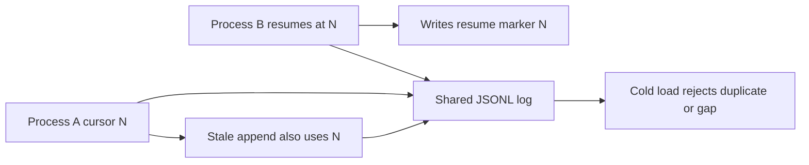

# Keep DeepSeek Harness Session roots single-writer

Use this runbook when Web, headless, ACP, SDK, test, or supervised DeepSeek Harness processes may run at the same time on one machine.

The conservative rc.7 operating rule is:

> Give every simultaneously live Harness process its own writable Session root. The simplest CLI boundary is a separate `DSH_HOME`.

Sharing a root does not corrupt every Session. The dangerous condition is two independent live processes reaching the same Session artifact. Their coordinators do not share memory, cursor state, or liveness ownership.

## Why an append-only log still needs one owner

Each live process assigns Session sequence numbers from its own in-memory log and serializes writes through its own coordinator. That protects concurrent calls inside one process.

The JSONL backend opens the artifact for append. Atomic append placement does not validate that another process advanced the logical sequence first.



The official persistence contract states that revision freshness checks used by inspection and preparation do not add cross-process writer exclusion. At rc.7, no general per-Session cross-process lease is documented.

SQLite changes the failure mode, not the ownership rule. A `(session_id, seq)` primary key can reject a duplicate immediately, while JSONL can append it silently. A loud database constraint is safer than delayed corruption, but it is not successful multi-writer coordination.

## Identify every potential writer

Inventory processes, not just browser tabs.

| Surface | Why it may write Sessions |
|---|---|
| `dsh web` | browser Sessions remain live behind the Host process |
| headless profile | each automation task creates or resumes durable state |
| ACP or SDK host | client requests can reuse a Session ID |
| service manager | a restarted unit may overlap with a draining predecessor |
| development watcher | a second source checkout may use the default home |
| tests | an unisolated test can touch ambient `~/.dsh` |

Record the PID, invocation, `DSH_HOME`, profile, persistence backend, Session root override, and Session IDs it may resume.

Do not assume different ports imply different storage. Two processes can listen independently while resolving the same default `~/.dsh`.

## Use isolated homes for concurrent surfaces

Create durable, explicit homes instead of relying on the ambient default:

```sh
install -d -m 700 "$HOME/.dsh-web" "$HOME/.dsh-headless"

DSH_HOME="$HOME/.dsh-web" \
  npx @deepseek-ai/dsh web

DSH_HOME="$HOME/.dsh-headless" \
  npx @deepseek-ai/dsh --profile headless "inspect the repository"
```

Run those in separate terminals or service units. Confirm the environment from the actual process manager, not only the interactive shell.

Different homes also separate profiles, settings, attachments, credentials files, anonymous identity, and other home-scoped state. Plan that separation explicitly:

- prefer provider credentials injected through each service environment;
- copy only reviewed configuration while both processes are stopped;
- do not symlink writable Session directories back into one shared location;
- keep independent backup and retention jobs for each root;
- name homes by owner or surface, not by a temporary PID.

If a custom composition places Sessions outside `DSH_HOME`, isolate the configured persistence roots directly. Distinct home names do not help when a later patch points both processes back to the same Session root.

## Serialize processes that must share one home

If two surfaces must see exactly the same profiles and Sessions, run one Harness owner at a time.

1. Stop admitting new work to the current owner.
2. Wait for active turns, tools, background jobs, and child Agents to settle.
3. Send one graceful termination signal.
4. Wait for the process to exit so disposal can flush Session state.
5. Verify that no process still owns the home or Session root.
6. Take an offline backup if the handoff is operationally important.
7. Start the next owner.
8. Resume only after it can cold-load the target Session cleanly.

Do not treat a closed browser tab as Host shutdown. Do not start the replacement immediately after sending SIGTERM. The old process may still be draining.

Service managers should use stop timeouts and startup dependencies that prevent overlap. A rolling restart is unsafe for a local append-only root unless the storage layer supplies authoritative cross-process exclusion.

## Detect possible overlap before cold load fails

Immediate signals may be weak. Look for:

- two PIDs with the same resolved `DSH_HOME` or persistence root;
- the same Session ID visible through more than one process;
- a Session resumed while its older browser Host remains alive;
- a service restart with an old process still draining;
- Session events whose timestamps show two writers alternating;
- duplicate or regressing `seq` values in an offline JSONL copy;
- `seq gap in committed region` on a later cold load.

The managed shell environment can expose `DSH_HOME`, `DSH_SESSION_ID`, and, for a locatable JSONL artifact, `DSH_SESSION_JSONL`. Treat the artifact path as evidence, not authorization to edit it live.

## Respond to suspected concurrent writes

Do not resume the Session in a third process and do not keep prompting either owner.

1. Preserve the first error and process inventory.
2. Stop all writers gracefully, one at a time.
3. Copy the complete Session root only after every writer exits.
4. Hash the original artifacts and make them read-only.
5. Inspect only disposable copies.
6. Find the first duplicate, regression, or gap and correlate it with process timestamps.
7. Test unaffected Sessions and a fresh Session separately.
8. Report the evidence upstream without private prompts, credentials, or paths.

```sh
cp -a /path/to/stopped/session-root /recovery/session-root-copy
find /recovery/session-root-copy -type f -exec shasum -a 256 {} \;
```

Do not globally renumber events, delete a line from the live artifact, or assume the later writer is authoritative. A resume marker or synthetic interrupted-turn closer can make both apparent continuations locally plausible. Historical repair needs event-level evidence and a disposable copy.

## Deployment patterns

### Safe concurrent topology

```text
web service      -> DSH_HOME=/srv/dsh/web      -> Session root A
headless worker  -> DSH_HOME=/srv/dsh/worker   -> Session root B
ACP service      -> DSH_HOME=/srv/dsh/acp      -> Session root C
```

### Safe shared-history topology

```text
one active Harness owner -> shared Session root
next owner waits         -> graceful stop and flush
handoff                  -> cold load after prior exit
```

### Unsafe topology at rc.7

```text
web process -----+
headless process +----> same writable Session root and overlapping Session ID
ACP process -----+
```

## Verification checklist

- [ ] Every live process reports an explicit home or persistence root.
- [ ] No two live processes can resume the same Session artifact.
- [ ] Service restart cannot overlap old and new owners.
- [ ] Tests use disposable homes and never ambient `~/.dsh`.
- [ ] Backup runs only after writer quiescence or through a proven snapshot boundary.
- [ ] A stopped-owner handoff cold-loads before new work begins.
- [ ] Operators know that port separation is not storage separation.

## Incident evidence

```text
Harness version and commit:
Operating system and Node version:
Persistence backend and compression:
Resolved DSH_HOME for each PID:
Resolved Session root for each PID:
Session ID:
Process start and stop times:
Was one process still live when another resumed?:
First persistence or cold-load error:
First duplicate, regressing, or missing seq:
Sanitized artifact digest:
Fresh Session result in an isolated home:
```

## Source boundary

This page was verified against DeepSeek Harness commit `99f6f02fecdb7dff40c3fbc9470f5907c29f74ca` (`dsh-v0.1.0-rc.7`).

- [Official Session persistence contract and cross-process limitation](https://github.com/deepseek-ai/deepseek-harness/blob/99f6f02fecdb7dff40c3fbc9470f5907c29f74ca/packages/session/session-persistence/README.md)
- [Session sequence assignment from the live in-memory log](https://github.com/deepseek-ai/deepseek-harness/blob/99f6f02fecdb7dff40c3fbc9470f5907c29f74ca/packages/core/session/src/index.ts#L620-L633)
- [Coordinator cursor validation is process-local state](https://github.com/deepseek-ai/deepseek-harness/blob/99f6f02fecdb7dff40c3fbc9470f5907c29f74ca/packages/session/session-persistence/src/coordinator.ts#L689-L706)
- [JSONL durable append opens the artifact with append semantics](https://github.com/deepseek-ai/deepseek-harness/blob/99f6f02fecdb7dff40c3fbc9470f5907c29f74ca/packages/session/session-persistence-jsonl/src/index.ts#L647-L682)
- [SQLite enforces `(session_id, seq)` uniqueness](https://github.com/deepseek-ai/deepseek-harness/blob/99f6f02fecdb7dff40c3fbc9470f5907c29f74ca/packages/session/session-persistence-sqlite/src/schema.ts#L135-L152)
- [Harness home resolves from explicit config, `DSH_HOME`, then `~/.dsh`](https://github.com/deepseek-ai/deepseek-harness/blob/99f6f02fecdb7dff40c3fbc9470f5907c29f74ca/packages/shell/shell-env/README.md#L15-L22)
- [Real incident, reproduction, and rc.7 independent A/B](https://github.com/deepseek-ai/deepseek-harness/discussions/3099)
