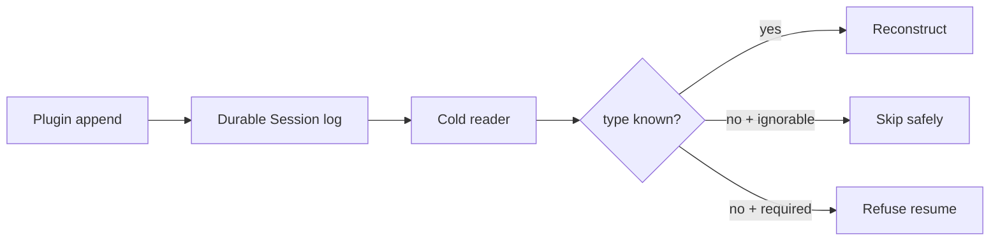

# Persist custom plugin events without breaking Session resume

At upstream commit `99f6f02`, an out-of-tree plugin can extend the TypeScript `SessionEventMap` and append its own event type, but that does not make the type known to a future Harness reader. The next cold load can refuse the complete Session:

```text
session "…" contains event type "plugin/example" (seq N) unknown to this
harness and not marked ignorable; refusing to interpret the log
```

Until the public writer API can persist the `ignorable` envelope for downstream event types, keep plugin-only audit and telemetry records outside the core durable Session log.

> [!CAUTION]
> Do not patch a live Session log, cast around the append API, or hand-edit the generated known-type catalog. The strict read refusal protects reconstruction integrity: an unknown required event may change the meaning of every event after it.

## Three contracts must agree

| Contract | Verified behavior | Plugin implication |
|---|---|---|
| Compile-time event map | declaration merging can type a downstream event | local type safety does not update another build’s reader |
| Durable envelope | `ignorable?: true` exists on stored events | only the writer can truthfully declare that loss is safe |
| Reader vocabulary | generated `KNOWN_SESSION_EVENT_TYPES` contains in-repository events | downstream types are unknown by construction |

The reader already skips an unknown event when its stored envelope carries `ignorable: true`. At the verified revision, `Session.append()` exposes surface options only for the built-in surface event types and exposes no options tuple for other event types. The read-side escape hatch exists; the public downstream write path does not yet expose it.



## Choose storage by semantics

### Put reconstruction events in the core Session only when the runtime owns the type

An event is reconstruction-critical if removing it changes messages, tool identity, policy, workspace, model route, or any state required to interpret later records. Such an event must never be marked ignorable.

For an out-of-tree plugin, use one of these patterns:

- represent the state through an existing official event or tool result when the semantics genuinely match;
- store plugin state in a plugin-owned, versioned backend keyed by Session ID;
- wait for an official registered/required-event compatibility contract before making the core Session depend on a custom type.

### Keep telemetry and audit in a plugin-owned store today

Purely informational observations belong in a separate append-only store until the official writer exposes a durable `ignorable` option.

Store at least:

```text
plugin id and version
session id
plugin event schema version
timestamp
correlation to tool call/result when available
lossless JSON payload
retention and deletion policy
```

The plugin store must not be required to reconstruct the Harness Session if the record is described as informational.

## Pre-release compatibility gate

Before shipping a plugin that writes durable events:

1. Start a clean Harness process with the supported release.
2. Create a disposable Session and exercise the plugin once.
3. Stop the process cleanly; do not reuse its in-memory Session object.
4. Start another clean process with the plugin installed and resume the Session.
5. Repeat with the plugin disabled or absent.
6. Upgrade to the next supported Harness version and repeat the cold-load test.

Expected outcomes:

- plugin-owned telemetry never affects Session resume;
- a required plugin event refuses clearly when its interpreter is absent;
- an officially supported ignorable event may be skipped with no change to reconstructed conversation state.

Do not treat same-process continuation as a resume test. The failure appears when persistence validates the log under a new reader.

## If a Session already refuses to resume

### 1. Preserve the writer and artifact

Stop the process that owns the Session. Export through the UI if it remains available; otherwise copy the raw artifact only while the writer is stopped. Record the complete error, event type, sequence number, Harness version, and plugin version.

### 2. Restore a compatible reader before modifying data

If the plugin version or Harness build that wrote the event is trusted and available, restore that complete compatible composition in an isolated environment and export a human-readable transcript. Do not install an unreviewed fork on a credential-bearing workstation merely to load the Session.

### 3. Continue in a new Session when compatibility cannot be proven

Create a new Session and bring forward a reviewed summary plus explicit source artifacts. Keep the rejected log immutable for diagnosis. A summary continuation is data loss compared with a valid resume, but it is safer than silently deleting an event whose semantics are unknown.

## When an official `ignorable` writer ships

Adopt it only for an event where all of these are true:

- removing the event cannot change conversation reconstruction;
- later events do not depend on its payload;
- no security, approval, policy, workspace, tool, or model decision depends on it;
- the plugin behaves correctly when every such event is absent;
- a cold-load test without the plugin proves the same visible Session state.

Use an explicit version gate in the plugin manifest or release notes. Do not use an unsafe TypeScript cast to send an option that the installed runtime does not support.

## Avoid fragile workarounds

- **Do not edit `known-event-types.ts`.** It is generated, local to one build, and does not travel with the Session.
- **Do not default unknown events to skippable.** That can reconstruct a plausible but incorrect Session.
- **Do not delete the offending event from a live log.** Sequence and source references may make later records invalid.
- **Do not assume reinstalling the plugin is sufficient.** The reader’s persisted-event compatibility runs against the Harness vocabulary and envelope.
- **Do not describe required plugin state as telemetry.** Storage location must follow semantics, not convenience.

## Plugin compatibility record

```text
Plugin and version:
Harness package and source revision:
Custom event types:
Each event is: reconstruction-required / informational
Core Session writes enabled: yes/no
Plugin-owned store:
Cold resume with plugin: pass/fail
Cold resume without plugin: pass/fail
Upgrade resume: pass/fail
Official ignorable writer available: yes/no
Rollback path:
```

## Primary sources

- [Upstream plugin compatibility discussion #3191](https://github.com/deepseek-ai/deepseek-harness/discussions/3191)
- [Generated reader vocabulary at `99f6f02`](https://github.com/deepseek-ai/deepseek-harness/blob/99f6f02fecdb7dff40c3fbc9470f5907c29f74ca/packages/core/session/src/known-event-types.ts)
- [Durable `ignorable` envelope contract](https://github.com/deepseek-ai/deepseek-harness/blob/99f6f02fecdb7dff40c3fbc9470f5907c29f74ca/packages/core/session/src/types.ts)
- [`Session.append()` option surface](https://github.com/deepseek-ai/deepseek-harness/blob/99f6f02fecdb7dff40c3fbc9470f5907c29f74ca/packages/core/session/src/index.ts)
- [Strict persistence read validation](https://github.com/deepseek-ai/deepseek-harness/blob/99f6f02fecdb7dff40c3fbc9470f5907c29f74ca/packages/session/session-persistence/src/coordinator.ts)

