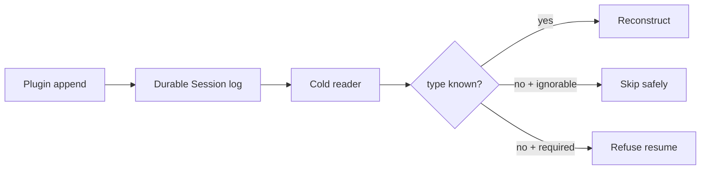

# Persist custom plugin events without breaking Session resume

At upstream rc.7 commit `99f6f02`, an out-of-tree plugin can extend the TypeScript `SessionEventMap` and append its own event type, but that does not make the type known to the persistence reader. The next cold load can refuse the complete Session—even with the same Harness version and the plugin still installed:

```text
session "…" contains event type "plugin/example" (seq N) unknown to this
harness and not marked ignorable; refusing to interpret the log
```

The historical reader could skip an unknown record carrying `ignorable: true`, although the public writer exposed no way to set it. Alpha.1 removes `ignorable` from the event envelope, reader, SQLite schema, and generated vocabulary contract. Every unknown type is now required and refused. Until a formal registration or optional-record surface ships, keep out-of-tree event types outside the core durable Session log.

## What the rc.7 incident proves

Upstream report #3416 records two otherwise healthy rc.7 Sessions containing eight `dsh-talk/speech` events. The plugin described those events as informational, but called `session.append('dsh-talk/speech', data)` because the public append signature has no `ignorable` option. Each stored envelope therefore omitted the only marker that permits an unknown reader to skip it.

Cold load failed on the same rc.7 build that wrote the events. Reinstalling or keeping the plugin enabled did not expand `KNOWN_SESSION_EVENT_TYPES`: declaration merging affects the writer's local TypeScript compilation, not the generated runtime set used by persistence validation.

This sharpens the diagnosis:

| Observation | What it proves |
|---|---|
| event sequence and framing are valid | this is not generic log corruption |
| same Harness version still refuses | version rollback alone is insufficient |
| plugin remains installed | plugin presence does not register durable reader vocabulary |
| adding `ignorable: true` to a copied artifact passes validation | the missing envelope capability is the blocking boundary |

The last row is forensic confirmation, not a general editing recipe. A format-aware repair must preserve frames, sequence, checksums, source references, and the original artifact; only the plugin author can assert that dropping the event is semantically safe.

## One incompatible artifact can block corpus search

The failure is not necessarily confined to opening the affected Session. At upstream `0.1.2-alpha.1` commit `cd5ef814`, SQLite session search reconciles persisted artifacts before every search. For each changed artifact not shadowed by a live Session, reconciliation calls the persistence service's `inspect()` method.

That creates this current control flow:

```text
session_search
  → reconcile every changed persisted artifact
    → inspect one artifact
      → reject an unknown required event
        → wrap as SESSION_QUERY_PERSISTENCE_FAILED
          → "session history storage is unavailable"
```

The per-event search extractor is already defensive: a declaration-merged event with no first-party search semantics contributes an empty string. That does **not** help when persistence refuses the artifact before document extraction begins. Interpretation remains correctly fail-closed for the incompatible Session, while the reconciliation loop currently lacks per-artifact failure isolation.

Incident #4811 observed a healthy SQLite `PRAGMA quick_check`, fewer indexed rows than persisted artifacts, and two artifacts rejected on `demo/hello`. Reversibly quarantining exactly those artifacts restored `session_search` for the remaining corpus. This is evidence for that recorded mixed-prerelease environment, not proof that every version, backend, or generic storage error has the same cause.

### Diagnose the blast radius without rewriting history

Use four joined facts before attributing the generic message:

| Evidence | Interpretation |
|---|---|
| SQLite opens and `PRAGMA quick_check` is `ok` | the index file is not generically corrupt |
| persisted artifact count exceeds indexed Session count | reconciliation is incomplete, but the cause is not yet proven |
| one artifact's read fails with `SessionFormatUnsupportedError` naming type and sequence | the artifact is intact but incompatible with this reader |
| moving only that frozen artifact out of the active root restores search | bounded containment confirms the scan participant |

Do not infer the incompatible Session from a missing index row alone. Stop the writer, identify the exact failing artifact through supported inspection or complete error evidence, record its location and SHA-256, and preserve an immutable copy before changing active discovery.

### Contain one artifact reversibly

1. Stop every process that can write the Session root.
2. Record the active artifact inventory and hashes.
3. Move only the proven incompatible Session directory to a quarantine outside the active scan root; do not delete or edit it.
4. Start the same runtime composition and rerun a bounded search.
5. Confirm the quarantined hash is unchanged and record that results exclude one Session.
6. Restore the artifact only into an isolated compatible-reader environment, never blindly into the recovered production scan.

If exact identity cannot be proven, stop. Broadly moving Sessions until the error disappears destroys attribution and can hide a second failure.

### Preserve strict reads while limiting global impact

A runtime repair should catch only `SessionFormatUnsupportedError` at the per-artifact observation boundary. It should leave the raw artifact untouched, remove or tombstone any stale rows for that identity atomically, emit an actionable warning with Session identity and location, continue indexing compatible artifacts, and return an explicit degraded/partial-result marker. Corruption, transport, cancellation, database, and identity-conflict errors must keep their existing typed failure paths.

Acceptance requires at least:

- one unknown required event degrades only its own Session;
- an unknown event is never silently interpreted or indexed;
- stale search rows for the incompatible identity cannot survive;
- every result page discloses degraded corpus coverage;
- a later compatible reader can re-admit the unchanged artifact;
- two incompatible artifacts produce two stable diagnostics without aborting compatible indexing;
- cancellation and database failures are not mislabeled as format incompatibility.

> [!CAUTION]
> Do not patch a live Session log, cast around the append API, or hand-edit the generated known-type catalog. The strict read refusal protects reconstruction integrity: an unknown required event may change the meaning of every event after it.

## Three contracts must agree

| Contract | Verified behavior | Plugin implication |
|---|---|---|
| Compile-time event map | declaration merging can type a downstream event | local type safety does not update another build’s reader |
| Durable envelope | `ignorable?: true` exists on stored events | only the writer can truthfully declare that loss is safe |
| Reader vocabulary | generated `KNOWN_SESSION_EVENT_TYPES` contains in-repository events | downstream types are unknown by construction |

At rc.7 the reader skips an unknown event when its stored envelope carries `ignorable: true`. `Session.append()` exposes a `SurfaceIntent` options tuple only for built-in surface event types and exposes no options tuple for other event types, so the read-side escape hatch never had a public downstream writer. Alpha.1 removes that escape hatch completely: its fixed envelope rejects an `ignorable` key, its reader refuses every unknown type, and SQLite replaces the old `ignorable` column with an `is_packed` storage discriminator.



## Specify a compatibility surface, not only a mutable set

Discussion #4815 consolidates twelve threads and at least nine downstream consumers into three materially different requirements. A safe extension design must not solve them with one boolean:

| Consumer shape | Missing plugin behavior | Required contract |
|---|---|---|
| optional audit or presentation record | core Session remains reconstructable but plugin UI may lose decoration | durable optionality plus explicit degraded projection |
| required plugin state transition | later records cannot be interpreted without the plugin | registered decoder/validator/migrator; absence refuses before reconstruction |
| foreign compatibility record | event belongs to another ecosystem and may need translation | versioned importer into owned semantics, not blanket recognition |

An event can be optional for model-history reconstruction while still affecting a plugin's visible conversation rows. Therefore “skippable” must name what may degrade. At minimum classify effects on model history, surface ordering, source references, policy/security, tool correlation, plugin state, search extraction, and UI projection. If any later core or plugin event depends on the record, it is required.

A registration entry needs more than a type string:

```ts
interface SessionEventRegistration {
  type: `${string}/${string}`
  owner: { package: string; version: string }
  schemaVersion: number
  semantics: 'optional-observation' | 'required-state'
  validate(data: unknown): JsonValue
  upgrade?(from: number, data: JsonValue): JsonValue
  projections: {
    modelHistory: 'none' | 'required'
    surface: 'none' | 'optional' | 'required'
    search: 'none' | 'optional' | 'required'
  }
}
```

This sketch is a design checklist, not an upstream API. The runtime also needs these lifecycle rules:

- registration completes before persistence inspection, Session listing, resume, search reconciliation, or fork;
- a type has one owner; duplicate registration fails atomically with both identities;
- registration is effect-owned and HMR-safe, but cannot disappear while a live or stored required event depends on it;
- the writer may append only while the matching registration is active and must bind the event to its schema version;
- JSONL and SQLite encode the same logical metadata and enforce the same decision;
- cold readers without an optional registration skip only the payloads whose on-disk contract says the named projections may degrade;
- required-event absence produces a typed compatibility refusal naming type, owner, schema version, Session, and recovery direction;
- uninstall and downgrade are tested against real stopped-process artifacts, not inferred from same-process behavior.

A global mutable `Set<string>` proves only name admission. It does not validate payload bytes, distinguish optional from required semantics, resolve two plugins claiming the same name, migrate versions, explain uninstallation, or keep HMR disposal from changing the meaning of an already-open Session.

### Separate write authority from read capability

Registration should grant a plugin authority to write only its namespaced type. A reader registration proves that this exact plugin version can validate and interpret the stored schema. Do not let “plugin is installed” imply either claim: a Bundle can be disabled, fail activation, load after Session discovery, or contain a different schema version under the same package name.

For optional events, persist origin, type, schema version, and the writer's explicit semantic classification in a core-owned envelope. The reader must validate the envelope without executing plugin code before deciding whether the payload can be skipped. For required events, load the registered interpreter first and fail closed if it is absent or incompatible.

### Prove the proposal with a compatibility matrix

Use immutable artifacts from each writer version:

| Reader | optional event | required event | expected result |
|---|---|---|---|
| same plugin version | present | present | exact replay |
| plugin disabled | present | absent | resume with declared degraded projections |
| plugin disabled | absent | present | typed refusal; no partial Session |
| newer compatible plugin | present | present | validated upgrade then replay |
| older plugin | newer schema | newer schema | skip only if on-disk optional contract permits; otherwise refuse |
| conflicting registration | either | either | boot/registration fails before reading or writing |

Repeat for JSONL/Zstandard and SQLite, cold resume, Session fork, export, search reconciliation, plugin uninstall/reinstall, HMR reload, and mixed compatible/incompatible corpora. An optional-event success is incomplete unless the UI and search explicitly disclose what was omitted.

## Choose storage by semantics

### Put reconstruction events in the core Session only when the runtime owns the type

An event is reconstruction-critical if removing it changes messages, tool identity, policy, workspace, model route, or any state required to interpret later records. Such an event must never be marked ignorable.

For an out-of-tree plugin, use one of these patterns:

- represent the state through an existing official event or tool result when the semantics genuinely match;
- store plugin state in a plugin-owned, versioned backend keyed by Session ID;
- wait for an official registered/required-event compatibility contract before making the core Session depend on a custom type.

### Keep telemetry and audit in a plugin-owned store today

Purely informational observations belong in a separate append-only store until the official writer exposes a durable `ignorable` option.

Store at least:

```text
plugin id and version
session id
plugin event schema version
timestamp
correlation to tool call/result when available
lossless JSON payload
retention and deletion policy
```

The plugin store must not be required to reconstruct the Harness Session if the record is described as informational.

## Pre-release compatibility gate

Before shipping a plugin that writes durable events:

1. Start a clean Harness process with the supported release.
2. Create a disposable Session and exercise the plugin once.
3. Stop the process cleanly; do not reuse its in-memory Session object.
4. Start another clean process with the plugin installed and resume the Session.
5. Repeat with the plugin disabled or absent.
6. Upgrade to the next supported Harness version and repeat the cold-load test.

Expected outcomes:

- plugin-owned telemetry never affects Session resume;
- a required plugin event refuses clearly when its interpreter is absent;
- an officially supported ignorable event may be skipped with no change to reconstructed conversation state.

Do not treat same-process continuation as a resume test. The failure appears when persistence validates the log under a new reader.

## If a Session already refuses to resume

### 1. Preserve the writer and artifact

Stop the process that owns the Session. Export through the UI if it remains available; otherwise copy the raw artifact only while the writer is stopped. Record the complete error, event type, sequence number, Harness version, and plugin version.

### 2. Restore a compatible reader before modifying data

If the plugin version or Harness build that wrote the event is trusted and available, restore that complete compatible composition in an isolated environment and export a human-readable transcript. Do not install an unreviewed fork on a credential-bearing workstation merely to load the Session.

For an rc.7 downstream type, “compatible” cannot mean merely reinstalling the plugin: prove that the reader actually recognizes the stored type or that the artifact carries an ignorable marker written under a supported contract.

### 3. Continue in a new Session when compatibility cannot be proven

Create a new Session and bring forward a reviewed summary plus explicit source artifacts. Keep the rejected log immutable for diagnosis. A summary continuation is data loss compared with a valid resume, but it is safer than silently deleting an event whose semantics are unknown.

## If an official optional-event writer ships

Adopt it only for an event where all of these are true:

- removing the event cannot change conversation reconstruction;
- later events do not depend on its payload;
- no security, approval, policy, workspace, tool, or model decision depends on it;
- the plugin behaves correctly when every such event is absent;
- a cold-load test without the plugin proves the same visible Session state.

Use an explicit version gate in the plugin manifest or release notes. Do not use an unsafe TypeScript cast to send an option that the installed runtime does not support. Alpha.1 does not support the historical `ignorable` key.

## Avoid fragile workarounds

- **Do not edit `known-event-types.ts`.** It is generated, local to one build, and does not travel with the Session.
- **Do not default unknown events to skippable.** That can reconstruct a plausible but incorrect Session.
- **Do not delete the offending event from a live log.** Sequence and source references may make later records invalid.
- **Do not assume reinstalling the plugin is sufficient.** The reader’s persisted-event compatibility runs against the Harness vocabulary and envelope.
- **Do not describe required plugin state as telemetry.** Storage location must follow semantics, not convenience.

## Plugin compatibility record

```text
Plugin and version:
Harness package and source revision:
Custom event types:
Each event is: reconstruction-required / informational
Core Session writes enabled: yes/no
Plugin-owned store:
Cold resume with plugin: pass/fail
Cold resume without plugin: pass/fail
Upgrade resume: pass/fail
Official ignorable writer available: yes/no
Rollback path:
```

## Primary sources

- [Real rc.7 `dsh-talk/speech` incident #3416](https://github.com/deepseek-ai/deepseek-harness/discussions/3416)
- [Upstream plugin compatibility discussion #3191](https://github.com/deepseek-ai/deepseek-harness/discussions/3191)
- [Generated reader vocabulary at `99f6f02`](https://github.com/deepseek-ai/deepseek-harness/blob/99f6f02fecdb7dff40c3fbc9470f5907c29f74ca/packages/core/session/src/known-event-types.ts)
- [Durable `ignorable` envelope contract](https://github.com/deepseek-ai/deepseek-harness/blob/99f6f02fecdb7dff40c3fbc9470f5907c29f74ca/packages/core/session/src/types.ts)
- [`Session.append()` option surface](https://github.com/deepseek-ai/deepseek-harness/blob/99f6f02fecdb7dff40c3fbc9470f5907c29f74ca/packages/core/session/src/index.ts)
- [Strict persistence read validation](https://github.com/deepseek-ai/deepseek-harness/blob/99f6f02fecdb7dff40c3fbc9470f5907c29f74ca/packages/session/session-persistence/src/coordinator.ts)
- [Global reconciliation incident #4811](https://github.com/deepseek-ai/deepseek-harness/discussions/4811)
- [Ecosystem registration request and consumer census #4815](https://github.com/deepseek-ai/deepseek-harness/discussions/4815)
- [`0.1.2-alpha.1` removal of the historical envelope marker](https://github.com/deepseek-ai/deepseek-harness/blob/cd5ef8148158c3a752a658978873241fdf8e2bbc/packages/core/session/src/types.ts)
- [`0.1.2-alpha.1` generated fail-closed vocabulary](https://github.com/deepseek-ai/deepseek-harness/blob/cd5ef8148158c3a752a658978873241fdf8e2bbc/packages/core/session/src/known-event-types.ts)
- [`0.1.2-alpha.1` SQLite logical envelope and packing discriminator](https://github.com/deepseek-ai/deepseek-harness/blob/cd5ef8148158c3a752a658978873241fdf8e2bbc/packages/session/session-persistence-sqlite/src/compression.ts)
- [`0.1.2-alpha.1` strict format refusal](https://github.com/deepseek-ai/deepseek-harness/blob/cd5ef8148158c3a752a658978873241fdf8e2bbc/packages/session/session-persistence/src/coordinator.ts)
- [`0.1.2-alpha.1` SQLite observation boundary](https://github.com/deepseek-ai/deepseek-harness/blob/cd5ef8148158c3a752a658978873241fdf8e2bbc/packages/session-query/session-query-sqlite/src/index.ts)
- [`0.1.2-alpha.1` unknown-event search extraction](https://github.com/deepseek-ai/deepseek-harness/blob/cd5ef8148158c3a752a658978873241fdf8e2bbc/packages/session-query/session-query/src/extraction.ts)
- [`SESSION_QUERY_PERSISTENCE_FAILED` tool presentation](https://github.com/deepseek-ai/deepseek-harness/blob/cd5ef8148158c3a752a658978873241fdf8e2bbc/packages/session-query/tool-session-query/src/service-boundary.ts)
