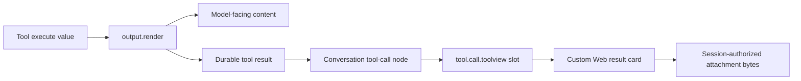

# Render a tool-produced image for both the model and the user

A DeepSeek Harness tool can save an image attachment and return an image content block that reaches a vision-capable model. That does not automatically put pixels in the Web conversation. Model-facing `output.render` and client-facing tool presentation are separate contracts.

The supported extension seam is narrower than arbitrary assistant-image rendering: register a Web tool view under the exact wire tool name, inspect the completed tool result, and load referenced bytes through the Session-authorized attachment path.

Use this guide when your tool generates a chart, screenshot, diagram, or edited image and the model can describe it while the human sees only a generic or collapsed row.

## Route the two consumers separately



| Contract | Consumer | Purpose |
|---|---|---|
| canonical `output.schema` value | Code Mode and programmatic callers | stable machine result |
| `output.render(args, value)` | next model request | text/image content the Agent can reason about |
| `presentationMeta` and card intent | replay-capable generic UI adapters | durable neutral presentation data |
| `tool.call.toolview` registration | DeepSeek Harness Web | business-owned React row for one wire tool name |
| `session.attachment` | rendered Session client | authorized retrieval of referenced attachment bytes |

Returning `{ type: 'image', attachment }` from `output.render` solves the model-facing path. It is not a declaration that the generic Web card should render an image.

## Do not use context injection as a display API

`exec.agent.inject()` and deferred plugin context append model-visible context for a later request. Web projects plugin-sourced context as a context node, whose compact presentation is intentionally different from a completed tool result card.

Reinjecting the same attachment as a user message changes role and transcript semantics. Code Mode has specialized behavior for nested tool results, but that is not a general plugin UI contract. Keep the image associated with the tool call that produced it.

## Build the Host-side tool contract

The tool should:

1. generate or receive image bytes under an explicit size and media-type policy;
2. save them through the mounted attachment service;
3. retain the returned durable attachment reference in its canonical result or renderable result;
4. return a schema-valid canonical JSON value;
5. project an image content block for the model only when the selected model route supports image input;
6. keep secrets, temporary URLs, and provider credentials out of the canonical value and attachment name.

Conceptual shape:

```ts
output: {
  schema: {
    type: 'object',
    additionalProperties: false,
    properties: {
      attachment: { /* exact durable reference schema */ },
      summary: { type: 'string', required: true },
    },
  },
  render: (_args, value) => [
    { type: 'text', text: value.summary },
    { type: 'image', attachment: value.attachment },
  ],
}
```

Use the exact attachment schema and service types from the pinned runtime rather than recreating the reference shape from this illustrative snippet.

The durable Session must reference the attachment id before Web can retrieve it. The Host's `session.attachment` endpoint is read-only and Session-scoped; it serves bytes only when a durable event in that Session references the requested id.

## Register one business-owned Web row

DeepSeek Harness Web assembles a `tool-call` conversation node, pairs call and result, and sends each atomic call through a keyed `tool.call.toolview` slot. A client plugin can register a component for its exact wire tool name:

```ts
ctx.slots.inject('tool.call.toolview', () =>
  ctx.slots.register({
    name: 'tool.call.toolview',
    key: 'generate_image',
  }, GenerateImageToolRow),
)
```

The component receives the standard tool-call owner payload, including stable call identity, the frozen call/result block, optional Session/workspace context, and Host actions. It should:

- show pending, success, failure, and interrupted states from the block;
- read image references only from the completed result content it owns;
- use the current Session id when requesting the attachment;
- render alt text, media dimensions, loading, and failure states;
- revoke object URLs and abort pending reads on unmount or Session change;
- retain readable text fallback when image loading fails;
- remain deterministic on Session replay.

Register only the tool names whose output contract you control. A global “render every attachment-looking object” hook would allow unrelated or malformed plugin output to select privileged UI behavior.

## Use the authorized attachment route

Do not create a local unauthenticated HTTP server, expose filesystem paths, or put base64 data URLs into assistant Markdown. Retrieve the attachment through the connected Session client or the runtime's Session-authorized attachment API.

Authorization depends on both Session identity and a durable reference. The browser should treat the returned bytes as untrusted media even after authorization:

- accept only the runtime's supported raster media types;
- enforce server-side byte and pixel limits before storage;
- create a Blob with the verified media type;
- avoid SVG or active document formats unless a separate sanitization contract exists;
- never use the attachment name as HTML;
- release Blob URLs when the view is disposed.

The known working community reference loads the attachment through `session.attachment`, creates an object URL, and registers its row under explicitly verified image-tool names. Treat that implementation as evidence and a design reference, not as an official first-party image-card component.

## Keep packages and lifecycle aligned

A complete integration normally has two sides:

```text
plugin bundle
├── host entry
│   ├── tool registration
│   ├── provider/image request
│   └── attachment save + canonical result
└── client entry
    ├── exact tool-name registration
    ├── completed-result parser
    └── authorized image view
```

The client registration must appear only while its owning plugin is mounted and must dispose cleanly on hot reload or removal. The tool name is the dispatch key; renaming it without updating the client entry falls back to the generic card.

Do not poll a broad global catalog when bundle composition can declare the exact tool/view pair. If dynamic tool names are unavoidable, publish a bounded authenticated manifest from the owning Host plugin and fail to the generic card when synchronization is unavailable.

## Failure routing

| Evidence | Boundary | Next action |
|---|---|---|
| model cannot see image | tool render, attachment save, or model capability | inspect result content and exact selected route |
| model sees it, generic card appears | client tool-view registration | confirm client bundle mounted and exact key matches |
| model sees it, context row appears | injection used as presentation | keep content on the owning tool result |
| custom card appears, no pixels | attachment reference or Session read | inspect result block, Session id, and authorized response |
| `session.attachment` denies | missing durable Session reference or wrong Session | never bypass with a public file URL |
| image loads after navigating away | view lifecycle leak | abort request and revoke object URL on disposal |
| replay card differs from live card | client view used external mutable state | derive it from frozen block and durable references |
| another tool unexpectedly gets image UI | registration scope too broad | key by exact controlled wire names |

## Acceptance matrix

- A tool result contains one durable image reference and readable text fallback.
- A vision-capable model receives the intended image content.
- A non-vision route rejects or degrades before an invalid model request.
- The Web client registers the custom row only for the exact tool name.
- Pending, successful, failed, cancelled, and interrupted calls remain distinguishable.
- The completed card renders pixels through the Session-authorized attachment path.
- Another Session cannot retrieve the attachment by guessing its id.
- A missing, corrupt, oversized, or unsupported image fails visibly without crashing Chat.
- Navigating away aborts the request and releases any object URL.
- Cold replay renders the same completed card without calling the image provider again.
- Removing the plugin unregisters both tool and client view.
- Unknown tools retain the generic fallback.
- Alt text and keyboard interaction meet the project's accessibility baseline.
- No provider URL, OAuth token, local path, or secret appears in the DOM or durable result.

## Separate this from assistant-message images

A tool result card is scoped to one known tool call and can be implemented today through the client slot. Rendering arbitrary image blocks in ordinary assistant messages is a broader product capability involving adapter output, assistant content projection, transcript rendering, export, compaction, and fallback behavior. Do not claim the result-card path solves that separate request.

## Primary sources

Verified against DeepSeek Harness rc.2 commit `b150a551b8d465e31e418e1b2eaf5e79bbb7d28e` on 2026-08-27.

- [Corrected tool-image report #4706](https://github.com/deepseek-ai/deepseek-harness/discussions/4706)
- [Assistant-image proposal and working tool-card reference #2995](https://github.com/deepseek-ai/deepseek-harness/discussions/2995)
- [rc.2 tool-authoring presentation contract](https://github.com/deepseek-ai/deepseek-harness/blob/b150a551b8d465e31e418e1b2eaf5e79bbb7d28e/docs/cookbook/adding-a-tool.md)
- [rc.2 client tool-view slot contract](https://github.com/deepseek-ai/deepseek-harness/blob/b150a551b8d465e31e418e1b2eaf5e79bbb7d28e/packages/client/ui-tool/README.md)
- [rc.2 Session-authorized attachment design](https://github.com/deepseek-ai/deepseek-harness/blob/b150a551b8d465e31e418e1b2eaf5e79bbb7d28e/.agents/notes/implemented/feature/2026-07-22-web-multimodal-image-input-and-durable-attachments.md)
- [Working community image-tool example](https://github.com/weijiafu14/pi2dsh/tree/main/examples/codex-image-gen)
