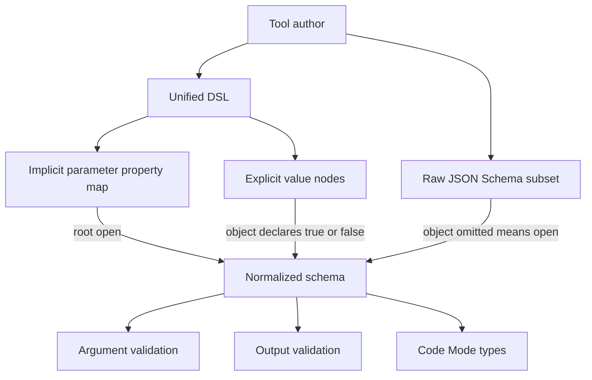

# Author tool schemas for the enforced subset

DeepSeek Harness does not accept arbitrary JSON Schema for every tool surface. Its rc.8 tool contract has two related representations:

- the unified authoring DSL used by `defineTool()` and `harness.defineTool()`; and
- an enforced raw JSON Schema subset shared by outputs, Code Mode, subagents, and workflows.

Use this guide when registration fails around `additionalProperties`, a `type` array, `oneOf`, or an unsupported keyword. The correct repair depends on which representation and which node you authored.

## Route the error before editing

| Error fragment | Boundary | Correct direction |
|---|---|---|
| `additionalProperties must be explicitly true or false` | explicit unified-DSL object | choose open or closed semantics at that object |
| `additionalProperties must be true or omitted because the implicit parameter root is open` | wrapped parameter root | remove `false`; close nested objects instead |
| `type must be a single type string (type arrays are not supported)` | enforced raw subset | use `oneOf` or optional omission |
| `must declare a valid type ... got [...]` | sandbox DSL normalization | replace the type array with DSL `oneOf` |
| `is not a supported keyword` | enforced subset vocabulary | remove the keyword or validate inside the tool body |
| `is not supported beside oneOf` | branch schema composition | put constraints inside each branch |

Do not copy a fix from one row to every object node. The implicit parameter root, explicit DSL objects, and raw schema objects have different open/closed defaults.

## The rc.8 schema map



The normalized vocabulary supports:

```text
type: object | array | string | number | integer | boolean | null
oneOf
properties
required
additionalProperties: boolean
items
enum
const
description, title, default, examples
```

The author-only DSL also has `type: 'json'` for an unconstrained lossless JSON value. Raw schemas express the same unconstrained node by omitting both `type` and `oneOf` and using annotations only.

## Rule 1: declare explicit DSL object openness

An explicit object in the unified DSL must state whether undeclared keys are accepted:

```ts
const record = {
  type: 'object',
  additionalProperties: false,
  properties: {
    result: { type: 'string', required: true },
  },
} as const
```

Use `false` for a closed record whose keys form an API contract. Use `true` for a map-like or forward-compatible record. The choice is semantic: `false` rejects unknown keys; `true` accepts them.

Every nested explicit DSL object makes its own choice:

```ts
const output = {
  type: 'object',
  additionalProperties: false,
  properties: {
    meta: {
      type: 'object',
      additionalProperties: true,
      properties: { source: { type: 'string' } },
    },
  },
} as const
```

The outer object is closed; `meta` remains open. Adding `false` mechanically to both would change the public behavior.

## Exception: the parameter root is implicit and open

The ordinary `defineTool()` parameter form is a property map, not an explicit object node:

```ts
parameters: {
  path: { type: 'string', required: true },
  limit: { type: 'integer' },
}
```

That root is intentionally open. When sandbox code supplies the wrapped JSON-looking form, rc.8 accepts `additionalProperties: true` or omission at the root, but rejects `false`:

```ts
parameters: {
  type: 'object',
  properties: {
    options: {
      type: 'object',
      additionalProperties: false,
      properties: { verbose: { type: 'boolean' } },
    },
  },
  // additionalProperties: true is allowed; omission has the same open-root meaning
}
```

The nested `options` value is an explicit object and therefore declares its own policy. This is why “add `additionalProperties: false` to every object” is wrong for rc.8.

## Raw JSON Schema keeps the standard open default

The enforced raw subset accepts an object with omitted `additionalProperties`; omission and `true` are open, while `false` closes the object. Raw callers own the distinction between schema validation and any additional body validation.

```ts
const rawOpen = {
  type: 'object',
  properties: { source: { type: 'string' } },
} as const

const rawClosed = {
  type: 'object',
  additionalProperties: false,
  properties: { source: { type: 'string' } },
  required: ['source'],
} as const
```

Do not infer which representation is in use from the object shape alone. Trace the registration API and its types.

## Rule 2: `type` is one string, never an array

The enforced subset deliberately models `type` as one value. This is rejected:

```ts
ref: { type: ['string', 'null'] }
```

If absence represents “no reference,” leave the property optional:

```ts
ref: { type: 'string' }
```

If explicit JSON `null` is meaningful, use exact-one `oneOf`:

```ts
ref: {
  oneOf: [
    { type: 'string' },
    { type: 'null' },
  ],
}
```

DeepSeek Harness validates `oneOf` as exactly one matching branch, not “at least one.” Branches should be mutually exclusive. A `number` branch overlaps an `integer` branch for integer values, so this schema rejects an integer because two branches match:

```ts
oneOf: [{ type: 'number' }, { type: 'integer' }]
```

Use one numeric type or redesign the branches with non-overlapping literal constraints.

## Unsupported keywords are not silently ignored

The subset rejects keywords such as `anyOf`, `allOf`, `pattern`, `format`, numeric bounds, and array-length bounds. This is safer than advertising a constraint to the model or generated SDK and then failing to enforce it.

When the vocabulary cannot express a domain rule:

1. keep the model-visible schema honest and as narrow as the subset permits;
2. validate the remaining rule at the start of `execute()`;
3. return a structured, actionable invalid-arguments error;
4. test both direct tool calls and Code Mode bindings;
5. document the body-owned constraint beside the tool.

Do not translate `pattern` into a description and assume the description is enforcement.

## A complete safe example

```ts
ctx.tools.register(ctx.plugin('lookup'), defineTool({
  name: 'lookup',
  description: 'Look up one optional reference.',
  parameters: {
    query: { type: 'string', required: true },
    ref: { oneOf: [{ type: 'string' }, { type: 'null' }] },
    options: {
      type: 'object',
      additionalProperties: false,
      properties: { exact: { type: 'boolean' } },
    },
  },
  output: {
    schema: {
      type: 'object',
      additionalProperties: false,
      properties: { value: { type: 'string', required: true } },
    },
    render: (_args, value) => [{ type: 'text', text: value.value }],
  },
  async execute(args) {
    return { value: await lookup(args.query, args.ref, args.options) }
  },
}))
```

The parameter root is implicit and open. `options` and the output are explicit closed objects. `ref` distinguishes omission from explicit null through `oneOf`.

## Verification gates

- Registration succeeds for the intended API surface.
- Every explicit DSL object declares `additionalProperties` deliberately.
- The implicit parameter root remains open.
- Raw object omission retains open JSON Schema semantics.
- Unknown keys are accepted or rejected at the intended level.
- Optional omission and explicit null have separate tests.
- Every `oneOf` sample matches exactly one branch.
- Type arrays are absent from the complete schema tree.
- Unsupported keywords are absent or enforced in the body.
- Invalid model arguments become `INVALID_ARGS` rather than reaching side effects.
- Canonical output is validated before rendering.
- Native and Code Mode exposure produce compatible types and runtime results.

## Source boundary

Discussion #1040 reported the constraints against rc.6, when the documentation and diagnostics were less explicit. At rc.8, the official tools README documents the unified DSL and raw subset, sandbox normalization reports paths, and the constraints remain intentional with more precise representation-specific behavior.

- [Original developer report #1040](https://github.com/deepseek-ai/deepseek-harness/discussions/1040)
- [rc.8 sandbox `harness.defineTool` normalization](https://github.com/deepseek-ai/deepseek-harness/blob/141eb6fef83422698aef7a981029e843e8161534/packages/extensions/cordis-host-runner/src/guard.ts)
- [rc.8 enforced raw JSON Schema subset](https://github.com/deepseek-ai/deepseek-harness/blob/141eb6fef83422698aef7a981029e843e8161534/packages/core/tools/src/json-schema.ts)
- [rc.8 unified tools contract](https://github.com/deepseek-ai/deepseek-harness/blob/141eb6fef83422698aef7a981029e843e8161534/packages/core/tools/README.md#schema-dsl-and-runtime-validation)
- [First plugin tutorial](first-plugin.md)
