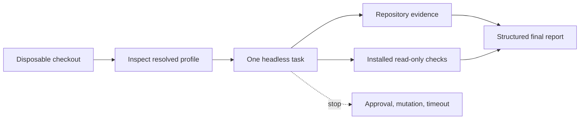

# Build a Repository Research Agent

This recipe runs a bounded, evidence-first review of a local repository with the shipped DeepSeek Harness `headless` profile. The Agent maps the project, finds its documented validation commands, and returns a report with file paths. It does not publish, install dependencies, or intentionally modify the checkout.

> [!CAUTION]
> “Do not edit files” is an instruction, not a security boundary. The shipped headless composition includes local tools. Inspect the resolved profile and use an isolated checkout with appropriate operating-system or runner controls before reviewing untrusted code.

## Agent contract

| Contract field | This recipe |
|---|---|
| Goal | Produce an evidence-backed repository map and risk report |
| Workspace | One disposable checkout, selected by the process working directory |
| Allowed effects | Read project files; run already-installed, read-only checks |
| Forbidden effects | File edits, dependency installation, network publishing, arbitrary network access, secret access |
| Completion evidence | Paths, commands attempted, observed output, uncertainties |
| Stop conditions | Approval request, missing credential, timeout, or a command that may mutate state |



## 1. Prepare a disposable checkout

Do not point the first run at your only working copy. Clone or create a worktree, then enter it:

```sh
git clone --no-hardlinks /path/to/source-repository /tmp/repository-research
cd /tmp/repository-research
git status --short
```

Use a provider-specific temporary directory in CI instead of hard-coding `/tmp`. Confirm that no credentials, production configuration, or unrelated directories are reachable from the workspace.

## 2. Inspect the shipped composition

Before the first turn, compare the default and resolved configuration:

```sh
npx @deepseek-ai/dsh --profile headless --dump-default-config
npx @deepseek-ai/dsh --profile headless --dump-config
```

Review the model route, local tools, approval behavior, sandbox mode, persistence, and any user-level patches. If the resolved graph exposes capabilities outside this contract, stop and create a narrower profile before continuing.

## 3. Run one bounded research turn

```sh
npx @deepseek-ai/dsh --profile headless \
  "Research this repository without modifying it. Map the top-level architecture, identify the documented build and test commands, and run only checks that are already installed and clearly read-only. Apart from the configured model call, do not install dependencies, access credentials, make network requests, or publish anything. Stop if a command may mutate state or requires approval. Return: (1) executive summary, (2) architecture map with file paths, (3) commands attempted and observed results, (4) risks with evidence, and (5) unanswered questions."
```

The working directory becomes the default workspace root. The profile creates a fresh persisted session, runs one nonblank task, writes the final assistant text to standard output, and exits.

## 4. Capture auditable output

For automation, save the report and keep deterministic checks as separate gates:

```sh
report_file="${RUNNER_TEMP:-/tmp}/repository-research.md"

npx @deepseek-ai/dsh --profile headless \
  "Inspect this repository without editing files. Report architecture, available checks, observed failures, and evidence paths. Apart from the configured model call, do not install, publish, or use the network." \
  > "$report_file"

test -s "$report_file"
git status --short
```

A nonempty report proves only that text was produced. Verify the checkout is unchanged and run your normal linters, tests, or policy checks independently.

The model call itself requires the configured provider connection. The restriction above applies to additional tool-driven network access. The current CLI reference states that reads, network access, and process visibility are not confined by the default workspace sandbox, so enforce this boundary at the runner or network layer when it matters.

## Expected evidence

A useful result names concrete evidence rather than claiming that the repository “looks good.” Expect items such as:

- entry points and package boundaries with repository-relative paths;
- build or test commands traced to `package.json`, a Makefile, CI workflow, or contributor guide;
- the exact checks attempted and whether each completed, failed, or was skipped;
- risks tied to files or observed command output;
- explicit unknowns when dependencies or credentials are unavailable.

## Failure and stop paths

| Signal | Meaning | Response |
|---|---|---|
| Agent asks for approval | The task reached a controlled effect | Do not auto-approve; decide whether the contract should expand |
| Dependency is missing | The checkout is not ready for that check | Record the skipped check; do not install during this recipe |
| Command can write or publish | The command exceeds the contract | Stop and report the proposed effect |
| Tool is denied | Policy or sandbox blocked the call | Preserve the denial as evidence; inspect resolved configuration |
| `SANDBOX_UNAVAILABLE` | Confinement could not be established | Stop; do not reinterpret it as an ordinary permission denial |
| Process does not exit | A tool, child process, or session may be stuck | Terminate the job at the runner boundary and inspect session events |
| Checkout changed | A mutation occurred despite the instruction | Preserve the diff for diagnosis; discard the disposable checkout |

## Timeout boundary

DeepSeek Harness tool timeouts and your CI job timeout protect different layers. Configure a runner-level deadline so a stalled process cannot hold the pipeline indefinitely. On timeout, retain the report, process output, and persisted session data before cleanup when your environment permits it.

## Cleanup

Review the final diff, then remove the disposable checkout using your platform's normal temporary-workspace cleanup. If you used a Git worktree, remove it through Git so worktree metadata is updated. Never reuse a checkout that unexpectedly changed until you have inspected the diff.

## Extend the recipe safely

Add capabilities one at a time:

1. start with filesystem inspection;
2. allow a small set of already-installed validation commands;
3. add network research only with an explicit domain and credential policy;
4. add edits in a new branch or disposable worktree;
5. keep publishing behind a separate approval boundary.

This progression makes each new effect visible in the resolved plugin graph and easier to test.

## Official sources

- [DeepSeek Harness CLI](https://github.com/deepseek-ai/deepseek-harness/blob/master/apps/cli/README.md)
- [CLI behavior reference](https://github.com/deepseek-ai/deepseek-harness/blob/master/apps/cli/reference/README.md)
- [rc.2 Headless Agent example](https://github.com/deepseek-ai/deepseek-harness/blob/b150a551b8d465e31e418e1b2eaf5e79bbb7d28e/examples/headless-agent/README.md)
- [Tool execution pipeline](https://github.com/deepseek-ai/deepseek-harness/blob/master/docs/tool-execution-pipeline.md)
- [Defensive patterns](https://github.com/deepseek-ai/deepseek-harness/blob/master/docs/defensive-patterns.md)
