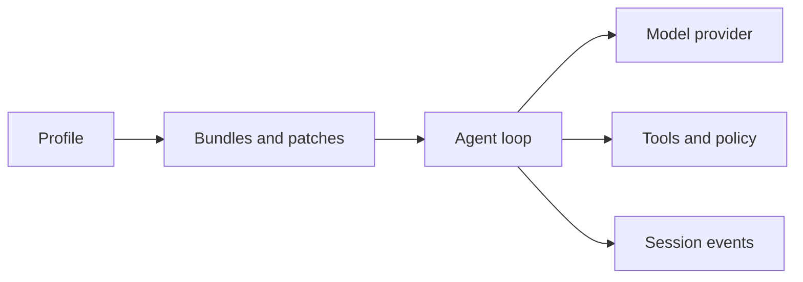

# DeepSeek Harness cheat sheet

A compact operator reference for starting, inspecting, and debugging DeepSeek Harness. Commands reflect the upstream repository on the verification date; pin the revision you use because the project is in developer preview.

## Start here

| Goal | Command |
|---|---|
| Launch the Web UI | `npx @deepseek-ai/dsh web` |
| Run one non-interactive task | `npx @deepseek-ai/dsh --profile headless "your task"` |
| Show the shipped Web composition | `dsh --profile web --dump-default-config` |
| Show your resolved Web composition | `dsh --profile web --dump-config` |
| Show your resolved headless composition | `dsh --profile headless --dump-config` |

The Web UI normally opens at `http://127.0.0.1:3080`. Run `dsh` from the directory you intend the Agent to use as its workspace.

## First safe task

```text
Inspect this repository without changing files.

Deliver:
1. its purpose;
2. its main packages and entry points;
3. the commands used to test it;
4. unresolved risks or unknowns.

Cite file paths for every conclusion. Stop before any write,
network request, credential use, or external publication.
```

A prompt is an instruction, not a security boundary. For untrusted work, use a disposable checkout or container and verify the resolved sandbox and approval policy.

## The five layers to inspect



| Layer | Question to ask |
|---|---|
| Profile | Which named assembly did I start: `web`, `headless`, or a custom profile? |
| Composition | Which bundles and patches produced the resolved Cordis graph? |
| Model | Which provider, endpoint, credential reference, and model does this session use? |
| Effects | Which tools exist, and what do sandbox and approval policy actually permit? |
| Session | Where are events persisted, and am I starting fresh or continuing prior state? |

## Web UI checklist

1. Start `npx @deepseek-ai/dsh web` and keep its terminal visible.
2. Open **Settings → Models** and configure a provider.
3. Choose the intended workspace before sending a message.
4. Begin with a bounded, read-only task.
5. Confirm the answer cites real workspace files and the session persists.

Use a limited credential. Do not paste secrets into chat, screenshots, logs, or issue reports.

## Headless and CI

```sh
npx @deepseek-ai/dsh --profile headless \
  "Review the current changes. Do not edit files. Report risks with file paths."
```

For automation, independently verify the exit code, output artifact, changed files, tests, and external state. Final assistant prose alone does not prove that a requested effect occurred.

## Python SDK

```sh
python -m venv .venv
. .venv/bin/activate
python -m pip install deepseek-harness-sdk
```

The official minimal example lives in the upstream `examples/jsonrpc-agent` directory. Its current composition uses `danger-full-access`; run it only in an isolated workspace you are prepared to discard.

## Diagnose by symptom

| Symptom | Check first |
|---|---|
| Browser does not load | `dsh` process, printed URL, and port conflict |
| Composer is disabled | selected workspace and configured model |
| Authentication fails | provider route, credential reference, and endpoint |
| Agent reads the wrong files | launch directory and selected workspace |
| Tool is denied | distinguish approval policy from sandbox enforcement |
| MCP server is absent | resolved config, process launch, transport, then registration |
| CI waits forever | human approval, child process, tool timeout, or session shutdown |
| Output says “done,” but state is unchanged | verify files, tests, API state, or session events directly |

## Before production

- Pin the upstream version or commit.
- Review `--dump-config`, not only the template.
- Separate credentials by environment and set spending limits.
- Make the allowed effects and approval path explicit.
- Use fresh session IDs for independent jobs.
- Preserve session evidence needed for debugging and audit.
- Test denial, timeout, partial completion, and cleanup paths.

## Go deeper

- [Five-minute Web UI quickstart](../getting-started/quickstart.md)
- [Headless Agent and CI](../getting-started/headless-agent.md)
- [Python SDK quickstart](../getting-started/python-sdk.md)
- [Agent runtime mental model](../architecture/agent-runtime.md)
- [Tool execution pipeline](../architecture/tool-execution-pipeline.md)
- [Troubleshooting index](../troubleshooting/README.md)

## Official sources

- [DeepSeek Harness README](https://github.com/deepseek-ai/deepseek-harness/blob/master/README.md)
- [Official user guide](https://github.com/deepseek-ai/deepseek-harness/blob/master/docs/user/guide/index.md)
- [Official CLI reference](https://github.com/deepseek-ai/deepseek-harness/blob/master/apps/cli/reference/README.md)
- [Official architecture](https://github.com/deepseek-ai/deepseek-harness/blob/master/docs/architecture.md)
- [Official Python SDK guide](https://github.com/deepseek-ai/deepseek-harness/blob/master/docs/user/guide/python-sdk.md)
