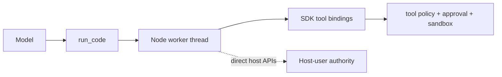

# Treat Code Mode worker threads as host-trusted

At upstream commit `99f6f02`, DeepSeek Harness Code Mode runs model-written TypeScript in a fresh Node worker thread. The runtime constrains lifetime, memory, output, and ambient environment, but its own documentation says the worker is **containment, not a security boundary**.

If `DSH_TOOLS_MODE` is `code` or `both`, do not assume `read-only` or `workspace-write` describes every effect available to the `run_code` program. Until a runtime with an enforceable OS boundary is deployed, treat the worker-thread Code Mode path as host-user trusted.

> [!CAUTION]
> This is a defensive operator advisory based on a public upstream report and the source revision above. It is not an official DeepSeek security bulletin or a CVE. Re-check the current release before applying it to a later revision.

## The two controls answer different questions

| Control | What it selects | What it does not prove |
|---|---|---|
| `DSH_TOOLS_MODE=native` | ordinary native tool presentation | that every installed third-party plugin is safe |
| `DSH_TOOLS_MODE=code` | `run_code` plus generated SDK bindings | OS-level confinement of the TypeScript body |
| `DSH_TOOLS_MODE=both` | native tools and `run_code` | that native-tool policy also wraps direct worker behavior |
| `DSH_PERMISSION_MODE=read-only` | the resolved sandbox policy for enforcing capability paths | that a code runtime outside those paths is confined |
| `DSH_PERMISSION_MODE=workspace-write` | writable roots for enforcing filesystem and shell paths | that a worker thread cannot use host APIs directly |

The shipped Web and headless bundles leave tool mode at the schema default, `native`, unless `DSH_TOOLS_MODE` opts the process into `code` or `both`. This means Code Mode is not the default exposure, but it is a first-class supported path that an operator can enable.

## What the worker boundary does provide

At the verified revision, every run gets a fresh worker with:

- an empty environment and empty inherited `execArgv`;
- a maximum old-generation heap;
- measured compute and wall-clock ceilings;
- a bounded outer output ledger;
- termination and no cross-run worker state.

These are valuable reliability and data-minimization controls. They do not create a separate kernel, UID, filesystem namespace, process namespace, or network policy.



SDK calls such as `tools.read(...)` re-enter the ordinary tool pipeline. The concern is the TypeScript program body itself: it executes through an `AsyncFunction` inside the worker, while the worker construction shown at the verified revision does not pass through `ctx.sandbox.confine(...)`.

## Check whether a deployment is exposed

Do not execute an escape proof on a workstation that contains real credentials. Inspect configuration instead.

### 1. Capture the effective environment

POSIX shell:

```sh
printf 'DSH_TOOLS_MODE=%s\n' "${DSH_TOOLS_MODE-<unset>}"
printf 'DSH_PERMISSION_MODE=%s\n' "${DSH_PERMISSION_MODE-<unset>}"
```

PowerShell:

```powershell
Get-Item Env:DSH_TOOLS_MODE -ErrorAction SilentlyContinue
Get-Item Env:DSH_PERMISSION_MODE -ErrorAction SilentlyContinue
```

An unset `DSH_TOOLS_MODE` keeps the shipped bundle on `native`. Values `code` and `both` require the containment decision below.

### 2. Dump the resolved composition

```sh
dsh --profile web --dump-config
```

Record the `tools` mode and the loaded `code-runtime` row. A runtime name containing `worker-thread` is not an OS sandbox.

### 3. Confirm the model-visible surface

Start a fresh disposable Session and inspect the visible tool catalog. If `run_code` appears, Code Mode is available to that Agent. Do not ask the model to prove host access.

## Immediate safe choices

### Choice A — return to native tools

Unset `DSH_TOOLS_MODE` or set it to `native`, then restart the entire Harness process and open a fresh Session.

POSIX shell:

```sh
unset DSH_TOOLS_MODE
dsh web
```

PowerShell:

```powershell
Remove-Item Env:DSH_TOOLS_MODE -ErrorAction SilentlyContinue
dsh web
```

Confirm that `run_code` is absent. Keep `read-only` or `workspace-write` according to the task; disabling Code Mode is not a reason to weaken the ordinary sandbox.

### Choice B — isolate the whole Host

If Code Mode is required, run the complete Harness Host inside a disposable VM or container boundary that is authoritative for filesystem, process, credential, and network effects.

The outer boundary should:

- mount only the intended workspace, preferably from a disposable copy;
- omit the user home directory, SSH agent, cloud config, browser profile, Docker socket, and package publishing credentials;
- use a dedicated low-privilege identity and short-lived model credential;
- restrict outbound network destinations independently of the Agent;
- be destroyed after the bounded job.

A container is useful only if its mounts, capabilities, sockets, and network are constrained. Running a privileged container with the host home mounted does not solve the trust-boundary problem.

## Do not rely on partial mitigations

- **Approval prompts are not an OS sandbox.** They cover effects routed through the approval-aware tool pipeline.
- **`env: {}` is not filesystem isolation.** It removes inherited environment variables, not every credential stored on disk or reachable service.
- **A worker heap or timeout is not file policy.** It limits resource use, not which host paths or processes the program can reach.
- **Prompt instructions are not enforcement.** Untrusted repository text, web content, tool output, and retrieved documents can influence a model.
- **A scoped tool allow-list is not proof that `run_code` is removed.** Select `native` mode and verify the final catalog.

## If Code Mode ran against untrusted input

Treat the Session as a security investigation, not merely a failed turn.

1. Stop the Harness process and preserve the Session export and sanitized launch configuration.
2. Record the time window, workspace, tool mode, permission mode, model route, and every `run_code` event.
3. From a separate trusted environment, review process, filesystem, and network telemetry for the same window.
4. Rotate credentials that were reachable from that Host identity; do not limit rotation to environment variables.
5. Rebuild a shared or production runner from a known-good image when integrity cannot be proven.
6. Report the smallest sanitized evidence bundle through the project’s security channel or the public upstream thread, according to the maintainer’s guidance.

Do not paste secrets, complete home-directory listings, or executable proof payloads into a public discussion.

## Deployment decision record

```text
Harness package and source revision:
Profile:
DSH_TOOLS_MODE:
DSH_PERMISSION_MODE:
Resolved tools mode:
Resolved code runtime:
run_code visible to the Agent: yes/no
Outer VM/container boundary:
Workspace mounts:
Host credentials/sockets omitted:
Outbound network policy:
Untrusted input accepted: yes/no
Decision: native tools / isolated Code Mode / do not run
Owner and review date:
```

## Primary sources

- [Public upstream security report #3245](https://github.com/deepseek-ai/deepseek-harness/discussions/3245)
- [Worker-thread runtime trust statement at `99f6f02`](https://github.com/deepseek-ai/deepseek-harness/blob/99f6f02fecdb7dff40c3fbc9470f5907c29f74ca/packages/code-runtime/code-runtime-worker-thread/README.md)
- [Worker construction at `99f6f02`](https://github.com/deepseek-ai/deepseek-harness/blob/99f6f02fecdb7dff40c3fbc9470f5907c29f74ca/packages/code-runtime/code-runtime-worker-thread/src/index.ts)
- [`AsyncFunction` execution path](https://github.com/deepseek-ai/deepseek-harness/blob/99f6f02fecdb7dff40c3fbc9470f5907c29f74ca/packages/code-runtime/code-runtime-worker-thread/src/bootstrap.ts)
- [Code Mode tool presentation contract](https://github.com/deepseek-ai/deepseek-harness/blob/99f6f02fecdb7dff40c3fbc9470f5907c29f74ca/packages/core/tools/README.md)
- [Web bundle `DSH_TOOLS_MODE` opt-in](https://github.com/deepseek-ai/deepseek-harness/blob/99f6f02fecdb7dff40c3fbc9470f5907c29f74ca/packages/bundle/web-app/cordis.patch.yml)

