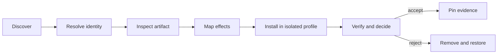

# Find and install DeepSeek Harness plugins without turning discovery into trust

The DeepSeek Harness plugin ecosystem is growing through the GitHub `dsh-plugin` topic, curated lists, repository search, and Agent-facing discovery tools. Those surfaces can tell you that a package exists. They cannot prove who controls its release, what code will execute during installation, which Host capabilities it registers, or whether removal restores a known-good profile.

Treat every community plugin as a Host software supply-chain decision.

> [!CAUTION]
> Plugin package scripts run during installation with package-manager permissions. Loaded Host plugins run with the permissions of the `dsh` process. Neither boundary is contained by the Agent's tool sandbox.

## Discovery is not verification

| Signal | Useful for | Does not prove |
|---|---|---|
| `dsh-plugin` GitHub topic | finding repositories | ownership, installability, or safety |
| curated plugin list | navigation and human descriptions | reproducible review of the current release |
| stars, forks, and recency | prioritizing attention | source integrity or least privilege |
| npm download count | adoption signal | that the published tarball matches the repository |
| Agent-generated install command | reducing typing | that executing the command is appropriate |
| successful `dsh plugin add` | package-manager completion | that the profile composes or boots safely |

The official project recommends the `dsh-plugin` topic for discoverability. It does not define the topic as an official marketplace or approval boundary.

## The six-gate workflow



Do not skip from discovery to installation. Each gate produces evidence needed by the next.

## Gate 1: resolve package and repository identity

For an npm candidate, read metadata without executing the package:

```sh
npm view <package>@<version> \
  name version dist.integrity dist.tarball \
  repository.url homepage license \
  scripts dependencies peerDependencies --json
```

Record:

- exact scoped or unscoped package name;
- exact version and registry integrity;
- repository URL and directory declaration;
- lifecycle scripts, especially `preinstall`, `install`, `postinstall`, `prepare`, and `prepack`;
- dependency and peer-dependency surface;
- license and maintainer identity.

Then compare the registry metadata with the repository release or commit. A README that names a package does not prove the registry package points back to that repository.

## Gate 2: inspect the artifact without running scripts

Download the exact registry artifact into a disposable directory with scripts disabled:

```sh
audit_dir=$(mktemp -d)
npm pack --ignore-scripts --pack-destination "$audit_dir" \
  <package>@<version>
tar -tf "$audit_dir"/*.tgz
```

Before extracting, confirm the archive contains only the files the package claims to ship. Then inspect at minimum:

```text
package/package.json
package/cordis.patch.yml
package entry points named by main, exports, or bin
package files referenced by dsh.bundle.patch
package lifecycle scripts and their transitive commands
```

Do not rely only on repository source. The installed object is the published tarball identified by `dist.integrity`.

For a Git dependency, pin the full commit:

```text
github:owner/repository#<full-commit-sha>
```

A Git install may execute `prepare` to build source. pnpm 10 requires an explicit `allowBuilds` decision for that script. The allowance is permission to execute package code on the Host; it is not an error to dismiss automatically.

## Gate 3: map composition and effects

A DSH bundle declares its patch in the package manifest:

```json
{
  "dsh": {
    "bundle": {
      "patch": "./cordis.patch.yml"
    }
  }
}
```

Read that patch and every inserted or overridden plugin row. Build an effect inventory:

| Boundary | Questions |
|---|---|
| services | Which `ctx.*` services are required or provided? |
| tools | Which model-facing names, schemas, and external effects are registered? |
| credentials | Which environment variables, files, settings, or OAuth flows are read? |
| filesystem | Which Host or workspace paths can be read or changed? |
| subprocess | Which commands or child processes can start? |
| network | Which hosts receive requests or user/session data? |
| UI | Which Client slots, settings, or Tool cards can be replaced? |
| persistence | Which durable Session events, databases, or files are written? |
| lifecycle | What happens on load, HMR update, disposal, failure, and restart? |

A plugin that registers a harmless-looking tool can still execute Host code during `apply()`. Review module-scope and lifecycle effects, not only the model-facing schema.

## Gate 4: preserve a known-good profile

Before installation, capture the profile state and resolved graph:

```sh
dsh --profile plugin-lab --dump-config > before.yml
```

Preserve through version control or a dated copy outside the live profile:

```text
$DSH_HOME/profiles/plugin-lab/package.json
$DSH_HOME/profiles/plugin-lab/pnpm-lock.yaml
$DSH_HOME/profiles/plugin-lab/pnpm-workspace.yaml
$DSH_HOME/profiles/plugin-lab/cordis.patch.yml
$DSH_HOME/cordis.patch.yml
```

Never use a production profile as the first install target. Create a disposable profile and workspace with no production credentials.

## Gate 5: install one exact candidate

For an npm release whose artifact and scripts you reviewed:

```sh
dsh plugin --profile plugin-lab add <package>@<exact-version>
dsh --profile plugin-lab --dump-config > after.yml
```

For a reviewed Git commit:

```sh
dsh plugin --profile plugin-lab add \
  github:owner/repository#<full-commit-sha>
```

Compare `before.yml`, `after.yml`, the manifest, lockfile, workspace build allowances, and physical installed package. Confirm that the only new bundle layer and dependency closure are the ones you expected.

Install one plugin at a time. Otherwise the first failed boot cannot be attributed reliably.

## Gate 6: verify behavior and cleanup

Test with a disposable workspace, limited credentials, and the narrowest permission preset compatible with the plugin's declared purpose.

Verify:

1. the profile composes before boot;
2. the plugin registers only the expected services, tools, and Client surfaces;
3. denied operations fail safely;
4. invalid configuration fails loudly;
5. network destinations match the inventory;
6. restart and HMR do not duplicate effects;
7. disposal stops processes, listeners, timers, and connections;
8. removal deletes both the dependency and bundle layer;
9. the restored profile dump matches the known-good composition.

Remove the candidate with:

```sh
dsh plugin --profile plugin-lab remove <package>
dsh --profile plugin-lab --dump-config > removed.yml
```

If installation or removal failed partway, stop the profile before restoring the captured manifest and lockfile. Do not edit a live profile repeatedly until it happens to boot.

## Minimum evidence record

```text
Discovery source:
Repository URL:
Reviewed repository commit:
Package name and exact version:
Registry dist.integrity:
Published tarball inspected: yes / no
Lifecycle scripts reviewed:
dsh.bundle.patch target:
Inserted or overridden rows:
Host services and effects:
Credential and network boundaries:
Known-good profile captured:
before/after dump-config diff:
Denial and cleanup tests:
Removal result:
Reviewer and date:
```

## Red flags that stop the install

- package metadata points to a different or missing repository;
- the tarball contains unexplained executables or files absent from source review;
- install scripts download or execute unpinned remote content;
- a Git dependency requests a build allowance without a self-contained reviewed build;
- the bundle overrides unrelated core rows without explaining why;
- credentials are requested through chat, committed config, or undocumented files;
- network destinations are dynamic, hidden, or broader than the feature requires;
- removal, disposal, or rollback behavior is absent;
- the author treats stars, curation, or successful installation as a security review.

## Official sources

- [Official discovery guidance for the `dsh-plugin` topic](https://github.com/deepseek-ai/deepseek-harness/blob/99f6f02fecdb7dff40c3fbc9470f5907c29f74ca/README.md)
- [Official CLI plugin-management contract](https://github.com/deepseek-ai/deepseek-harness/blob/99f6f02fecdb7dff40c3fbc9470f5907c29f74ca/apps/cli/reference/README.md#plugin-management)
- [Official package and install tutorial](https://github.com/deepseek-ai/deepseek-harness/blob/99f6f02fecdb7dff40c3fbc9470f5907c29f74ca/docs/user/develop/basic/publish.md)
- [Official plugins and lifecycle guide](https://github.com/deepseek-ai/deepseek-harness/blob/99f6f02fecdb7dff40c3fbc9470f5907c29f74ca/docs/user/develop/framework/index.md)
