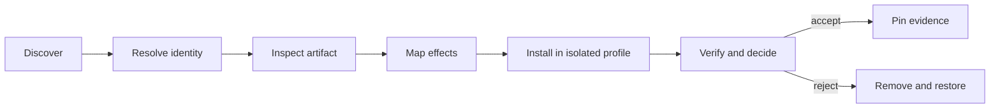

# Find and install DeepSeek Harness plugins without turning discovery into trust

The DeepSeek Harness plugin ecosystem is growing through the GitHub `dsh-plugin` topic, curated lists, repository search, and Agent-facing discovery tools. Those surfaces can tell you that a package exists. They cannot prove who controls its release, what code will execute during installation, which Host capabilities it registers, or whether removal restores a known-good profile.

Treat every community plugin as a Host software supply-chain decision.

> [!CAUTION]
> Plugin package scripts run during installation with package-manager permissions. Loaded Host plugins run with the permissions of the `dsh` process. Neither boundary is contained by the Agent's tool sandbox.

## Discovery is not verification

| Signal | Useful for | Does not prove |
|---|---|---|
| `dsh-plugin` GitHub topic | finding repositories | ownership, installability, or safety |
| curated plugin list | navigation and human descriptions | reproducible review of the current release |
| stars, forks, and recency | prioritizing attention | source integrity or least privilege |
| npm download count | adoption signal | that the published tarball matches the repository |
| Agent-generated install command | reducing typing | that executing the command is appropriate |
| successful `dsh plugin add` | package-manager completion | that the profile composes or boots safely |

The official project recommends the `dsh-plugin` topic for discoverability. It does not define the topic as an official marketplace or approval boundary.

### Current community announcements: discovered, not approved

Two recent upstream discussions are useful discovery signals, not security or compatibility verdicts:

| Project | Announcement | Claimed release | Intake command | What is still unproven |
|---|---|---:|---|---|
| `miuzel/dsh-graph` | [#4877](https://github.com/deepseek-ai/deepseek-harness/discussions/4877) | `dsh-graph@0.7.2` | `dsh plugin --profile <name> add dsh-graph` | exact npm integrity, lifecycle effects, graph-file trust boundary, and runtime matrix |
| `miuzel/dsh-subagent-ui` | [#4876](https://github.com/deepseek-ai/deepseek-harness/discussions/4876) | `dsh-subagent-workspace-ui@1.1.3` | `dsh plugin --profile web add dsh-subagent-workspace-ui` | exact artifact, browser-local state behavior, session-read scope, and cleanup after removal |
| `H97y/dsh-devflow` | [#2572](https://github.com/deepseek-ai/deepseek-harness/discussions/2572) | `dsh-devflow` (announcement describes v0.4.0) | `dsh plugin --profile web add dsh-devflow` | exact npm version/integrity, background-agent authority, workspace/worktree writes, merge-to-main behavior, and model/cost controls |

The rows intentionally use **discovered** language. Before installing any candidate, resolve the registry tarball, inspect its `dsh` bundle patch and lifecycle scripts, pin the exact version/integrity, and test in a disposable profile. For an automation plugin that can create worktrees, run tools, and merge to `main`, review repository write authority and approval gates before enabling any background pump. Screenshots, a discussion post, a package name, or a high star count do not promote a row to `installable`, `runtime-compatible`, or `security-reviewed`.

## A runtime-tested catalog is still a discovery surface

Discussion #4736 introduces `dsh-verified-market`, backed by an external radar that labels catalog entries `ok`, `incompatible`, and other verdicts after container tests. This is stronger evidence than a topic or star count, but the verdict still needs an artifact identity and a test contract before it can authorize installation.

At the reviewed market commit [`836fc832…`](https://github.com/G-pledge/dsh-verified-market/tree/836fc832023101e256c367a65b7493843fd8231e), the client fetches an unsigned mutable JSON document from the radar repository's `master` branch, validates only the schema string and `plugins` array, and caches it in memory. An `ok` entry is matched by its `name` or repository basename. The installer then independently resolves the repository's current default-branch `package.json` and either:

- installs the npm package at the registry's current `latest` value when repository metadata agrees; or
- installs `github:owner/repository`, which resolves the repository's current HEAD.

Those steps do not establish that the bytes installed now are the exact bytes the radar tested. Repository agreement reduces namespace confusion, but it does not bind this tuple:

```text
catalog snapshot digest
repository identity + full commit
package name + exact version + dist.integrity
test image/toolchain + DSH/Node/platform
test case set + verdict + timestamp
```

Without that tuple, `ok` means “some radar observation associated with this catalog identity,” not “this selected artifact is known-good,” and never “safe.” A mutable `latest` tag can move; a default branch can advance; Git install may run `prepare`; dependencies can resolve differently; a six-hour cache can retain a verdict after its artifact changes.

### Use four distinct verdict tiers

| Tier | Evidence | Honest label |
|---|---|---|
| discovered | name or repository appeared in a source | discovered |
| installable | one exact package transaction and composition dump completed | installable on the recorded environment |
| runtime-compatible | a pinned artifact passed a declared smoke/behavior suite | tested compatible with the recorded matrix |
| security-reviewed | artifact, dependency closure, effects, policy, provenance, and cleanup received a scoped security review | reviewed only for the stated threat model |

Do not compress the last three tiers into a green “verified” badge. Show the tested artifact and matrix on the card itself, and make any version drift visible before enabling Install.

### Bind the catalog to immutable evidence

A trustworthy runtime verdict record should carry at least:

```json
{
  "repository": "owner/repo",
  "commit": "<40-character SHA>",
  "package": "@scope/name",
  "version": "1.2.3",
  "integrity": "sha512-...",
  "testedAt": "<ISO-8601>",
  "runner": { "imageDigest": "sha256:...", "dsh": "...", "node": "...", "os": "..." },
  "suite": { "id": "...", "revision": "<full SHA>" },
  "verdict": "runtime-compatible"
}
```

Sign the catalog or publish it through an immutable release artifact with a digest and verifiable provenance. The marketplace must reject—not silently reinterpret—a record whose commit, version, integrity, repository, or suite evidence is missing. Offline fallback should show the captured digest, age, and artifact binding; it must not authorize an update to a different artifact.

### Separate catalog trust from mutation authority

A marketplace Host plugin can install packages, remove them, execute package-manager lifecycle code, and edit profile composition. Its HTTP or RPC surface is therefore a package-management control plane, not just a catalog viewer.

At the same reviewed commit, the market's mutating routes require matching `Origin` and `Host`, which is a useful CSRF fence but not user authorization. The hot-toggle route accepts an arbitrary row id and writes it into YAML text; the install/update routes eventually spawn the profile package manager. A robust implementation must additionally:

- keep the carrier loopback-only unless it has an authenticated principal and narrow package/profile grants;
- resolve all actions through server-owned opaque candidate and row identities, not body-supplied names or YAML ids;
- validate profile identity and prevent cross-profile writes;
- parse, modify, schema-check, and atomically replace the patch document instead of interpolating YAML text;
- serialize package and patch transactions and reject stale manifest/lock/patch revisions;
- show the exact target, lifecycle/build policy, dependency diff, Bundle rows, and source evidence before approval;
- apply time-bounded operator approval separately to install, update, uninstall, disable, and force-enable;
- preserve a known-good snapshot and prove rollback after partial pnpm, timeout, process restart, or HMR failure;
- never return unsanitized package-manager output that can contain local paths, registry credentials, or control sequences;
- audit principal, profile, candidate digest, action, revisions, result, and rollback—never secret values.

An allowlist narrows available choices; it does not make every caller authorized, every selected version reviewed, or every mutation reversible.

### Marketplace acceptance gates

- [ ] Every green verdict binds a full repository commit and exact package integrity.
- [ ] The runner image, DSH/Node/platform matrix, suite revision, timestamp, and logs are linked.
- [ ] Catalog authenticity and immutable digest are verified before a verdict is trusted.
- [ ] Name and repository-basename collisions cannot select a different entry.
- [ ] Install refuses artifact drift rather than falling back from a tested npm artifact to mutable Git HEAD.
- [ ] `latest`, default branches, and unpinned transitive resolution never appear in an approved target.
- [ ] Runtime compatibility and security review use visibly different labels.
- [ ] Mutating routes require an authenticated, authorized operator—not same-origin alone.
- [ ] Client input cannot become package-manager syntax, profile paths, row ids, YAML, shell text, or log control sequences.
- [ ] Patch edits use parsed schema-aware modification, revision checks, locking, and atomic replacement.
- [ ] The operator previews package, lock, Bundle, effective-config, lifecycle, and capability changes.
- [ ] Each action has a separate approval and an idempotent terminal result.
- [ ] Partial install, timeout, crash, and cold-restart recovery restore the exact known-good profile.
- [ ] Stale or offline catalogs cannot approve a different artifact than the one tested.
- [ ] Removal proves dependency, Bundle, patch, process, listener, and Client cleanup.
- [ ] Audit and UI output are redacted and safe against terminal or HTML injection.

## The six-gate workflow



Do not skip from discovery to installation. Each gate produces evidence needed by the next.

## Gate 1: resolve package and repository identity

For an npm candidate, read metadata without executing the package:

```sh
npm view <package>@<version> \
  name version dist.integrity dist.tarball \
  repository.url homepage license \
  scripts dependencies peerDependencies --json
```

Record:

- exact scoped or unscoped package name;
- exact version and registry integrity;
- repository URL and directory declaration;
- lifecycle scripts, especially `preinstall`, `install`, `postinstall`, `prepare`, and `prepack`;
- dependency and peer-dependency surface;
- license and maintainer identity.

Then compare the registry metadata with the repository release or commit. A README that names a package does not prove the registry package points back to that repository.

## Gate 2: inspect the artifact without running scripts

Download the exact registry artifact into a disposable directory with scripts disabled:

```sh
audit_dir=$(mktemp -d)
npm pack --ignore-scripts --pack-destination "$audit_dir" \
  <package>@<version>
tar -tf "$audit_dir"/*.tgz
```

Before extracting, confirm the archive contains only the files the package claims to ship. Then inspect at minimum:

```text
package/package.json
package/cordis.patch.yml
package entry points named by main, exports, or bin
package files referenced by dsh.bundle.patch
package lifecycle scripts and their transitive commands
```

Do not rely only on repository source. The installed object is the published tarball identified by `dist.integrity`.

For a Git dependency, pin the full commit:

```text
github:owner/repository#<full-commit-sha>
```

A Git install may execute `prepare` to build source. pnpm 10 requires an explicit `allowBuilds` decision for that script. The allowance is permission to execute package code on the Host; it is not an error to dismiss automatically.

## Gate 3: map composition and effects

A DSH bundle declares its patch in the package manifest:

```json
{
  "dsh": {
    "bundle": {
      "patch": "./cordis.patch.yml"
    }
  }
}
```

Read that patch and every inserted or overridden plugin row. Build an effect inventory:

| Boundary | Questions |
|---|---|
| services | Which `ctx.*` services are required or provided? |
| tools | Which model-facing names, schemas, and external effects are registered? |
| credentials | Which environment variables, files, settings, or OAuth flows are read? |
| filesystem | Which Host or workspace paths can be read or changed? |
| subprocess | Which commands or child processes can start? |
| network | Which hosts receive requests or user/session data? |
| UI | Which Client slots, settings, or Tool cards can be replaced? |
| persistence | Which durable Session events, databases, or files are written? |
| lifecycle | What happens on load, HMR update, disposal, failure, and restart? |

A plugin that registers a harmless-looking tool can still execute Host code during `apply()`. Review module-scope and lifecycle effects, not only the model-facing schema.

### Incident: installation can replace the Agent's world

An rc.7 report showed `@struktoai/mirage-dsh@0.0.1` changing the Web profile from Host-backed filesystem and shell providers to a Mirage workspace. Inspection of the exact public npm artifact, without running scripts, confirms that its declared bundle patch disables these existing rows:

```yaml
- id: fs-sandbox
  disabled: true
- id: bash-sandbox
  disabled: true
- id: pwsh-sandbox
  disabled: true
- id: tool-pwsh
  disabled: true
- id: tool-fs-search
  disabled: true
```

It then inserts `mirage`, `mirage-fs`, and `mirage-shell`, initially with a RAM mount at `/tmp`. The effect is not merely “three more plugins.” It substitutes the services behind filesystem and shell behavior and removes Host-native search and PowerShell from the composed graph.

This is an intentional design in the inspected artifact: comments in its published `cordis.patch.yml` explicitly describe the provider swap. The audit problem is that `dsh plugin add` automatically reconciles a dependency declaring `dsh.bundle.patch` into the profile's ordered bundle stack; a successful install does not present the resulting core-row diff as an approval boundary.

The official composer supports this behavior by design:

- profile bundles apply in manifest order over an empty root;
- a later patch targets an existing row by `id`;
- `disabled` can change independently of the row's plugin identity;
- profile and home patches apply after bundle layers;
- `--dump-config` prints both the effective tree and source-layer comments without booting plugins.

Therefore, judge the **resolved Agent capability graph**, not whether a package calls itself an extension.

## Detect capability drift before boot

Capture both the shipped bundle baseline and the current effective profile before installation:

```sh
dsh --profile plugin-lab --dump-default-config > default-before.yml
dsh --profile plugin-lab --dump-config > effective-before.yml
```

After adding one exact package, dump again **before booting the profile**:

```sh
dsh plugin --profile plugin-lab add <package>@<exact-version>
dsh --profile plugin-lab --dump-config > effective-after.yml
diff -u effective-before.yml effective-after.yml
```

Classify every changed row:

| Change | Required decision |
|---|---|
| new row | Is the new service, tool, UI, process, or network effect expected? |
| existing row disabled | Which Agent capability disappears, and on which platforms? |
| provider identity replaced | Does the same tool now address a different filesystem, shell, or trust domain? |
| existing `config` replaced | Which defaults or runtime expressions were lost? |
| row enabled | Was dormant Host code or telemetry activated? |
| source comment changes | Which package or user layer owns the final value? |

Search by stable row IDs, not only npm package names. On rc.7, a core-capability review should at least track:

```text
fs-sandbox  tool-fs  tool-fs-search
bash-sandbox  pwsh-sandbox  tool-bash  tool-pwsh
sandbox  sandbox-policy  approval
credentials  session-persistence-jsonl  attachment-local
```

Platform expressions matter. The base profile enables the Bash stack on non-Windows hosts and the PowerShell stack on Windows. A literal `disabled: true` applied later disables that row on every platform; do not infer the impact from a dump captured on only one operating system.

> [!IMPORTANT]
> Tool names can remain familiar while their backing service changes. Prove the workspace identity, path semantics, persistence, permission boundary, and subprocess environment observed by an actual disposable Agent turn.

## Gate 4: preserve a known-good profile

Before installation, capture the profile state and resolved graph:

```sh
dsh --profile plugin-lab --dump-config > before.yml
```

Preserve through version control or a dated copy outside the live profile:

```text
$DSH_HOME/profiles/plugin-lab/package.json
$DSH_HOME/profiles/plugin-lab/pnpm-lock.yaml
$DSH_HOME/profiles/plugin-lab/pnpm-workspace.yaml
$DSH_HOME/profiles/plugin-lab/cordis.patch.yml
$DSH_HOME/cordis.patch.yml
```

Never use a production profile as the first install target. Create a disposable profile and workspace with no production credentials.

## Gate 5: install one exact candidate

For an npm release whose artifact and scripts you reviewed:

```sh
dsh plugin --profile plugin-lab add <package>@<exact-version>
dsh --profile plugin-lab --dump-config > after.yml
```

For a reviewed Git commit:

```sh
dsh plugin --profile plugin-lab add \
  github:owner/repository#<full-commit-sha>
```

Compare `before.yml`, `after.yml`, the manifest, lockfile, workspace build allowances, and physical installed package. Confirm that the only new bundle layer and dependency closure are the ones you expected.

Do not boot when the diff contains an unexplained disable, provider replacement, credential source, network destination, or loss of a sandbox/approval row. Removal is safer than stacking an emergency override whose row configuration you have not reconstructed completely:

```sh
dsh plugin --profile plugin-lab remove <package>
dsh --profile plugin-lab --dump-config > effective-removed.yml
diff -u effective-before.yml effective-removed.yml
```

Install one plugin at a time. Otherwise the first failed boot cannot be attributed reliably.

## Gate 6: verify behavior and cleanup

Test with a disposable workspace, limited credentials, and the narrowest permission preset compatible with the plugin's declared purpose.

Verify:

1. the profile composes before boot;
2. the plugin registers only the expected services, tools, and Client surfaces;
3. denied operations fail safely;
4. invalid configuration fails loudly;
5. network destinations match the inventory;
6. restart and HMR do not duplicate effects;
7. disposal stops processes, listeners, timers, and connections;
8. removal deletes both the dependency and bundle layer;
9. the restored profile dump matches the known-good composition.
10. filesystem and shell probes reach the intended workspace rather than a substitute mount.
11. platform-native tool availability matches the pre-install baseline.
12. approval and sandbox-denial behavior remains unchanged unless the reviewed purpose requires a documented change.

Remove the candidate with:

```sh
dsh plugin --profile plugin-lab remove <package>
dsh --profile plugin-lab --dump-config > removed.yml
```

If installation or removal failed partway, stop the profile before restoring the captured manifest and lockfile. Do not edit a live profile repeatedly until it happens to boot.

## Minimum evidence record

```text
Discovery source:
Repository URL:
Reviewed repository commit:
Package name and exact version:
Registry dist.integrity:
Published tarball inspected: yes / no
Lifecycle scripts reviewed:
dsh.bundle.patch target:
Inserted or overridden rows:
Host services and effects:
Credential and network boundaries:
Known-good profile captured:
before/after dump-config diff:
Denial and cleanup tests:
Removal result:
Reviewer and date:
```

## Red flags that stop the install

- package metadata points to a different or missing repository;
- the tarball contains unexplained executables or files absent from source review;
- install scripts download or execute unpinned remote content;
- a Git dependency requests a build allowance without a self-contained reviewed build;
- the bundle overrides unrelated core rows without explaining why;
- the install changes a core row but no pre-boot effective-config diff was reviewed;
- familiar tool names now resolve to a different filesystem or shell trust domain without explicit operator approval;
- credentials are requested through chat, committed config, or undocumented files;
- network destinations are dynamic, hidden, or broader than the feature requires;
- removal, disposal, or rollback behavior is absent;
- the author treats stars, curation, or successful installation as a security review.

## Official sources

- [rc.2 CLI plugin-management contract](https://github.com/deepseek-ai/deepseek-harness/blob/b150a551b8d465e31e418e1b2eaf5e79bbb7d28e/apps/cli/reference/README.md#plugin-management)
- [rc.2 plugin reconciliation implementation](https://github.com/deepseek-ai/deepseek-harness/blob/b150a551b8d465e31e418e1b2eaf5e79bbb7d28e/apps/cli/src/plugin.ts)
- [rc.2 profile composition contract](https://github.com/deepseek-ai/deepseek-harness/blob/b150a551b8d465e31e418e1b2eaf5e79bbb7d28e/packages/boot/app-boot/README.md#profiles)
- [rc.2 atomic write and lock contract](https://github.com/deepseek-ai/deepseek-harness/blob/b150a551b8d465e31e418e1b2eaf5e79bbb7d28e/packages/util/atomic-write/README.md)
- [Published Mirage bundle patch at the inspected release](https://unpkg.com/@struktoai/mirage-dsh@0.0.1/cordis.patch.yml)
- [Core-provider replacement report #3421](https://github.com/deepseek-ai/deepseek-harness/discussions/3421)
- [Verified-market proposal #4736](https://github.com/deepseek-ai/deepseek-harness/discussions/4736)
- [Reviewed dsh-verified-market commit](https://github.com/G-pledge/dsh-verified-market/tree/836fc832023101e256c367a65b7493843fd8231e)
