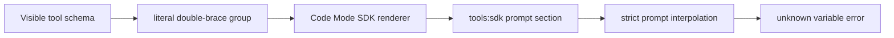

# Fix double-brace tool descriptions breaking Code Mode

DeepSeek Harness rc.8 can reject prompt assembly when a third-party tool description contains a complete double-brace group. Two independent reports now cover both parser branches:

```text
unknown prompt variable "{{hexagon}}" in section "tools:sdk";
registered variables: provider, model, cwd, ...

malformed prompt variable reference "{{dotted.state.path}}" in section "tools:sdk"
(variable names match /^[a-z][a-z0-9_]*$/)
```

The first group is a syntactically valid variable name that is not registered. The second documents a tool's own dotted-path template syntax, so it fails the variable-name grammar before lookup. Both share the same ownership error: generated third-party text was treated as a Harness-authored prompt template.

In `code` or `both` tool-presentation mode, DSH generates a model-facing SDK from every visible tool schema. Raw tool and property descriptions enter the `tools:sdk` prompt section. The system-prompt renderer then interprets every complete `{{name}}` group in that generated text as a strict Harness prompt variable.

Third-party prose has crossed into deployment-authored template syntax.

## Confirm the four-part signature

This guide applies when all four conditions hold:

1. the failure names section `tools:sdk`;
2. the unknown or malformed group appears in a tool or schema description, property name, enum, or const string;
3. effective tool presentation is `code` or `both`; and
4. the same tool set assembles in `native` mode or assembles after the offending tool is removed.

Capture the exact error, resolved configuration, preset, enabled MCP servers, and DSH version before changing anything:

```bash
dsh --profile web --dump-config > dsh-config.json
node --version
pnpm --version
```

If the configuration contains secrets, redact values while preserving key names, plugin order, presentation mode, and MCP package identities.

## Trace the complete data path



At rc.8:

- `dsh-tools` registers `tools:sdk` only for effective `code` and `both` modes;
- the TypeScript renderer sends tool and property descriptions through `docLines()` and can render schema values;
- the Python renderer also turns descriptions, property names, and schema values into generated SDK documentation;
- `renderPrompt()` subsequently calls the same strict interpolator for every section; and
- the interpolator scans for `{{`, validates a complete simple name, and throws when that name has no registered variable.

Fenced Markdown is not a protection. The generated TypeScript SDK is itself fenced, but the interpolator does not parse Markdown and does not skip code blocks.

## Why `native` behaves differently

Native presentation sends tool schemas through the model provider's function-calling surface. It does not generate the `tools:sdk` prompt section, so the description never crosses the system-prompt template parser.

`both` is not a workaround. It includes native schemas **and** the generated SDK; the same poisoned description still reaches `tools:sdk`.

## Immediate operator recovery

Choose the smallest reversible option for the current task.

### Use a native-only preset

If the selected model and task support native tool calling, clone the preset and set effective tool presentation to `native`. Start a fresh Session so the prompt and capability surface are rebuilt cleanly.

Prove:

- the resolved mode is `native`;
- no `tools:sdk` section is present;
- the draw.io MCP tools remain discoverable through native schemas; and
- one bounded read-only tool call succeeds before allowing writes.

### Disable the offending MCP server

If Code Mode is required, remove the draw.io MCP bridge from a disposable copy of the preset and start a fresh Session. This restores assembly but removes those tools; it is a diagnostic isolation step, not a feature-complete fix.

### Sanitize generated text locally

For a controlled source checkout, sanitizing double-brace openers can restore one known description. Apply the same rule consistently to:

- top-level tool descriptions;
- nested parameter-property descriptions;
- TypeScript SDK output; and
- Python SDK output.

One conservative display transformation is `{{` → `{ {`. It prevents strict variable recognition, but it changes the model-visible documentation and can miss special property names, enum values, const values, or future renderer fields. Treat it as an operator patch, not the complete contract.

Do not mutate only the published `@drawio/mcp` text and declare the Harness fixed. Another MCP server, plugin, or ordinary tool can carry the same group tomorrow.

## Do not use these shortcuts

- Do not register a fake prompt variable named `hexagon`; the next description can contain a different name, and substitution would corrupt tool documentation.
- Do not switch to `both`; it still generates `tools:sdk`.
- Do not disable strict interpolation globally. Deployment-authored sections rely on unknown-variable failures to catch configuration mistakes.
- Do not teach interpolation to ignore fenced blocks as the only fix. Tool descriptions are not guaranteed to be fenced, while Harness-authored templates may legitimately reference variables inside fences.
- Do not strip all braces from schemas. JSON examples, template examples, and diagram syntax may need literal braces for the model to use the tool correctly.
- Do not edit installed dependencies without recording the exact diff and expecting the next install to erase it.

## The trust-boundary repair

Strict interpolation is useful for text owned by the deployment. Tool descriptions are different: their producer can be an MCP server outside the Harness process, and no registered-variable contract applies to that prose.

A durable repair should preserve both properties:

1. Harness-authored templates still fail on unknown or malformed variables.
2. Third-party schema prose reaches the model as literal documentation, never as template syntax.

The stronger repair is an explicit literal-section contract. A proposed fork commit adds an opt-in `PromptSection.raw` flag, preserves it on `AssembledSection`, makes `renderPrompt()` skip interpolation for raw sections, and registers `tools:sdk` as raw. Deployment persona and other authored sections remain strict.

This design covers every byte of generated SDK text, not only descriptions. It also keeps output byte-identical for tool sets without double-brace text. The commit lives in a contributor fork, not the official DeepSeek AI repository, so treat it as a reviewed proposal until an upstream commit lands.

A raw-section implementation must preserve the flag through complete-section selection, waterfall assembly replacement, serialization boundaries, and any plugin that reconstructs `PromptAssembly`. Dropping `raw` at one boundary reintroduces the failure only for those compositions.

## Regression gates

### Presentation matrix

- [ ] A tool description containing `{{hexagon}}` assembles in `native` mode.
- [ ] A tool description containing `{{dotted.state.path}}` assembles and remains literal.
- [ ] It assembles in TypeScript `code` mode and remains readable in the generated SDK.
- [ ] It assembles in Python `code` mode and remains readable.
- [ ] It assembles in `both` mode without removing native schemas.
- [ ] A nested property description with `{{example}}` follows the same rules.
- [ ] A special property name, enum string, and const string containing a complete group remain literal.

### Template strictness

- [ ] An unknown variable in deployment-authored persona text still throws.
- [ ] A malformed complete group in deployment-authored text still throws.
- [ ] A registered variable still substitutes exactly once.
- [ ] Substituted values are not scanned a second time.
- [ ] Literal prose without a closing group remains literal according to the existing contract.
- [ ] A raw section next to a normal section does not disable interpolation in the normal section.
- [ ] The raw flag survives assembly replacement and complete-section selection.

### Generated-SDK safety

- [ ] Tool order remains deterministic.
- [ ] Existing JSDoc closer escaping remains intact.
- [ ] Python quote, backslash, control-character, and surrogate escaping remains intact.
- [ ] Sanitization cannot create a new comment closer, string terminator, or prompt-variable group.
- [ ] The model can still identify and call the affected tool after sanitization.

## Route neighboring prompt failures

| Error evidence | First boundary |
|---|---|
| `unknown prompt variable … in section "tools:sdk"` | valid simple group from third-party schema text crossed into strict interpolation |
| `malformed prompt variable reference … in section "tools:sdk"` | third-party literal group violates the Harness variable-name grammar |
| Same error in `deployment:persona` | deployment template references an unregistered name |
| `malformed prompt variable reference` | group shape or variable-name grammar |
| `prompt variable … has no value` | registered provider returned `undefined` |
| `no SDK renderer for …` | Code Mode runtime language has no registered renderer |
| `UNKNOWN_TOOL` after successful assembly | presentation/execution mismatch, not interpolation |
| Native mode fails at provider schema validation | tool JSON Schema compatibility, not generated SDK prose |

## Incident bundle

Include:

- exact DSH and MCP package versions;
- effective `tool-presentation.mode` and runtime language;
- the full error including section and registered-variable list;
- the smallest redacted tool schema that reproduces it;
- whether `native`, `code`, and `both` reproduce independently;
- whether the double-brace group occurs in a description, property name, enum, or const value; and
- the generated SDK fragment after any proposed escaping.

## Primary sources

- [Official discussion #3454](https://github.com/deepseek-ai/deepseek-harness/discussions/3454)
- [Dotted-path reproduction and raw-section proposal #3541](https://github.com/deepseek-ai/deepseek-harness/discussions/3541)
- [Contributor fork commit `c2af02e` implementing `PromptSection.raw`](https://github.com/Max-LiQingYang/deepseek-harness/commit/c2af02e6fc50eb32b2f20d71b5ff9551aba44db2)
- [rc.8 strict prompt interpolation](https://github.com/deepseek-ai/deepseek-harness/blob/141eb6fef83422698aef7a981029e843e8161534/packages/core/system-prompt/src/index.ts)
- [rc.8 TypeScript SDK renderer](https://github.com/deepseek-ai/deepseek-harness/blob/141eb6fef83422698aef7a981029e843e8161534/packages/core/tools/src/ts-types.ts)
- [rc.8 Python SDK renderer](https://github.com/deepseek-ai/deepseek-harness/blob/141eb6fef83422698aef7a981029e843e8161534/packages/core/tools/src/py-types.ts)
- [rc.8 tool-presentation and `tools:sdk` registration](https://github.com/deepseek-ai/deepseek-harness/blob/141eb6fef83422698aef7a981029e843e8161534/packages/core/tools/src/index.ts)
