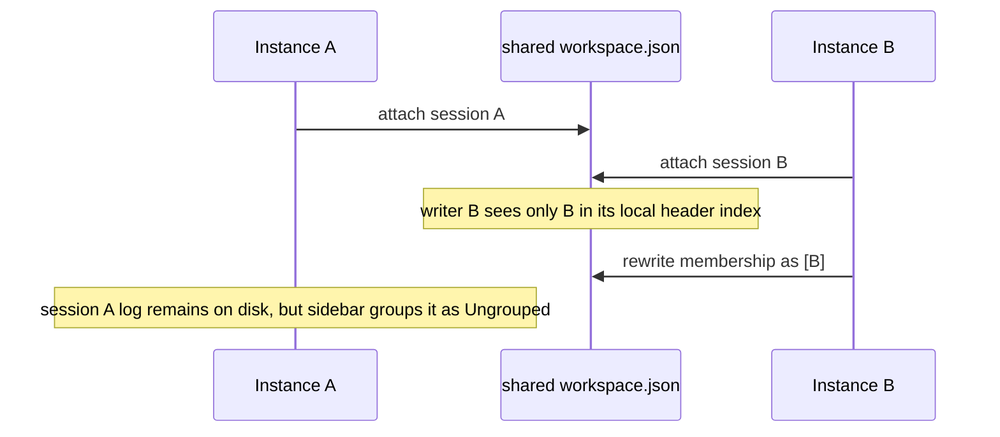

# When two DSH instances make Sessions fall into Ungrouped

Running two DeepSeek Harness Web instances can make workspace membership appear to “move” Sessions into **Ungrouped**. The session logs may still be intact; the durable workspace index is what was overwritten. This distinction determines whether to recover metadata or restore data.

The [upstream bug report (#1485)](https://github.com/deepseek-ai/deepseek-harness/discussions/1485) describes the failure when profiles use different Session roots but share one `DSH_HOME`: each process writes the home-level workspace store using only the Session headers it can see. The last writer can prune IDs owned by the other process.

## Recognize the failure signature

Look for all of these signals before attempting repair:

- two live `dsh web` processes or profiles point at the same `DSH_HOME`;
- `session-persistence-jsonl.root` is isolated, but the workspace storage root is not;
- the Session header’s canonical `cwd` still matches the workspace path;
- the workspace file contains only the most recently attached instance’s IDs;
- restarting or attaching again does not re-adopt the missing IDs.

If the Session log or header is missing, this is a different persistence problem. Do not overwrite the workspace store until you have made a copy of the entire DSH home and both Session roots.

## Why different Session roots do not fully isolate profiles

Profile patches can point each instance at a different JSONL Session root, but the Web bundle’s workspace domain can remain home-level. Each process builds an in-memory header index from its own Session root. During a workspace mutation, it filters IDs against that index. A valid ID from the other process looks unknown and can be removed from the shared `workspace.json`.

This is a multi-writer problem, not a cwd mismatch. The fact that a Session renders under Ungrouped means the log can still be discovered; it does not mean the workspace’s membership record is safe.

## Safe operating topology

Choose one of these topologies before running concurrent instances:

| Topology | Workspace store | Session roots | Assessment |
|---|---|---|---|
| One live Web instance | One | One | Safest default |
| Separate profiles, separate DSH homes | Separate | Separate | Strong isolation; explicit paths |
| Same DSH home, separate Session roots | Shared | Separate | Unsafe for concurrent workspace writes |
| Shared home with external writer lock | Shared | Separate or shared | Requires a lock around every workspace mutation |

The practical workaround is to give each concurrently running profile a distinct `DSH_HOME` (and therefore distinct `storages`), or to run only one writer for a workspace. Merely changing the Session JSONL root is not enough.

## Reproduce without risking real Sessions

Use a disposable workspace and copied configuration:

1. Start instance A with Session root `sessions-a` and attach Session `A`.
2. Start instance B with Session root `sessions-b` and the same workspace store.
3. Attach Session `B` from instance B.
4. Inspect the workspace membership file after each write; it may contain only `B`.
5. Confirm the header and log for `A` still exist, then stop both instances.

Never reproduce this against a production DSH home. A workspace metadata backup is cheap; reconstructing years of Session organization is not.

## Recovery checklist

1. Stop all writers and copy the complete DSH home, workspace store, and every Session root.
2. Compare the workspace’s missing IDs with the Session header index from each profile.
3. Verify each candidate’s canonical `cwd` is the intended workspace; do not reattach an ID based only on its prefix.
4. Restore membership using one writer or the supported re-attach operation, one Session at a time.
5. Restart the intended profile and verify the sidebar, archive state, and Session log all agree.
6. Keep the backup until a second restart and a new Session attachment prove the membership remains stable.

Do not “fix” the issue by deleting and recreating the workspace. That can discard archive and retention metadata while leaving the underlying Session logs untouched.

## Acceptance tests for a fix or plugin

- Two profiles can attach Sessions without either process deleting IDs it cannot index.
- A known Session whose canonical cwd differs is filtered deliberately and recorded as a repairable decision.
- An ID merely absent from the current process’s index is retained until its ownership is proven invalid.
- Archive and active Sessions survive a restart and a subsequent attachment from the other profile.
- The test inspects the durable workspace file, not only each process’s in-memory `workspace.list` response.
- Recovery remains possible after a crash because the writer uses an atomic update or a documented lock.

An Agent-facing plugin should surface the writer, store path, profile, and decision in diagnostics, but it must not silently modify another profile’s workspace file. Treat the workspace store as shared mutable state and apply the same single-writer discipline used for Session roots.

## Primary evidence

- [Upstream concurrent `DSH_HOME` workspace-membership bug (#1485)](https://github.com/deepseek-ai/deepseek-harness/discussions/1485)
- [Single-writer Session topology](../operations/single-writer-session-roots.md)
- [Session Collections and no-Workspace profiles](../operations/session-groups-workspace-less.md)
- [Archive, trash, and delete Sessions safely](../operations/session-archive-trash-delete.md)
