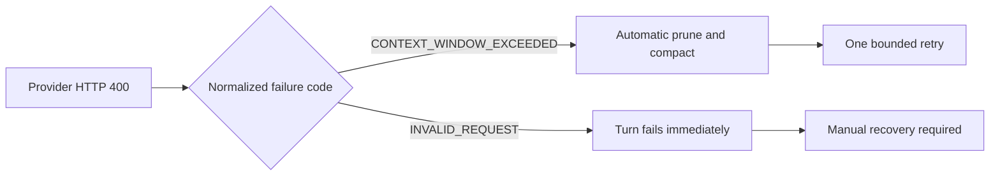
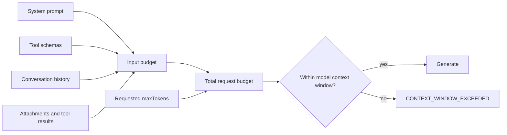

# Fix DeepSeek Harness context window exceeded errors

Use this guide when a provider rejects a DeepSeek Harness request with an error like:

```text
This model's maximum context length is 1048576 tokens.
However, you requested 1048728 tokens
(664728 in the messages, 384000 in the completion).
```

DeepSeek production traffic can report the same capacity failure in a less obvious shape:

```json
{"message":"Input token exceed the limit (request id: ...)","type":"api_error","param":"","code":"quota_limit_reached"}
```

This is a request-budget error, not an authentication failure and not necessarily a model outage. The provider is being asked to reserve more tokens than the selected model can accept.

> [!WARNING]
> At rc.7 commit `99f6f02`, the second wording is not classified as `CONTEXT_WINDOW_EXCEEDED`. It falls through as `INVALID_REQUEST`, so automatic prune, compact, and retry recovery does not run. The provider field `quota_limit_reached` is ambiguous here; route on the full error body, not the code name alone.

## Read the error as an equation

```text
request budget = input messages + requested completion
               = 664,728 + 384,000
               = 1,048,728

model context window = 1,048,576
overflow             =       152 tokens
```

The failure can therefore be fixed from either side:

- reduce the output reservation, called `maxTokens` inside Harness;
- reduce the input history through compaction or a new session;
- correct inaccurate model-capacity metadata so automatic pressure handling starts early enough.

## Classification decides whether recovery runs



The basic compaction service listens to `agent/request-error` and only enters overflow recovery when `failure.code` is exactly `CONTEXT_WINDOW_EXCEEDED`. A correct human-readable provider message is not enough if the adapter normalizes it to a different machine code.

At rc.7, the shared classifier recognizes structured names such as `context_length_exceeded`, phrases such as `maximum context length`, and input that is `too large for model context`. It does not recognize DeepSeek's terse `Input token exceed the limit` wording. Both the direct DeepSeek adapter and the pi-ai route depend on this shared classifier for text-based overflow recognition.

Do not globally reinterpret every `quota_limit_reached` as context overflow. Providers also use quota language for account balance and usage limits. The proposed narrow match requires `input token(s)` followed immediately by an `exceed... the limit` phrase.

Do not confuse this with an output that stopped because it actually reached `maxTokens`. That case preserves the partial answer and the Web UI shows **Output token limit reached**. A context-window rejection happens before normal generation begins.

## The request budget



`maxTokens` is a ceiling, not a prediction of how long the answer will be. A very large ceiling still reserves budget in providers that validate input plus maximum completion before generation. In the example above, reducing the completion ceiling by only 152 tokens would satisfy the arithmetic, but leaving such a narrow margin is fragile. The next message, tool schema, or attachment can overflow again.

## Why the Context Meter can still show room

The current Web UI meter is a prompt-occupancy reference, not a sendability guarantee. Its numerator is the projected prompt pressure for the next request:

```text
uncached input + cache reads + cache writes + projected surface movement
```

It deliberately excludes response output and does not reserve the configured conversation `maxTokens`. The provider can therefore reject a request even when the ring remains below 100 percent:

```text
UI ring                 = projected prompt / context window
provider admission      = prompt + requested completion <= context window
```

The System, Tools, and Messages rows in the meter are also a heuristic composition estimate. They are not expected to add up to the provider-anchored numerator. The fixed estimator can underprice CJK text and JSON schemas, while the headline stays anchored to the newest provider usage sample plus later surface changes.

Reasoning tokens are not simply missing from cumulative usage: they are included in `outputTokens`. They do not belong to the prompt-only occupancy numerator. When deciding whether the next request fits, read the provider error and combine the displayed prompt estimate with the active completion reservation.

## Fast recovery for one conversation

Try the least destructive options in this order.

### 0. Record the raw and normalized errors

Before changing the Session, save the sanitized provider response body and the Harness failure code. If the body says `Input token exceed the limit` while Harness reports `INVALID_REQUEST`, you are on the rc.7 classifier gap. Repeatedly retrying the same turn cannot activate overflow recovery.

### 1. Lower the output limit

In the Web UI, open the active conversation's model settings and lower the maximum output tokens. Use a value that leaves meaningful headroom rather than matching the error boundary exactly.

For example, changing the requested completion from `384000` to `128000` in the error above leaves about 255,848 tokens for growth:

```text
1,048,576 - 664,728 - 128,000 = 255,848
```

Choose the limit based on the task. A short diagnosis rarely needs hundreds of thousands of output tokens. A long code-generation task may need more, but should still leave room for its input, tool schemas, and follow-up steps.

### 2. Compact before retrying

If the shipped profile includes the human compaction command, send:

```text
/compact
```

The command takes no arguments. It summarizes one useful balanced older span and reports the replaced history-item count and estimated tokens. It runs as a command, not as another ordinary model turn.

Wait for a successful compaction result, then retry the original request once. Do not repeatedly submit the same failed prompt while the history is already over budget.

If `/compact` reports `Compaction could not produce a useful summary`, the summarizer may itself be unable to read the already oversized history. Lower the active output reservation first. If that still does not create a summarizable envelope, move directly to a clean continuation rather than looping on `/compact`.

### 3. Start a clean continuation

Use a new session when there is no compactable history, the newest indivisible item is itself too large, or compaction cannot create enough room. Carry forward a short explicit handoff containing:

- the goal and current state;
- decisions that must remain true;
- exact file paths and commands;
- unresolved errors;
- the single next action.

Do not paste the entire old transcript into the new session. That recreates the same input pressure.

## Make the fix durable

### Set a realistic provider output cap

The direct DeepSeek adapter exposes `maxTokens` as the default per-request output cap. An exact model entry can override it:

```yaml
- name: '@deepseek-ai/dsh-llm-deepseek'
  config:
    maxTokens: 128000
    defaultContextWindow: 1048576
    models:
      - id: deepseek-v4-flash
        contextWindow: 1048576
        maxTokens: 128000
```

Treat this as an illustrative patch fragment, not a complete profile. Inspect the resolved composition before editing:

```sh
dsh --profile web --dump-config
```

Apply the value to the adapter instance that owns the active provider route. A conversation-level explicit value wins over the adapter default, so also check the active conversation settings if the outgoing request still uses the old cap.

### Verify capacity metadata

Automatic compaction measures pressure against the routed model's context capacity. For the direct DeepSeek adapter:

- an exact model `contextWindow` describes that model;
- `defaultContextWindow` is used when the selected model has no exact value;
- `maxTokens` is the output ceiling and is not the same setting as `contextWindow`.

Do not increase `contextWindow` merely to silence local pressure detection. If it exceeds the provider's real limit, Harness will compact too late and the provider remains authoritative.

### Tune compaction only after fixing the cap

The shipped basic compaction backend defaults to:

| Setting | Default | Meaning |
|---|---:|---|
| `thresholdRatio` | `0.8` | compact when measured context reaches 80 percent of capacity |
| `retainRatio` | `0.16` | keep a recent tail equal to 16 percent of capacity |
| `maxTokens` | `8192` | output cap for the separate summarization call |
| `maxOverflowRetries` | `1` | retry once after canonical overflow if the durable surface shrinks |

The compaction backend's `maxTokens` controls the summary call. It is different from the conversation model's output cap. Name the layer whenever you change either value.

Example policy for a known route:

```yaml
- name: '@deepseek-ai/dsh-compaction-basic'
  config:
    thresholdRatio: 0.75
    retainRatio: 0.15
    maxOverflowRetries: 1
    modelPolicies:
      - provider: deepseek-official
        model: deepseek-v4-flash
        thresholdRatio: 0.75
        retainRatio: 0.15
```

Lowering the threshold creates more headroom but causes earlier summary calls and more cache invalidation. Confirm the provider and model identifiers from the resolved profile; exact policy matching uses both fields.

## When automatic recovery does not help

Canonical provider overflow can trigger one maximal balanced head reduction and an immediate retry. Recovery still has limits:

- system prompts and tool schemas are outside ordinary conversation-surface compaction;
- the newest indivisible message or attachment may be larger than the available budget;
- a tool unit may remain too large after its text result is pruned;
- capacity metadata may be absent or inaccurate;
- summarization can fail or fail to shrink enough;
- `maxOverflowRetries: 0` disables overflow recovery.
- a real overflow normalized as `INVALID_REQUEST` never reaches the recovery listener.

If a tiny 152-token overflow reaches the provider despite automatic compaction, first compare the raw provider body with the normalized Harness failure code. Then check whether the profile mounts the basic compaction service, whether the selected route exposes the correct context window, and whether an explicit conversation `maxTokens` value consumes the remaining headroom.

## Verification checklist

After changing configuration or compacting, verify all of these:

1. `--dump-config` shows the intended adapter and compaction values.
2. The selected provider and model match the exact policy entry.
3. The next outgoing completion cap is lower than before.
4. The context meter has meaningful headroom, not merely a few hundred tokens.
5. One retry generates normally without `CONTEXT_WINDOW_EXCEEDED`.
6. A longer follow-up still triggers proactive compaction before the provider boundary.
7. A regression fixture using `Input token exceed the limit` normalizes to `CONTEXT_WINDOW_EXCEEDED`, not `QUOTA` or `INVALID_REQUEST`.
8. A genuine monthly usage-limit message does not enter context-overflow recovery.

## Diagnostic bundle for an upstream report

Remove credentials, prompts, private paths, and proprietary tool output. Include:

```text
Harness version or commit:
Surface and profile:
Provider and model route:
Raw provider status, code, type, and sanitized message:
Normalized Harness failure code:
Provider-reported context window:
Input/message tokens from the error:
Requested completion tokens from the error:
Conversation-level maxTokens:
Adapter default maxTokens:
Exact model contextWindow and maxTokens:
Compaction thresholdRatio and maxOverflowRetries:
Was /compact available and what did it report?:
Did a new empty session reproduce?:
```

## Source boundary

This page was verified against DeepSeek Harness commit `99f6f02fecdb7dff40c3fbc9470f5907c29f74ca`.

- [Shared context-overflow classifier](https://github.com/deepseek-ai/deepseek-harness/blob/99f6f02fecdb7dff40c3fbc9470f5907c29f74ca/packages/llm/llm/src/error.ts)
- [Direct DeepSeek HTTP error normalization](https://github.com/deepseek-ai/deepseek-harness/blob/99f6f02fecdb7dff40c3fbc9470f5907c29f74ca/packages/llm/llm-deepseek/src/adapter.ts)
- [pi-ai stop-reason mapping](https://github.com/deepseek-ai/deepseek-harness/blob/99f6f02fecdb7dff40c3fbc9470f5907c29f74ca/packages/llm/llm-pi-ai/src/stream.ts)
- [Basic compaction policies and defaults](https://github.com/deepseek-ai/deepseek-harness/blob/99f6f02fecdb7dff40c3fbc9470f5907c29f74ca/packages/compaction/compaction-basic/README.md)
- [Canonical overflow recovery listener](https://github.com/deepseek-ai/deepseek-harness/blob/99f6f02fecdb7dff40c3fbc9470f5907c29f74ca/packages/compaction/compaction-basic/src/index.ts)
- [Human `/compact` command contract](https://github.com/deepseek-ai/deepseek-harness/blob/99f6f02fecdb7dff40c3fbc9470f5907c29f74ca/packages/compaction/command-compact/README.md)
- [Prompt-only context-pressure projection](https://github.com/deepseek-ai/deepseek-harness/blob/99f6f02fecdb7dff40c3fbc9470f5907c29f74ca/packages/llm/token-meter/src/usage-projection.ts)
- [Context meter semantics and heuristic breakdown](https://github.com/deepseek-ai/deepseek-harness/blob/99f6f02fecdb7dff40c3fbc9470f5907c29f74ca/packages/llm/token-meter/src/projection.ts)
- [DeepSeek production wording report #3399](https://github.com/deepseek-ai/deepseek-harness/discussions/3399)
- [Original context-window report](https://github.com/deepseek-ai/deepseek-harness/discussions/1930)
- [Context-meter budget mismatch report](https://github.com/deepseek-ai/deepseek-harness/discussions/1937)
