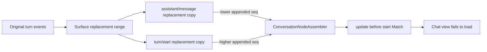

# Recover a conversation that updates before its start Match

Use this runbook when opening one existing DeepSeek Harness Session fails with an error like:

```text
conversation Context 9:turn-tail8 received an update before its start Match
```

This is a client conversation-projection failure. A surface replacement can copy an update for a turn before it copies that turn's `turn/start`. The durable Session may still be structurally valid and usable by non-conversation readers.

Do not edit or renumber the live Session log. Preserve an export, move active work to a fresh Session, and treat any local runtime patch as disposable until an upstream release owns the behavior.

## Classify the exact failure

The context key carries useful evidence:

```text
conversation Context 9:turn-tail8
                     ^ ^^^^^^^^^^
                     | kind + id
                     Definition index
```

For the verified incident, `turn-tail8` is the `turn-tail` conversation node for turn 8. Its update was an `assistant/message`; its start was `turn/start`. Both were replacement copies, but their appended sequence order was update first, start second.

| Observation | What it supports | What it does not prove |
|---|---|---|
| Only one old Session fails | data-dependent projection path | corrupt persistence bytes |
| A fresh Session loads | Host and provider are broadly usable | the old log is safe to rewrite |
| Restart reproduces the same key | deterministic replay from stored events | a cache or plugin fault |
| Session export succeeds | Host can read and flush the log | the Web conversation assembler can project it |
| `session-query` can read events | logical log passes that reader's contract | conversation-node ordering is valid |

Do not merge this signature with `more than one start Match`. That error can be an identity collision. Here the assembler has one start, but an earlier update occupies `matches[0]`.

## The verified ordering chain



The assembler sorts pending additions by event sequence. It records the discovered start, then requires that exact match to be the first entry. When a replacement update has a lower appended sequence than its start copy, the invariant fails even though both events belong to the same replacement operation.

At rc.8, the same invariant is enforced in three paths:

1. `acceptMatch()` rejects a newly arriving start after any match already exists.
2. `applyPendingMatches()` merges a replacement window and rejects a start that is not `matches[0]`.
3. `replayContext()` refuses to rebuild state unless `matches[0]` is the start.

A fix in only one path leaves cold load, live append, or later replay inconsistent.

## Preserve the Session before recovery

1. Stop sending messages to the affected Session.
2. Use **Session log** or `/export` if the view still exposes it. The Web command downloads `GET /api/session.export?sessionId=<id>&includeDescendants=true`.
3. If the conversation route crashes before export is reachable, stop every process that can write the Session root and copy the complete Session directory.
4. Hash the untouched evidence copy. Inspect only another copy.
5. Record the exact Harness package version, source commit, Session id, context key, stack trace, and first failing load time.

An exported archive can contain prompts, file paths, tool output, and credentials embedded by user workflows. Sanitize a derivative copy before sharing; retain the original privately.

## Restore work without mutating evidence

### 1. Start a fresh Session

Create a new conversation in the same workspace. Reconstruct only the minimum current task context from a reviewed transcript or summary. Do not fork from the affected tail: a fork can retain the same replacement surface that triggers projection.

### 2. Prove the boundary

Open the new Session, send one bounded read-only prompt, then reload it. If the fresh Session works while the old Session fails with the same context key, the evidence favors a data-driven conversation projection failure over a general Web, provider, or workspace outage.

### 3. Archive, do not delete

Archive the affected Session after preserving evidence. Archiving changes list visibility; it does not repair or erase the durable log.

### 4. Test an exact fixed build separately

When an upstream fix exists, run its exact commit or release against a disposable copy and isolated Harness home first. Confirm the old Session renders, a fresh Session still renders, and the exported event stream remains unchanged. Keep the previous release available for rollback.

## Read-only evidence extraction

The minimal proof is a pair of matched events for the same conversation context where the update's appended `seq` is lower than the start's:

```json
[
  {
    "seq": 101,
    "type": "assistant/message",
    "data": { "turn": 8, "step": 0, "message": { "content": [] } },
    "surfaceOp": { "op": "replace", "start": 1, "end": 99 }
  },
  {
    "seq": 102,
    "type": "turn/start",
    "data": { "turn": 8 }
  }
]
```

Preserve these facts in a sanitized reproduction:

- appended `seq` order;
- event type, turn, and step;
- `surfaceOp` range and `sourceEventSeqs`;
- the registered conversation-node Definition;
- whether failure occurs in `replaceWindow()`, live append, or explicit replay.

Do not publish real Session logs. Replace message content and paths while keeping identity, ordering, and replacement metadata exact.

## Unsafe shortcuts

- Do not swap the two durable event lines. Sequence numbers, replacement references, checksums, and other projections still describe the original log.
- Do not delete the early update. It may be the visible assistant output produced by compaction or another replacement owner.
- Do not repeatedly reopen the Session and attribute persistence of the error to new corruption. Deterministic replay should reproduce it.
- Do not disable the invariant globally. Start-first ordering is part of Definition state construction; accepting arbitrary orders can hide unrelated malformed contexts.
- Do not patch only the bundled `lib/client.js` and call the data repaired. That changes one local reader, not the durable Session or source contract.
- Do not share the archive before a content and credential review.

## Upstream repair contract

The source fix must choose and document one owner:

- the replacement producer emits copies in Definition-safe order; or
- the conversation assembler treats the unique start as logically first even when its appended sequence is later.

If the assembler owns normalization, it should preserve update order relative to other updates, reject duplicate starts, keep location and sequence indexes truthful, and apply the same rule in live acceptance, pending-window merge, and replay. Moving a start to index zero is not sufficient unless downstream readers explicitly distinguish logical Definition order from durable sequence order.

## Regression gates

- A replacement update followed by its start loads without throwing.
- A start followed by updates retains existing behavior.
- Multiple pre-start updates retain their relative update order.
- A duplicate start still fails with the duplicate-start diagnostic.
- An update with no eventual start remains incomplete rather than fabricating state.
- `acceptMatch`, `applyPendingMatches`, and `replayContext` agree.
- Replacement-window load and live append converge on the same context state.
- Location indexes and `contextsBySeq` still point to the original event sequences.
- Dependencies are rebuilt from the actual start event.
- Ordinary non-replacement turns are unchanged.
- The 2-event sanitized reproduction passes.
- A corpus replay covers compacted and tool-result-pruned Sessions without exposing private content.

## Incident bundle

```text
Harness version and source commit:
Operating system and browser:
Session id (redacted if shared publicly):
Exact context key and stack trace:
First update event type / seq / turn / step:
Start event type / seq / turn:
surfaceOp range and sourceEventSeqs:
Does a fresh Session load and reload?
Does restart reproduce the same key?
Untouched export preserved: yes/no
Sanitized two-event reproduction attached: yes/no
```

## Primary sources

Verified against DeepSeek Harness rc.8 commit `141eb6fef83422698aef7a981029e843e8161534`. The upstream report reproduced the failure on rc.7; the three invariant checks remain present at the verified rc.8 commit.

- [Upstream reproduction #3450](https://github.com/deepseek-ai/deepseek-harness/discussions/3450)
- [rc.8 conversation assembler](https://github.com/deepseek-ai/deepseek-harness/blob/141eb6fef83422698aef7a981029e843e8161534/packages/client/runtime/src/client/sessions/conversation-assembler.ts)
- [rc.8 Session export command](https://github.com/deepseek-ai/deepseek-harness/blob/141eb6fef83422698aef7a981029e843e8161534/packages/session-query/session-log-export/README.md)
- [rc.8 Session query surface validation](https://github.com/deepseek-ai/deepseek-harness/blob/141eb6fef83422698aef7a981029e843e8161534/packages/session-query/session-query/README.md)
- [rc.8 compaction surface-replacement contract](https://github.com/deepseek-ai/deepseek-harness/blob/141eb6fef83422698aef7a981029e843e8161534/docs/subsystems/compaction.md)
- [Session-history corruption router](session-history-corruption-triage.md)
