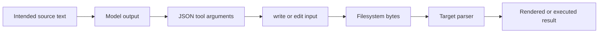

# Stop losing escapes when generated code contains more code

HTML containing OpenAPI examples, JavaScript templates containing shell commands, and PowerShell containing paths all place one language inside another. A backslash or dollar sign can be consumed before DeepSeek Harness calls a filesystem tool, even when the final `write` operation is byte-faithful to its argument.

Do not diagnose this from the damaged file alone. Capture the first boundary where intended text and observed text differ.

## The current file tools are literal at their boundary

At rc.2 commit `b150a55`, `write` validates only that `file_path` is non-blank, returns `content` untouched from `parseWriteArgs`, then passes it directly to `ctx.fs.writeText`. The `edit` tool passes literal `old_string` and `new_string` to `ctx.fs.editText`; it does not interpret regular expressions or template syntax.

That establishes a precise distinction:

| Evidence | Likely owner |
|---|---|
| tool-call `content` is already damaged | model construction or an earlier string/JSON layer |
| tool-call argument is correct, returned `after` is damaged | filesystem tool/provider boundary |
| returned `after` is correct, later runtime behaves differently | target language parsing, encoding, line endings, or build transformation |
| file was correct, then a later edit damages it | later mutation, stale read, ambiguous match, or generated replacement |

The tool cannot infer whether a missing backslash was intentional. “Repairing” content after it arrives would corrupt legitimate input.

## Trace the representation ladder



For one minimal failure, retain:

1. the exact user-requested fragment;
2. the structured tool-call arguments as displayed in the Session/tool record;
3. the tool result `after` value or diff metadata;
4. an immediate readback of the narrow written range;
5. a byte/hash observation from a trusted local command when exact bytes matter;
6. the target parser, formatter, compiler, or renderer error.

Redact secrets before sharing. Preserve escape characters as downloadable artifacts or fenced blocks, not screenshots alone.

## Reduce nesting instead of counting slashes

### Externalize executable examples

Prefer:

```html
<script src="./examples/client.js"></script>
```

over a large inline script that contains JSON, code samples, regular expressions, and shell strings. Store OpenAPI as its own `.yaml` or `.json` artifact and load it through the renderer's supported API. This gives every language one parser and lets later edits target the real source file.

If the documentation must be a single distributable HTML file, build that artifact from separate reviewed sources. Do not author the bundled representation directly.

### Write one language per operation

Create the HTML shell first. Create JavaScript, JSON, YAML, CSS, and example programs as separate files. Validate each artifact with its native parser. Only then run a deterministic bundler if single-file output is required.

When direct embedding is unavoidable, insert one uniquely delimited block into a file that has already been read. Keep the outer edit small and immediately read the edited range back.

### Avoid an extra program-string layer

Do not call `run_code` merely to construct a long JavaScript string that will be passed to `write`. That adds JavaScript literal rules around the JSON tool-call layer and the target language. Call the file tool directly when the intended artifact is already text.

Code Mode remains useful for bounded orchestration, hashing, parsing, and verification. It should not become an unnecessary quoting tunnel.

## Use artifacts as the unit of truth

For a generated OpenAPI documentation page, keep this source layout:

```text
docs-page/
├── index.html
├── openapi.yaml
├── examples/
│   ├── curl.sh
│   ├── client.js
│   └── client.py
└── verify.mjs
```

The build may later produce `dist/index.html`, but source review and edits operate on the four languages independently. Record a digest manifest after validation:

```text
openapi.yaml  sha256:...
client.js     sha256:...
client.py     sha256:...
index.html    sha256:...
```

Digests detect unexpected mutation; they do not explain it. Keep the representation ladder evidence to locate the owner.

## A bounded write-and-verify procedure

1. Stop after the first repeated escape failure. Do not ask the model to retry the same long literal.
2. Preserve the current diff and exact tool-call arguments.
3. Split nested languages into separate source artifacts.
4. Write one artifact directly with `write`.
5. Read back the changed region immediately.
6. Compare a cryptographic digest if byte identity is required.
7. Run the native parser or syntax checker for that artifact.
8. Commit or checkpoint the verified unit before editing the next language.
9. Assemble the final page with a deterministic build step.
10. Validate the built output in the real renderer or browser.

Examples of independent validation:

```sh
node --check examples/client.js
python -m py_compile examples/client.py
python -c "import yaml; yaml.safe_load(open('openapi.yaml', encoding='utf-8'))"
```

Use the project's actual pinned parser when possible. A generic YAML loader does not prove OpenAPI schema validity.

## Literal edit safety

The rc.2 `edit` tool requires `old_string` to match exactly once by default. This is useful for containing changes, but it also means invisible CRLF, tabs, non-breaking spaces, or Unicode normalization can make a visually identical fragment fail.

When a match fails:

- read a narrow range again;
- keep tabs and line endings visible in diagnostic output;
- choose a longer unique structural anchor;
- avoid `replace_all` unless every match is intended;
- do not switch to a broad regular expression merely to force success.

When a read is clipped or reports a total larger than the returned content, never round-trip that partial content through full-file `write`. Use a targeted edit or a trusted local transformation that reads the complete file and verifies the result.

## Failure routing

| Symptom | Next evidence | Avoid |
|---|---|---|
| `D:\\path` becomes `D:path` | tool-call argument before execution | adding more slashes without counting representation layers |
| `$env:X` disappears | exact string literal and interpolation context | blaming PowerShell before inspecting the generated artifact |
| inline script breaks HTML | HTML parser location plus source artifact | editing minified/bundled output as the source of truth |
| `edit` finds zero matches | escaped view of the exact file range | broad `replace_all` |
| `edit` finds multiple matches | longer unique anchor | selecting by stale line number after earlier edits |
| syntax passes but rendering fails | browser console, network, CSP, and DOM evidence | more escaping changes without a parser error |
| repeated retries consume tokens | first divergent boundary | allowing an unbounded repair loop |

## Acceptance matrix

- Intended fixtures cover backslash, dollar, backtick, quote, CRLF, tab, Unicode, `${...}`, `</script>`, and triple-backtick content.
- The captured tool-call argument can be compared with the intended fixture without manual retyping.
- `write` readback equals the intended UTF-8 text.
- `edit` changes one exact unique block and leaves surrounding bytes stable.
- Separate JavaScript, Python, shell, JSON/YAML, and HTML artifacts pass native validation.
- A deterministic build produces the same digest twice from unchanged sources.
- Single-file bundling escapes the HTML script-closing boundary correctly.
- No secret-bearing example reaches Session screenshots, logs, or public fixtures.
- A failed parser stops the pipeline before later files are modified.
- A repeated identical failure stops after one diagnostic retry.
- Large or clipped reads are never used as complete-file replacement input.
- Line-ending conversion, if any, is explicit and tested on the target platform.

## What a stronger editing system could add

Useful improvements belong at explicit boundaries: downloadable tool-argument artifacts, byte counts and digests in write results, parser-aware artifact tools, heredoc/file attachment inputs that avoid program literals, and bounded no-progress detection. None should silently reinterpret a string that has already reached `write`.

## Primary sources

Verified against DeepSeek Harness rc.2 commit `b150a551b8d465e31e418e1b2eaf5e79bbb7d28e` on 2026-08-27.

- [Embedded OpenAPI/code escaping report #4699](https://github.com/deepseek-ai/deepseek-harness/discussions/4699)
- [Earlier write-boundary investigation #2373](https://github.com/deepseek-ai/deepseek-harness/discussions/2373)
- [Batch-edit and partial-read incident #2414](https://github.com/deepseek-ai/deepseek-harness/discussions/2414)
- [rc.2 literal write implementation](https://github.com/deepseek-ai/deepseek-harness/blob/b150a551b8d465e31e418e1b2eaf5e79bbb7d28e/packages/fs/tool-fs/src/write.ts)
- [rc.2 literal edit implementation](https://github.com/deepseek-ai/deepseek-harness/blob/b150a551b8d465e31e418e1b2eaf5e79bbb7d28e/packages/fs/tool-fs/src/edit.ts)
- [rc.2 string-replace editor contract](https://github.com/deepseek-ai/deepseek-harness/blob/b150a551b8d465e31e418e1b2eaf5e79bbb7d28e/packages/fs/tool-str-replace-editor/README.md)
