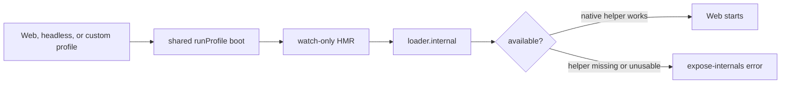

# Fix `--expose-internals is required for HMR service`

When a DeepSeek Harness source-checkout profile exits with:

```text
--expose-internals is required for HMR service
```

do not immediately add a permanent Node flag. First prove which launch path you are using, whether the repository-pinned pnpm version installed the native helper correctly, and whether only the fallback Node-internals path changes the result.

The observed report uses `pnpm dsh web`, but the startup path is not Web-only. `runProfile()` is shared by Web, headless, and custom profiles. After boot, it installs patch-file watching unconditionally while the root is active. If the composed tree has no HMR service, it mounts watch-only HMR with `root: []`; both the Web and headless bundles disable the shared module-reload row and therefore enter that fallback. A custom profile that omits or disables HMR enters it too.

At upstream commit `99f6f02`, the repository pins `pnpm@11.7.0`, supports Node `^22.19.0 || >=24.0.0`, and launches the source CLI without `--expose-internals`. A normal source setup is therefore expected to start without manually editing the root `dsh` script.

> [!WARNING]
> `--expose-internals` opens unsupported Node implementation modules. Use the direct command below only as a short diagnostic in a disposable source checkout. It is not a security hardening flag, a deployment recommendation, or a durable fix.

## Route the installation before changing it

| Launch | What it means | First evidence |
|---|---|---|
| `pnpm dsh web` from repository root | source workspace | Git SHA, Node version, package-manager pin, actual pnpm version |
| `npx @deepseek-ai/dsh web` | published package path | exact package version and npx cache/install log |
| `pnpm add -g ...` then `dsh web` | global virtual-store path | global package location and dependency resolution |
| packaged executable | bundled distribution | executable version and install source |

Do not apply a source-tree command to a global install. Dependency visibility differs across these layouts.

## Establish the blast radius

| Profile result | HMR path | Exposure when `loader.internal` is absent |
|---|---|---|
| Web bundle disables shared HMR | post-boot watch-only fallback | constructor fails before the Web run can continue |
| headless bundle disables shared HMR | the same fallback, before bounded shutdown removes watchers | one-shot startup can fail too |
| custom profile has no HMR service | the same fallback | fails while the root is still active |
| profile mounts module-reload HMR | composition-time HMR service | can fail earlier at the same constructor check |

`disabled: true` is not a safety boundary here: it removes the shared service, which is exactly the condition that triggers the fallback. Diagnose the resolved composition and the shared `runProfile()` lifecycle, not only the surface name.

## Why the error appears

When the resolved composition lacks HMR, profile boot later mounts a watch-only HMR instance with `root: []` so user patch changes stay live. HMR still requires `ctx.loader.internal` at construction. Its initializer also reads `this.internal.loadCache` even with no module roots, so removing only the constructor error would merely move the crash; a real upstream repair must preserve module-reload requirements while separating the watch-only path.

The loader tries two ways to obtain Node’s internal ESM loader:

1. if `process.execArgv` contains `--expose-internals`, require the internal module directly;
2. otherwise call the optional native helper `node-addon-require-builtin`.

Both failures are swallowed and `fromInternal()` returns `undefined`. HMR then emits the visible flag-focused error even when the actual failure is native-helper discovery or loading.



The message identifies the missing loader capability, not necessarily the root cause.

## Safe source-checkout diagnosis

### 1. Capture immutable version evidence

From the repository root:

```sh
git rev-parse HEAD
node --version
node -p "require('./package.json').packageManager"
corepack pnpm --version
pnpm --version
```

At the verified revision, the project pin is `pnpm@11.7.0`. If `pnpm --version` disagrees with `corepack pnpm --version`, the shell may be bypassing the project’s package-manager selection.

### 2. Prefer a fresh-clone A/B test

Keep the failing checkout as evidence. In a new disposable sibling directory, use the repository’s documented Corepack setup and pinned manager:

```sh
corepack enable
corepack pnpm install --frozen-lockfile
corepack pnpm dsh web
```

If a clean pinned install succeeds, compare the failing checkout’s Node/pnpm versions, lockfile status, dependency links, and install warnings. Do not copy the fresh `node_modules` tree into the old checkout.

### 3. Probe the helper from its real resolution point

Run this from the repository root:

```sh
node -e "const{createRequire}=require('node:module');const{pathToFileURL}=require('node:url');const r=createRequire(pathToFileURL('vendor/loader/package.json'));console.log(r.resolve('node-addon-require-builtin'));console.log(typeof r('node-addon-require-builtin').requireBuiltin)"
```

Interpretation:

- resolution failure: the loader package cannot see the helper in this install layout;
- `requireBuiltin` loads but later startup still fails: capture the complete error and platform-package layout;
- the probe works and `pnpm dsh web` still fails: do not assume the same cause; preserve the first stack.

### 4. Use the direct flag only as a diagnostic A/B

The supported Node line may reject this flag in `NODE_OPTIONS`, and the loader checks `process.execArgv`. Use a direct invocation:

```sh
node --expose-internals --import tsx/esm apps/cli/src/bin.ts web
```

If this starts while `pnpm dsh web` fails, the missing `loader.internal` chain is implicated. Stop the process, record the result, and return to repairing the installation or tracking the upstream fix. Do not modify the repository script just to make the probe permanent.

## Recovery choices

### Source contributors

Use the exact package-manager pin and a clean install. If the pinned clean clone still fails, report:

- OS and architecture;
- Node and pnpm versions;
- Git SHA;
- install warnings;
- helper resolution/probe result;
- ordinary launch result;
- direct-flag A/B result.

### Published-package users

Reproduce with the recommended package path in a disposable directory:

```sh
npx @deepseek-ai/dsh web
```

Record the resolved package version. If only a global pnpm install fails, report the global virtual-store layout separately; do not turn a global-layout problem into a source-build report.

### Operators who only need a working runtime

Prefer a published release or packaged distribution over an arbitrary source checkout. Pin the package version and keep the failing source environment available for diagnosis.

## Avoid misleading fixes

- **Do not set `NODE_OPTIONS=--expose-internals`.** It may be rejected on the supported Node line and is not what the loader’s `process.execArgv` check asks for.
- **Do not permanently edit the root `dsh` script first.** That hides the helper/install failure and creates an unsupported local launch contract.
- **Do not delete the failing checkout before collecting evidence.** A fresh sibling clone gives a cleaner A/B.
- **Do not weaken HMR into a silent no-op.** Profile patch watching is a documented behavior; absence should be explicit.
- **Do not assume headless is unaffected.** Its disabled shared HMR row also causes the shared launcher to mount the watch-only fallback while the root remains active.
- **Do not blame a Unicode path without an A/B.** The failure can occur from package-manager or native-helper resolution independently of path text.

## Minimal report

```text
Install path: source / npx / global / packaged
OS and architecture:
Git SHA or package version:
node --version:
package.json packageManager:
corepack pnpm --version:
pnpm --version:
Install warnings:
Helper resolves from vendor/loader: yes/no
requireBuiltin export present: yes/no
pnpm dsh web result:
Direct --expose-internals A/B result:
Complete first stack:
```

## Primary sources

- [Upstream report and investigation #2699](https://github.com/deepseek-ai/deepseek-harness/discussions/2699)
- [Pinned engines, package manager, and source `dsh` script at `99f6f02`](https://github.com/deepseek-ai/deepseek-harness/blob/99f6f02fecdb7dff40c3fbc9470f5907c29f74ca/package.json)
- [Official development prerequisites](https://github.com/deepseek-ai/deepseek-harness/blob/99f6f02fecdb7dff40c3fbc9470f5907c29f74ca/docs/development.md)
- [Watch-only HMR mount in profile boot](https://github.com/deepseek-ai/deepseek-harness/blob/99f6f02fecdb7dff40c3fbc9470f5907c29f74ca/apps/cli/src/profile-boot.ts)
- [Headless bundle disables shared HMR and relies on the launcher fallback](https://github.com/deepseek-ai/deepseek-harness/blob/99f6f02fecdb7dff40c3fbc9470f5907c29f74ca/packages/bundle/headless/cordis.patch.yml)
- [Optional internal-loader discovery](https://github.com/deepseek-ai/deepseek-harness/blob/99f6f02fecdb7dff40c3fbc9470f5907c29f74ca/vendor/loader/src/internal.ts)
- [HMR’s loader-internal requirement](https://github.com/deepseek-ai/deepseek-harness/blob/99f6f02fecdb7dff40c3fbc9470f5907c29f74ca/vendor/hmr/src/index.ts)
