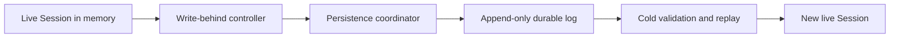

# Protect and recover DeepSeek Harness session logs

Use this guide when a live DeepSeek Harness session loses, replaces, or corrupts its durable session artifact.

The safe rule is simple:

> Treat a live session log as an append-only database file. Stop its writer before copying, replacing, deleting, or repairing it.

This is not only a file-system concern. DeepSeek Harness keeps a live in-memory `Session`, batches events through a write controller, and appends them to a durable backend. The live object and the disk artifact have different authority at different moments.

## The ownership model



While a process owns a live session, the in-memory `Session` is authoritative and the coordinator tracks the next durable sequence. After the writer stops, the stored log becomes the source for validation, crash-tail repair, and replay.

External mutation breaks that handoff:

- deleting the directory leaves the live writer pointing at a path that no longer exists;
- replacing the artifact changes the stored prefix without updating the live coordinator cursor;
- editing a committed middle event can violate sequence, message, or tool-pairing invariants;
- copying a live artifact may capture a valid prefix, a torn tail, or an older revision depending on timing.

## Recognize the failure class

| Symptom | Boundary | First response |
|---|---|---|
| `ENOENT` from `appendLines` or `appendBatch` | durable path disappeared | stop the writer and preserve every surviving artifact |
| `SessionPersistenceCorruptionError` on load | committed log failed validation | keep the raw file unchanged and identify the first invalid event |
| sequence gap or duplicate `seq` | append-only ordering | do not append more events or renumber blindly |
| `message must have tool source` | tool result identity | inspect the assistant call, `tool/call`, and `tool/result` as one set |
| session works until reload | live memory differs from durable replay | export visible evidence, stop cleanly, then test the cold artifact |

## If the session is still running

Do not send another prompt just to test it. Another turn can add in-memory events, retry the failed batch, or widen the difference between memory and disk.

1. Record the Harness version or commit, surface, profile, workspace, session ID, and first persistence error.
2. Capture the visible transcript or task result without invoking another agent turn.
3. Stop the Harness process gracefully if the surface still responds. If it does not, preserve the terminal output before terminating it.
4. Copy the entire affected session directory to a separate recovery location only after the writer has stopped.
5. Keep the original artifact read-only. Perform diagnosis and experiments on copies.

Do not assume that recreating only the missing directory recovers the history. If the next append starts at a non-zero sequence without the earlier prefix, a later reader must reject the gap. A correct runtime recovery must either restore the original durable prefix or rematerialize the complete authoritative live event sequence from `seq: 0`.

## If the process has stopped

Classify the artifact before changing it.

### Artifact is missing

Search backups, snapshots, container volumes, and the exact `$DSH_HOME` used by the failed process. A different user, service unit, or container can resolve a different home directory.

If no durable artifact survives, do not create an empty file with the same session ID. The missing event history cannot be reconstructed from the ID alone. Preserve any exported transcript and begin a new session with an explicit handoff summary.

### Artifact was externally replaced

Preserve both the replacement and any older copy. Record file size, modification time, and a cryptographic digest before inspection:

```sh
stat /path/to/session.jsonl
sha256sum /path/to/session.jsonl
```

For a zstd artifact, keep the compressed original. Decompress into a separate file for inspection rather than overwriting it:

```sh
zstd -dc /path/to/session.jsonl.zstd > /recovery/session.decoded.jsonl
```

The replacement may be internally valid but still conflict with the live session prefix. A successful JSON parse does not prove that it is safe to resume.

### Artifact loads only after a crash

DeepSeek Harness cold recovery has a narrow contract. It may discard a never-fully-written torn tail and append deterministic closers for an interrupted final turn. It does not treat arbitrary committed middle corruption as a repairable crash tail.

The synthetic closers preserve tool safety:

- a recorded assistant tool request that never started receives `TOOL_NOT_STARTED`;
- a recorded tool call with no durable outcome receives `TOOL_OUTCOME_UNKNOWN`;
- the latter must not be retried blindly when the tool may have external side effects.

## Validate an uncompressed copy

Use a disposable copy and keep line numbers. The checks below are triage aids, not a supported repair command.

```sh
jq -c . /recovery/session.jsonl > /dev/null
jq -r '[.seq // "header", .type] | @tsv' /recovery/session.jsonl
```

Review these invariants together:

1. The first record is the session header and names the expected session ID.
2. Event `seq` values form one contiguous increasing sequence.
3. Every message has a non-empty ID and a valid source.
4. Each assistant `tool-call` ID matches the corresponding `tool/call` and `tool/result` identity.
5. A completed middle turn is not missing events.
6. Only the final physical fragment is eligible to be classified as a torn tail.

Do not repair an empty tool-call ID with a global string replacement. One logical call can appear in the assistant message, the execution event, the result source, the result content, and source-event references. Any deterministic replacement must update the entire identity set consistently.

## Back up without racing a writer

The safest portable backup is an offline copy:

```text
stop writer
    ↓
copy session root
    ↓
verify file count and digests
    ↓
restart writer
```

For continuous operation, use a storage-level snapshot mechanism that gives a point-in-time view of the whole session root. Test restoration, not just snapshot creation. A file watcher, sync client, cleanup job, or editor must not rewrite active artifacts in place.

Exclude the active session root from generic retention scripts unless the script coordinates with the Harness lifecycle. The current persistence service does not expose a general deletion or retention API, so out-of-band pruning is an operator responsibility and must run while no process owns the target sessions.

## Recovery decision table

| Evidence | Safe next action | Avoid |
|---|---|---|
| writer active, no persistence error | stop gracefully, then snapshot | live file replacement |
| writer active, first `ENOENT` | stop, preserve output and surviving files | another agent turn |
| cold artifact has only a torn final fragment | let the matching Harness build perform cold recovery on a copy | manual middle-log truncation |
| cold artifact has a committed middle gap | preserve and report the first invalid sequence | appending a new tail |
| tool IDs disagree | repair one complete identity set on a copy, with validation | global search and replace |
| no artifact remains | start a new session from an explicit handoff | fabricating an empty log |

## Report a reproducible incident

Share no prompts, credentials, or private paths. Include:

```text
Harness version or commit:
Surface and profile:
Operating system and storage type:
Session backend and compression:
Was the writer active during mutation?:
Exact external action:
First persistence or load error:
Last known durable seq:
First invalid or missing seq:
Artifact size and sanitized digest:
Reproduces on a disposable session?:
```

Separate prevention from historical repair in an upstream proposal. A patch that prevents future empty IDs or recreates a missing directory does not prove that an already-corrupted log can be replayed safely.

## Source boundary

This page was verified against DeepSeek Harness commit `47f943859bef60e4160492346772ded9b24f765a`.

- [`appendLines` opens the current JSONL path for append](https://github.com/deepseek-ai/deepseek-harness/blob/47f943859bef60e4160492346772ded9b24f765a/packages/session/session-persistence-jsonl/src/index.ts#L647-L682)
- [The coordinator filters a live batch from its durable cursor](https://github.com/deepseek-ai/deepseek-harness/blob/47f943859bef60e4160492346772ded9b24f765a/packages/session/session-persistence/src/coordinator.ts#L1353-L1361)
- [Cold preparation wraps committed validation failures](https://github.com/deepseek-ai/deepseek-harness/blob/47f943859bef60e4160492346772ded9b24f765a/packages/session/session-persistence/src/coordinator.ts#L898-L931)
- [Message and tool-result identity validation](https://github.com/deepseek-ai/deepseek-harness/blob/47f943859bef60e4160492346772ded9b24f765a/packages/core/session/src/index.ts#L301-L353)
- [Interrupted-turn repair and tool outcome classification](https://github.com/deepseek-ai/deepseek-harness/blob/47f943859bef60e4160492346772ded9b24f765a/packages/core/session/src/repair.ts#L1-L151)
- [Session persistence contract and known limitations](https://github.com/deepseek-ai/deepseek-harness/blob/47f943859bef60e4160492346772ded9b24f765a/packages/session/session-persistence/README.md)
- [Runtime deletion report #1891](https://github.com/deepseek-ai/deepseek-harness/discussions/1891)
- [Live replacement report #1912](https://github.com/deepseek-ai/deepseek-harness/discussions/1912)
- [Empty tool-call identity report #1915](https://github.com/deepseek-ai/deepseek-harness/discussions/1915)

