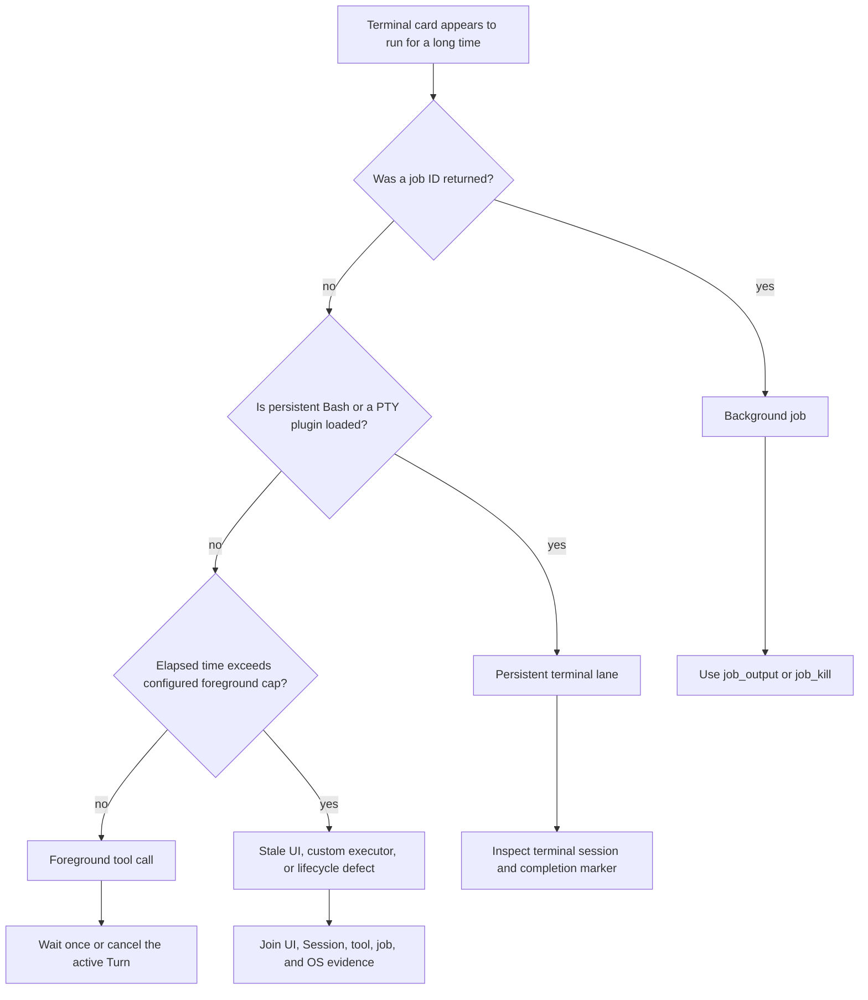

# Diagnose a long-running terminal command followed by a prompt error

Use this runbook when DeepSeek Harness shows a terminal command running for a long time and submitting another message then produces an error. Do not assume the elapsed timer proves that one foreground `bash` process is still alive.

At `dsh@0.1.2-alpha.1`, the standard local Bash executor defaults foreground calls to 120 seconds and caps a requested timeout at 600 seconds. Background Bash deliberately ignores that timeout and returns a job ID; persistent Bash has a separate 300-second default. A UI card visible after 40 minutes therefore contradicts the default foreground path and must be classified before recovery.

## Protect the work first

1. Do not press Enter repeatedly. A failed submission does not prove that the first message was rejected or that the command was not restarted.
2. Copy the exact banner text and preserve a screenshot containing the command card, elapsed time, status marker, and composer state.
3. Record the Session ID, DSH version, profile, preset, provider/model, browser tab identity, and Host PID.
4. In a separate terminal, inspect the operating-system process tree without killing it yet.
5. If the task can mutate data, stop launching equivalent commands from other Sessions.

The first objective is to determine whether there is a live process, a live background job, an active tool call, or only stale presentation.

## Classify the execution lane



### Standard foreground Bash

The model-facing `bash` tool forwards `timeoutMs` to `ctx.shell.resolve()`. The alpha.1 local executor fills a missing value with 120,000 ms, clamps explicit values at 600,000 ms, and applies a deadline to the subprocess. Its result distinguishes `timedOut` from caller-driven `aborted`.

Expected terminal markers include:

```text
[timed out after 120000ms]
[killed by signal: SIGTERM]
[exit code: N]
```

If the card exceeds the effective cap without settling, capture the resolved timeout and subprocess identity. The elapsed card alone is not evidence that the executor deadline still owns a live process.

### Background Bash job

When `run_in_background: true` is enabled, Bash returns `started background job <id>`. The background process ignores the foreground timeout by contract. Its lifecycle is controlled through:

- `job_output(job_id)` to read new output and current status;
- `job_output(job_id, wait: true, timeout_ms: N)` for one bounded wait;
- `job_list()` to recover a forgotten ID;
- `job_kill(job_id, reason)` to request cancellation.

A timed-out `job_output` wait leaves the job alive. Do not interpret it as job failure, and do not start a duplicate.

### Persistent Bash or PTY

The persistent Bash plugin owns a terminal per Agent and looks for unique start/end markers around each command. Its alpha.1 timeout default is 300 seconds. On timeout it attempts to interrupt and may reset the shell. A missing completion marker, terminal reset, or retained process must be diagnosed at this lane rather than as a standard Bash timeout.

### Stale presentation

If the OS process is gone and no job is running but the card still appears active, preserve the Session event tail and browser console before refreshing. A stale card is a projection problem; restarting the command can turn a display defect into a duplicate side effect.

## Interpret the second message correctly

DeepSeek Harness separates two kinds of input:

- a **follow-up** queues an ordinary next Turn;
- **steering** targets the nearest step while an Agent is running.

Queued work can share one overall `running` interval. A submission error can occur at the browser-to-Host boundary even while the original Turn or queued message remains durable. Therefore, never infer message admission from the toast alone.

Check the Session event stream for the submitted message ID:

| Evidence | Meaning | Safe next action |
|---|---|---|
| matching `user/message` exists | submission became durable | do not resubmit; wait for its claim or inspect cancellation |
| optimistic bubble exists, durable event absent | client attempted submission but durability is unproven | preserve browser and gateway evidence before one retry |
| `turn/end` closes the first Turn, then a new `turn/start` claims the message | ordinary queued follow-up | let the second Turn finish |
| message is claimed in the active step | steering path | inspect whether the active tool supports cancellation |
| Host rejects because Agent or Session was disposed | lifecycle failure | resume from durable state in a fresh client |

## Build one joined timeline

Use monotonic timestamps where available:

| Layer | Capture |
|---|---|
| UI | card ID, displayed state, timer, submit attempt ID, toast text |
| gateway | prompt request start/result, connection reset, Remote generation |
| Session | `user/message`, `turn/start`, tool call/result, `turn/end` sequence numbers |
| Agent | `running`/`idle`, cancellation reason, queued and steering claims |
| tool | Bash lane, resolved timeout, job ID or terminal session ID |
| process | PID/PGID, argv, cwd, start/end time, signal and exit status |

The earliest contradiction usually identifies the owner. For example, a settled subprocess with no tool result points above the executor; a live background job with a foreground-looking card points to presentation or lane labeling.

## Safe recovery

### A background job is still running

Read it once with `job_output`. If it still matters, leave it alive and continue only independent work. If it no longer matters, call `job_kill` once and wait for terminal status. Collect its final output before closing the Session.

### A foreground tool call is still active

Use the UI's explicit stop action once. Confirm both a terminal process outcome and a durable tool/Turn close before submitting replacement work. Closing a browser tab is not a reliable process-control operation.

### The process ended but the Turn did not

Preserve the Session log and Host/browser logs. Reconnect with one client. If the Turn remains open, stop mutating that Session and continue in a fresh Session with a bounded handoff. Keep the affected Session for diagnosis.

### The second message is durable but unclaimed

Do not submit it again. Wait for the active Turn to close or cancel the active owner once. A queued follow-up is not individually represented by the Agent-wide `running` status.

## Design long operations so the Agent stays controllable

For builds, downloads, training, indexing, or servers expected to outlive a normal tool call:

1. use background mode only when the loaded profile exposes the Jobs runtime;
2. retain the returned job ID;
3. write durable artifacts and logs to explicit paths;
4. use bounded `job_output` waits instead of shell `sleep` polling;
5. keep working on independent steps;
6. collect or kill every relevant job before the final answer;
7. make the command idempotent or add a run lock before retrying.

Do not raise a foreground timeout to emulate job control. A longer blocked tool call makes cancellation, ownership, reconnect, and duplicate detection harder.

## Maintainer regression contract

- A foreground command settles at its resolved timeout and records whether timeout or caller abort won.
- Background launch returns a durable job ID before the Turn proceeds.
- `job_output` wait timeout leaves the job alive and reports `running`.
- One submit attempt produces at most one durable `user/message` ID.
- Reconnect reconstructs active tool/job state from authoritative events rather than a browser timer.
- Explicit stop closes the process tree, tool result, and Turn in order.
- A queued follow-up survives active-tool completion and is claimed exactly once.
- A rejected submit restores the draft without fabricating a durable message.
- Disposing a tab does not silently orphan a Host-owned process.
- Logs correlate Session, Turn, tool call, job/terminal, and PID identities.

## Incident bundle

```text
DSH version and source revision:
OS, Node, install topology, Host PID:
Profile, preset, provider/model:
Session ID and browser tab identity:
terminal card text and elapsed time:
exact submit error/toast:
foreground, background, or persistent lane:
resolved timeout and configured cap:
job ID / terminal session ID / PID and PGID:
Session event sequence around both inputs:
Agent status and cancellation reason timeline:
browser console and gateway reset events:
whether the second message is durable:
whether any command was retried:
```

## Primary sources

Verified against DeepSeek Harness `dsh@0.1.2-alpha.1` commit `cd5ef8148158c3a752a658978873241fdf8e2bbc`.

- [Upstream long-running terminal report #4844](https://github.com/deepseek-ai/deepseek-harness/discussions/4844)
- [alpha.1 local Bash timeout and process lifecycle](https://github.com/deepseek-ai/deepseek-harness/blob/cd5ef8148158c3a752a658978873241fdf8e2bbc/packages/shell/bash-local/src/index.ts)
- [alpha.1 Bash foreground/background tool contract](https://github.com/deepseek-ai/deepseek-harness/blob/cd5ef8148158c3a752a658978873241fdf8e2bbc/packages/shell/tool-bash/src/index.ts)
- [alpha.1 persistent Bash timeout and marker lifecycle](https://github.com/deepseek-ai/deepseek-harness/blob/cd5ef8148158c3a752a658978873241fdf8e2bbc/packages/shell/tool-bash-persistent/src/index.ts)
- [alpha.1 background job controls](https://github.com/deepseek-ai/deepseek-harness/blob/cd5ef8148158c3a752a658978873241fdf8e2bbc/packages/jobs/tool-jobs/README.md)
- [Official Agent lifecycle contract](https://github.com/deepseek-ai/deepseek-harness/blob/cd5ef8148158c3a752a658978873241fdf8e2bbc/docs/agent-lifecycle.md)
