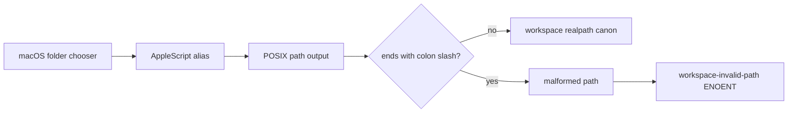

# Fix macOS workspace picker trailing-colon paths

Use this guide when selecting an existing workspace folder on macOS fails even though Finder can open it, and the error adds a colon immediately before the final slash:

```text
workspace-invalid-path: cannot create a workspace at
"/Volumes/.../code:/": ENOENT: no such file or directory,
realpath '/Volumes/.../code:/'
```

At upstream commit `99f6f02`, the native directory picker runs AppleScript `choose folder`, asks for `POSIX path of selectedFolder`, removes only newlines, and passes that string into the workspace registry. The registry intentionally uses `fs.realpath` as its identity canon. On the reported firmlinked APFS layout, AppleScript leaks the HFS separator as a trailing `:/`; `realpath` correctly rejects that malformed spelling.

The spaces in the volume name are not, by themselves, the defect. The distinguishing evidence is the unexpected colon directly before the terminating slash.

## Prove the picker output first

Do not rename or move the directory. Reproduce the same AppleScript boundary in Terminal:

```sh
osascript \
  -e 'set selectedFolder to choose folder with prompt "Select Workspace Directory"' \
  -e 'POSIX path of selectedFolder'
```

Select the failing directory and preserve the exact output. Then compare both spellings without modifying anything:

```sh
PICKED='/Volumes/Example Drive/Projects/code:/'
FIXED="${PICKED%:/}/"
printf 'picked: <%s>\nfixed:  <%s>\n' "$PICKED" "$FIXED"
test -d "$FIXED" && echo 'normalized directory exists'
```

Do not apply this normalization to arbitrary colons. The proposed upstream fix is deliberately narrow: only a terminal `:/` becomes `/`.

## Follow the actual boundary



The workspace registry should continue to canonicalize with `realpath`. The correction belongs at the macOS picker output boundary, before a platform-specific spelling enters the cross-platform workspace contract.

## Safe recovery while waiting for a release

Prefer one of these reversible options:

1. type or paste the verified normalized path into a flow that accepts a path directly;
2. choose the same directory through the in-app browse picker if the active profile exposes that backend;
3. test a fixed build in a disposable profile while keeping the existing workspace registry unchanged.

If no alternate path-entry flow is available, create a separate symlink with a simple local path and register that only after confirming how the registry's `realpath` identity behaves:

```sh
ln -s '/Volumes/Example Drive/Projects/code' "$HOME/dsh-workspace-link"
realpath "$HOME/dsh-workspace-link"
```

Because the registry stores the canonical target, the symlink is only an input spelling, not a second workspace identity.

## Do not damage valid paths

- **Do not remove every colon.** A broad replacement can corrupt valid path text and masks the platform boundary.
- **Do not weaken `fs.realpath`.** It is the documented uniqueness canon for workspaces, symlinks, session cwd checks, and ownership.
- **Do not rename an external volume first.** The path is evidence, and the trigger is more specific than whitespace.
- **Do not edit the durable workspace registry by hand.** The invalid spelling is rejected before a valid record is created.
- **Do not treat every `workspace-invalid-path` as this bug.** Missing directories, files selected as directories, permissions, and other I/O errors share the same outer error code.

## Acceptance test for an official fix

Test the picker adapter and the complete UI flow:

```text
1. ordinary macOS directory returns its unchanged POSIX path
2. reported firmlinked-volume output ending in :/ returns the same path ending in /
3. internal colons are preserved
4. empty output still means cancel/no selection
5. user cancellation remains null, not an error
6. workspace create realpaths the normalized directory
7. selecting the same directory again reuses the existing workspace identity
```

The regression fixture should include spaces so quoting remains covered, but the assertion must prove the terminal-colon normalization rather than imply that spaces are invalid.

## Minimal upstream report

```text
DeepSeek Harness version or Git SHA:
macOS version / architecture:
Volume name and mount path (redacted if needed):
Is the volume firmlinked or an external system/data pair?:
Exact osascript output in angle brackets:
Does the output end in :/?:
Does the same path without the terminal colon pass test -d?:
Complete workspace-invalid-path error:
Native picker or in-app browse picker:
```

## Primary sources

- [Upstream report #3253](https://github.com/deepseek-ai/deepseek-harness/discussions/3253)
- [Native macOS picker at `99f6f02`](https://github.com/deepseek-ai/deepseek-harness/blob/99f6f02fecdb7dff40c3fbc9470f5907c29f74ca/packages/host/directory-picker-native/src/native-picker.ts)
- [Proposed narrow fix and regression test](https://github.com/iZiwer/deepseek-harness/commit/e1474742ab96a5b4c2a6355517c6872c2c216891)
- [Workspace realpath identity contract](https://github.com/deepseek-ai/deepseek-harness/blob/99f6f02fecdb7dff40c3fbc9470f5907c29f74ca/docs/subsystems/workspace.md)
- [Directory picker capability seam](https://github.com/deepseek-ai/deepseek-harness/blob/99f6f02fecdb7dff40c3fbc9470f5907c29f74ca/packages/host/directory-picker/README.md)

