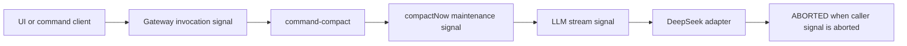

# Diagnose manual `/compact` aborted by the caller

Use this runbook when an idle DeepSeek Harness Agent accepts `/compact`, appends `compaction/start`, then fails seconds later with both of these signals:

```text
command/done    kind: error    This operation was aborted
compaction/end  error: DeepSeek request aborted by caller
```

This signature says the compaction summarization request received an aborted caller signal. It does not by itself identify which upstream lifecycle owner aborted that signal.

## Stop the retry loop

Do not repeat `/compact` until one attempt succeeds. Each accepted attempt can begin a separate summarization model call before it is cancelled, and an abort does not prove the provider performed no billable work.

After the first failure:

1. stop issuing `/compact`;
2. preserve the full `command/run` through `compaction/end` event span;
3. confirm that no `compaction/summary` was committed;
4. verify the conversation surface is unchanged;
5. continue in a fresh Session with a bounded handoff if context pressure is urgent.

The failed transaction should close durably and leave the original conversation intact. An unmatched `compaction/start` is a different persistence incident and can block later compaction.

## Read the four-signal chain



At rc.8:

- `dsh-command-compact` forwards `invocation.signal` into `compactNow()`;
- `compactNow()` fuses that signal with the Agent maintenance signal;
- the basic compactor forwards the fused signal to `ctx.llm.stream()`;
- the DeepSeek adapter maps an aborted options signal to `LlmError(..., "ABORTED")`.

That chain establishes caller-side cancellation. It does not yet distinguish UI cancellation, command-channel disposal, Agent maintenance disposal, profile reload, Host shutdown, or a gateway Remote-token lifecycle race.

## Distinguish a caller abort from a silent summarization hang

Upstream Discussion [#3711](https://github.com/deepseek-ai/deepseek-harness/discussions/3711) describes a different failure shape in rc.8: `compaction/start` is the last durable event, `session.list` remains `running: true`, and neither `compaction/summary`, `compaction/end`, nor an error ever arrives. That is not evidence of an aborted caller. The compaction signal may still be live while the summarization provider never returns, because the turn signal is cancellation—not a finite deadline.

Use the last event sequence, not a flat step counter, for liveness:

| Observation | Interpretation |
|---|---|
| `compaction/end` with an abort error | a signal owner cancelled the request; use the chain above |
| `compaction/start` remains last event and `running: true` | possible summarization hang; preserve the Session and enforce an external watchdog |
| `compaction/end` with a timeout or provider error | bounded failure; inspect the original provider response and retry policy |

Do not “fix” the silent-hang shape by repeatedly issuing `/compact` or by deleting the Session. A host-side watchdog can cancel one owned attempt after a policy deadline, record the timeout with command and compaction IDs, and let the existing failed-compaction path close the transaction. A runtime change should make that deadline configurable (for example, a finite default with `0` explicitly disabling it), preserve explicit user cancellation, and emit `compaction/end` on expiry. Treat the five-minute value proposed in #3711 as a field-test starting point, not a universal safe default.

## Build one joined timeline

For a single attempt, capture monotonic timestamps and stable identities:

| Boundary | Required evidence |
|---|---|
| command | command ID, source, admission time, done kind and text |
| compaction | compaction ID, `start`, optional `summary`, `end`, and referenced source command ID |
| Agent | Session ID, turn state, maintenance admission, cancel cause, queued wakeups |
| gateway | Remote descriptor, install token generation, invoke start, dispose or reinstall time |
| client | tab identity, component mount/unmount, WebSocket continuity, explicit cancel actions |
| LLM | provider/model, request start, first byte if any, abort time, adapter error code and cause |

Join by command and compaction IDs first. Wall-clock proximity without shared identity is weak evidence.

## Classify the first abort reason

`AbortSignal.any()` preserves the reason from the first source that aborts. Instrument each source before fusion and record:

```text
source name
aborted timestamp
signal.reason type and sanitized message
owning lifecycle generation
commandId and compactionId
```

If the final reason is the default DOM abort exception, do not replace it with a guessed user action. The default reason shows that a controller aborted without a more specific cause.

| First source | Likely owner | Next experiment |
|---|---|---|
| explicit command cancel signal | UI or API caller | reproduce without clicking cancel and with one stable client |
| gateway Remote token | service install or disposal | trace token generation and provider scope lifecycle |
| Agent maintenance signal | Agent cancellation or lifecycle end | capture cancel cause, queued wakeups, and Session end-seed |
| Host shutdown signal | process or profile restart | correlate PID, config reload, HMR, and shutdown logs |
| provider timeout reason | adapter or retry layer | route as timeout, not caller abort |

## Test the lifecycle-race hypothesis

The upstream report identifies the API gateway Remote install token as a plausible source because a call without its own signal can inherit `token.abort.signal`. Treat that as a hypothesis until a token generation is observed aborting during the same command.

Use one controlled A/B matrix:

1. Run one attempt from a stable, single Web client with HMR and profile editing inactive.
2. Run one attempt through the narrowest supported non-Web command entrypoint.
3. Record Remote install/dispose generations for both.
4. Keep model, Session, profile, network, and context fixed.
5. Stop after one attempt per cell.

If Web fails while the non-Web path succeeds and only the Web attempt disposes the matching token, the lifecycle hypothesis gains direct evidence. If both paths abort without token disposal, continue upstream toward Agent maintenance or Host lifetime.

## Separate nearby failures

| Durable signature | Classification | Next action |
|---|---|---|
| `compaction/end` says caller aborted | cancellation chain | identify the first aborted source here |
| `compaction/end` reports `MAX_TOKENS` | summary output ceiling | use the [summary truncation guide](compaction-summary-truncated.md) |
| `/compact` reports Agent busy before `compaction/start` | idle admission | finish or cancel the active owner, then retry once |
| unmatched `compaction/start` remains live | failed close or persistence | preserve the Session and investigate the orphaned transaction |
| provider returns 429, 5xx, or transport failure while signal is live | provider or network | diagnose the original provider response |
| compaction succeeds but history cannot reload | replacement projection | use the [conversation update ordering guide](conversation-update-before-start.md) |

## Safe continuity when pressure is urgent

If the Session is near its context limit and manual compaction is not dependable:

1. stop all mutation of the affected Session;
2. export or preserve its durable evidence;
3. create a fresh Session in the same workspace;
4. carry a bounded handoff containing goals, confirmed state, unresolved risks, and exact artifact paths;
5. verify the new Session does not inherit a hidden full-history attachment;
6. keep the old Session archived, not deleted, until the incident is resolved.

Do not paste credentials, private reasoning, or an unreviewed full log into the handoff.

## Runtime repair contract

A durable fix must retain authentic cancellation while preventing unrelated service remounts from killing an accepted long-running command.

Possible repair shapes include a call-scoped controller owned by the invocation, or a Remote token whose lifetime is guaranteed to dominate every accepted call. Decoupling compaction from all caller cancellation is unsafe because a user or Host must still be able to stop an expensive or stuck summary.

Require these regression gates:

- a 45-second manual summary survives benign client rerenders and event reconnects;
- explicit user cancellation aborts promptly with a specific reason;
- Host shutdown cancels and durably closes the compaction attempt;
- profile or service reload cannot dispose an accepted call silently;
- Remote token generation and command identity appear in diagnostic logs;
- first-abort reason is preserved through every `AbortSignal.any()` boundary;
- one accepted command produces at most one summarization call;
- failed cancellation commits no `compaction/summary` or replacement;
- `compaction/end` is flushed before maintenance admission releases;
- automatic, overflow, and manual compaction retain distinct owners;
- successful `command/done.sourceEventSeq` points to the committed summary;
- rc.7 and rc.8 reproductions are covered by the same long-running fixture.

## Unsafe shortcuts

- Do not retry dozens of times.
- Do not remove cancellation from the LLM stream.
- Do not blame the provider after proving the options signal was aborted.
- Do not infer a network drop from WebSocket continuity alone.
- Do not edit or delete Session events to clear a compaction lock.
- Do not hot-reload profile code during the controlled reproduction.
- Do not call automatic compaction affected without a separate trace.
- Do not publish raw Session text, tokens, or filesystem usernames.

## Incident bundle

```text
DSH version and source revision:
OS, Node, install topology, Host PID:
Profile, preset, provider/model, reasoning effort:
Session ID, command ID, compaction ID:
command/run and command/done timestamps:
compaction/start, summary, and end timestamps:
surface hash before and after:
gateway Remote token generation and lifecycle:
each source signal abort time and sanitized reason:
client mount/unmount and event connection timeline:
LLM request start, first byte, abort, and provider response:
single-attempt A/B result:
```

## Primary sources

Verified against DeepSeek Harness rc.8 commit `141eb6fef83422698aef7a981029e843e8161534`.

- [Upstream 22-of-23 manual compaction abort report #3542](https://github.com/deepseek-ai/deepseek-harness/discussions/3542)
- [rc.8 manual compaction signal fusion](https://github.com/deepseek-ai/deepseek-harness/blob/141eb6fef83422698aef7a981029e843e8161534/packages/compaction/compaction-basic/src/index.ts)
- [rc.8 command signal forwarding](https://github.com/deepseek-ai/deepseek-harness/blob/141eb6fef83422698aef7a981029e843e8161534/packages/compaction/command-compact/src/index.ts)
- [rc.8 API gateway Remote-token cancellation](https://github.com/deepseek-ai/deepseek-harness/blob/141eb6fef83422698aef7a981029e843e8161534/packages/api/gateway/src/client/index.ts)
- [rc.8 DeepSeek adapter cancellation mapping](https://github.com/deepseek-ai/deepseek-harness/blob/141eb6fef83422698aef7a981029e843e8161534/packages/llm/llm-deepseek/src/adapter.ts)
- [Official compaction lifecycle contract](https://github.com/deepseek-ai/deepseek-harness/blob/141eb6fef83422698aef7a981029e843e8161534/docs/subsystems/compaction.md)
- [Compaction summarization with no deadline can hang indefinitely (#3711)](https://github.com/deepseek-ai/deepseek-harness/discussions/3711)
