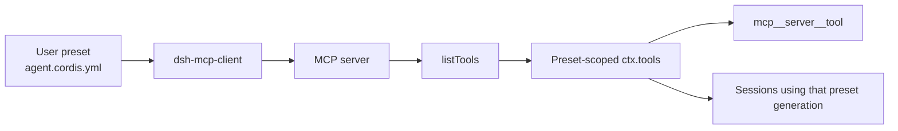

# Add an MCP server and diagnose missing tools

At upstream revision [`99f6f02`](https://github.com/deepseek-ai/deepseek-harness/commit/99f6f02fecdb7dff40c3fbc9470f5907c29f74ca), DeepSeek Harness has an official MCP client bridge but no dedicated Web form for adding arbitrary MCP servers. The capability belongs to an **Agent preset composition**: one `@deepseek-ai/dsh-mcp-client` row connects one server and registers its tools in that preset's scoped tool registry.

Separate five states that all look like “MCP tools are missing”:

1. no MCP row was added to the selected preset;
2. the row changed, but the current Session still runs the old preset generation;
3. the client never connected or synchronized tools;
4. discovery succeeded but registration conflicted;
5. a previously healthy connection exhausted its outage budget.

## Start with the ownership boundary

MCP tools are not process-global. A preset mounts once under its own standing scope, and Sessions that choose that preset inherit its tools. A sibling preset does not.



The writable user root defaults to `<DSH_HOME>/.agent-presets`. A preset directory contains `agent.cordis.yml`. Shipped presets are read-only; create a user copy before editing. Treat a preset composition as code with shell-level trust—it names executable plugins, commands, arguments, environments, and remote endpoints.

## Add one server per row

For a local stdio server:

```yaml
- id: mcp-filesystem
  name: '@deepseek-ai/dsh-mcp-client'
  config:
    serverName: filesystem
    transport: stdio
    command: npx
    args: ['-y', '@modelcontextprotocol/server-filesystem', '/approved/workspace']
    failOnStartupError: true
```

For Streamable HTTP:

```yaml
- id: mcp-internal-search
  name: '@deepseek-ai/dsh-mcp-client'
  config:
    serverName: internal-search
    transport: streamable-http
    url: https://mcp.example.internal/mcp
    headers:
      Authorization: !!js '`Bearer ${process.env.MCP_TOKEN}`'
    failOnStartupError: true
```

Use a unique row `id` and a unique `serverName`. The latter must match `[A-Za-z0-9_-]{1,32}`. Never paste a production token into YAML. Resolve it from the launch environment or an approved secret provider.

`failOnStartupError: true` is useful while authoring because the preset fails visibly when initial connection or tool synchronization fails. The shipped default is `false`: the profile can activate with zero tools after logging the failure. Decide deliberately whether availability or fail-loud startup is correct for the deployment.

## Create a new Session after changing the preset

A preset generation is keyed by the `agent.cordis.yml` file stamp. When the file changes:

- a later Session that selects the preset mounts the next generation;
- a Session already joined keeps the generation it started with;
- changing the deployment default affects only later Sessions;
- switching presets is restricted to a blank Session because prior tool-call history must remain reconstructable.

Therefore, after saving the MCP row, create a **new blank Session**, select the edited user preset, and inspect that Session's tools. Do not use an old Session as proof that the new composition failed.

## Expected tool identity

A server tool named `search` under `serverName: internal-search` appears as:

```text
mcp__internal-search__search
```

The public name is a deterministic function of `(serverName, rawName)`. Names that require replacement or truncation gain a deterministic hash so distinct raw names do not collapse. Changing `serverName` changes every model-facing tool name and can make old conversation history incompatible with the new tool surface.

## Route the first failed boundary

| Evidence | Likely boundary | First evidence to collect |
|---|---|---|
| no dedicated add button | product surface | selected preset and whether a user copy exists |
| new row saved, old Session has no tools | preset generation | Session creation time, selected preset, file stamp, fresh-Session A/B |
| stdio child never starts | process transport | exact executable resolution, args, cwd, sanitized environment, stderr |
| HTTP connection cannot initialize | network transport | exact URL, DNS/TLS/proxy/auth result from the Host environment |
| connection succeeds but `listTools()` fails | discovery | server logs, cursor sequence, first protocol error |
| discovery returns but no generation registers | namespace/schema conflict | unique `serverName`, duplicate raw names, foreign tool registration error |
| tools existed and calls now fail | active outage | transport close, reconnect attempt, last good generation |
| tools disappear after repeated crashes | exhausted outage budget | final failure log, configured `maxAttempts`, recovery action |

## Diagnose stdio without leaking secrets

Run the configured executable outside Harness from the same Host account and `cwd`. Verify that the exact command resolves:

```sh
command -v npx
node --version
npx --version
```

On PowerShell:

```powershell
Get-Command npx
node --version
npx --version
```

Do not expect an MCP stdio server to print a friendly prompt; arbitrary stdout can corrupt the protocol. Capture stderr and exit status. If the server requires a variable, pass only the required value through the composition:

```yaml
env:
  SERVICE_TOKEN: !!js process.env.SERVICE_TOKEN
```

The child receives a scrubbed ambient environment plus explicit `config.env`. An environment available in your interactive shell is not proof that the Host or child received it.

## Diagnose Streamable HTTP from the Host boundary

Test the exact scheme, host, port, path, TLS trust, proxy route, and authentication from the machine and launch environment running DSH. Browser reachability is not sufficient: the MCP client runs in the Host.

Use TLS for non-loopback endpoints. Never disable certificate verification to make a private CA work; install the approved trust anchor for the Node process instead. Record response status and sanitized server logs, not bearer tokens.

## Understand discovery and registration

Initial activation awaits connection and `listTools()`. The returned generation registers atomically before the first turn:

- duplicate live `serverName` rejects the later plugin instance;
- a server listing the same raw tool twice is invalid;
- a foreign registration occupying `mcp__<serverName>__...` rolls back the attempted generation;
- a failed list refresh keeps the previous good generation;
- a registration conflict leaves no partial new generation.

The bridge exposes MCP **tools**. Resources and prompts do not currently have Harness consumers. Seeing resources in another MCP client is not evidence that DSH should list them as tools.

## Understand outage behavior

Automatic reconnect is enabled by default. For a transport close, the supervisor starts at 500 ms, doubles delays to a 30-second ceiling, and permits 10 consecutive failed attempts unless configured otherwise.

During an outage:

- the last good tool generation stays registered;
- calls against it fail until recovery;
- successful recovery replaces the generation without duplicates;
- exhausting `maxAttempts` unregisters the tools and stops reconnecting;
- an HMR reload or Host restart starts a new recovery opportunity.

Stdio child crashes trigger the supervisor. Streamable HTTP failures can surface per request and through the SDK transport's SSE recovery, so do not assume every HTTP failure produces a process-style respawn cycle.

## Acceptance test

Use a harmless server or read-only capability:

1. **Composition:** the edited user preset parses and mounts.
2. **Generation:** a fresh Session explicitly uses that preset.
3. **Discovery:** expected `mcp__<server>__<tool>` names appear before the first turn.
4. **Execution:** one read-only call produces a durable `tool/call` and matching `tool/result`.
5. **Isolation:** a Session using a sibling preset does not inherit the tools.
6. **Reconnect:** terminate the test server once and observe attempt, recovery, and stable tool names.
7. **Disposal:** remove or disable the row in a new generation and confirm its tools disappear from a new Session.

## Unsafe false fixes

- Do not edit a shipped read-only preset in place; create a user copy.
- Do not place credentials directly in `agent.cordis.yml`.
- Do not add the same `serverName` twice.
- Do not test a changed composition only from an already-running Session.
- Do not increase reconnect attempts to hide a deterministic startup error.
- Do not classify MCP resources or prompts as missing tools.
- Do not expose a local unauthenticated MCP endpoint to the network for convenience.

## Minimal report

```text
DSH version / Git SHA:
OS, architecture, Node version:
Selected preset id and trust: system / user
Fresh Session after edit: yes / no
Transport: stdio / streamable-http
serverName (no credential):
Command + args or sanitized URL:
failOnStartupError:
First connection/discovery/registration error:
Expected public tool names:
Reconnect attempt and final state:
Sibling-preset isolation result:
```

## Official sources

- [MCP client configuration and behavior](https://github.com/deepseek-ai/deepseek-harness/blob/99f6f02fecdb7dff40c3fbc9470f5907c29f74ca/packages/mcp/mcp-client/README.md)
- [MCP client lifecycle](https://github.com/deepseek-ai/deepseek-harness/blob/99f6f02fecdb7dff40c3fbc9470f5907c29f74ca/packages/mcp/mcp-client/src/index.ts)
- [Tool discovery and atomic registration](https://github.com/deepseek-ai/deepseek-harness/blob/99f6f02fecdb7dff40c3fbc9470f5907c29f74ca/packages/mcp/mcp-client/src/tools.ts)
- [Connection and reconnect supervisor](https://github.com/deepseek-ai/deepseek-harness/blob/99f6f02fecdb7dff40c3fbc9470f5907c29f74ca/packages/mcp/mcp-client/src/connection.ts)
- [Agent preset ownership and generations](https://github.com/deepseek-ai/deepseek-harness/blob/99f6f02fecdb7dff40c3fbc9470f5907c29f74ca/packages/preset/agent-presets/README.md)
- [MCP integration guide](../integrations/mcp.md)
- [Original “no MCP add entry” discussion](https://github.com/deepseek-ai/deepseek-harness/discussions/1754)
