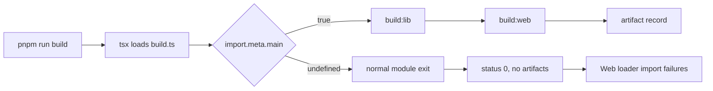

# Recover a silent source build on Node 24 and tsx

DeepSeek Harness rc.8 can report a successful root build without running either nested build when one Node 24 and `tsx` execution path leaves `import.meta.main` undefined. The missing artifacts surface later, often while the Web profile boots:

```text
AggregateError: loader fibers failed
Cannot find .../lib/typert.host.js
```

or as missing client bundles such as `lib/client.js`.

Treat this as a build-entrypoint failure first. `loader fibers failed` is an aggregate label: it says one or more loader branches rejected, not why their required modules are absent.

## Recognize the silent-build signature

The distinctive combination is:

1. the official source checkout is on rc.8;
2. `pnpm run build` exits with status `0` unusually quickly;
3. no final `build: recorded … client artifact(s)` line appears;
4. `.dsh-build/client-build-environment.json` is absent;
5. several unrelated host or client exports are missing; and
6. Web startup later collapses those import failures into `loader fibers failed`.

Do not classify this signature from the aggregate message alone. A plugin with one missing export, a stale install, an unsupported Node version, and a genuinely failed package build can all reach the same loader layer.

## Prove whether the root build ran

From the repository root, preserve the complete output and status:

```bash
node --version
pnpm --version
git rev-parse HEAD
pnpm run build 2>&1 | tee dsh-build.log
build_status=${PIPESTATUS[0]}
printf 'build status: %s\n' "$build_status"
```

On PowerShell:

```powershell
node --version
pnpm --version
git rev-parse HEAD
pnpm run build 2>&1 | Tee-Object dsh-build.log
$LASTEXITCODE
```

For rc.8, the source contract is Node `^22.19.0 || >=24.0.0`, pnpm `11.7.0`, and commit `141eb6fef83422698aef7a981029e843e8161534`.

Then test the positive evidence, not only the exit code:

```bash
test -s .dsh-build/client-build-environment.json
test -s packages/context/session-reference/lib/typert.host.js
test -s packages/client/ui-renderer/lib/client.js
test -s packages/client/ui-brand-official/lib/client.js
test -s packages/client/ui-attachment/lib/client.js
test -s packages/client/ui-reference/lib/client.js
```

The exact package named by a loader error can vary with the resolved profile. The durable invariant is broader: a complete root build runs `build:lib`, then `build:web`, then writes a record that binds the selected public environment to a non-empty digest of client artifacts.

## Why exit zero is not proof

At the rc.8 source revision, the root package maps `build` to:

```text
tsx scripts/build.ts
```

The file defines `main()`, but invokes it only through:

```ts
if (import.meta.main) main()
```

In the reported Node v24.0.0 plus `tsx` path, `import.meta.main` is `undefined`. The condition is false, the module finishes normally, and the process returns zero. None of these intended effects occur:



This is why reinstalling dependencies after the silent exit does not create the missing files, and why debugging the final loader aggregate starts too late in the chain.

## Bounded recovery

### Prefer a supported environment that proves the entrypoint

The least invasive recovery is to use the rc.8-supported Node 22 line, reinstall exactly from the lockfile, and demand artifact evidence:

```bash
node --version  # require 22.19.x or another ^22.19.0 release
pnpm install --frozen-lockfile
pnpm run build
test -s .dsh-build/client-build-environment.json
pnpm dsh --profile web --help
```

Do not claim success if the command merely returns zero. Require the recorded artifact count and the files consumed by the selected profile.

### If you must evaluate the reported patch

Use a disposable branch. Preserve the native check and add a direct-entry fallback that compares the launched script path with the current module URL:

```ts
import { fileURLToPath } from 'node:url'

const launchedDirectly = process.argv[1] !== undefined
  && resolve(process.argv[1]) === fileURLToPath(import.meta.url)

if (import.meta.main ?? launchedDirectly) main()
```

This fallback is narrower than calling `main()` unconditionally: importing `scripts/build.ts` for a test or helper still must not launch the complete repository build. The upstream report verifies this shape locally, but it is not part of the rc.8 release. Keep the patch explicit and re-evaluate it on upgrade.

## Do not take these shortcuts

- Do not treat `status 0` as build evidence.
- Do not create empty placeholder `lib/client.js` or `typert.host.js` files; those exports contain generated runtime contracts.
- Do not copy `lib/` directories from another commit or machine; the build record is designed to bind artifacts to their source and public environment.
- Do not delete the loader aggregate from the error path; it may be reporting several real import failures.
- Do not call `main()` unconditionally at module scope; that gives imports an unexpected full-build side effect.
- Do not assume every `loader fibers failed` incident is this bug. Verify the absent build record and multi-package artifact pattern.

## Route neighboring failures

| Evidence | First boundary |
|---|---|
| Build exits 0, no record, no nested-build output | root script entrypoint did not invoke `main()` |
| Build reports `ERR_UNKNOWN_FILE_EXTENSION .exe` | standalone pnpm was passed through Node |
| Build exits nonzero inside `build:lib` | first named workspace compilation failure |
| Build completes and record exists, but one plugin export is missing | plugin packaging or installation artifact |
| Record exists but digest validation fails | artifacts changed after the complete build |
| Only Web client bundles are absent | inspect `build:web` and the selected client environment |
| One loader fiber rejects with all core artifacts present | inspect the exact nested cause, not the aggregate label |

## Upstream repair contract

A durable repair should make direct execution explicit and make a no-op impossible to mistake for a complete build.

### Entrypoint gates

- [ ] Direct execution through the supported `tsx` CLI invokes `main()` on Node 22 and Node 24.
- [ ] Importing the module does not invoke `main()`.
- [ ] An invalid direct CLI argument fails nonzero; it cannot silently exit before argument parsing.
- [ ] Symlinked or relative launcher paths are either normalized consistently or rejected clearly.
- [ ] Windows and POSIX path comparison are covered.

### Artifact gates

- [ ] `build:lib` runs before `build:web`.
- [ ] A nested nonzero status makes the root build nonzero.
- [ ] A complete build prints its recorded artifact count.
- [ ] `.dsh-build/client-build-environment.json` exists and parses.
- [ ] The record covers at least one client artifact and its digest matches current files.
- [ ] Required host `typert` and selected client exports exist.
- [ ] The Web profile reaches its help or readiness boundary without loader import failures.

## Incident bundle

Attach these items before reporting a new occurrence:

- exact Node, pnpm, `tsx`, OS, and source commit;
- full root-build output and exit status;
- whether the final artifact-count line appeared;
- presence and contents of the client build record;
- a list of missing exports, without copying their contents from elsewhere;
- the complete nested causes inside `loader fibers failed`; and
- whether the same checkout succeeds on Node 22.19.x.

## Primary sources

- [Official discussion #3455](https://github.com/deepseek-ai/deepseek-harness/discussions/3455)
- [rc.8 root build entrypoint](https://github.com/deepseek-ai/deepseek-harness/blob/141eb6fef83422698aef7a981029e843e8161534/scripts/build.ts)
- [rc.8 client build-record contract](https://github.com/deepseek-ai/deepseek-harness/blob/141eb6fef83422698aef7a981029e843e8161534/scripts/client-build-environment.ts)
- [rc.8 loader aggregate implementation](https://github.com/deepseek-ai/deepseek-harness/blob/141eb6fef83422698aef7a981029e843e8161534/vendor/loader/src/config/tree.ts)
- [rc.8 root package and engine contract](https://github.com/deepseek-ai/deepseek-harness/blob/141eb6fef83422698aef7a981029e843e8161534/package.json)
